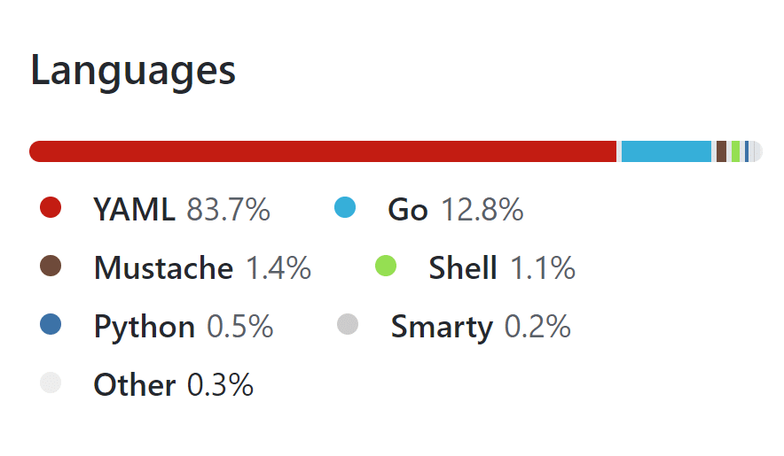
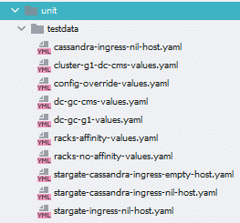
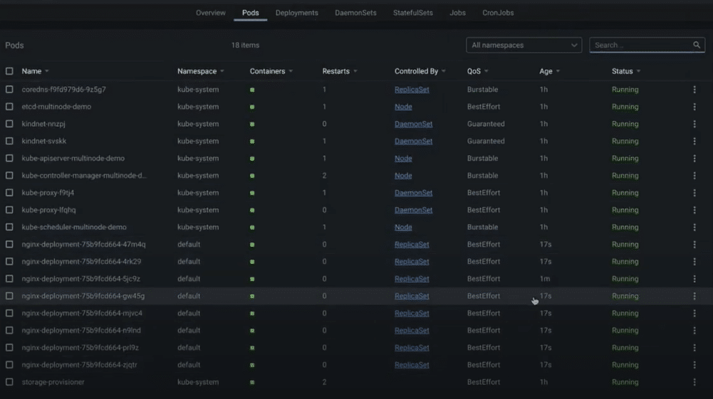

You might have heard about the [K8ssandra](https://github.com/k8ssandra/k8ssandra) project and want to start contributing, or maybe you want to start using all of its features. If you aren't familiar with K8ssandra (pronounced like "Kate Sandra"), you can read this [overview](https://k8ssandra.io/) before digging into the developer activities in this post.

In a nutshell, K8ssandra is an open-source distribution of Apache Cassandra™ for Kubernetes, which includes a rich set of trusted open-source services and tooling. K8ssandra comes with handy features that are baked-in and pluggable, which allows for flexible deployment and configuration.

This post walks the K8ssandra developer through various activities for getting set up to run K8ssandra on a local machine, while including maintainer tips and tricks. Information and activities are split into four sections as some readers may already have varied foundations existing for Kubernetes development.

The sections include: editor and tooling installation, installation and setup of K8ssandra, hands-on exercises, and information shared from K8ssandra maintainers.

## Configuring the development environment

Let's set the foundation for a K8ssandra development environment. Where possible, this guide attempts to maintain an operating system agnostic approach. K8ssandra supports the following operating systems for development:

* MacOS
* Linux
* Windows 10

**Note** : For Windows, we recommend using [Windows Subsystem for Linux](https://docs.microsoft.com/en-us/windows/wsl/about) (WSL2) to execute the shell scripts referenced below.

Although K8ssandra is created primarily to run in Kubernetes cloud environments, we'll focus here on local machine development.

Reference "[Requirements for running K8ssandra for development](https://k8ssandra.io/blog/2021/03/10/requirements-for-running-k8ssandra-for-development/)" for details on managing expectations if you are running on a resource-constrained machine.

### Development editor

If you already have a code editor setup supporting Kubernetes development AND have Go installed, feel free to skip this section.

One option available is [Visual Studio Code](https://code.visualstudio.com/) (VS Code) for development on K8ssandra because it is free, open-source, and supports editing all of the artifacts that make up the K8ssandra project. Another great alternative is JetBrains [GoLand](https://www.jetbrains.com/go/) IDE, which isn't free for all users, but does provide an evaluation/trial period.

#### VS Code installation

First, download the VS Code binaries and install the necessary extensions to assist with K8ssandra development.

1. [Download](https://code.visualstudio.com/) VS Code specific to your operating system.  
   Note: this guide is based on version 1.54.2.
2. Add a Go extension to your VS Code editor for editing and compiling of Go source.  

   To install an extension, navigate to **File-** \>**Preferences-** \>**Extensions** in VS Code and search for "Go". This guide uses version 0.23.2 (not the nightly build) from the Go Team at Google.
3. Follow the steps in the Go extension's documentation, which includes a [Download](https://golang.org/) of **Go**specific to your operating system. Select 1.14+ as a version.

Here is a list of useful VS Code extensions for K8ssandra development. Search for them by name in the VS Code extensions page.

* [ms-kubernetes-tools.vscode-kubernetes-tools](https://marketplace.visualstudio.com/items?itemName=ms-kubernetes-tools.vscode-kubernetes-tools) - develop, deploy, and debug Kubernetes applications
* [ipedrazas.kubernetes-snippets](https://marketplace.visualstudio.com/items?itemName=ipedrazas.kubernetes-snippets) - code snippets of Kubernetes for easier development and configuration.
* [redhat.vscode-yaml](https://marketplace.visualstudio.com/items?itemName=redhat.vscode-yaml) - YAML language support with Kubernetes syntax assistance included.

Once the VS Code editor and Go binaries are installed, let's make sure you're ready to pull in the K8ssandra source.

### Git and GitHub

If you already have Git setup and you've got a GitHub account, feel free to skip this section.

1. Reference the following to install Git properly:  
   [About Git](https://git-scm.com/)  
   [Setup Guide](https://github.com/git-guides/install-git)  
   [Basic Guide](https://git-scm.com/)
2. Reference information for setting up a GitHub account.  
   [Getting started](https://github.com/join) with GitHub

## Checkpoint

At this point, you should have the following setup \& installed:

✔ VS Code (the editor)

✔ Go (the Golang binaries)

✔ Git (a version control system)

✔ GitHub account (for forking and contributing)

See the references listed below of useful information developers use when starting out with the technologies installed above:

* Using [VS Code and Github](https://vscode.github.com/)
* A Git [cheat sheet](https://training.github.com/downloads/github-git-cheat-sheet/)
* Go [tutorial](https://golang.org/doc/tutorial/getting-started)

## Installing and configuring a Kubernetes and K8ssandra environment

If you already have a Kubernetes environment setup with K8ssandra, feel free to skip this section.

This [10-minute quick-start](https://k8ssandra.io/docs/getting-started/) will guide you through the steps to run a basic K8ssandra deployment in a local Kubernetes environment.

For a more visual and interactive demonstration of setting up K8ssandra, check out [K8ssandra First Touch](https://k8ssandra.io/blog/2021/03/30/k8ssandra-first-touch/), a step-by-step 15 minute video.

Now it's time to learn about the file types contained in the K8ssandra codebase.

## Getting hands-on

### Repository

The K8ssandra GitHub repository resides [here](https://github.com/k8ssandra/k8ssandra). Follow these steps to download the current K8ssandra source code:

1. Click on the **Fork**button (top right corner of the screen).
2. This will fork the K8ssandra to your personal GitHub repository.
3. Using **Git**, you can now pull the K8ssandra source code and documentation to your local machine. Some developers choose to do this via the GitHub plugin-in in an IDE or from a command line.

Command line example:

```
git clone https://github.com/your-github-repo-name/k8ssandra.git
```

**Note**: Insert your personal GitHub repository name followed by k8ssandra.git.

If you want to take GitHub to the command line, checkout [GitHub CLI](https://cli.github.com/). It is GitHub's official command line tool.

### Project composition

K8ssandra is primarily composed of [YAML](https://en.wikipedia.org/wiki/YAML) files used for declarative configurations. In fact, many of the YAML files are a collection of [Helm charts](https://helm.sh/). Helm is an open source package management solution for Kubernetes, and its charts are the packaging format used.


In addition to YAML, you will see some **.go** files in the K8ssandra project. [Go](https://golang.org/) within K8ssandra is used for utilities and tests.

K8ssandra's reference documentation is maintained with languages including: HTML, Markdown, and CSS. The artifacts reside under the top-level **/** docs folder in the K8ssandra repository and are used to generate content for the [k8ssandra.io](https://bit.ly/3rWG9m8) website.

To round out the different file types, there are shell and Python scripts provided for automation of tasks including documentation publishing and assisting the developer with environment setup tasks. The scripts reside under the top-level /scripts folder in the K8ssandra repository. See their README for more information.

The K8ssandra project contains multiple GitHub repositories, with the main repository at [k8ssandra/k8ssandra](https://github.com/k8ssandra/k8ssandra).

The [K8ssandra organization page](https://github.com/k8ssandra) provides a bird's eye view of the project's repository. Each repository has a README that will allow you to learn more about the K8ssandra family.

In addition, there are two very important repositories that currently reside outside of the K8ssandra project; they're provided as optional tooling for management of Apache Cassandra:

* [Medusa for Apache Cassandra](https://github.com/thelastpickle/cassandra-medusa)
* [Reaper for Apache Cassandra](https://github.com/thelastpickle/cassandra-reaper)

The K8ssandra repository itself has a few important folders to take note of.

* **Charts** - Helm-based charts, categorized by sub-chart.
* **Docs** - layouts, content, etc. that drives [k8ssandra.io](https://bit.ly/3rWG9m8).

Check out the [docs readme](https://github.com/k8ssandra/k8ssandra/tree/main/docs) for more detail.

* **Scripts** - a collection of useful scripts for working with K8ssandra that you can use or extend. Also included are documentation scripts for K8ssandra docs management.
* **Tests - unit, integration, and end-to-end testing for K8ssandra.**

### Running tests

The K8ssandra test directory contains subdirectories for managing and executing tests at the unit and integration levels. Let's run the unit tests as an example. Using the command line, navigate to the K8ssandra project root directory where the Makefile resides.

Issue the command:

```
make unit-test
```

Once complete, you should see something like the following:

```
ok github.com/k8ssandra/k8ssandra/tests/unit 47.156s
```

Feel free to explore the K8ssandra [Makefile](https://github.com/k8ssandra/k8ssandra/blob/main/Makefile) for other recipes that can be targeted.

## Maintainer tips and tricks

The K8ssandra maintainer team has developed a set of common knowledge and best practices that we wanted to share with you. Think of it as a starting point for learning and growing with K8ssandra. This will enable you to become more comfortable with contributing to the project and/or utilizing K8sssandra to deploy your own applications.

### Make testing a priority

The K8ssandra maintainers have created test foundations for unit and integration tests with the goal of aligning with Kubernetes developer practices. As you continue to customize and/or expand the K8ssandra ecosystem, it's recommended to include verifications at all levels.

The K8ssandra project creates separation between the tests themselves and the supporting test data. The illustration below shows sample unit tests written in Go, with their supporting test data files.

#### Unit test artifacts with test data files



  

Watch for the expansion of testing practices as K8ssandra continues to grow!

### Visually inspect your Kubernetes environment

For a more visual way to obtain an overview of the resources and components in a Kubernetes cluster, consider using a free Kubernetes IDE like [Lens](https://k8slens.dev/).

Here's an example of what it looks like to view your K8ssandra pods, deployments, jobs, and other Kubernetes objects using the Lens UI. The tool has support for Windows, Linux, and MacOS.


A UI can be great for some users, but there will be times when only a command line will be required or needed. That's why tips related to Kubernetes command-line usage specific to K8ssandra are included below.

### Commands to collect useful information

If you have an error after editing a K8ssandra configuration, or you just want to inspect resources as you learn, there are many useful commands that can save you lots of time.

The tips are written to use the *k8ssandra* namespace, but this can be easily adjusted as needed for your own usage.

The shorthand -n is used in the examples in place of the full --namespace designation.

**Note**: it is possible you may experience a "missing in charts/ directory" error message, when issuing some of the commands. To prevent this error, utilize the K8ssandra script ./scripts/update-helm-deps.sh. The script assists with ensuring charts are updated in the appropriate order.

Let's get started with some useful commands for looking at important K8ssandra logs.

#### Log related commands

➠ View [Management-api](https://github.com/k8ssandra/management-api-for-apache-cassandra) logs. Replace cassandra-pod with an actual pod instance name.

```
kubectl logs cassandra-pod -c cassandra -n k8ssandra
```

The Management-api is a service layer that attempts to build a well supported set of operational actions on Apache Cassandra nodes. This service shares the same container as Apache Cassandra and runs as process ID 1 (as an init process).

➠ View [Apache Cassandra](https://cassandra.apache.org/) logs. Replace cassandra-pod with an actual pod instance name.

```
kubectl logs cassandra-pod -c server-system-logger -n k8ssandra
```

➠ View [Medusa](https://github.com/thelastpickle/cassandra-medusa) logs. Replace cassandra-pod with an actual pod instance name.

```
kubectl logs cassandra-pod -c medusa -n k8ssandra
```

See also kubectl documentation describing the [logs command](https://kubernetes.io/docs/reference/generated/kubectl/kubectl-commands#logs) in more detail.

#### Pod \& Cassandra Datacenter related commands

➠ Collect a bird's eye view of the K8ssandra namespaced pods.

```
kubectl get pods -n k8ssandra
```

Example: A summarized version of the output.

```
NAME
k8ssandra-cass-operator-64db8585d7-kqhmf
k8ssandra-dc1-default-sts-0
k8ssandra-dc1-stargate-74558b9d76-hswj9
k8ssandra-grafana-575dfb8f98-94j2n
k8ssandra-kube-prometheus-operator-7dcccdcc86-sxsxz
k8ssandra-reaper-7bb77d575c-6bpng
k8ssandra-reaper-operator-6c9c4576d5-kpjfb
k8ssandra-reaper-schema-w5x8n
prometheus-k8ssandra-kube-prometheus-prometheus-0
traefik-57d7955dcc-dgm7z
```

Another variation with the -o wide option provides details of IP and node, which is super helpful when you need to trace a pod back to a node or require IP details for network troubleshooting.

```
kubectl get pods -n k8ssandra -o wide
```

➠ Gather container information for a pod.

First, list out the pods scoped to the K8ssandra namespace and instance with a target release.

```
kubectl get pods -l app.kubernetes.io/instance=release-name -n k8ssandra
```

If you don't know the release name, look it up with a common Helm command:

```
helm list -n k8ssandra -o yaml
```

Example: output of the releases in YAML format.

```
- app_version: ""
chart: k8ssandra-1.0.0
name: k8ssandra
namespace: k8ssandra
revision: "1"
status: deployed
updated: 2021-04-01 10:46:23.1836929 -0500 CDT
- app_version: 2.4.8
chart: traefik-9.18.1
name: traefik
namespace: k8ssandra
revision: "1"
status: deployed
updated: 2021-04-01 10:46:07.048129 -0500 CDT
```

Next, targeting a specific pod, filtering out container-specific information. Replace pod-name with the target pod of interest.

```
kubectl describe pod/pod-name -n k8ssandra | grep container -C 1
```

**Example**: describe with output returning one line above, and one line below the word being grepped.

```
<code>kubectl describe pod/k8ssandra-dc1-default-sts-0 </code>
<code>-n k8ssandra | grep container -C 1</code>
```

**server-config-init:**

```
Container ID: containerd://eceb37bacb91b261dc7dc7ae03852a7d5a5c2e2181a4bf613aec68d72b0b8cdc 
Image: datastax/cass-config-builder:1.0.3
```

--

**jmx-credentials:**

```
Container ID: containerd://084fa60db282be00c79970f4cb32dc5397e56ac7a6044313634e8481a3ecc55b 
Image: busybox
```

--

**cassandra:**

```
Container ID: containerd://3dbc4ebaa07e08139360c8321f1c3986d001896c087564595207e63fb6f6c740 Image: datastax/cassandra-mgmtapi-3_11_10:v0.1.22
```

--

**server-system-logger:**

```
Container ID: containerd://4420cc9591aa683490478846dd278ed050e1cdf1832f597948494fa93aab56de 
Image: busybox:1.32.0-uclibc
```

➠ A slight variation, get pods having a label for a Cassandra cluster.

```
kubectl get pods -l cassandra.datastax.com/cluster=release-name -n k8ssandra
```

Now, using one of the pod names returned, describe the pod details.

```
kubectl describe pod/pod-name -n k8ssandra
```

➠ Describe the CassandraDatacenter resource. This provides a wealth of information about the resource, which includes aged events with detail to assist when trying to troubleshoot an issue.

```
kubectl describe cassandradatacenter/dc1 -n k8ssandra
```

Example: includes a sample of the output provided.

```
Name: dc1
Namespace: k8ssandra
Labels: app.kubernetes.io/instance=k8ssandra
app.kubernetes.io/managed-by=Helm
app.kubernetes.io/name=k8ssandra
app.kubernetes.io/part-of=k8ssandra-k8ssandra-k8ssandra
helm.sh/chart=k8ssandra-1.0.0
Annotations: meta.helm.sh/release-name: k8ssandra
meta.helm.sh/release-namespace: k8ssandra
reaper.cassandra-reaper.io/instance: k8ssandra-reaper
API Version: cassandra.datastax.com/v1beta1
Kind: CassandraDatacenter
Metadata:
Creation Timestamp: 2021-04-01T15:46:35Z
Finalizers:
finalizer.cassandra.datastax.com
Generation: 2
Managed Fields:
API Version: cassandra.datastax.com/v1beta1
Fields Type: FieldsV1
fieldsV1:
```

**...**

#### Helm commands

➠ Determine what K8ssandra chart version you have deployed. This is helpful when diagnosing a problem or looking for new features in releases of K8ssandra. Helm, like kubectl, also allows for a shorthand specification of a namespace using -n.

```
helm list -n k8ssandra
```

➠ Determine what configurations have been applied. That is, a full picture of the current K8ssandra configuration for a scoped release. Look out, it returns lots of content!

```
helm get all k8ssandra -n k8ssandra
```

It's advisable to add some filtering to this output, based on what resource you are trying to locate.

Example: locating information around Stargate configurations.

```
helm get all k8ssandra -n k8ssandra | grep stargate -C 2
```

## Summing up

We've covered a lot in this post, including:

* Installing an editor supporting K8ssandra development
* Installing the Go and Git binaries needed for K8ssandra development
* Setting up a GitHub account and forking the K8ssandra repository
* An overview of the project structure and K8ssandra file types
* Running K8ssandra unit tests
* Tips and tricks from K8ssandra maintainers

Completing the activities and understanding the information in this article prepares you to be productive doing K8ssandra development on your local machine. It will also provide you with a foundation for understanding upcoming K8ssandra deep dives.

There are additional open source repositories that makeup the overall K8ssandra project. They all contribute to the overall functionality provided by K8ssandra. For more exploration, the primary repositories include:

* [management-api-for-apache-cassandra](https://github.com/k8ssandra/management-api-for-apache-cassandra)
* [reaper-operator](https://github.com/k8ssandra/reaper-operator)
* [medusa-operator](https://github.com/k8ssandra/medusa-operator)
* [cass-operator](https://github.com/k8ssandra/cass-operator)

## Next steps

Here are some recommended next steps for learning more about K8ssandra:

* Examine the [roadmap](https://docs.k8ssandra.io/roadmap/) to see where K8ssandra is headed.
* Contribute to K8ssandra; check out this [guide](https://k8ssandra.io/docs/contribution-guidelines/) to get started.
* Explore K8ssandra deep-dives shared in the official [K8ssandra blog](https://k8ssandra.io/blog/), where everyone can learn and share.
* Get to know Apache Cassandra quickly and easily on [DataStax Astra DB's](https://astra.dev/3Ij9OQx) free tier.

[K8ssandra.io](https://bit.ly/3rWG9m8) has a wealth of detailed information for digging deeper into features available. This will assist with making the most of your Cassandra deployments in Kubernetes.

Stay tuned for future K8ssandra articles to expand your knowledge and build on the foundation presented. Feel free to post **questions and/or feedback** through the following channels:

* [K8ssandra Twitter @k8ssandra](https://twitter.com/k8ssandra)
* [K8ssandra GitHub repository](https://github.com/k8ssandra/k8ssandra/issues)
* [K8ssandra DataStax Community](https://community.datastax.com/topics/k8ssandra.html)
