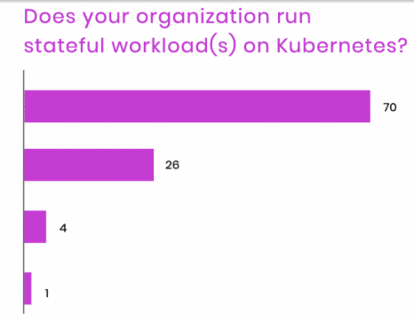
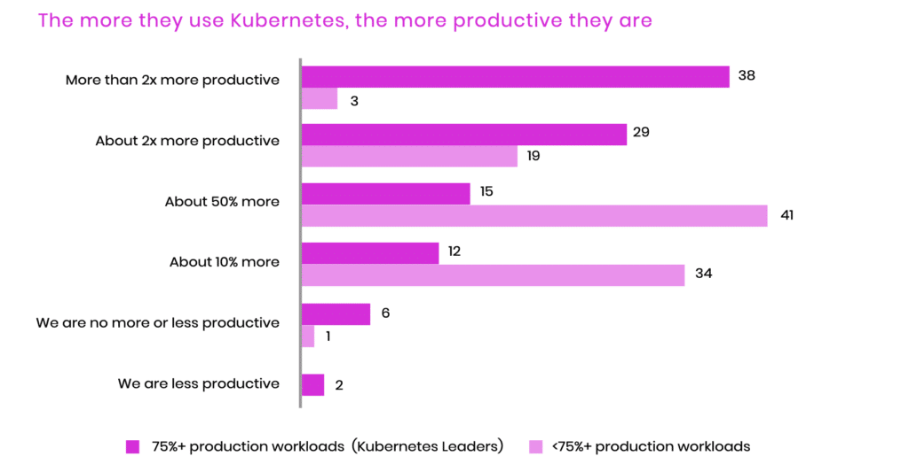

For people that work in infrastructure and application development, the pace of change is quick. Finish one project and it's on to the next. Each iteration requires an evaluation asking if the right technology is being used and if it provides a new advantage. Kubernetes has been on the fast track of continuous evaluation. New projects and methodologies are continuously emerging and it can be hard to keep up. Then there is the question of running stateful services. The Data on Kubernetes community has [released a report](https://dok.community/dokc-2021-report/) titled "Data on Kubernetes 2021" to give us a snapshot of where our industry sits with stateful workloads. Over 500 executives and tech leaders were asked some very direct and insightful questions about how they use Kubernetes. It turns out that there were a lot of surprising finds. Some that I would have never predicted. Let's dig into some of the highlights that stood out to me.

One of the most important findings in the survey is how recently the trend of running stateful workloads on Kubernetes has turned from the minority to a majority. Not just a year ago most Kubernetes organizations were managing stateful in a separate environment. Microservices running in Kubernetes, database running on bare metal or VMs. Now in a major shift, a majority (70% of respondents) say they are embracing stateful workloads and are full steam ahead (*Figure 1*).

What happened? This is likely due to the meeting of two important factors. Kubernetes has undergone a lot of important changes to make stateful workloads a first-class workload, especially around storage such as Stateful Sets. The other is the general maturity in the industry when it comes to running any workloads in Kubernetes and the comfort level to bring critical workloads into the control plane. Every cloud now has a Kubernetes service and the proliferation of operators has lowered the barrier to entry for most organizations to go all-in on Kubernetes. That includes stateful data workloads. This is something we have witnessed at DataStax firsthand, as our customers increasingly are using Kubernetes for the entire stack.

Figure 1

On the downside, an age-old issue that has plagued fast-moving technology reared its head in the survey results.. The survey showed we are still trying to deal with finding qualified people to adopt new technology and experienced people to lead the way. Upgrading to newer technology takes resources and if older technology isn't retired, the tail of support needs only grows longer. In many cases, company growth can support the expansion of teams to meet these needs but can run into a brick wall when it comes to hiring. Upgrading existing personnel can be a faster way to stay on top of your resourcing needs. The path I have been advocating is transitioning [Database Administrators(DBA) to Site Reliability Engineer (SRE)](https://vmblog.com/archive/2021/10/04/does-the-move-to-cloud-native-spell-the-end-of-the-dba.aspx#.YVsQ41NKh-p) for a win-win for everyone involved. I can't think of a better group of professionals to take on the challenge of data on Kubernetes.

To help meet that demand, at DataStax we have been running free online workshops that attract thousands of DBAs as they upgrade their careers. We have also [added more certification](https://www.datastax.com/dev) for both administering and developing applications using Apache Cassandra on Kubernetes. It's great to see engineers taking advantage of this upgrade path and we hope to see the trend continue. This is a survey data point we'll be watching closely in the coming years.

Beyond any need to upgrade technology for the sake of the latest thing, the survey showed that there were some very compelling business outcome reasons for being all-in on Kubernetes. The volume of digital transformation during the covid-19 pandemic has blown through any reasonable expectations. Organizations using Kubernetes reported that they were**twice as productive** after adoption. The aim of Kubernetes has been to reduce the toil for infrastructure engineers. Instead of provisioning hardware and installing software, engineers are describing what they need in containerized deployments.

Doing more with less is the dream of any technology leader trying to bring new or improved products to market. Any advantage of moving faster will keep you ahead of the competition that is most likely also moving fast. Those of you that have used Kubernetes can understand why this might be the case. Kubernetes handles a lot of what has traditionally been managed by entirely separate teams. A deployment creates a virtual data center that includes default secure networking with certificates, routes, and domain name entries. Much like how the automotive industry used robotics to increase the productivity of assembly lines, infrastructure automation via Kubernetes is meeting a similar promise.

The last point is one that we live every day here at DataStax. When we asked for the important factors about running stateful workloads on Kubernetes, the top answer respondents gave was ensuring consistency. Doing the same thing over and over with no deviation and, more importantly, no surprises! Those that have made the move to Kubernetes have learned that declarative infrastructure is a super-power. Defining the end state of your application and letting Kubernetes ensure that the state is met and maintained. This frees your team to work on the things that build your business by creating applications your customers love.

At DataStax we have first-hand knowledge of this from our cloud data service [Astra DB](https://astra.dev/31t7NQN). We rely on Kubernetes every day to run a scale Cassandra service with the consistency and reliability required by our customers. It's safe to say that we couldn't do what we do without Kubernetes. So if anyone asks if you can bet your business on stateful data run on Kubernetes, the survey (and DataStax) says… yes!

The Data on Kubernetes community is just getting started and we would love to have you [there](https://dok.community/). We are looking for more organizations to participate and especially end users. Tell your story. Share your experience. Help others succeed. That's the best part of a community.
