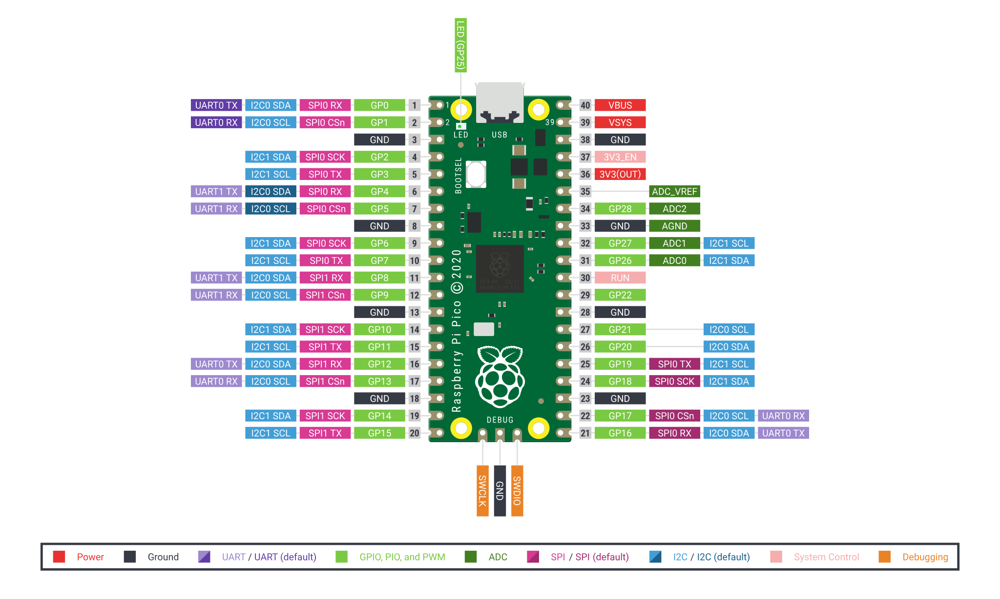
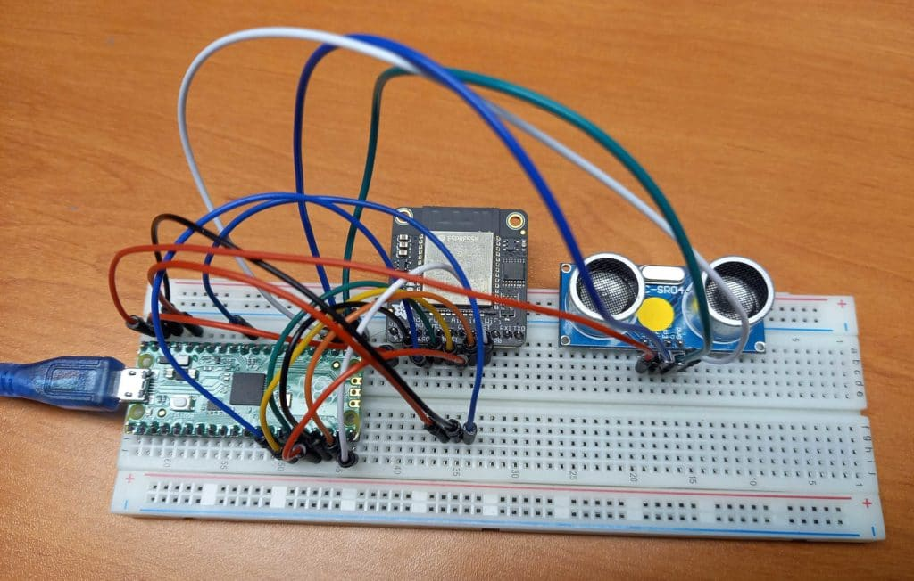
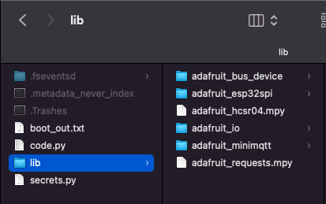
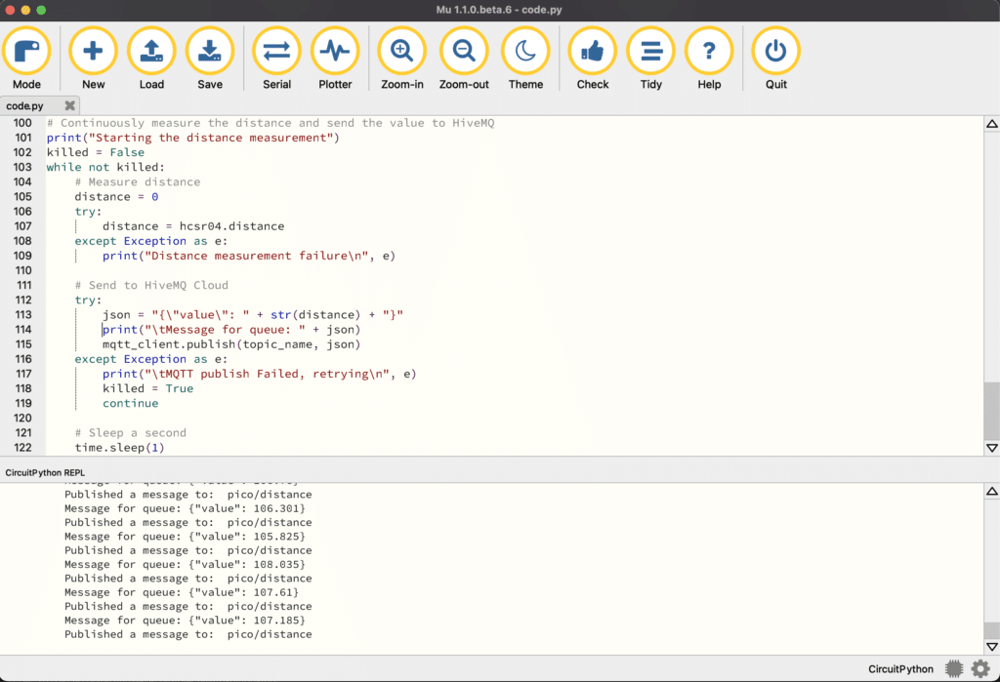
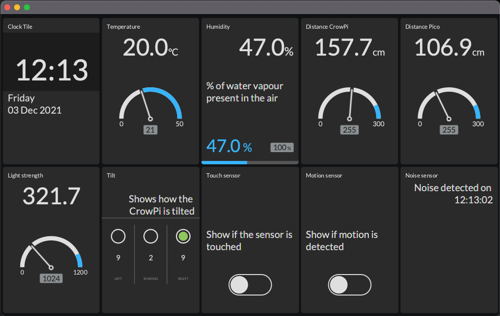

In the previous two posts in this series, we used Java on the Raspberry Pi mini-computer to send sensor data to HiveMQ Cloud, and visualize it on a dashboard.

1. ["Part 1: MQTT on Raspberry Pi, Send Sensor Data to HiveMQ Cloud with Java and Pi4J"](https://foojay.io/today/mqtt-on-raspberry-pi-part-1-send-sensor-data-to-hivemq-cloud-with-java-and-pi4j/)
2. ["Part 2: Using MQTT and Raspberry Pi to Visualize Sensor Data on a TilesFX Dashboard"](https://foojay.io/today/mqtt-on-raspberry-pi-part-2-using-mqtt-and-raspberry-pi-to-visualize-sensor-data-on-a-tilesfx-dashboard/)

Now we are going to add some more data to our messaging system with another member of the Raspberry Pi family: the Pico, and add this new data to the JavaFX dashboard from part 2.



## About the Raspberry Pi Pico

In January 2021 the Raspberry Pi Pico was introduced. This is a completely new type of board as it's not a full Linux PC, but a microcontroller chip (RP2040) developed by Raspberry Pi itself, on a small and versatile board. This RP2040 features a dual-core Arm Cortex-M0+ processor with 264KB internal RAM and support for up to 16MB of off-chip Flash, combined with a wide range of GPIOs (supporting I2C, SPI, and Programmable I/O (PIO)). So it's comparable to an Arduino or similar microcontroller board. But the biggest surprise of this Pico: the price of only 4$!

The Raspberry Pi Foundation made sure a very extensive [documentation site](https://www.raspberrypi.com/documentation/microcontrollers/raspberry-pi-pico.html) was available when the board was launched. Programming can be done with a C/C++ and MicroPython SDK.

The Pico provides a lot of GPIOs which are grouped very nicely by separating them with a ground connection. These grounds even have a different shape on the board (no rounded corners), to make it easier to find the correct pin you want to use.
 Pico pinout diagram

## Pico project

For this post, we will extend the Pico with a WiFi module and one distance sensor, as an example of how you can easily send sensor data to HiveMQ Cloud from this inexpensive board. To achieve this very low price, the Pico doesn't contain wireless functions. Luckily there are different possibilities to add WiFi to the Pico, of which the [Adafruit AirLift ESP32 WiFi Co-Processor Breakout Board](https://www.adafruit.com/product/4201) is probably the easiest and cheapest at 9.95$. An extra advantage of the Adafruit products is the big amount of documentation they provide on their website. Most of these examples use a different "flavor" of MicroPython, called **CircuitPython**, which is based on the same Python implementation, but more focused on beginners, education, and getting started tutorials.

The project in this post is a combination of different examples from Adafruit:

* [Connecting to a MQTT Broker](https://learn.adafruit.com/mqtt-in-circuitpython/connecting-to-a-mqtt-broker)
* [Getting Started with Raspberry Pi Pico and CircuitPython](https://learn.adafruit.com/getting-started-with-raspberry-pi-pico-circuitpython/overview)
* [Quickstart IoT - Raspberry Pi Pico RP2040 with WiFi](https://learn.adafruit.com/quickstart-rp2040-pico-with-wifi-and-circuitpython/overview)
* [Python \& CircuitPython](https://learn.adafruit.com/ultrasonic-sonar-distance-sensors/python-circuitpython)
* [Installing the Mu Editor](https://learn.adafruit.com/welcome-to-circuitpython/installing-mu-editor)

## Prepare the Pico for CircuitPython

Let's start with preparing our Pico for this tutorial. We need to connect the components, flash CircuitPython on the Pico, add libraries, and upload our code.

### Wiring

Take a breadboard and some wires to create this small test setup.
 Breadboard wiring

#### Adafruit AirLift WiFi

The AirLift is the WiFi module that will handle all the communication between the Pico and HiveMQ Cloud. We need 8 breadboard wires to make the connection between both components. By using the pins 10 till 15 we group all the GPIO connections on one side.

Important remark on the Adafruit website: **You MUST use the Pico's VSYS pin for powering the AirLift Breakout.**

|      Pico       | AirLift |
|-----------------|---------|
| VSYS            | Vin     |
| GND             | GND     |
| GP10 (SPI1 SCK) | SCK     |
| GP11 (SPI1 TX)  | MOSI    |
| GP12 (SPI1 RX)  | MISO    |
| GP13 (SPI1 CSn) | CS      |
| GP14            | BUSY    |
| GP15            | !RST    |

#### Distance sensor

The third component on the breadboard is an HC-SR04 distance sensor, similar to the one in the CrowPi. Here we need 4 wires and for the GPIOs we use the other side of the Pico.

| Pico | HC-SR04 |
|------|---------|
| VBUS | Vcc     |
| GND  | GND     |
| GP16 | ECHO    |
| GP17 | TRIGGER |

### CircuitPython on the Pico

For our Pico to support this example CircuitPython project, we need to load the correct firmware and add some libraries.

#### Firmware

Download the firmware which needs to be installed on the Pico to be able to use it as a CircuitPython device. This .uf2-file for the Raspberry Pi Pico can be downloaded from [circuitpython.org/board/raspberry_pi_pico](https://circuitpython.org/board/raspberry_pi_pico/).

Use a USB cable (which is not charge-only), press and hold the BOOTSEL button on the Pico, and connect the cable between the Pico and computer. Wait until you see a new USB drive "RPI-RP2" appearing on your PC to release the BOOTSEL button.

Drag or copy the downloaded .uf2-file to the "RPI-RP2"-drive. When done, this drive will disappear as the Pico reboots, and reappear as a drive called "CIRCUITPY". Now your Pico is ready to program with CircuitPython.

#### Libraries

To simplify the use of components, a whole set of libraries is available as one download on [circuitpython.org/libraries](https://circuitpython.org/libraries). Download the ZIP-file, extract it on your PC and copy the directories or files from the following list to a directory "libs" on the "CIRCUITPY"-drive.

* adafruit_bus_device
* adafruit_esp32_spi
* adafruit_hcsr04
* adafruit_io
* adafruit_minimqtt
* adafruit_requests

 Files on the Pico

### IDE

The code-files can be written directly to the Pico with any text editor or IDE. Adafruit advises to use the Mu editor as this allows to both write the code and see the application output in one tool. You can download this tool from[codewith.mu](https://codewith.mu/).

Install the application on your PC, run it and select Mode \> CircuitPython.
 Mu Editor

### Code

The sources of this application are [available on GitHub in the same repository where you can find the sources of the previous two posts](https://github.com/FDelporte/HiveMQ-examples).

#### Secrets

To separate the generic code from your specific WiFi and HiveMQ Cloud credentials, a separate file is used. Create a file `secrets.py` and save it to the Pico with the following content, using your login, password, etc.

```
secrets = {
   'ssid' : 'WIFI_NETWORK_NAME',
   'password' : 'WIFI_PASSWORD',
   'timezone' : 'Europe/Brussels',
   'mqtt_username' : 'HIVEMQ_USERNAME',
   'mqtt_key' : 'HIVEMQ_PASSWORD',
   'broker' : 'YOUR_INSTANCE.hivemq.cloud',
   'port' : 8883
}
```

#### Main code

Below you find the full code for this project. I tried to explain every step by adding comments and prints. Create a new file in Mu, copy this code and save it to the Pico as `code.py`.

```
import time
import board
import busio
import adafruit_hcsr04
import adafruit_requests as requests
import adafruit_esp32spi.adafruit_esp32spi_socket as socket
import adafruit_minimqtt.adafruit_minimqtt as MQTT

from digitalio import DigitalInOut
from adafruit_esp32spi import adafruit_esp32spi

# Load the WiFi and HiveMQ Cloud credentials from secrets.py
try:
    from secrets import secrets
except ImportError:
    print("Error, secrets could not be read")
    raise

# MQTT Topic to publish data from Pico to HiveMQ Cloud
topic_name = "pico/distance"

# Initialize the Pico pins, WiFi module and distance sensor
esp32_cs = DigitalInOut(board.GP13)
esp32_ready = DigitalInOut(board.GP14)
esp32_reset = DigitalInOut(board.GP15)
spi = busio.SPI(board.GP10, board.GP11, board.GP12)
esp = adafruit_esp32spi.ESP_SPIcontrol(spi, esp32_cs, esp32_ready, esp32_reset)
hcsr04 = adafruit_hcsr04.HCSR04(trigger_pin=board.GP17, echo_pin=board.GP16)

# Handle HTTP requests
requests.set_socket(socket, esp)

# Check ESP32 status
print("Checking ESP32")
if esp.status == adafruit_esp32spi.WL_IDLE_STATUS:
    print("\tESP32 found and in idle mode")
print("\tFirmware version: ", esp.firmware_version)
print("\tMAC address: ", [hex(i) for i in esp.MAC_address])

# List the detected WiFi networks
print("Discovered WiFi networks:")
for ap in esp.scan_networks():
    print("\t", (str(ap["ssid"], "utf-8")), "\t\tRSSI: ", ap["rssi"])

# Connect to the configured WiFi network
print("Connecting to WiFi: ", secrets["ssid"])
while not esp.is_connected:
    try:
        esp.connect_AP(secrets["ssid"], secrets["password"])
    except RuntimeError as e:
        print("\tCould not connect to WiFi: ", e)
        continue
print("\tConnected to ", str(esp.ssid, "utf-8"), "\t\tRSSI:", esp.rssi)
print("\tIP address of this board: ", esp.pretty_ip(esp.ip_address))
print("\tPing google.com: " + str(esp.ping("google.com")) + "ms")

# Configure MQTT to use the ESP32 interface
MQTT.set_socket(socket, esp)

# Configure MQTT client (uses secure connection by default)
mqtt_client = MQTT.MQTT(
    broker=secrets["broker"],
    port=secrets["port"],
    username=secrets["mqtt_username"],
    password=secrets["mqtt_key"]
)

# Define callback methods and assign them to the MQTT events
def connected(client, userdata, flags, rc):
    print("\tConnected to MQTT broker: ", client.broker)

def disconnected(client, userdata, rc):
    print("\tDisconnected from MQTT broker!")

def publish(mqtt_client, userdata, topic, pid):
    print("\tPublished a message to: ", topic)

mqtt_client.on_connect = connected
mqtt_client.on_disconnect = disconnected
mqtt_client.on_publish = publish

# Connect to the MQTT broker
print("Connecting to MQTT broker...")
try:
    mqtt_client.connect()
    print("\tSucceeded")
except Exception as e:
    print("\tMQTT connect failed: ", e)

# Continuously measure the distance and send the value to HiveMQ
print("Starting the distance measurement")
killed = False
while not killed:
    # Measure distance
    distance = 0
    try:
        distance = hcsr04.distance
    except Exception as e:
        print("Distance measurement failure\n", e)

    # Send to HiveMQ Cloud
    try:
        json = "{\"value\": " + str(distance) + "}"
        print("\tMessage for queue: " + json)
        mqtt_client.publish(topic_name, json)
    except Exception as e:
        print("\tMQTT publish Failed, retrying\n", e)
        killed = True
        continue

    # Sleep a second
    time.sleep(1)
```

Because `code.py` is the default filename for the main code, this file will be executed directly, or you can soft-reset the board with `CTRL+D` in the terminal of Mu.

#### Program output

In the terminal of Mu, the print-output is shown.

```
Auto-reload is on. Simply save files over USB to run them or enter REPL to disable.
code.py output:
Checking ESP32
    ESP32 found and in idle mode
    Firmware version:  bytearray(b'1.2.2\x00')
    MAC address:  ['0x50', '0x18', '0x49', '0x95', '0xab', '0x34']
Discovered WiFi networks:
     *****1         RSSI:  -73
     *****2         RSSI:  -79
Connecting to WiFi:  *****1
    Connected to  *****1        RSSI: -71
    IP address of this board:  192.168.0.189
    Ping google.com: 20ms
Connecting to MQTT broker...
    Connected to MQTT broker:  ***.s1.eu.hivemq.cloud
    Succeeded
Starting the distance measurement
    Message for queue: {"value": 106.777}
    Published a message to:  pico/distance
    Message for queue: {"value": 106.352}
    Published a message to:  pico/distance
    Message for queue: {"value": 107.202}
```

## Adding the data to our JavaFX dashboard

With a few small changes, we can now add the data of the Pico messages to our JavaFX application we created in the previous post. The only file which needs to be modified is `DashboardView.java`.

### Code changes

First, we add a new variable:

```
private final Tile gaucheDistancePico;
```

Inside the constructor, we initialize the tile similar to the existing ones and define a subscription to the topic where the Pico publishes its distance measurements.

```
gaucheDistancePico = TileBuilder.create()
    .skinType(Tile.SkinType.GAUGE)
    .prefSize(TILE_WIDTH, TILE_HEIGHT)
    .title("Distance Pico")
    .unit("cm")
    .maxValue(255)
    .build();

client.toAsync().subscribeWith()
    .topicFilter("pico/distance")
    .qos(MqttQos.AT_LEAST_ONCE)
    .callback(this::handlePicoData)
    .send();
```

One last additional method is needed to parse the received data and update the tile:

```
public void handlePicoData(Mqtt5Publish message) {
    var sensorData = new String(message.getPayloadAsBytes());
    logger.info("Pico distance data: {}", sensorData);
    try {
        var sensor = mapper.readValue(sensorData, DoubleValue.class);
        gaucheDistancePico.setValue(sensor.getValue());
    } catch (JsonProcessingException ex) {
        logger.error("Could not parse the data to JSON: {}", ex.getMessage());
    }
}
```

### Extended layout

With these small modifications, we now will see the data of both the CrowPi and the Pico in one dashboard.


## Conclusion

The Raspberry Pi Pico is a very versatile device for a very low price. With the additional Adafruit WiFi module, you can easily add wireless communication. In the meantime, already many new boards based on this same RP2040 microcontroller are available and some of them even have WiFi onboard. A nice overview can be found on  
[tomshardware.com/best-picks/best-rp2040-boards](https://www.tomshardware.com/best-picks/best-rp2040-boards).

HiveMQ Cloud is a great (and free up to 100 devices!) way to experiment with messaging. When combining this with Java, Raspberry Pi, and electronic components, exchanging data between different applications and devices becomes very easy.

I hope these three posts can help you to get started to create your own project!

*This series has been written on request of HiveMQ and was originally published on the [HiveMQ Blog](https://www.hivemq.com/blog/mqtt-raspberrypi-part01-sensor-data-hivemqcloud-java-pi4j/).*
