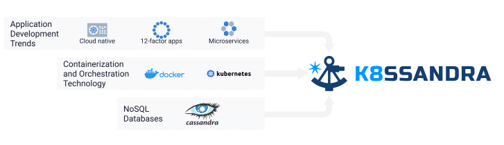

The problem: scalable data persistence for cloud-native applications
--------------------------------------------------------------------

The past decade and a half has brought tremendous change in how we in the software industry think about building and delivering internet applications. With the launch of Amazon Web Services (AWS) in 2006, companies of any size could access cloud computing infrastructure. The burst of creativity that followed gave birth to concepts like [cloud-native](http://pzf.fremantle.org/2010/05/cloud-native.html) in 2010, and methodologies such as the [twelve-factor app](https://12factor.net/) in 2011.

In parallel, there were major developments in open-source infrastructure for data and computing. [Apache Cassandra®](https://cassandra.apache.org/) and other NoSQL databases first appeared around 2008, supporting amazing performance and reliability at internet scale. Infrastructure for deploying and running containerized applications took huge leaps forward with the release of Docker in 2013. Kubernetes rapidly became the default standard for container orchestration soon after its release in 2016.
 Computing trends that inspired K8ssandra.

Unfortunately, computing and data infrastructure have been maturing in largely separate tracks these past several years. This was driven in part by the initial emphasis on Kubernetes for stateless applications. While many companies have successfully migrated cloud applications to Kubernetes and deployed Cassandra at massive scale in production, the data tier has been slower to follow. Running applications in Kubernetes with databases external to Kubernetes creates a mismatched architecture. This situation has led to limited developer productivity, duplicative stacks for monitoring applications and database infrastructure, and increased cloud computing cost.

The solution: K8ssandra == Production-ready Cassandra on Kubernetes
-------------------------------------------------------------------

The solution is to move the data tier into Kubernetes. Deploying Cassandra on Kubernetes directly alongside applications can be a significant driver of increased developer productivity and scalability at reduced cost. Whether you are a Cassandra user looking to move clusters to Kubernetes, a Kubernetes user looking for a scalable data solution, or an application developer looking to get up and running quickly with data APIs that "just work," K8ssandra was created to provide a production-ready deployment of Cassandra on Kubernetes. This includes not only the database itself, but also supporting infrastructure for monitoring and management so that you can deploy with confidence.

K8ssandra Defined
-----------------

So, what is K8ssandra, exactly? K8ssandra is an open source project with the mission of capturing SRE knowledge and best practices. This knowledge is distilled into a collection of Helm charts. The charts are deployable prescriptions for how to run Cassandra, along with supporting tools that ensure smooth operation of Cassandra clusters of any size.

The core of K8ssandra is [cass-operator](https://k8ssandra.io/docs/architecture/cassandra/), a [Kubernetes operator](https://kubernetes.io/docs/concepts/extend-kubernetes/operator/) which includes a [custom resource definition (CRD)](https://kubernetes.io/docs/concepts/extend-kubernetes/api-extension/custom-resources/) for Cassandra Datacenters. Cass-operator has two fundamental roles. First, it translates logical Cassandra terms like datacenters, racks, and nodes into Kubernetes resources such as labels, stateful sets, and pods. K8ssandra deploys those resources on the Kubernetes distribution of your choice. Second, it responds to Kubernetes notifications and takes corrective actions to reconcile state changes. This includes scaling the Cassandra cluster up or down based on a change to your desired number of nodes, or reacting to a pod terminated event for a Cassandra node by creating a replacement node and attaching a storage volume containing the correct data files.

Configuration Tailored to Your Kubernetes Environment
-----------------------------------------------------

Cassandra has a large surface area of configurable parameters. While this flexibility allows Cassandra to be tailored to a number of different environments and workloads, it is intimidating and error-prone for new users. Cass-operator takes care of setting these values appropriately for Kubernetes deployments and managing persistent volume claims and stateful sets. The documentation provides guidance on the appropriate storage classes for your preferred Kubernetes distribution, whether a public cloud, self-hosted infrastructure such as VMWare Tanzu, or a simple development configuration in Docker on your desktop.

Worry-Free Cassandra Operations
-------------------------------

In keeping with the principles of [shared-nothing architecture](https://en.wikipedia.org/wiki/Shared-nothing_architecture), Cassandra nodes have a lot of built-in intelligence. Cassandra nodes contain logic for keeping track of the other nodes in their cluster, spreading data and read/write load across these nodes, and maintaining high availability. Most of this work is handled automatically. However, there are two important operational tasks that are traditionally performed or scheduled by human operators based on the needs of each deployment. These tasks are backup/restore of data files, and anti-entropy repairs that run in the background to prevent data inconsistency.

Thankfully, the Cassandra community has developed two open-source tools to automate these operational tasks. [Medusa](https://docs.k8ssandra.io/components/medusa/) is a tool that automates backup of Cassandra's data files to an object store such as S3. Medusa provides interfaces for scheduling backups and restoring data on the rare occasion when a node needs to be rebuilt or replaced. [Reaper](https://docs.k8ssandra.io/components/reaper/) helps you schedule Cassandra's anti-entropy repair processing for off-peak times to maintain high throughput and low latency for your application queries.

Integration with the Rest of Your Stack
---------------------------------------

K8ssandra is designed to support common infrastructure that you're likely already using in your cloud-based deployments, instead of requiring separate infrastructure specific to Cassandra.

For example, let's consider observability, and specifically metrics. K8ssandra deploys the DataStax Metrics Collector for Apache Cassandra in the same Kubernetes pod alongside each Cassandra node. The metrics collector extracts metrics and pushes them to Prometheus. Grafana is configured as a visualization tool for these metrics. The deployment includes Grafana dashboards that allow you to monitor the key Cassandra and OS metrics indicating the health of each node. This makes it a simple task to create integrated views showing application and database metrics side-by-side, for a holistic view of system performance and health.

In another example, K8ssandra leverages TCP [ingresses](https://kubernetes.io/docs/concepts/services-networking/ingress/) for exposing Cassandra's native binary protocol. This alllows microservices or other application code running outside the Kubernetes cluster to access data using the Cassandra Query Language (CQL). The default configuration leverages [Traefik](https://docs.k8ssandra.io/tasks/connect/ingress/), but that may be replaced with the ingress implementation of your choice.

Optimizing Developer Productivity, Cost, and Performance
--------------------------------------------------------

Fast access to CQL endpoints is attractive to developers who are already using Cassandra. However, most developers we've talked with would prefer to code to data APIs for new development, rather than learning a new database query language. This is why [K8ssandra also includes Stargate](https://docs.k8ssandra.io/components/stargate/), a data services gateway. Stargate provides REST, Document, and GraphQL APIs on top of Cassandra. These familiar APIs lead to increased productivity and reduced time to market.

Because Stargate nodes are Cassandra-compatible, they participate in the Cassandra cluster. This architecture confers additional benefits: Stargate nodes do the compute-intensive coordination, while the Cassandra nodes handle data storage. This means that you can configure Cassandra deployments in Kubernetes with the right mix of compute-intensive Stargate and storage-intensive Cassandra machines for your use case. By selecting different instance types for Stargate and Cassandra nodes, you can achieve the ideal balance of cost and performance for your deployment.

Join the Community!
-------------------

The potential for Cassandra on Kubernetes is massive, and there are lots of areas to explore for people of all experience levels and backgrounds:

* If you're new to the project, make sure to check out the [Quick Start](https://docs.k8ssandra.io/quickstarts/) guides and follow up with some of the guided tutorials.
* Ready to dig into the source? Check out the [GitHub project](https://github.com/k8ssandra/k8ssandra) and [contribution guidelines](https://k8ssandra.io/community/code-contribution-guidelines/).
* Do you have knowledge, lessons learned, or best practices to share? We'd love to hear from you on Twitter ([@K8ssandra](https://twitter.com/k8ssandra)) or our [forum](https://forum.k8ssandra.io/).

We'll be excited to have you!
