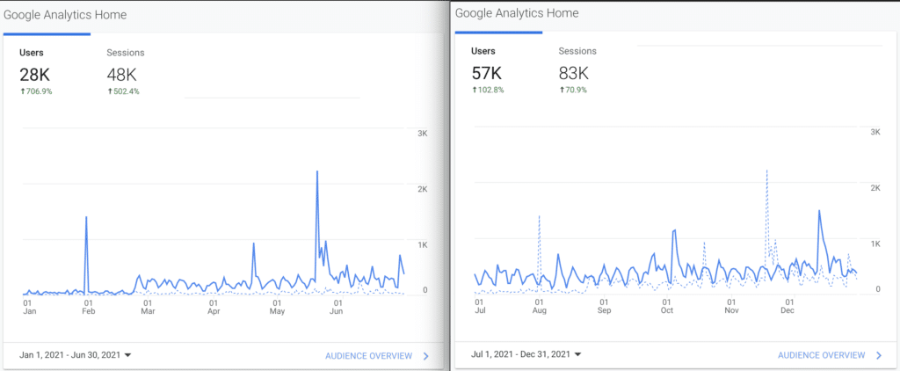

Another 6 months are behind us... and let's take a look at some stats on Foojay, a central resource and community platform for friends of OpenJDK. ([The previous report is here.](https://foojay.io/today/foojay-status-report-january-june-2021/))

In the back of my mind, in the first full year of Foojay, **it would have been great to have had 50K unique visitors and 100K sessions** , in terms of Google Analytics. Below is the actual result over the whole of last year, i.e., significantly more unique visitors and sessions than anticipated: **84K unique visitors and 131K sessions**.



The chart shows steady growth over the year, with some significant spikes, the first being around the announcement of the [Foojay Board](https://foojay.io/board/) and the [Foojay room at FOSDEM 2021](https://foojay.io/today/friends-of-openjdk-at-fosdem-2021/), the second an article by Wim, [Better Error Handling for Your Spring Boot REST APIs](https://foojay.io/today/better-error-handling-for-your-spring-boot-rest-apis/), the third (the biggest spike) is Deepu's [Demystifying JVM Memory Management](https://foojay.io/today/demystifying-jvm-memory-management/), Bazlur's great [Java threading series starting here](https://foojay.io/today/java-thread-programming-part-1/), and the last big spike is around [articles connected to log4j](https://foojay.io/log4j-cve).

How does the first half of the year compare to the second half of the year? Well, take a look, the first image shows the first half of the year and the second shows the second half of the year:

In other words, Foojay doubled in usage from the first half to the second half of the year.

Congrats everyone and that's a really nice trend!

Onwards to 2022, let's see what this year brings... first and most important of all is the upcoming Friends of OpenJDK room at FOSDEM. [See you there!](https://foojay.io/today/friends-of-openjdk-at-fosdem-2022/)

**Note:** Thanks to [Yelk for all their development work](https://yelk.com.ua) on Foojay.io!
