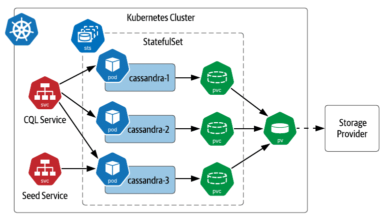
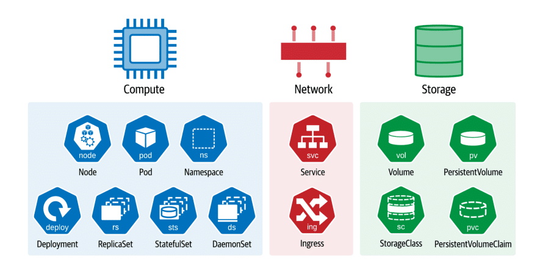
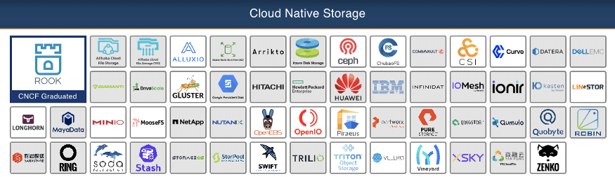

**Learn the key steps of deploying databases and stateful workloads in Kubernetes and meet the cloud-native technologies, like K8ssandra, that can streamline Apache Cassandra for K8s.**{#95cc}

The idea of running a stateful workload in Kubernetes (K8s) can be intimidating, especially if you haven't done it before. How do you deploy a database? Where is the actual storage? How is the storage mapped to the database or the application using it?{#6cde}

Let's demystify the deployment of databases and stateful workloads in K8s. Basically, it boils down to a few key steps:{#6104}

* Get to know the Kubernetes primitives
* Pick a database
* Pick a storage provider
* Pick an operator

This article dives into the key steps of deploying databases and stateful workloads in K8s. You can learn more about them in the [upcoming O'Reilly book](https://twitter.com/JessHaberman/status/1425898298959859712): Managing Cloud Native Data on Kubernetes.{#4c48}

Simply put: databases are just applications composed of compute, network, and storage. We can deploy them like any other K8s application and take advantage of resources that it provides: StatefulSets, Services, StorageClasses, PersistentVolumes, and PersistentVolumeClaims, and more.{#a54c}
 Figure 1: Kubernetes resources help us think of applications in terms of compute, network, and storage.

Getting comfortable with using these primitives will help you understand how databases and other data infrastructure are deployed on K8s. For example, a deployment of [Apache Cassandra®](https://cassandra.apache.org/) will typically use a StatefulSet to launch pods across available Kubernetes worker nodes, with each Cassandra pod having its own PersistentVolumeClaim that can be preserved and reused if the pod needs to be replaced.{#02fb}
 Figure 2: Simple deployment of Cassandra on Kubernetes using a StatefulSet.

For more great examples of using these primitives online, check the reference example in the Kubernetes documentation of [deploying Cassandra using StatefulSets](https://kubernetes.io/docs/tutorials/stateful-application/cassandra/). We're also building a [collection of examples on GitHub](https://github.com/data-on-k8s-book/examples) in association with the book project and would love to see your issues and pull requests.{#5517}

Once you've familiarized yourself with the basic building blocks of Kubernetes, there are three main considerations when setting up the right database for your application.{#aae9}

To start, you'll want to think about what *kind* of database your application needs. To help you make the right choice, consider the following factors:{#10e7}

* **Database language:** does your application need SQL, NoSQL, developer-friendly data APIs?
* **Capacity, performance, and scalability requirements**: will your data fit on a single node, or will you need a distributed database that can scale as your application grows?
* **Deployment topology**: will your application be running in on-premises data centers, public clouds, or a mix of both?

Deciding on a database isn't entirely independent from other decisions in your application design, and we'll see more of this below. Note that your needs may also change as your application evolves.{#c1cf}

Unless the database you choose is just a cache holding ephemeral data, you'll need to configure your database to use persistent storage. If you're using one of the public clouds, you'll have storage options available such as Elastic Block Storage (EBS) volumes in AWS.{#9616}

However, there are many other options that are cloud-vendor independent. You can find a thriving ecosystem of K8s providers in the [Cloud-Native Storage category](https://landscape.cncf.io/card-mode?category=cloud-native-storage&grouping=category) of the CNCF Landscape.{#2674}
 Figure 3: Cloud Native Storage projects on the CNCF Landscape as of September 2021.

These include a number of options for managing both local and networked storage, in formats such as block, file, and object storage. You'll likely be able to find sample code that shows how to configure your selected database to use your chosen storage provider. For example, here's a [tutorial on running Apache Cassandra on OpenEBS](https://docs.openebs.io/docs/next/cassandra.html), a popular open-source storage provider for K8s that you can run in a variety of environments.{#b20b}

If you intend on running more than a small handful of nodes of your selected database, you'll benefit from automating your operations by using a K8s Operator. You can find a wide variety of operators for databases and other applications at the [OperatorHub](https://operatorhub.io/?category=Database). When selecting an operator, you'll want to make sure it's open-source, and also check how actively it's maintained.{#8fb3}

There are operators for most popular databases, such as the Zalando [Postgres-operator](https://postgres-operator.readthedocs.io/en/latest/), or [Cass-operator](https://github.com/k8ssandra/cass-operator), which the Apache Cassandra community [has recently banded around](https://cassandra.apache.org/_/blog/Cassandra-and-Kubernetes-SIG-Update-2.html). Cass-operator is actually part of a larger project called [K8ssandra](https://k8ssandra.io/), which builds on that operator to create a more comprehensive data platform around Cassandra. This includes tooling for maintenance and backups, along with an open-source data gateway called [Stargate](https://stargate.io/) that supports a variety of developer-friendly APIs.{#d40a}

Of course, even with an operator, running a database in K8s yourself may be more than you want to take on, especially if you're a smaller team looking to maximize your leverage.{#3ec0}

If this is you, you can still take advantage of one of the many managed database services available. If you need a highly scalable database combined with a great developer experience, [DataStax Astra DB](https://astra.dev/3ARx46y) is a great choice. Astra DB is a managed Cassandra service that itself happens to be built on top of Kubernetes, and the Stargate APIs are available by default --- even with a [free Astra DB account](https://astra.dev/3ARx46y).{#9a86}

No matter what choices you end up making for your K8s-deployed applications, you can find a group of passionate developers pushing the state of the art forward in the [Data on Kubernetes Community](https://dok.community/) (DoKC). If you're attending KubeCon North America, join us for [DoK Day](https://events.linuxfoundation.org/kubecon-cloudnativecon-north-america/program/colocated-events/#data-on-kubernetes-day) on Tuesday, October 12.{#d602}

*Register* [*here*](https://events.linuxfoundation.org/kubecon-cloudnativecon-north-america/register/)*to join KubeCon North America 2021 and* [*subscribe to our event alert*](https://docs.google.com/forms/d/e/1FAIpQLSfEtzzVauuFpFJWUiepYndqchBpNsaOwm6raPJDsMt9nTvMbw/viewform)*to get notified about new DataStax workshops for developers, by developers. For exclusive posts on Cassandra, streaming, Kubernetes, and more; follow* [*DataStax on Medium*](https://datastax.medium.com/)*.*{#1970}

1. [Astra DB --- Managed Apache Cassandra as a Service](https://astra.dev/3ARx46y)
2. [Stargate APIs \| GraphQL, REST, Document](https://stargate.io/)
3. [GitHub: Examples for Managing Cloud-Native Data on Kubernetes](https://github.com/data-on-k8s-book/examples)
4. [k8ssandra/cass-operator: The DataStax Kubernetes Operator for Apache Cassandra](https://github.com/k8ssandra/cass-operator)
5. [KubeCon North America 2021](https://events.linuxfoundation.org/kubecon-cloudnativecon-north-america/)
6. [DataStax Academy](https://auth.cloud.datastax.com/auth/realms/CloudUsers/protocol/saml/clients/absorb)
7. [DataStax Workshops](https://www.datastax.com/workshops)
