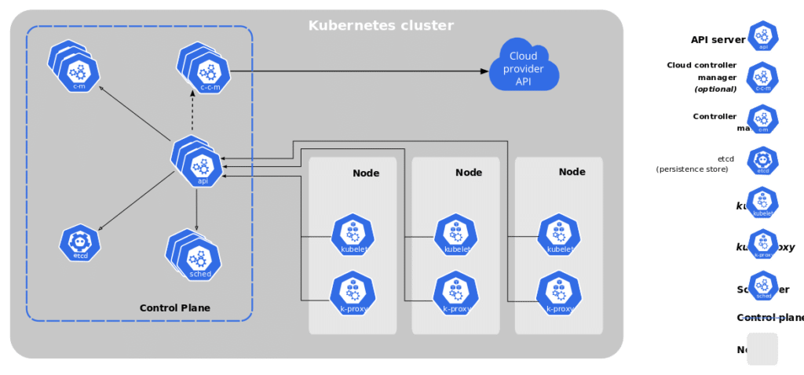
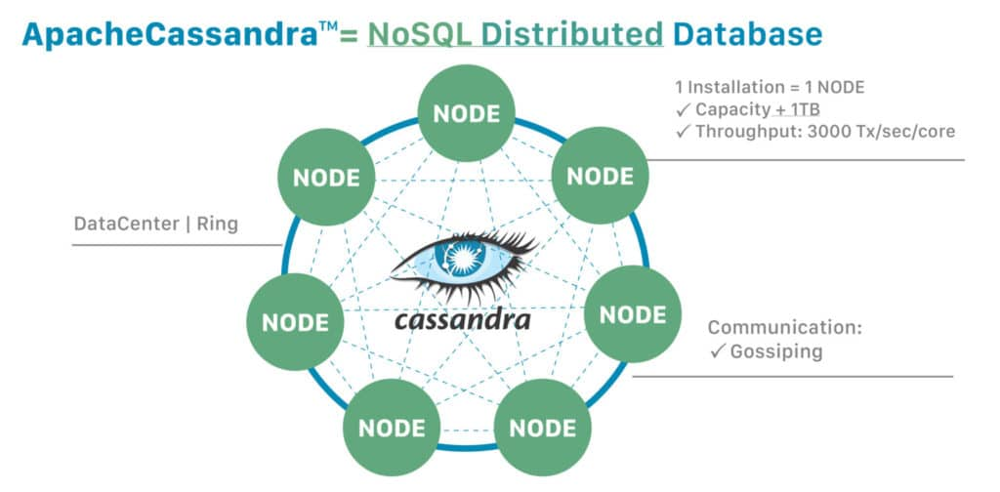

 "I need it now and I need it reliable"
> -- ANYONE WHO HASN'T DEPLOYED APPLICATION INFRASTRUCTURE

If you're on the receiving end of this statement, we understand you here in the [K8ssandra community](https://dtsx.io/3uZHFqS). Although we do have reason for hope. Recent [surveys](https://dok.community/dokc-2021-report/) have shown that [Kubernetes](https://kubernetes.io/) (K8s) is growing in popularity, not only because it's powerful technology, but because it actually delivers on reducing the toil of deployment.

Deploy an application on Kubernetes and it's easy to miss the almost magical, complex orchestration that happens as compute, network, and storage are all aligned into what you declared in a YAML file. With the size and scale of applications we need for modern cloud applications, we could certainly use a little magic.

While Kubernetes is the go-to orchestration platform to run distributed applications in the cloud, Cassandra provides a dependable distributed database environment.

If you go back to when we were using shell scripts on bare-metal, you'll find [Apache Cassandra®](https://cassandra.apache.org/_/index.html) proudly growing with the tech stacks of companies like Uber, Spotify, and Netflix. Known for its robust, distributed, and scalable infrastructure --- with no single point of failure and high availability --- it's the top choice for any business operating large-scale cloud applications that need to reliably maintain their "always-on" services.

It's common to Cassandra and K8s described as the "most logical pairing" since they allow you to keep your data and operations close for better performance at scale.So let's take a closer look at what makes Cassandra and K8s a dream team --- and why this isn't always true.

**Why Cassandra and K8s work so well together** {#h-why-cassandra-and-k8s-work-so-well-together}
------------------------------------------------------------------------------------------------

Like any great story of modern infrastructure, it all started with the need to scale. Before the term "cloud native" became mainstream, Cassandra was inspired by the distributed storage and replication techniques from Amazon's [DynamoDB](https://www.allthingsdistributed.com/files/amazon-dynamo-sosp2007.pdf), as well as the data storage engine model from Google's [Bigtable](https://static.googleusercontent.com/media/research.google.com/en//archive/bigtable-osdi06.pdf). The idea was to build the best of both into one package to help guarantee availability and resiliency for large-scale, business-critical applications.

Guided by a similar philosophy, Kubernetes boasts a leaderless architecture that also makes it reliable, easy to scale, and highly available. The main difference is that Cassandra is a shared-nothing architecture (i.e. nodes don't share memory or storage), whereas Kubernetes has a primary node --- the control plane --- which runs across multiple machines to provide fault-tolerance.

Essentially, both Cassandra and Kubernetes are distributed systems designed to meet the snowballing requirements for data and storage in global-scale apps. It's unlikely we'll have *less* data and infrastructure in the future, so we need strategies that embody the following ideas:

* **Scale:** Cassandra and K8s both allow for horizontal or vertical scaling, and are both based on nodes, which lets developers expand or shrink their infrastructure with no downtime or third-party software. You can simply tell K8s by how much you want to resize your Cassandra cluster and let it deal with the logistics.
* **Elasticity:** With the ability to dynamically add or remove nodes, developers can build and run distributed applications that automatically scale, based on demand, to free resources outside of peak load periods. One of the more critical elements of controlling costs in scale infrastructure is finding ways to prevent paying for idle resources.
* **Self-healing:** K8s will instantly redeploy failed containerized apps, and Cassandra makes it easy to recover failed nodes without losing any data thanks to its built-in replication. For example, Spotify uses Cassandra to easily replicate the data between their EU and US data centers, allowing [Spotify's music personalization system](https://engineering.atspotify.com/2015/01/09/personalization-at-spotify-using-cassandra/) to reach their users if any single center should experience a failure.

The reason both K8s and Cassandra can accomplish similar things is rooted in the architecture of distributed systems. Namely, building systems that act as a team where no one piece is critical. When comparing Figure 1 to Figure 2, you can see some basic similarities; nodes act independently and communicate via a network to coordinate and exchange data.

The concept of a node in distributed computing is a basic unit of scale and resilience. Cassandra overlays nicely on a K8s cluster with concerns for compute, network, and storage being managed independently. Again, the main difference is the control plane, which leads us to our next point.

**How sometimes they don't work well together** {#h-how-sometimes-they-don-t-work-well-together}
------------------------------------------------------------------------------------------------

It would appear Kubernetes and Cassandra are highly compatible and can coexist peacefully in your tech stack. After all, they're both distributed, scalable, and resilient --- except they're actually more like two pieces from different puzzles that don't quite fit together without some elbow grease.

Take Cassandra operators, for example. In Kubernetes, the compute and storage are separate rather than managed as a group. So in a failure scenario, K8s could replace a node without attaching the precious storage data. The challenge is keeping the storage with the Cassandra node that owns the data, which is simple to do using operators like [cass-operator](https://dtsx.io/3ByF2yK) instead of hours of manual work.

In recent years we've seen a flurry of open-source technologies designed to solve some of the challenges around K8s and Cassandra. [K8ssandra](https://dtsx.io/3v2PSKZ), for example, is a production-ready, open-source project that abstracts away the transactional and operational aspects of Cassandra deployments, making it easy to deploy and manage Cassandra on any K8s engine (and they mean **any**).

As compatible as K8s and Cassandra may be, sometimes you don't want to have to piece things together, you just want the full picture pre-assembled so you can move on to building better things. The bottom line is: there's a growing need for a cloud-native database that's inherently designed for Kubernetes. One that's built to leverage its capabilities, not dance around them.

In the next post, we'll take a closer look at how Cassandra pushes the boundaries of K8s, and explore how the pipe dream of a cloud-native database *designed specifically for K8s* might not be just a dream after all.

Resources {#h-resources}
------------------------

Curious to learn more about (or play with) Cassandra itself? We recommend trying it on the [Astra DB](https://astra.dev/3uYxgxN) free plan for the fastest setup.

1. [K8ssandra -- Apache Cassandra® on Kubernetes](https://dtsx.io/3v2PSKZ)
2. [GitHub: K8ssandra](https://dtsx.io/3DzVKi1)
3. [Kubernetes Architecture](https://avinetworks.com/glossary/kubernetes-architecture/)
4. [The Dynamo Paper -- David Furnes](https://www.dfurnes.com/notes/dynamo)
5. [cass-operator: The DataStax Kubernetes Operator for Apache Cassandra](https://dtsx.io/3ByF2yK)
