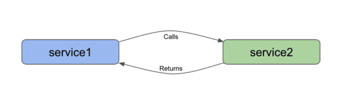
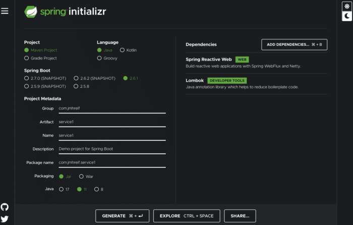
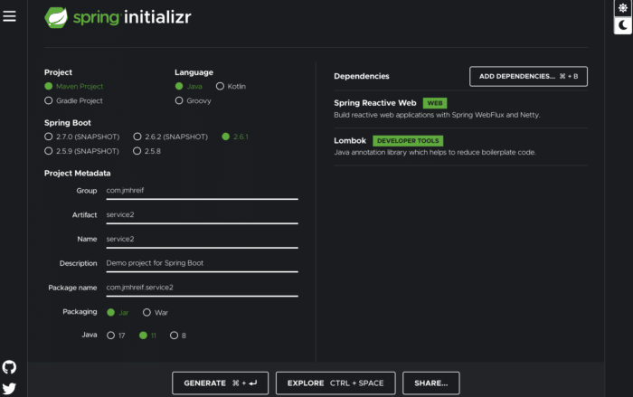
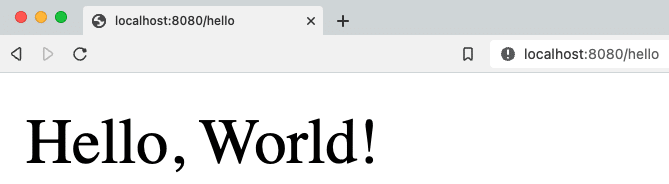

Microservices have been used and deployed in businesses and projects for awhile, and there is plenty of content available for architecting them into a system. For my next project, I want to dive into the world of microservices and begin building my own little virtual empire from different kinds of services to find out the complexities, best practices, power, and trouble that comes with them. I will share all my learnings along the way, as well.

While I know the general idea behind microservices and have heard both the benefits and hassles of them, where to start? After some research, reading, and chatting with colleagues, someone mentioned starting with two applications talking to one another via REST.

This sounds easy, right? 🙂 The output was easy, but putting the right pieces in place to produce them was a bit trickier, as I wasn't able to find existing projects that completely mimicked the fundamental concepts (most started at a level or two above).

I came up with some code, but wasn't able to get it returning anything. After a bit more reading and playing around, I got busy with a few other deadlines, then came back to the microservices project again recently. A few minutes of reviewing surfaced the issue, and removing a line of code got the project running! Success!

## Why Microservices?

There are tons of reasons for and against a microservices architecture - many rooted in frustrations and limitations found in current business scenarios - but what does that have to do with us or our projects?

Microservices are commonly an alternative to building all functionality in a single application or system. Grouping many different functionalities together can be cumbersome for finding/reusing code, scaling (resource consumption), adding/removing/changing features, and handling failures.

It's hard to find a utility class for formatting numbers to use in the new customer order system when it has been used for finance, HR, and operations applications. Where is the original source code and which systems copy/pasted?

What about when it is the holiday rush and your order section of the application needs more resources to handle the load? You'll need to scale up many duplicates of the whole application, optimizing for the orders and oversizing for the shipping part of the application. When the dev team needs to add a new shipping method to the system, you'll need to test all shipping methods, as well as the all other functionality to ensure changes don't impact non-related components. Finally, when the customer system is handling many simultaneous user logins that crash the system, the orders and shipping will also be down.

If businesses hold all their functionality in a single application, it can cause frustrations, inefficiencies, and dependencies that add to response times and create large failure points. Microservices' aim is to combat these problems by breaking the bundled behemoth applications into small, independent mini-apps.

On the bright side, the standard issues we saw from the larger app are abated. On the down side, there are complexities with coordinating services and additional technical layers for communication channels and management. There is no one-size-fits-all in any technology, so businesses still need to evaluate and advocate for those that make the most sense in their unique situations.

Let's talk architecture!

## Architecture

Our eventual goal is to create a web of microservices that communicate and pass information without intervention. However, before we get to that point, we need to reduce everything to the base components and concepts. We need two things - more than one application (to have conversation), and communication between them.

I like to think of this architecture like a bridge connecting two bits of land. There are some extremely complex and astounding bridges in the world, but we will start with a small footbridge over a stream (like that in the header image). 🙂

Our architecture diagram will, therefore, will look like the following:



There are several technologies we could use to build our two services and the channel between them, but there were a few things that went into my decision. First, since I want to tack on skills slowly and not take on too many new things at once, I wanted to stick with some things I'm already familiar with. I can always change or expand things once I have a working system.

With that in mind, I chose both [Spring Boot](https://spring.io/projects/spring-boot) to build my applications and [REST endpoints](https://restfulapi.net/) for my communication channels. Some microservices content insists REST is not "true microservices" (as it requires some mapping and knowledge of client services), but just to get the cogs turning, this is our initial stepping stone. As we get comfortable with the technologies, we will move from the abridged to the unabridged microservices forms. Now it's time to start building!

## Applications - Service 1

We could build the front or the back service to start, but I usually like to start from the bottom and build up. So, `service1` will be our backend service. Because we are using Spring Boot to build these services, I can assemble the skeleton of the project from the [Spring Initializr](https://start.spring.io/).

I'll leave the first three fields as defaults (Maven project, Java language, Spring Boot 2.6.1), and the `Project Metadata` section can also remain defaulted, if you'd like. I'll make a couple of tweaks for my personal preferences (just to group and artifact fields). Packaging and Java version will also stay defaulted.

In the `Dependencies` area, we need to add two things - `Spring Reactive Web` and `Lombok`. The use of Lombok is personal preference, as well, but I wanted to use it here to trim some code. Next, click the `Generate` button at the bottom of the screen and pick a location to save it.



**Note:* the Spring Initializr displays in dark mode or light mode via the moon or sun icons in the right column of the page. The image above is in dark mode.*

After the project downloads, find the `.zip` file and uncompress it. Open the uncompressed folder in your favorite IDE, and let's start coding!

### Service 1 - project code

There is very little code we need to add to this project. Our goal is to create an REST endpoint that another application can reach, returning results so that we confirm the connection. That means we will need a REST endpoint and some return value.

I'll code everything in the `Service1Application` file, since we don't have much code to add. To add the REST controller bit, we can use the `@RestController` annotation in Spring and set up the endpoint using `@RequestMapping("/text")`. This tells the application that we will use the `/text` suffix in order to get to anything we define within this class. With Lombok, I also add the `@AllArgsConstructor` to create a constructor with all arguments. All that's left is to define a method to return something.

For now, we will return a bit of text because I don't want to add complexity with a data store just yet. Adding complexity defeats our purpose, after all. 🙂 We can define a method with a `String` return type and call it `sayHello()`. Next, we will return a hard-coded message from the call. Let's use the string "Hello, World!". It's simple and doesn't require additional dependencies.

All of our added code is shown below ([full code on Github](https://github.com/JMHReif/microservices-level1/blob/main/service1/src/main/java/com/jmhreif/service1/Service1Application.java)):

```java
@RestController
@AllArgsConstructor
@RequestMapping("/text")
class TextController {
   @GetMapping
   String sayHello() { return "Hello, World!"; }
}
```

So short and sweet, right? Let's charge on to Service 2!

## Applications - Service 2

Now that we have completed our backend service, we need to build the second service on the front to call it. Time to head back to the Spring Initializr! Our fields will look very similar to those in our last project, which makes this one faster. The only change is our artifact name. We will keep the same dependencies of `Spring Reactive Web` and `Lombok`. Click the `Generate` button, pick a place to save, unzip, and open the project in your IDE.



Let's add some code!

### Service 2 - project code

Just as with service1, we will keep our code light and as simple as possible. I haven't done anything unusually new from previous applications I have built, but this is where I add some new things. Most of my prior applications have used a data store and injected a bean for my data store's repository that I define. However, since we are removing the data store for this project, what do I inject?

Also, many of my projects relied upon traditional imperative programming style (synchronous). Traditional microservices aim to have a bit more independence with asynchronous and streaming results, which we will accomplish through reactive programming (with `WebFlux` dependency vs `Web`).

Thankfully, we can answer both questions with the same solution - the [WebClient interface](https://docs.spring.io/spring-framework/docs/current/javadoc-api/org/springframework/web/reactive/function/client/WebClient.html). WebClient handles HTTP requests in a non-blocking manner, meaning it doesn't need to wait for all results to return nor wait for one request to complete before starting the next. In short, processes and results are not *blocked* under normal circumstances.

First, we will need to create a bean for our WebClient object, so that we can inject and use its object. In our `Service2Application` class, we can create the bean (outside the `main` method) with the `@Bean` annotation. Code will look like the following:

```java
@SpringBootApplication
public class Service2Application {
    public static void main(String[] args) {
        SpringApplication.run(Service2Application.class, args);
    }
    @Bean
    WebClient client() {
        return WebClient.create("http://localhost:8081");
    }
}
```

Next, we need to create another controller for us (as the user) to interact with and call our backing service. For more on what the controller is/does, see the explanation of [MVC design pattern](https://www.geeksforgeeks.org/mvc-design-pattern/) (design pattern Spring follows). Similar to our `service1`, I added the class below the application class, but in the same file.

Users will interface with service2 (through `:8080/hello` endpoint), and then service2 interacts with service1 and any other backing services. In order to expose this service for users, I will create a REST service with `@RestController` and `@RequestMapping` annotations, just as I did with service1. The rest controller annotation will find our custom WebClient bean and inject it into the class.

I also will need a constructor, so I'll use the `@AllArgsConstructor` annotation from Lombok to create one. Next, we need to inject our `WebClient` bean into the class to use it for calling the backing service over HTTP and returning the results in a non-blocking fashion.

Last, but certainly, not least, we need to create the method that calls our backing service. We know to expect a single `String` value in return, so because we are working with reactive types, our type choices are `Mono` or `Flux`. `Mono` is for 0 or 1 return values, so this is what we need. *Note:* `Flux`*is 0 to n values.*

We can name the method anything we want to. Here, it is just called `getText()`. Inside the method, we will return the outcome of calling the client, getting values (read only), at the uri `/text`, retrieving the body portion of the response (`.retrieve()`), and then mapping that body to a single String (`.bodyToMono()` of `String.class`).

Final code is shown below ([full code on Github](https://github.com/JMHReif/microservices-level1/blob/main/service2/src/main/java/com/jmhreif/service2/Service2Application.java)).

```
@RestController
@AllArgsConstructor
@RequestMapping("/hello")
class TextController {
    private final WebClient client;

    @GetMapping
    Mono<String> getText() {
        return client.get()
                .uri("/text")
                .retrieve()
                .bodyToMono(String.class);
    }
}
```

Time to test it out and see if it works!

## Put it to the test

Start each of the applications, either through your IDE or via the command line. Once both are running, open a browser and go to `localhost:8080/hello`. Alternatively, you can run this at the command line with `curl localhost:8080/hello` or (if you have [httpie](https://httpie.io/) tool installed) `http :8080/hello`.

And here should be the output!



## Wrapping up!

Congratulations, we have created our first (albeit, rudimentary) pair of microservices!

We created two individual Spring Boot applications that communicated over HTTP by creating a REST api backing service that produced a string message and a client REST frontend service that called the backing service and displayed the text in response. We utilized the Spring `WebClient` interface to reactively call and retrieve results. Our starter services successfully prove that our communication channel between the two applications works, solidifying the foundation of the microservices architecture.

The root of microservices is all about having multiple applications/technologies as services and getting them to communicate among one another. Of course, there is much more to a production-ready rendition, such as scale, coordination, error-handling, and so on. However, this first step gives us our footbridge, gathering confidence and skill required to eventually tackle the business-scale systems.

Happy coding!

## Resources

* Github: [microservices-level1](https://github.com/JMHReif/microservices-level1) repository
* Documentation: [Spring Boot](https://spring.io/projects/spring-boot)

(Cover photo by [Dženis Hasanica](https://unsplash.com/@dddzenis?utm_source=unsplash&utm_medium=referral&utm_content=creditCopyText) on [Unsplash](https://unsplash.com/@jmhreif/likes?utm_source=unsplash&utm_medium=referral&utm_content=creditCopyText))
