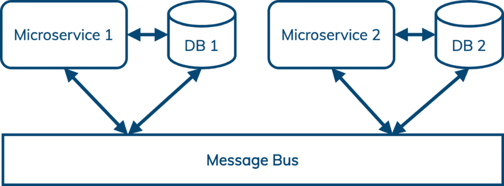
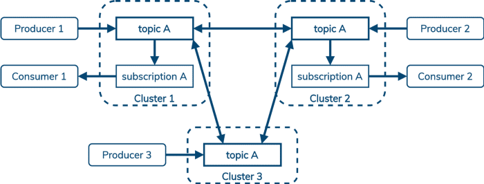
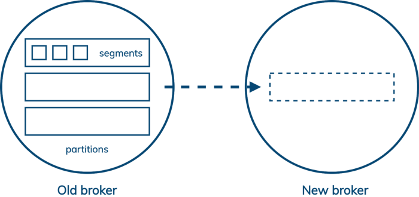
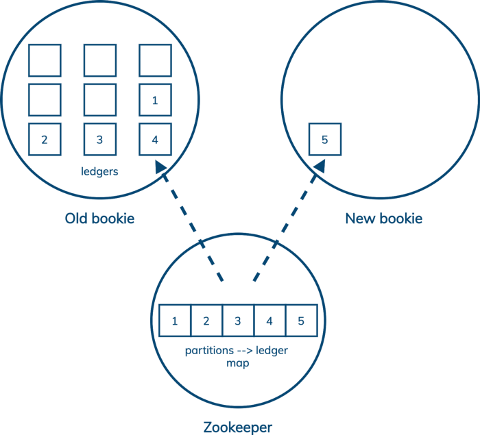
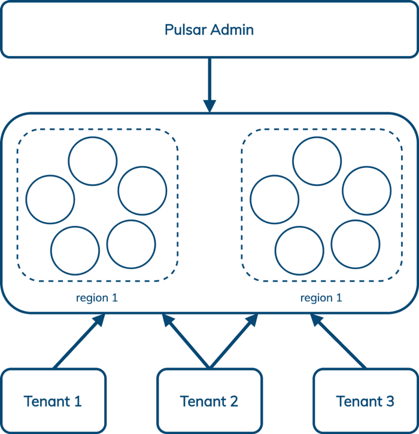
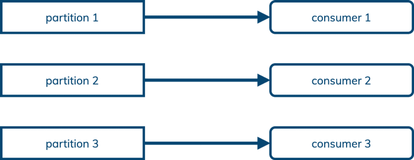
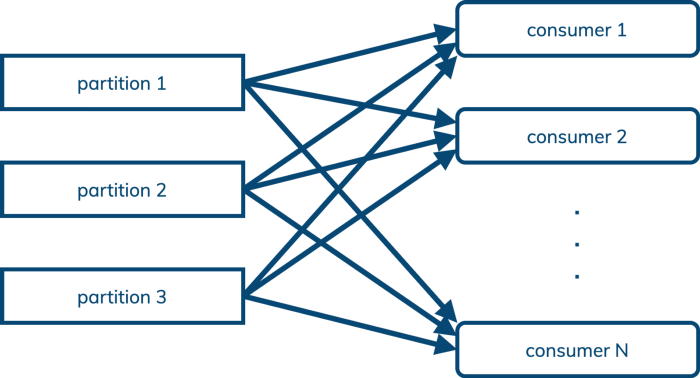

Messaging has been on DataStax's radar for several years. A significant motivator for this is the increasing popularity of microservices-based architectures. Briefly, microservices architectures use a message bus to decouple communication between services and to simplify replay, error handling, and load spikes.

With Apache Cassandra™ and DataStax Astra Cassandra-as-a-service, developers and architects have a database ecosystem that is:

1. Based on open source
2. Well-suited for hybrid- and multi-cloud deployments
3. Available in a cloud-native, consumption-priced service

There is no current messaging solution that satisfies these requirements, so we're building one. We started by evaluating the most popular option, Apache Kafka. We found that it came up short in four areas:

1. Geo-replication
2. Scaling
3. Multi-tenancy
4. Queuing

Apache Pulsar solves all of these problems to our satisfaction. Let's look at each of these in more detail.

Cassandra supports synchronous and asynchronous replication within or across data centers. Most often, Cassandra is configured for synchronous replication within a region, and asynchronous replication across regions. This enables [**Cassandra users like Netflix**](https://www.slideshare.net/VinayKumarChella/cassandra-serving-netflix-scale) to serve customers everywhere with local latency, to comply with data sovereignty regulations, and to survive infrastructure failures. (When AWS rebooted 218 Cassandra nodes to patch a security vulnerability, [**Netflix experienced zero downtime**](https://www.infoq.com/news/2014/10/netflix-cassandra/).)

Kafka is designed to run in a single region and does not support cross-datacenter replication. Clients outside the region where Kafka is deployed must simply tolerate the increased latency. There are several projects that attempt to add cross-datacenter replication to Kafka at the client level, but these are necessarily difficult to operate and prone to failure.

Like Cassandra, Pulsar builds geo-replication into the core server. Also like Cassandra, you can choose to deploy this in a synchronous or asynchronous configuration, and you can configure replication by topic. Producers can write to a shared topic from any region, and Pulsar takes care of ensuring those messages are visible to consumers everywhere.

Splunk wrote up a good overview of Pulsar geo-replication in two parts: [**one**](https://www.splunk.com/en_us/blog/it/geo-replication-in-apache-pulsar-part-1-concepts-and-features.html), [**two**](https://www.splunk.com/en_us/blog/devops/geo-replication-in-apache-pulsar-part-2-patterns-and-practices.html).

In Kafka, the unit of storage is a segment file, but the unit of replication is all the segment files in a partition. Each partition is owned by a single leader broker, which replicates to several followers. So when you need to add capacity to your Kafka cluster, some partitions have to be copied to the new node before it can participate in reducing the load on the existing nodes.

This means that *adding capacity to a Kafka cluster makes it slower before it makes it faster.* If your capacity planning is on point, then this is fine, but if business needs to change faster than you expected then it could be a serious problem.

Pulsar adds a layer of indirection. (Pulsar also splits apart compute and storage, which is managed by the broker and the bookie, respectively, but the important part here is how Pulsar, via Bookkeeper, increases the granularity of replication.) In Pulsar, partitions are split up into ledgers, but unlike Kafka segments, ledgers can be replicated independently of one another. Pulsar keeps a map of which ledgers belong to a partition in Zookeeper. So when we add a new storage node to the cluster, all we have to do is start a new ledger on that node. Existing data can stay where it is---no extra work needs to be done by the cluster.

See [**Jack Vanlightly's blog**](https://jack-vanlightly.com/blog/2018/10/2/understanding-how-apache-pulsar-works) for an in-depth explanation of Pulsar's architecture and storage model.

Multi-tenant infrastructure can be shared across multiple users and organizations while isolating them from each other. The activities of one tenant should not be able to affect the security or the SLAs of other tenants.

Fundamentally, multi-tenancy reduces costs in two ways. First, simply by sharing infrastructure that isn't maxed out by a single tenant --- the cost of that component can be amortized across all users. Second, by simplifying administration --- when there are dozens or hundreds or thousands of tenants, managing a single instance offers significant simplification. Even in a containerized world, "get me an account on this shared system" is much easier to fulfill than "stand me up a new instance of this service." And global problems may be obscured by being scattered across many instances.

Like geo-replication, multi-tenancy is hard to graft on to a system that wasn't designed for it. Kafka is a single-tenant design, but Pulsar builds multi-tenancy in at the core.

Pulsar enables us to manage multiple tenants across multiple regions from a single interface that includes authentication and authorization, isolation policy (Pulsar can optionally carve out hardware within the cluster that is dedicated to a single tenant), and storage quotas. CapitalOne wrote up a good overview of Pulsar multi-tenancy [**here**](https://medium.com/capital-one-tech/apache-pulsar-one-cluster-for-the-entire-enterprise-using-multi-tenancy-ac0bd925fbdf).

DataStax's Admin Console for Pulsar makes this even easier.

## Queuing (as well as streaming)

Kafka offers a classic pub/sub (publish/subscribe) messaging model --- publishers send messages to Kafka, which orders them by partition within a topic, and sends a copy to every subscriber (or "consumer").

Kafka records which messages a consumer has seen with an offset into the log. This means that messages cannot be acknowledged out-of-order, which in turn means that a subscription cannot be shared across multiple consumers. (Kafka enables mapping multiple partitions to a single consumer in its consumer group design, but not the other way around.)

This is fine for pub/sub use cases, sometimes called streaming. For streaming, it's important to consume messages in the same order in which they were published.

Pulsar supports the pub/sub model, but it also supports the queuing model, where processing order is not important and we just want to load balance messages in a topic across an arbitrary number of consumers:

This (and queuing-oriented features like "dead letter queue" and negative acknowledgment with redelivery) means that Pulsar can often replace AMQP and JMS use cases as well as Kafka-style pub/sub, offering a further opportunity for cost reduction to enterprises adopting Pulsar.

Pulsar's architecture gives it important advantages over Kafka in geo-replication, scaling, multi-tenancy, and queuing. DataStax joined the Pulsar community earlier this year when we [acquired Kesque](https://www.datastax.com/press-release/datastax-delivers-scale-out-enterprise-event-streaming-modern-data-apps) and open-sourced the management and monitoring tools built by the Kesque team in our [Luna Streaming](https://www.datastax.com/products/luna-streaming) distribution of Pulsar.

Want to learn more about what Pulsar can do for Cassandra, and what Cassandra can do for Pulsar? Check out:

* This blog post: [Data, Data Everywhere: Bringing Together the High Performance Stack for Distributed Data](https://www.datastax.com/blog/2021/01/data-data-everywhere-bringing-together-high-performance-stack-distributed-data)
* This webinar replay: [Apache Kafka or Apache Pulsar For Scale-out Event Streaming?](https://www.datastax.com/resources/webinar/how-apache-pulsar-can-help-you-build-c-applications-nam)
* This RedMonk video conversation with DataStax chief product officer Ed Anuff: [The Intersection of Application Development and Databases in 2021](https://redmonk.com/videos/intersection-of-app-dev-and-dbs-in-2021)

***Want to try out Apache Pulsar?*** *[Sign up now](https://dtsx.io/3Gz8Xt1) for* [*Astra Streaming*](https://www.datastax.com/products/astra-streaming)*, our fully managed Apache Pulsar service. We'll give you access to its full capabilities entirely free through beta. See for yourself how easy it is to build modern data applications and let us know what you'd like to see to make your experience even better.*
