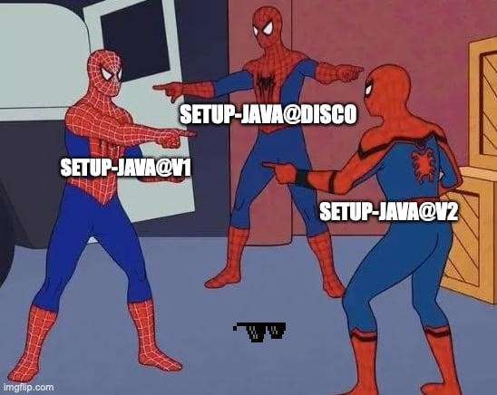
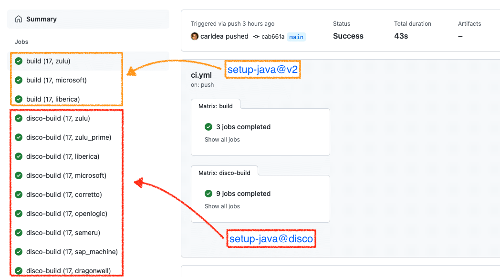

The Java GitHub Action that Rules them all - Disco API

When we ended Part 2 of this blog series Lights, Camera, Action: GitHub Actions with Java [Part 2](https://foojay.io/today/github-actions-with-java-part-2 "Part 2"), I talked about the near future of GitHub Actions. Well, today the future is now, so let's get into this!

Welcome back to the series of articles on GitHub Actions with Java Part 3. If you didn't catch Part 1 \& 2 head over here: [Part 1](https://foojay.io/today/github-actions-with-java-part-1 "Part 1") \& [Part 2](https://foojay.io/today/github-actions-with-java-part-2 "Part 2")

In this article we will talk about the new JDK distributions added to the default GitHub actions **setup-java@v2** and the **New** **setup-java@disco** GitHub Actions from our very own Foojay.io. This new Disco GitHub Action uses the flexible and powerful [Discovery API](https://github.com/foojayio/discoapi "Discovery API") created by Gerrit Grunwald ([@hansolo_](https://twitter.com/hansolo_ "@hansolo_")). As you will see later, the Discover API is able to download any JDK/JRE distribution available from any vendor.

For the impatient the example code (yml) for this article is on GitHub [ci.yml](https://github.com/carldea/HelloWorldGHActions/blob/main/.github/workflows/ci.yml#L27-L42 "ci.yml").

New to GitHub Actions `setup-java@v2` are additional Java build distributions from the vendors Microsoft and Liberica. To keep an eye on their progress you can see the link below:  
<https://github.com/actions/setup-java#supported-distributions>

As a devops person or owner of a repository on GitHub you'll need to create a GitHub Actions workflow file. To create an Actions workflow I already provide instructions in Part 2 where you are presented a template using the following code snippet:

```yaml
steps: 
  - uses: actions/checkout@v2 
  - name: Set up JDK ${{ matrix.java-version }} 
    uses: actions/setup-java@v2
```

Here you'll notice the actions/setup-java@v2 is the same uses value, but will now support 2 additional vendor build distributions microsoft and liberica.

## Specify a Supported JDK Distribution

To specify the build distribution you simply add it to the `distribution` attribute as shown below:

```yaml
with:
  java-version: ${{ matrix.java-version }} 
  distribution: 'liberica'
```

Of course you can create a matrix to specify all the available distributions like the example below:

```yaml
build:
  runs-on: ubuntu-latest
  strategy:
    matrix:
      java-version: [ 17 ]
      distribution: [ 'zulu', 'microsoft', 'liberica' ]
  steps:
    - uses: actions/checkout@v2
    - name: Set up JDK ${{ matrix.java-version }}
        uses: actions/setup-java@v2
        with:
          java-version: ${{ matrix.java-version }}
          distribution: ${{ matrix.distribution }}
          cache: maven
    - name: Build with Maven
      run: mvn -B package --file pom.xml
```

Above you'll notice the workflow will build and test the repo for JDK 17 on Linux with `zulu`, `microsoft`, and `liberica` distributions.

To see the example workflow head over to github here  
<https://github.com/carldea/HelloWorldGHActions/blob/main/.github/workflows/ci.yml#L10-L25>

**New** to GitHub Actions `foojayio/setup-java@v2` is the ability to specify **any** Java build distribution from any vendor such as the following:

* [Azul Zulu](https://www.azul.com/downloads/?package=jdk "Azul Zulu") \& [Zulu Prime](https://www.azul.com/products/prime/stream-download/ "Azul Zulu Prime Builds of OpenJDK") - 'zulu' , commericial offering 'zulu_prime'
* [Oracle](https://openjdk.java.net/ "Oracle") - 'oracle_open_jdk', commercial offering 'oracle'
* [Bellsoft](https://bell-sw.com "Bellsoft") - 'liberica'
* [Amazon](https://aws.amazon.com/corretto/ "Amazon") - 'corretto'
* [Red Hat](https://developers.redhat.com/products/openjdk/overview "Red Hat") - 'redhat'
* [OpenLogic](https://www.openlogic.com/openjdk-downloads "OpenLogic") - 'openlogic'
* [IBM](https://github.com/ibmruntimes/semeru17-binaries "IBM's Builds of OpenJDK") - 'semeru'
* [SAP Machine](https://www.sap.com/about/company.html "SAP") - 'sap_machine'
* [Alibaba](https://dragonwell-jdk.io "Alibaba") - 'dragonwell'

**Note:** Visit the links above for licenses and support offerings from the respective vendors.

To keep an eye on new build distributions added you can see the link below:  
<https://github.com/foojayio/discoapi>

As a devops person or owner of a repository on GitHub you'll need to create a GitHub Actions workflow file. To create an Actions workflow I already provide instructions in Part 2 where you are presented a template using the following code snippet. But the difference is you want to replace the `uses` attribute value with `foojayio/setup-java@disco`.

```yaml
steps:
  - uses: actions/checkout@v2
  - name: Set up JDK ${{ matrix.java-version }}
    uses: foojayio/setup-java@disco
```

## Specify any JDK Distribution

Now that this job uses the new `foojayio/setup-java@disco` you can now specify any JDK distribution as you wish! Let's look at ways we can specify distributions in yml.

Same as before you would specify the build `distribution` attribute with a particular distribution or the use of a matrix (array of items). What's nice about `setup-java@disco` is that if you remove the attribute `distribution` it will default to `zulu` builds of the OpenJDK.

Let's look at a build distribution that I chose as it relates to Azul Systems Inc., where we have two different build distributions of the OpenJDK. One is the plain community build and the other namely [Azul Zulu Prime Builds of the OpenJDK](https://www.azul.com/products/components/azul-zulu-prime-builds-of-openjdk/ "Azul Zulu Prime Builds of the OpenJDK") includes specialized high performance features.

```yaml
with: 
  java-version: ${{ matrix.java-version }} 
  distribution: 'zulu_prime'
```

Of course you can create a matrix to specify all the available distributions like the example below:

```yaml
disco-build:
  runs-on: ubuntu-latest
  strategy:
    matrix:
      java-version: [ 17 ]
      distribution: [ 'zulu', 'zulu_prime', 'liberica', 'microsoft', 'corretto', 'openlogic', 'semeru', 'sap_machine', 'dragonwell' ]
  steps:
    - uses: actions/checkout@v2
    - name: Set up JDK ${{ matrix.java-version }}
      uses: foojayio/setup-java@disco
      with:
        java-version: ${{ matrix.java-version }}
        distribution: ${{ matrix.distribution }}
        cache: maven
    - name: Build with Maven
      run: mvn -B package --file pom.xml
```

Above you'll notice the workflow will build and test the repo for JDK 17 on Linux with 'zulu', 'zulu_prime', 'liberica', 'microsoft', 'corretto', 'openlogic', 'semeru', 'sap_machine', and 'dragonwell' distributions.

To see the example workflow head over to github to:  
<https://github.com/carldea/HelloWorldGHActions/blob/main/.github/workflows/ci.yml#L27-L42>

When the GitHub action workflows are run successfully the summary should look like the following:  


GitHub Actions workflows run successfully

You got a chance to see the new distributions added to `actions/setup-java@v2` for you to choose from. Also, you were shown the **New** `foojayio/setup-java@disco` GitHub Actions that enables you to specify **ANY** build distribution! When using this action you can remove the `distribution` attribute it will default to using `zulu` as a distribution. And lastly you saw the GitHub Actions CI/CD job run successfully.

Well, there you have it, more choices and more possibilities when building your CI/CD pipelines.

As always comments and feedback are encouraged.
