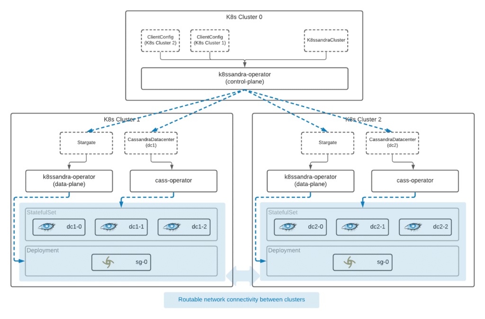
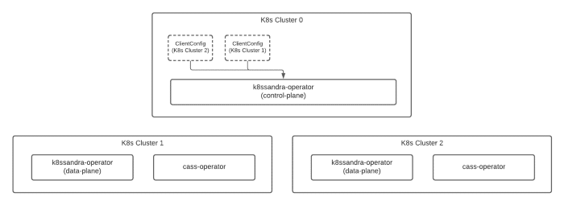
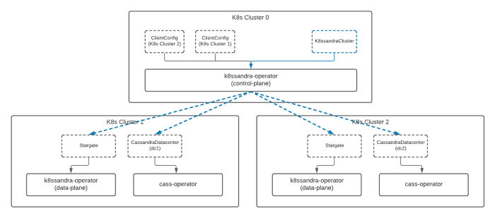
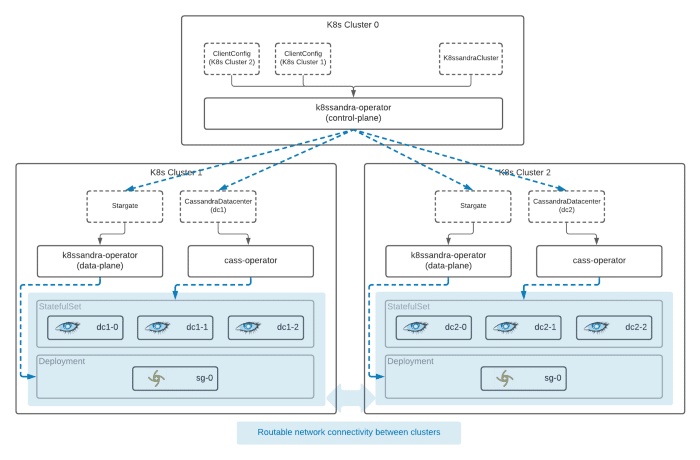

We built the new K8ssandra Operator to simplify deploying multiple Apache Cassandra data centers in different regions and across multiple Kubernetes (K8s) clusters. We're not at the finish line just yet, but we've hit the first major milestone. Now, it's easier than ever to run Apache Cassandra® across multiple K8s clusters in multiple regions with the K8ssandraCluster!

The K8ssandraCluster is a new custom resource for K8ssandra that covers all the bases necessary for installing a production-ready, multi-cluster K8ssandra deployment. Head over to the [DataStax Tech blog](https://medium.com/building-the-open-data-stack/deploying-to-multiple-kubernetes-clusters-with-the-k8ssandra-operator-f7562bee1841) to learn more about how to specify your remote clusters with the K8ssandraCluster, its deployment architecture, and what's coming next in our continued development of the K8ssandra operator.

Over the last few months, the [K8ssandra](https://k8ssandra.io/) team has been talking about [building a new operator for K8ssandra](https://k8ssandra.io/blog/articles/why_k8ssandra_operator_part_1/). The first release of that work has officially arrived! We're not at the finish line just yet, but we've hit the first major milestone: **making it easier than ever to run Apache Cassandra® across multiple Kubernetes (K8s) clusters in multiple regions.**{#8080}

One of the many reasons we chose to develop a new operator was to enable a simpler operational story when *running multiple Cassandra data centers across multiple Kubernetes clusters in different regions* . In a previous blog post, we discussed how to manually install a [multi-cluster Cassandra deployment with Google Kubernetes Engine](https://k8ssandra.io/blog/tutorials/multi-cluster-cassandra-deployment-with-google-kubernetes-engine/). With this alpha release, we're taking a leap towards simplifying that process.{#d044}

Let's take a look at what that means and how this new operator helps enable multi-cluster deployments.{#fb7a}

Meet the [K8ssandra Operator](https://github.com/k8ssandra/k8ssandra-operator). In this initial release, we're introducing a new custom resource: the *K8ssandraCluster*. This new resource will encompass all of the aspects necessary to install a production-ready, multi-cluster K8ssandra deployment.{#1089}

Figure 1 below shows what a configuration might look like. This example would create a cluster with two data centers deployed across two different Kubernetes clusters.{#130b}

```
apiVersion: k8ssandra.io/v1alpha1
kind: K8ssandraCluster
metadata:
  name: demo
spec:
  cassandra:
    cluster: demo
    serverVersion: "3.11.11"
    storageConfig:
      cassandraDataVolumeClaimSpec:
        storageClassName: standard
        accessModes:
          - ReadWriteOnce
        resources:
          requests:
            storage: 5Gi
    config:
      jvmOptions:
        heapSize: 512M    
    datacenters:
      - metadata:
          name: dc1
        size: 3
        stargate:
          size: 1
          heapSize: 256M
      - metadata:
          name: dc2
        k8sContext: k8ssandra-east
        size: 3
        stargate:
          size: 1
          heapSize: 256M
```

Figure 1: Creating a cluster with two data centers deployed across two different Kubernetes clusters.

In this example, you can see that the Cassandra configuration is exposed very similarly to how it was previously within K8ssandra, allowing you to specify data centers, racks, and easy access to the selected version --- to name a few. This should feel very familiar for good reason. Under the hood, the K8ssandra Operator still leverages and delegates control to [Cass Operator](https://github.com/k8ssandra/cass-operator).{#fd18}

So, what's different? How does this add anything to the current K8ssandra experience?{#1ccd}

One key element of this new configuration is the *k8sContext*, which is the connection between the CassandraDatacenter and the Kubernetes cluster that is to be its home. With this small yet powerful setting, you can simply define a remote Kubernetes cluster that a particular data center should be deployed to.{#a92f}

You know you can tell the K8ssandraCluster what remote cluster to install a data center within --- but how? The association of a remote cluster is made possible through the addition of another new custom resource: the *ClientConfig*.{#0e10}

A ClientConfig is essentially the definition of a remote cluster a `kubeconfig` that the K8ssandra Operator can use to remotely access it. Deploying a data center onto the local Kubernetes cluster, where the "control plane" operator is deployed, doesn't require any additional settings.{#13b2}

Next, we'll take a look at the overall architecture of a K8ssandra Operator deployed system. This will show you how the K8ssandra Operator works within each cluster, and also help you understand the difference between a "control plane" and "data plane" deployment.{#3bd8}

What happens when you deploy a K8ssandraCluster?{#e10f}

Before deploying a K8ssandraCluster, there are a few other requirements, including the installation of the necessary operators as well as establishing network connectivity between the clusters. It's important to note that there must be routable network connectivity among the pods in each cluster. The good news is that the virtual networking configurations available within cloud services, such as Google Kubernetes Engine, make this easy to do.{#0de0}

There are a few different ways to accomplish the prerequisite steps, using either [Helm](https://helm.sh/) or [Kustomize](https://kustomize.io/). You can learn more about the installation process with this [step-by-step guide on GitHub](https://github.com/k8ssandra/k8ssandra-operator/blob/main/docs/install/README.md).{#610c}

Figure 2 below gives you a quick glimpse at a simple deployment, before the installation of the K8ssandraCluster:{#75cb}
 Figure 2: Diagram of a simple deployment before installing k88ssandraCluster.

Here we have:{#5f47}

* Deployed across three distinct Kubernetes clusters.
* Declared that "K8s Cluster 0" is our control plane.
* Declared that "K8s Cluster 1" and "K8s Cluster 2" are data plane clusters.
* Provided access from K8s Cluster 0 to K8s Cluster 1 and K8s Cluster 2 by providing a ClientConfig for each remote data plane cluster.

While any k8ssandra-operator is capable of operating in the control plane or data plane mode, the control plane is the one responsible for distributing resources to remote clusters. So, the K8ssandraCluster resource should be deployed to the control plane cluster.{#ba19}

When a K8ssandraCluster resource is installed to the control plane cluster, other resources will be distributed to the remote clusters for local reconciliation within those clusters.{#83db}
 Figure 3: Diagram illustrating the distribution of resources between clusters.

The control plane has now distributed new resources to each of the other clusters. From here, the operators installed in each remote cluster will begin to deploy the necessary services within that cluster.{#66b4}

Eventually, a coordinated deployment will take shape that will look like the following:{#8c11}
 Figure 4: Diagram showing the coordinated deployment of Kubernetes clusters.

Once resources have been distributed by the control plane to each data plane cluster, the local operator services within each cluster will manage the deployment of the data services.{#d964}

The control plane has also taken care of the configuration necessary within the remote clusters to connect each of the distributed data centers, forming a highly available (HA) multi-datacenter cluster.{#d7a6}

In addition to coordinating the distribution of resources to remote clusters and configuration, the control plane is also responsible for the collection and rollup of status across the complete cluster. This is another benefit of the K8ssandra Operator that wasn't possible before in K8ssandra.{#e66b}

What we've described in this post noticeably doesn't include some of the critical components that K8ssandra 1.x provides, notably backup/restore via Medusa and entropy repair via Reaper. Not to worry, those elements haven't been taken away. They're still a critical part of the overall production landscape for Cassandra and will continue to be components of K8ssandra.{#a85f}

In this alpha release of the K8ssandra Operator, we focused on the core database functionality, providing control and delegation for Cassandra itself and [Stargate](https://stargate.io/). Our initial focus was on establishing multi-cluster functionality. With that basic goal achieved, next, we'll start migrating the functionality provided in the Medusa and Reaper Operator components into new controllers within the K8ssandra Operator. For insight into some of the design choices we're making, check out this blog post on how [we pushed Helm to the limit, then built a Kubernetes operator](https://thenewstack.io/we-pushed-helm-to-the-limit-then-built-a-kubernetes-operator/).{#44c3}

To learn even more about the K8ssandra Operator, give it a spin, and get involved with the K8ssandra community, check out the [K8ssandra Operator repo on GitHub](https://github.com/k8ssandra/k8ssandra-operator).{#75ec}

*Follow* [*DataStax on Medium*](https://datastax.medium.com/)*for exclusive posts and the latest announcements about Cassandra, Kubernetes, streaming, and much more.*{#625e}

1. [k8ssandra-operator: The Kubernetes operator for K8ssandra](https://github.com/k8ssandra/k8ssandra-operator)
2. [K8ssandra --- Apache Cassandra® on Kubernetes](https://k8ssandra.io/)
3. [cass-operator: The DataStax Kubernetes Operator for Apache Cassandra](https://github.com/k8ssandra/cass-operator)
4. [Why we decided to build a K8ssandra operator](https://k8ssandra.io/blog/articles/why_k8ssandra_operator_part_1/)
5. [Deploy a multi-datacenter Cassandra cluster in Kubernetes](https://k8ssandra.io/blog/tutorials/multi-cluster-cassandra-deployment-with-google-kubernetes-engine/)
