*This post introduces developers to* [*DataStax Astra Streaming*](https://astra.dev/3SZLxE1)*with a step-by-step tutorial that illustrates how it can be used to easily build scalable, streaming applications.*{#39ae}

[Astra Streaming](https://astra.dev/3SZLxE1) enables developers to build streaming applications on top of an elastically scalable, multi-cloud messaging and event streaming platform powered by [Apache Pulsar](https://pulsar.apache.org/). [DataStax Astra Streaming](https://astra.dev/3SZLxE1) is currently in beta, and we'll be releasing a full demo soon. In the meantime, this article will walk you through a short demo that will provide a great starting point for familiarizing yourself with this powerful new streaming service.{#a6cf}

Here's what you will learn:{#27be}

1. How to create an Astra Streaming tenant, complete with namespaces, topics, and sinks.
2. How to produce messages for a topic that make use of serialized Java [POJOs](https://en.wikipedia.org/wiki/Plain_old_Java_object).
3. How to store topic messages in a [DataStax Astra](https://astra.dev/3SZLxE1) database.

To illustrate, we'll use [Astra Streaming](https://astra.dev/3SZLxE1) to replicate the streaming object tracking information normally provided by the Federal Aviation Authority (FAA) to each airport. This stream reports the location of every piece of equipment at the airport (planes, fuel trucks, aircraft tow tractors, baggage carts, etc).{#a2c7}

## Let's start building!

With [Astra Streaming](https://astra.dev/3SZLxE1), not only can you feed information into the streaming "pipe", but you can also store those events into an [Astra](https://astra.dev/3SZLxE1) database for later analysis. This allows us to view our object tracking information in two ways:{#f46d}

1. Where is everything located right now?
2. Where has a specific object been located historically? This is useful for tracking the paths of the object over time.

To build our streaming pipeline for tracking objects in real-time and historically, we'll need to build the following:{#1581}

* An [Astra Streaming](https://astra.dev/3SZLxE1) tenant with a single topic `object_location`
* A Java producer that will publish events to the `object_location` topic.
* An [Astra](https://astra.dev/3SZLxE1) database with two tables that get data from the `object_location` topic.

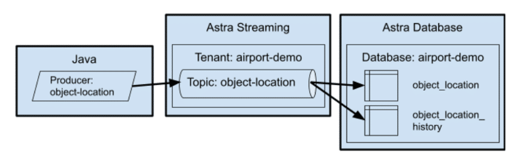 Figure 1: All the moving parts we'll need to build for this demo.

In our object tracking example, a single topic will feed data into two different tables. The `object_location` table records only the most recent known location for an object while the `object_location_history` records all locations that an object has been located at any given time. The location history data is useful for different types of analyses, such as analyzing the flow of different objects through the airport terminal.{#7aad}

This approach is not only applicable to object tracking, it can be used for any use case that requires the ability to see both real-time streaming data and historical data, for example, tracking stock prices where one table holds the current stock price while another table holds the historical stock prices.{#924b}

## Create the database

Now back to our object tracking example. Our first step will be to create the database. This is a very simple database with only two tables, which we'll create in a keyspace called `airport` to keep things simple. The tables in the `airport` keyspace is `object_location` which tracks where every object is at the moment (well, really, the last known location), and `object_location_history` which tracks the location of the object over time with the most recent update listed first.{#2932}

If you are following along with your own [Astra](https://astra.dev/3SZLxE1) instance, simply create a database with the keyspace `airport` and then run the `database/create.cql `file to create your tables.{#9fe4}

You can create your [Astra Streaming](https://astra.dev/3SZLxE1) on one cloud provider even if your [Astra](https://astra.dev/3SZLxE1) database is hosted by another. However, you'll get better performance if they are both hosted by the same cloud provider and in the same region.{#4cdc}

## Create a custom role

While it is possible to create an access token that grants you access to all of your databases, I highly recommend creating database-specific tokens based on custom roles. On more than one occasion, I've accidentally leaked security tokens into GitHub (errors that I corrected within minutes). The only thing that's saved my bacon is the fact that the token was restricted to a single database. If you're not familiar with the process for creating a token, I'll show you how to do that in this section.{#ae33}

After you have created the database, click on the "down arrow" next to your organization name, as shown in the red square in the following image.{#f493}
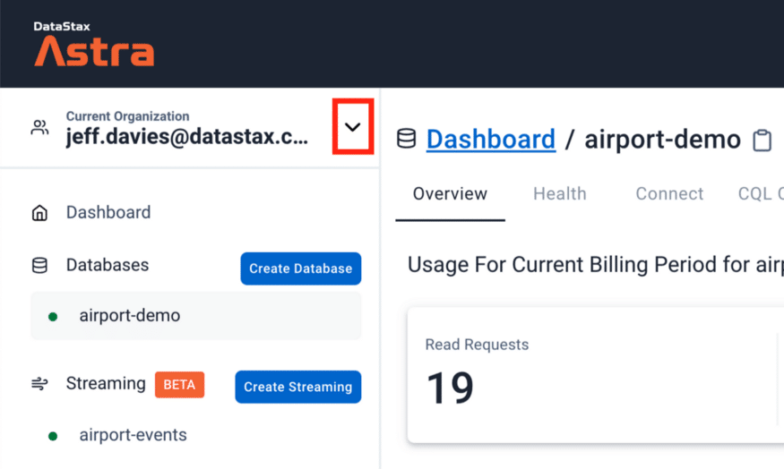 Figure 2: Accessing your organization settings.

This will bring up a menu. Click on the `Organization Settings` menu item. Once the page loads, click on the `Role Management` menu item on the left side of the page and press the `Add Custom Role` button. Give your role a meaningful name. As you can see in the following image, I named my custom role `airport-demo`. Then you can start selecting the permissions for your role. Since this role will be specific to a database built for demo purposes, I tend to be pretty liberal with my permissions. Set your permissions to suit your needs and scroll down to access the rest of the page.{#8d99}
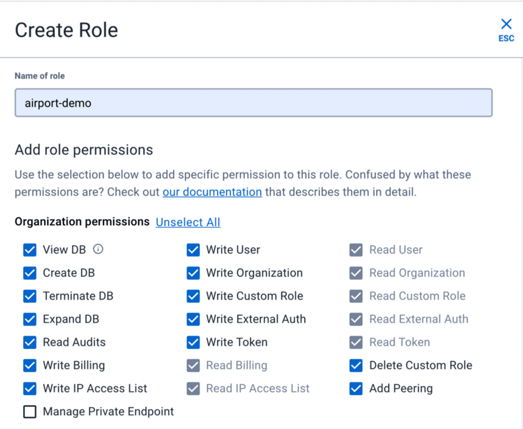 Figure 3: Define the permissions for your custom role.

Select the keyspace permission and table permissions as appropriate. I like to enable all of the APIs for my databases, so I usually select them all. The most important step occurs at the very bottom where you select the single database for which this role applies.{#1bf7}
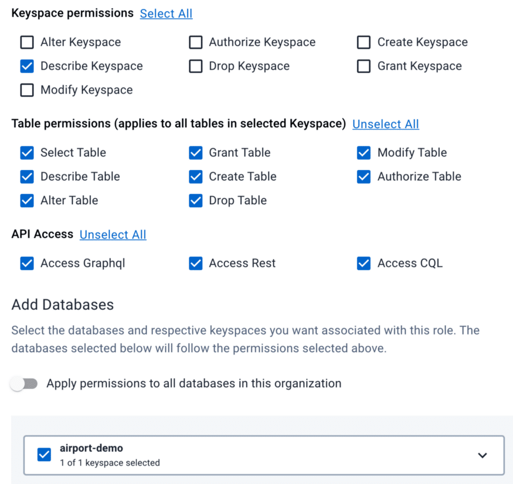 Figure 4: Finishing the custom role definition.

When you are satisfied with your role configuration press the `Create Role` button.{#66d6}

Now you can create a security token that is specific to your customer role and database. Select the `Token Management` menu item. Then select the custom role you created earlier and press the `Generate Token` button.{#9284}
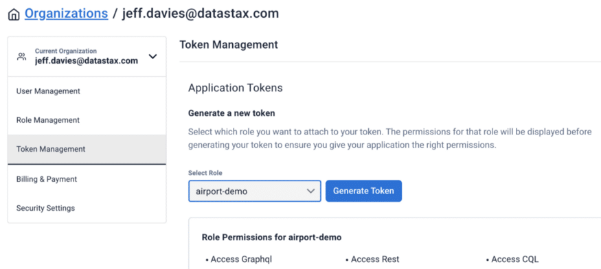 Figure 5: Generating a token.

You'll need to exercise some caution here because the dialog box that pops up will never be displayed again. You'll need this token information in your source code to connect to the database from Astra Streaming. So, you might want to press the ***Download Token Details*** button to download a CSV file with your token.{#be2d}
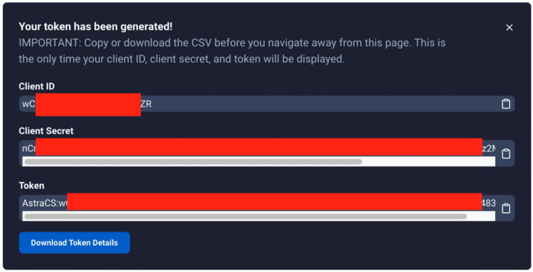 Figure 6: This information will never be shown to you again! Take this opportunity to download it.

## Create the Astra Streaming components

Now we're going to shift gears and create the [Astra Streaming](https://astra.dev/3SZLxE1) components. Here we will create a tenant, namespace, and a topic.{#718f}

## Create the Astra Streaming tenant

An Astra tenant is the top-level object for streaming. You can think of a tenant as akin to an application or a database. Create a new streaming tenant in the [Astra DB](https://astra.dev/3SZLxE1) web console and name it `airport-events`. When the tenant is fully created and running you will see a small green dot to the left of its name and the dashboard for the tenant will show up in your browser, as shown in the following image.{#5559}
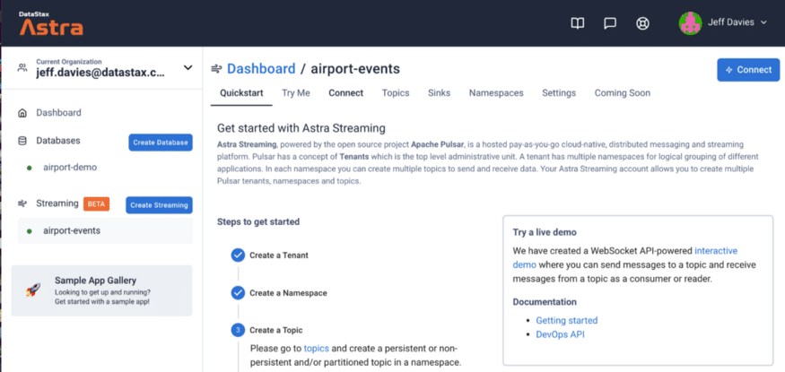 Figure 7: The airport-events tenant dashboard.

## Create the Astra Streaming namespace

This step is optional because there is a default namespace created for you when you create a tenant. However, I like to keep things organized and isolated so I strongly recommend that you create a namespace for the airport-demo. Click on the `Namespaces` tab.{#ed46}
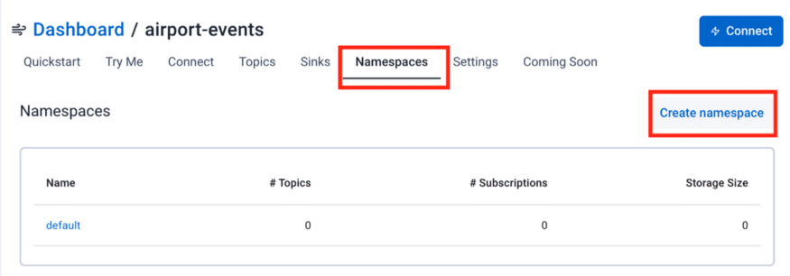 Figure 8: Creating a namespace in Astra Streaming.

Set the namespace to `airport` and press the `create` button. It's just that easy!{#2dfd}

## Create the Astra Streaming Topic

Our next step is to create the topic for our object location events. Click on the `Topics` tab in the dashboard. By default, you will see both the new `airport` namespace and the default namespace listed in the dashboard. Click the `Add Topic` button in the `airport` namespace to create the new topic.{#d760}
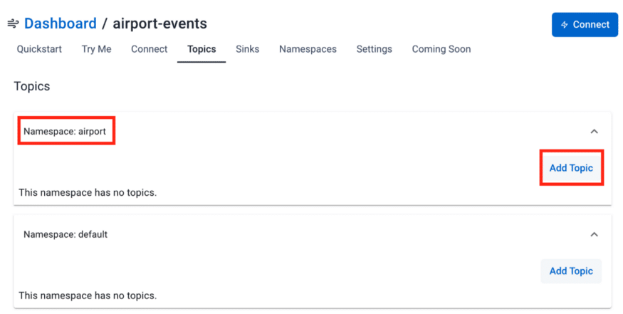 Figure 9: Creating a topic in the airport namespace.

You only need to specify the name of the topic, `object-location` as shown in the next image.{#59cc}
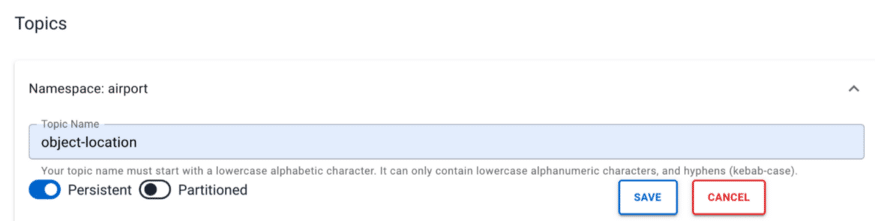 Figure 10: Creating the object-location topic in the airport namespace.

Press the `Save` button. At this point, we have a topic on which we can publish events. However, those events don't go anywhere just yet. Next, we will create two "sinks'' that will consume the events and store them in a database. A "sink" in streaming terms is either an [Astra DB](https://astra.dev/3SZLxE1) or an [ElasticSearch](https://www.elastic.co/elasticsearch/) instance. For this article, we will use the [Astra DB](https://astra.dev/3SZLxE1) to store our events.{#9111}

## Create the Astra DB sinks

The mechanism that [Astra Streaming](https://astra.dev/3SZLxE1) uses to store events to a database is a "sink". We will need to create two sinks, one for each of our tables.{#1a21}

## Create the object-location sink

Our first sink will store the event on the `object_location` table. This table is different from the `object_location_history` table in that it does **not** have the `ts` (timestamp) field. Click on the `Sinks` tab and then press the `Create Sink` button.{#64eb}
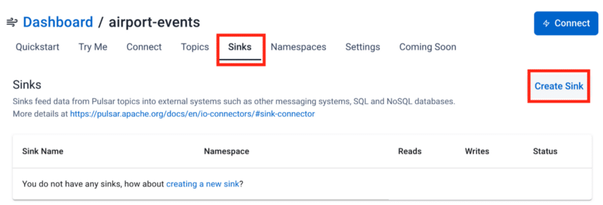 Figure 11: Creating the sink for the object_location table in our Astra DB.

In Step 1 of the wizard, select the fields as shown in the following image.{#7c92}
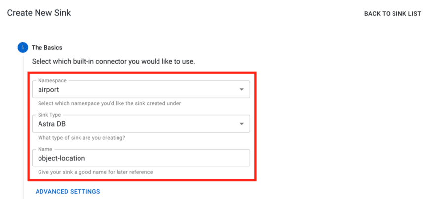 Figure 12: Step 1-Create the object-location sink.

Be sure to select the `object-location` topic in Step 1 of the wizard.{#9549}
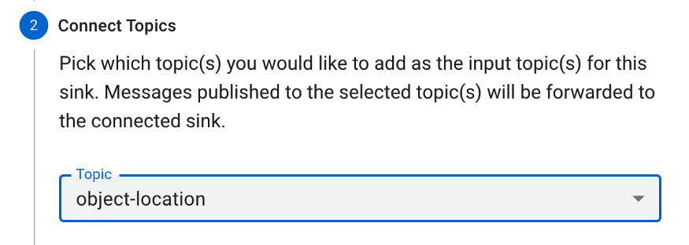 Figure 13: Step 2-Select the topic.

Next, you need to provide the connectivity information for your database. All of the information is important, but the database token is probably the most critical piece here. After you have pasted your token in, press the TAB button to exit the token field. This will prompt the [Astra](https://astra.dev/3SZLxE1) website to inspect your database and table and generate the field mappings, as you will see next.{#a632}
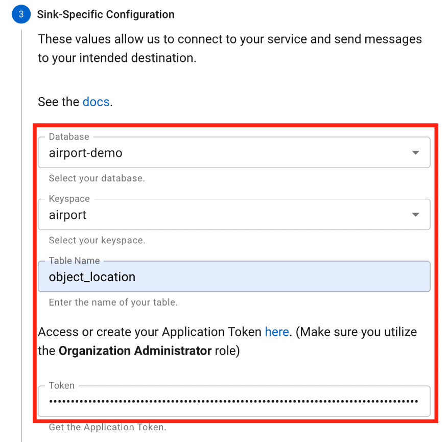 Figure 14: Step 3-Specify the database you want to use.

The field mapping is done automatically for you. Notice that the automatic mapping only concerns itself with the fields in the table you have specified. There is no schema for the overall topic yet because we haven't sent any messages over the topic (we will get to that in a little bit). I have yet to find a condition where the automatic mapping is incorrect, but it never hurts to check twice! Also, you can now expand the area for the `object_location` schema and view the details there as shown in the following image.{#beb0}
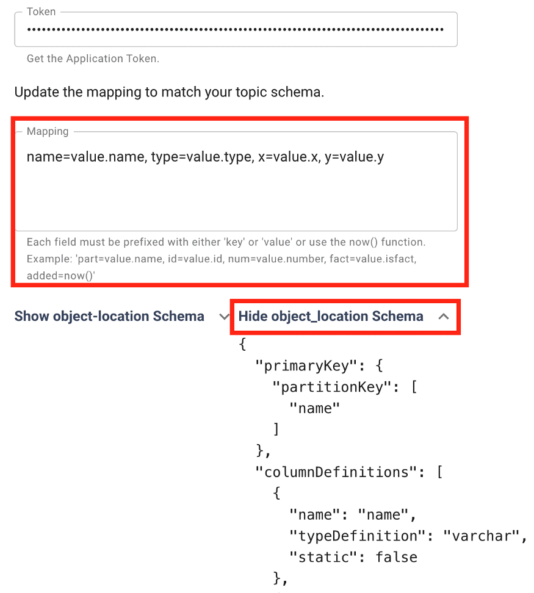 Figure 15: Notice the field mapping is automatically generated for you.

Press the `Create` button to create the sink.{#4659}

## Create the objloc-history sink

Now to create our second sink, the one that will capture information into the `object_location_history` table. You will perform essentially the same steps that you did for the first sink, with some key differences:{#d977}

* **Sink Name** : `objloc-history` (names are limited to 18 characters)
* **Topic** : Pick the `object-location` topic again. It will feed both of our tables!
* **Table Name** : `object_location_history`

This time when you enter the database token and TAB out of the field, the mapping will appear a little differently as shown below.{#4320}
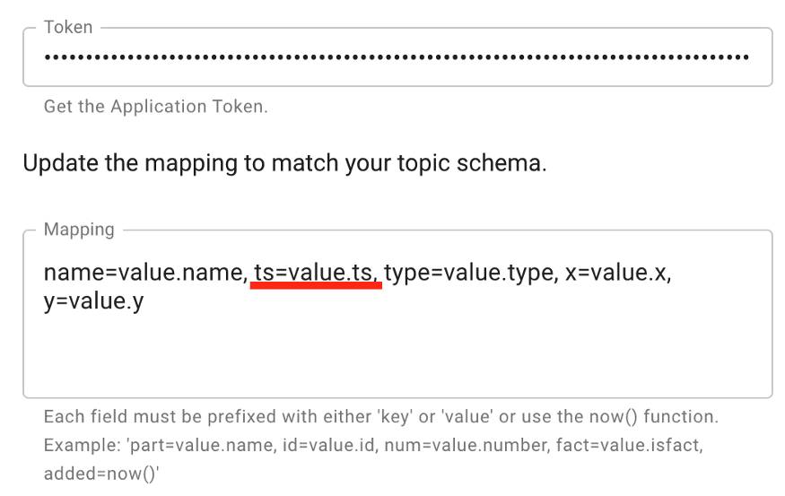 Figure 16: Notice the field mapping is slightly different for this sink.

You see here the `ts` or `timestamp` field (a Java long data type) is included in the mapping. Press the `Create` button to create this sink.{#c653}

## Create a Java producer

Things that generate messages on a topic are called "[producers](https://pulsar.apache.org/docs/en/security-encryption/#producer)" in [Apache Pulsar](https://pulsar.apache.org/) (and by extension in [Astra Streaming](https://astra.dev/3SZLxE1)). We need to create a producer that will send messages to the `object-location` topic. In fact, we don't want to send simple string messages like many of the Pulsar, "Hello World" level examples do. We want to send an object that can be stored in database tables.{#62be}

If you take a look at the Java code in the folder for this demo in [GitHub](https://github.com/jdavies/airport-demo/tree/main/pulsar/skyview/src/main/java/com/datastax/pulsar), you will see several files. The main entry point is the [App.java](https://github.com/jdavies/airport-demo/blob/main/pulsar/skyview/src/main/java/com/datastax/pulsar/App.java) file. It's a pretty simple file that just instantiates a Flight object and causes the Flights run() method to be invoked every second. The interesting work is in the Flight class.{#40b0}

The Flight class is designed to be a producer. It produces messages on the object-location topic each time the run() method is invoked. The constructor of the Flight class takes care of creating the PulsarClient connection and then the Pulsar topic producer. The most important thing to note here is the use of a `JSONSchema` based on the `ObjectLocation `class. This tells Pulsar the exact schema of the object that is being sent. Pulsar will expect the message to match the specified JSON Schema. If the message does not match the schema exactly, you will receive an error message.{#0916}

```
public Flight(String flightID, String aircraftType) {
     try {
          // Initialize our location
          Date now = new Date();
          objLoc = new ObjectLocation(flightID, aircraftType, 0.0, 0.0, 
now.getTime());
          // Create client object
          client = PulsarClient.builder()
          .serviceUrl(BROKER_SERVICE_URL)
          .authentication(
               AuthenticationFactory.token(Credentials.token)
          )
          .build();

          // Create producer on a topic
          producer = client.newProducer(JSONSchema.of(ObjectLocation.class))
          .topic("persistent://" + STREAM_NAME + "/" + NAMESPACE + "/" + TOPIC)
          .create();
     } catch(Exception ex) {
          System.out.println(ex.getMessage());
     }
   }
```

No messages are sent to the topic until the run() method is invoked. Here is the run() method implementation:{#2f7b}

```
public void run() {
     // Send a message to the topic
     try {
          producer.send(objLoc);
          System.out.println(objLoc.toString());
          Date now = new Date();
          updatePosition(objLoc);
          objLoc.setTs(now.getTime());
     } catch(PulsarClientException pcex) {
          pcex.printStackTrace();
     }
}
```

The `producer.send(objLoc)` takes a native Java POJO that watches the schema expected and sends it over the topic. Note that you don't have to serialize your object. The Pulsar libraries are smart enough to take care of that for you! Also, the very first time you run this code (which we will do next), [Astra Streaming](https://astra.dev/3SZLxE1) will record the schema for the message type. You can view that schema by navigating to your topic and clicking on the ***Schema*** tab, as shown next.{#2cbe}
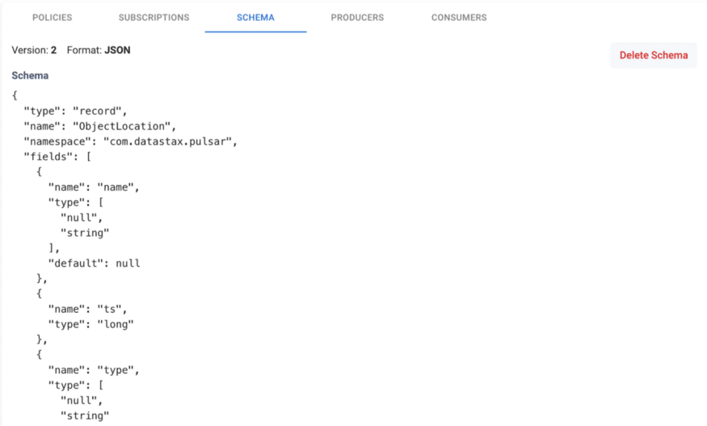 Figure 17: Viewing a topic schema.

If you load the project up in an editor like [VS Code](https://code.visualstudio.com/) you can run the App class to see the application in action. When you do, you will see output like the following:{#5a36}
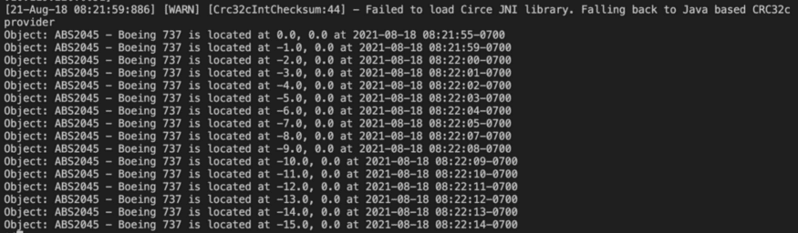 Figure 18: Events generated by the producer.

From the output above, we can see that the producer is generating events/messages on our topic. Now let's check our database tables to see the data that was recorded. I'm going to use the CQLShell window on the [Astra](https://astra.dev/3SZLxE1) website to keep things simple. Let's start by looking at the `object_location` table.{#eb46}
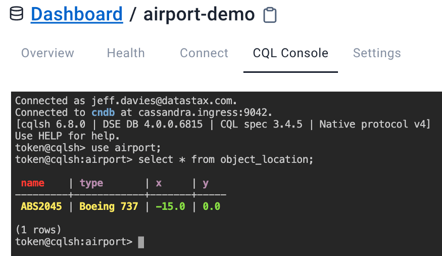 Figure 19: There should be a single record in your object_location table.

Remember, the purpose of this table is to record the last known location of an object, a Boeing 737 in this case. Your X and Y coordinates will vary depending on when you stopped the application from creating messages.{#2f07}

Now let's take a look at our `object_location_history` table:{#4e09}
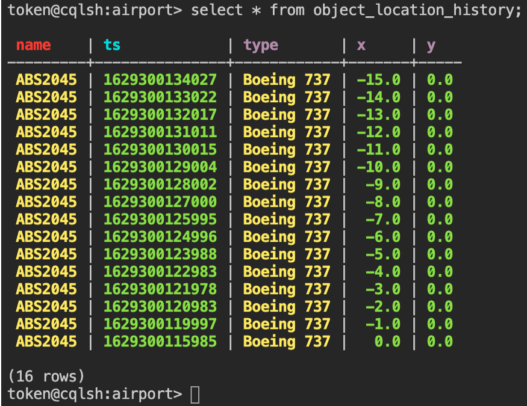 Figure 20: Our object_location_history table's data.

## Try it yourself!

As you can see, making real use of [Astra Streaming](https://astra.dev/3SZLxE1) is easy to do. Despite the many screenshots and the level of detail provided here, building this application requires just a few simple steps:{#bb7c}

1. **Create a Database**

* Create the `object_location` table
* Create the `object_loction_history` table.
* Create the custom role (optional)
* Generate a token for the database

2.**Create a Streaming Tenant**{#6ae6}

* Create the `airport` namespace
* Create the `object-location` topic
* Create the `object-location` sink
* Create the `objLoc-history` sink

**3. Create a Java Topic Producer**{#d898}

That's all there is to it. Now you have a recipe for sending and receiving event objects via [Astra Streaming](https://astra.dev/3SZLxE1) and storing them in an [Astra DB](https://astra.dev/3SZLxE1). Try this code yourself by creating your free Astra account at [https://astra.datastax.com](https://auth.cloud.datastax.com/auth/realms/CloudUsers/protocol/openid-connect/auth?client_id=auth-proxy&redirect_uri=https%3A%2F%2Fgatekeeper.auth.cloud.datastax.com%2Fcallback&response_type=code&scope=openid+profile+email&state=adiabyxa4aa6drngHZ0XW2rFfuU%3D) (no credit card required). Your Astra account will work for both [Astra DB](https://astra.dev/3SZLxE1) and [Astra Streaming](https://astra.dev/3SZLxE1). When you sign up, you'll get $25.00 worth of free credits each month in ***perpetuity***! That's enough to cover 80GB storage and 20M read/write ops. There's never been a better time to start building streaming applications, and now with Astra Streaming, it's never been easier.{#dc48}

*Follow the DataStax Tech Blog for more developer stories. Check out our YouTube channel for tutorials and here for DataStax Developers on Twitter for the latest news about our developer community.*{#b25e}

*Follow the* [*DataStax Tech Blog*](https://datastax.medium.com/)*for more developer stories. Check out our* [*YouTube*](https://www.youtube.com/channel/UCqA6zOSMpQ55vvguq4Y0jAg)*channel for tutorials and here for DataStax Developers on* [*Twitter*](https://twitter.com/DataStaxDevs)*for the latest news about our developer community.*{#b4e9}

1. [DataStax Astra DB](https://astra.dev/3SZLxE1)
2. [DataStax Astra Streaming](https://astra.dev/3SZLxE1)
3. [Apache Pulsar](https://pulsar.apache.org/)
4. [GitHub repo for this project](https://github.com/jdavies/airport-demo/tree/main/pulsar/skyview/src/main/java/com/datastax/pulsar)
