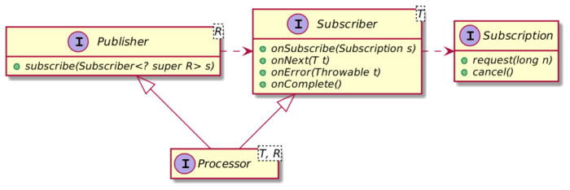
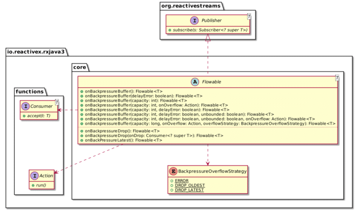
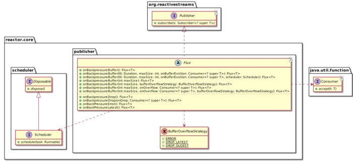
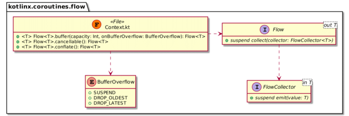

Mid-January, I held [a talk at Kotlin.amsterdam](https://www.youtube.com/watch?v=w0b4OQQmhBI) based on my post [Migrating from Imperative to Reactive](https://hazelcast.org/blog/migrating-from-imperative-to-reactive/) (a Spring Boot application).

Because it was a Kotlin meetup, I demoed Kotlin code, and I added a step by migrating the codebase to coroutines.

During Q\&A, somebody asked whether coroutines implemented backpressure. I admit I was not sure of the answer, so I did a bit of research.

This post provides information on backpressure in general and how [RxJava](https://github.com/ReactiveX/RxJava) (v3), [Project Reactor](https://projectreactor.io/) and Kotlin's [Coroutines](https://kotlinlang.org/docs/reference/coroutines-overview.html) handle it.

What is backpressure? {#h2-0-what-is-backpressure}
--------------------------------------------------

> Back pressure (or backpressure) is a resistance or force opposing the desired flow of fluid through pipes, leading to friction loss and pressure drop. The term back pressure is a misnomer, as pressure is a scalar quantity, so it has a magnitude but no direction. -- [Wikipedia](https://en.wikipedia.org/wiki/Back_pressure)

In software, backpressure has a slightly related but still different meaning: considering a fast data producer and a slow data consumer, backpressure is the mechanism that "pushes back" on the producer not to be overwhelmed by data.

Whether based on [reactivestreams.org](https://www.reactive-streams.org/) or Java's `java.util.concurrent.Flow`, Reactive Streams provides four building blocks

1. A `Publisher` that emits elements
2. A `Subscriber` that reacts when elements are received
3. a `Subscription` that binds a `Publisher` and a `Subscriber`
4. And a `Processor`

Here's the class diagram:



The `Subscription` is at the root of backpressure via its `request()` method.

The specifications are pretty straightforward:
> A `Subscriber` MUST signal demand via `Subscription.request(long n)` to receive `onNext` signals. *The intent of this rule is to establish that it is the responsibility of the Subscriber to decide when and how many elements it is able and willing to receive. To avoid signal reordering caused by reentrant Subscription methods, it is strongly RECOMMENDED for synchronous Subscriber implementations to invoke Subscription methods at the very end of any signal processing. It is RECOMMENDED that Subscribers request the upper limit of what they are able to process, as requesting only one element at a time results in an inherently inefficient "stop-and-wait" protocol.* -- [Reactive Streams specifications for the JVM](https://github.com/reactive-streams/reactive-streams-jvm)

Reactive Streams' specifications are pretty solid. They also come with a Java-based .

But it falls outside the specifications' scope to define how to manage items emitted by the producer that cannot be handled downstream. While the problem is pretty simple, different solutions are possible. Each Reactive framework provides some options, so let's see them in turn.

Backpressure in RxJava 3 {#h2-1-backpressure-in-rxjava-3}
---------------------------------------------------------

RxJava v3 provides several base classes:

|     Class     |                             Description                              |
|---------------|----------------------------------------------------------------------|
| `Flowable`    | A flow of 0..N items. It supports Reactive-Streams and backpressure. |
| `Observable`  | A flow of 0..N items. It doesn't support backpressure.               |
| `Single`      | A flow of exactly: * 1 item * or an error                            |
| `Maybe`       | A flow with either: * no items * exactly one item * or an error      |
| `Completable` | A flow with no item but: * either a completion * or an error signal  |

Among these classes, `Flowable` is the only class that implements Reactive Streams - and backpressure. Yet, providing backpressure is not the only issue. As RxJava's wiki states:
> Backpressure doesn't make the problem of an overproducing Observable or an underconsuming Subscriber go away. It just moves the problem up the chain of operators to a point where it can be handled better. -- [Reactive pull backpressure isn't magic](https://github.com/ReactiveX/RxJava/blob/3.x/docs/Backpressure.md#reactive-pull-backpressure-isnt-magic)

To cope with that, RxJava offers two main strategies to handle "overproduced" items:

1. Store items in a bufferNote that if you set no upper bound to the buffer, it might cause `OutOfMemoryError`.
2. Drop items

The following diagram summarizes the different methods that implement those strategies:



Note that `onBackPressureLatest` operator is similar to using `onBackpressureBuffer(1)`:


Note that I took the above Marble diagrams from RxJava's wiki.

Compared to other frameworks, RxJava offers methods to send an overflow exception signal after sending all items. These allow the consumer to receive items *and* still be notified that the producer has dropped items.

Backpressure in Project Reactor {#h2-2-backpressure-in-project-reactor}
-----------------------------------------------------------------------

Strategies offered by Project Reactor are similar to those of RxJava's.

The APIs have some slight differences, though. For example, Project Reactor offers a convenient method to throw an exception if the producer overflows:

```java
var stream = Stream.generate(Math::random);

// RxJava
Flowable.fromStream(stream)          // 1
        .onBackpressureBuffer(0);    // 2

// Project Reactor
Flux.fromStream(stream)              // 1
    .onBackpressureError();          // 2
```


1. Create the Reactive Stream
2. Throw if the producer overflows

Here's the `Flux` class diagram that highlights backpressure capabilities:



Compared to other frameworks, Project Reactor offers methods to set a for buffered items to prevent overflowing it.

Backpressure in coroutines {#h2-3-backpressure-in-coroutines}
-------------------------------------------------------------

Coroutines do offer the same buffering and dropping capabilities. The base class in coroutines is `Flow`.



You can use the classes like this:

```java
flow {                              // 1
  while (true) emit(Math.random())  // 2
}.buffer(10)                        // 3
```


1. Create a `Flow` which content is defined by the next block
2. Define the `Flow` content
3. Set the buffer's capacity to 10

Conclusion {#h2-4-conclusion}
-----------------------------

All in all, RxJava, Project Reactor, and Kotlin coroutines all provide backpressure capabilities. All cope with a producer that is faster than its subscriber by offering two strategies: either buffer items or drop them.

**To go further:**

* [Reactive Streams JVM specifications](https://github.com/reactive-streams/reactive-streams-jvm)
* [How (not) to use Reactive Streams in Java 9+](https://blog.softwaremill.com/how-not-to-use-reactive-streams-in-java-9-7a39ea9c2cb3)
* [RxJava Backpressure](https://github.com/ReactiveX/RxJava/blob/3.x/docs/Backpressure.md)

*Originally published at [A Java Geek](https://blog.frankel.ch/backpressure-reactive-systems/) on March 14^th^ 2021*

*[TCK]: Test Compatibility Kit
*[TTL]: Time-To-Live
