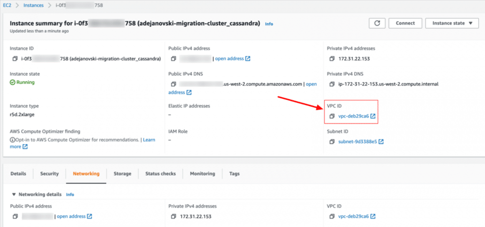
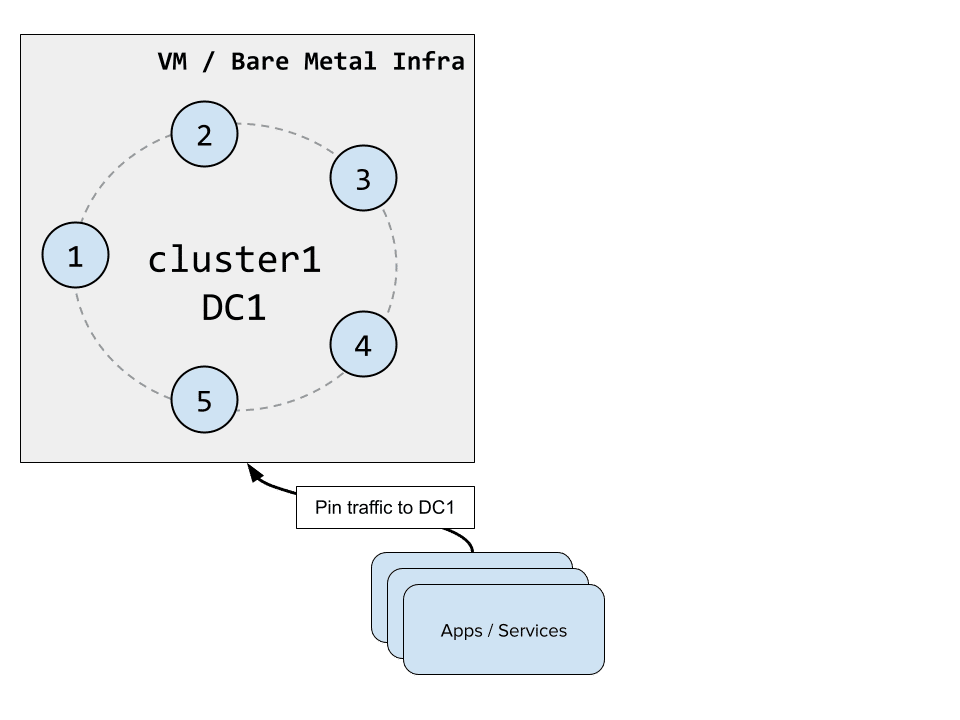
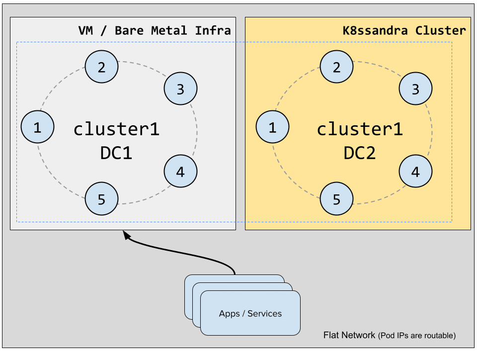
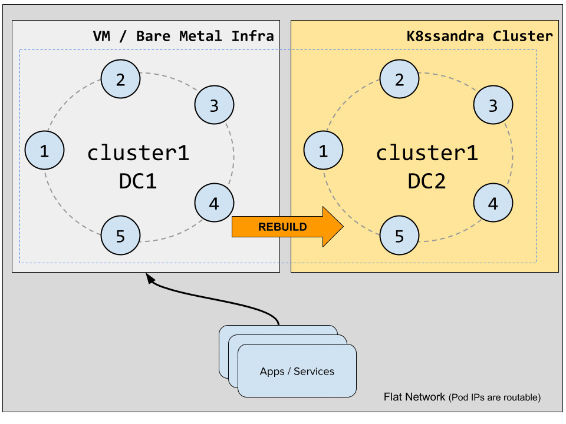
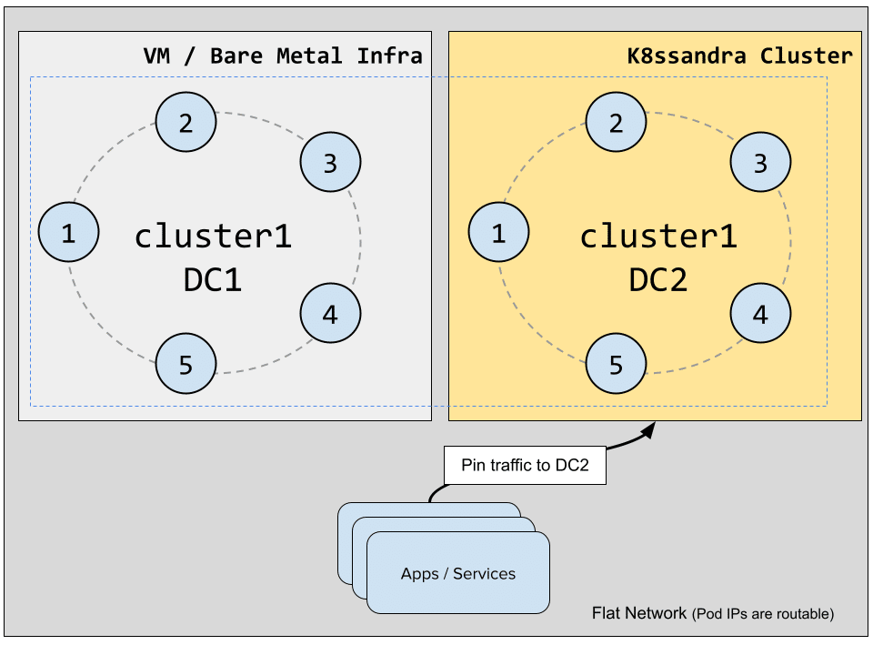
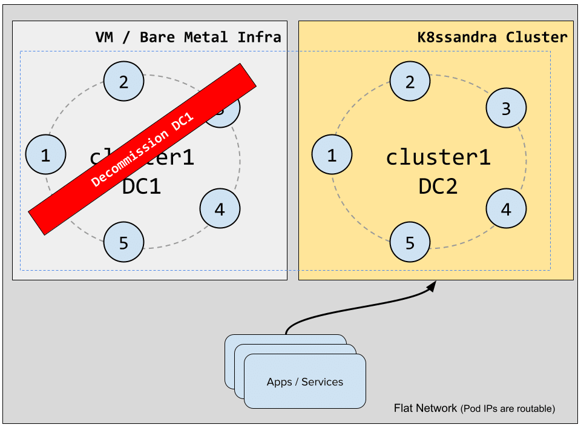

K8ssandra is a cloud-native distribution of the Apache Cassandra® database that runs on Kubernetes, with a suite of tools to ease and automate operational tasks. In this post, we'll walk you through a database migration from a Cassandra cluster running in AWS EC2 to a K8ssandra cluster running in Kubernetes on AWS EKS, with zero downtime.

As an Apache Cassandra user, your expectation should be that migrating to K8ssandra would happen without downtime. To make that happen with "classic" clusters running on virtual machines or bare metal instances, you will use the datacenter (DC) switch technique which is commonly used in the Cassandra community to transfer clusters to different hardware or environments. The good news is that it's not very different for clusters running in Kubernetes as most Container Network Interfaces (CNI) will provide routable pod IPs.

Routable pod IPs in Kubernetes {#h-routable-pod-ips-in-kubernetes}
------------------------------------------------------------------

A common misconception about Kubernetes networking is that services are the only way to expose pods outside the cluster and that pods themselves are only reachable directly from within the cluster.

Looking at [the Calico documentation](https://docs.projectcalico.org/networking/determine-best-networking), we can read the following:
> If the pod IP addresses are routable outside of the cluster then pods can connect to the outside world without SNAT, and the outside world can connect directly to pods without going via a Kubernetes service or Kubernetes ingress.

The same documentation tells us that the default CNI used in AWS EKS, Azure AKS and GCP GKE provide routable pod IPs within a VPC.

This is necessary because Cassandra nodes in both datacenters will need to be able to communicate with each other without having to go through services. Each Cassandra node stores the list of all the other nodes in the cluster in the `system.peers(_v2)` table and communicates with them using the IP addresses that are stored there. If pod IPs aren't routable, there's no (easy) way to create a hybrid Cassandra cluster that would span outside of the boundaries of a Kubernetes cluster.

Database Migration using Cassandra Datacenter Switch {#h-database-migration-using-cassandra-datacenter-switch}
--------------------------------------------------------------------------------------------------------------

The traditional technique to migrate a cluster to a different set of hardware or environment is to add up a new datacenter to the cluster whose nodes will be located in the target infrastructure, configure keyspaces so that Cassandra replicates data to the new DC, switch traffic to the new DC once it's up to date, and then decommission the old infrastructure.

While this procedure was brilliantly documented by my co-worker Alain Rodriguez on [the TLP blog](https://thelastpickle.com/blog/2019/02/26/data-center-switch.html), there are some subtleties related to running our new datacenter in Kubernetes, and more precisely using K8ssandra, which we'll cover in detail here.

Here are the steps we'll go through to perform the migration:

* Restrict traffic to the existing datacenter.
* Expand the Cassandra cluster by adding a new datacenter in a Kubernetes cluster using K8ssandra.
* Rebuild the newly created datacenter.
* Switch traffic over to the K8ssandra datacenter.
* Decommission the original Cassandra datacenter.

Performing the migration {#h-performing-the-migration}
------------------------------------------------------

### Initial State {#h-initial-state}

Our starting point is a Cassandra 4.0-rc1 cluster running in AWS on EC2 instances:

```
$ nodetool status
Datacenter: us-west-2
=====================
Status=Up/Down
|/ State=Normal/Leaving/Joining/Moving
--  Address        Load      Tokens  Owns (effective)  Host ID                               Rack
UN  172.31.4.217   10.2 GiB  16      100.0%            9a9b5e8f-c0c2-404d-95e1-372880e02c43  us-west-2c
UN  172.31.38.15   10.2 GiB  16      100.0%            1e6a9077-bb47-4584-83d5-8bed63512fd8  us-west-2b
UN  172.31.22.153  10.2 GiB  16      100.0%            d6488a81-be1c-4b07-9145-2aa32675282a  us-west-2a
```


In the AWS console, we can access the details of a node in the EC2 service and locate its VPC id which we'll need later to create a peering connection with the EKS cluster VPC:
 Finding the VPC id

The next step is to create an EKS cluster with the right settings so that pod IPs will be reachable from the existing EC2 instances.

### Creating the EKS cluster {#h-creating-the-eks-cluster}

We'll use the [k8ssandra-terraform](https://github.com/k8ssandra/k8ssandra-terraform) project to spin up an EKS cluster with 3 nodes (see <https://docs.k8ssandra.io/install/eks/> for more information).

After cloning the project locally, we initialize a few env variables to get started:

```
# Optional if you're using the default profile
export AWS_PROFILE=eks-poweruser
export TF_VAR_environment=dev 
# Must match the existing cluster name
export TF_VAR_name=adejanovski-migration-cluster
export TF_VAR_resource_owner=adejanovski
export TF_VAR_region=us-west-2
```


We go to the env directory and initialize our Terraform files:

```
cd env
terraform init
```


We can then update the `variables.tf` file and adjust it to our needs:

```
variable "instance_type" {
  description = "Type of instance to be used for the Kubernetes cluster."
  type        = string
  default     = "r5.2xlarge"
}

variable "desired_capacity" {
  description = "Desired capacity for the autoscaling Group."
  type        = number
  default     = 3
}

variable "max_size" {
  description = "Maximum number of the instances in autoscaling group"
  type        = number
  default     = 3
}

variable "min_size" {
  description = "Minimum number of the instances in autoscaling group"
  type        = number
  default     = 3
}

...

variable "private_cidr_block" {
  description = "List of private subnet cidr blocks"
  type        = list(string)
  default     = ["10.0.1.0/24", "10.0.2.0/24", "10.0.3.0/24"]
}
```


Make sure the private CIDR blocks are different from the ones used in the EC2 cluster VPC, otherwise you may end up with IP addresses conflicts.

Now create the EKS cluster and the three worker nodes:

```
terraform plan
terraform apply
...
# Answer "yes" when asked for confirmation
Do you want to perform these actions in workspace "eks-experiment"?
  Terraform will perform the actions described above.
  Only 'yes' will be accepted to approve.

  Enter a value: yes
```


The operation will take a few minutes to complete and output something similar to this at the end:

```
Apply complete! Resources: 50 added, 0 changed, 0 destroyed.

Outputs:

bucket_id = "dev-adejanovski-migration-cluster-s3-bucket"
cluster_Endpoint = "https://FB2B5CD5D27F43B69B54.gr7.us-west-2.eks.amazonaws.com"
cluster_name = "dev-adejanovski-migration-cluster-eks-cluster"
cluster_version = "1.20"
connect_cluster = "aws eks --region us-west-2 update-kubeconfig --name dev-adejanovski-migration-cluster-eks-cluster"
```


Note the `connect_cluster` command which will allow us to create the kubeconfig context entry to interact with the cluster using `kubectl`:

```
% aws eks --region us-west-2 update-kubeconfig --name dev-adejanovski-migration-cluster-eks-cluster

Updated context arn:aws:eks:us-west-2:3373455535488:cluster/dev-adejanovski-migration-cluster-eks-cluster in /Users/adejanovski/.kube/config
```


We can now check the list of worker nodes in our k8s cluster:

```
% kubectl get nodes
NAME                                       STATUS   ROLES    AGE   VERSION
ip-10-0-1-107.us-west-2.compute.internal   Ready    <none>   5m   v1.20.4-eks-6b7464
ip-10-0-2-34.us-west-2.compute.internal    Ready    <none>   5m   v1.20.4-eks-6b7464
ip-10-0-3-239.us-west-2.compute.internal   Ready    <none>   5m   v1.20.4-eks-6b7464
```


### VPC Peering and Security Groups {#h-vpc-peering-and-security-groups}

Our Terraform scripts will create a specific VPC for the EKS cluster. In order for our Cassandra nodes to communicate with the K8ssandra nodes, we will need to create a peering connection between both VPCs. Follow the documentation provided by AWS on this topic to create the peering connection: [VPC Peering Connection](https://docs.aws.amazon.com/vpc/latest/peering/create-vpc-peering-connection.html).

Once the VPC peering connection is created and the route tables are updated in both VPCs, update the inbound rules of the security groups for both the EC2 Cassandra nodes and the EKS worker nodes to accept all TCP traffic on ports 7000 and 7001, which are used by Cassandra nodes to communicate with each other (unless configured otherwise).

### Preparing the Cassandra cluster for the expansion {#h-preparing-the-cassandra-cluster-for-the-expansion}

 Original Cassandra cluster

When expanding a Cassandra cluster to another DC, and assuming you haven't created your cluster with the [SimpleSnitch](https://docs.datastax.com/en/cassandra-oss/3.x/cassandra/architecture/archSnitchSimple.html) (otherwise you first have to [switch snitches first](https://docs.datastax.com/en/cassandra-oss/3.x/cassandra/operations/opsSwitchSnitch.html)), you need to make sure your keyspaces use the [NetworkTopologyStrategy](https://docs.datastax.com/en/cassandra-oss/3.x/cassandra/architecture/archDataDistributeReplication.html?hl=replication%2Cstrategy#archDataDistributeReplication__nts) (NTS). This replication strategy is the only one that is DC and rack aware. The default [SimpleStrategy](https://docs.datastax.com/en/cassandra-oss/3.x/cassandra/architecture/archDataDistributeReplication.html?hl=replication%2Cstrategy#archDataDistributeReplication__simpleStrategy) will not consider DCs and will behave as if all nodes were collocated in the same DC and rack.

We'll use `cqlsh` on one of the EC2 Cassandra nodes to list the existing keyspaces and update their replication strategy.

```
$ cqlsh $(hostname)
Connected to adejanovski-migration-cluster at ip-172-31-22-153:9042
[cqlsh 6.0.0 | Cassandra 4.0 | CQL spec 3.4.5 | Native protocol v5]
Use HELP for help.
cqlsh> DESCRIBE KEYSPACES

system       system_distributed  system_traces  system_virtual_schema
system_auth  system_schema       system_views   tlp_stress
```


Several system keyspaces use the special `LocalStrategy` and are not replicated across nodes. They contain only node specific information and cannot be altered in any way.

We'll alter the following keyspaces to make them use NTS and only put replicas on the existing datacenter:

* `system_auth` (contains user credentials for authentication purposes)
* `system_distributed` (contains repair history data and MV build status)
* `system_traces` (contains probabilistic tracing data)
* `tlp_stress` (user-created keyspace)

Add any other user-created keyspace to the list. Here we only have the `tlp_stress` keyspace which was created by the [tlp-stress](https://thelastpickle.com/tlp-stress/) tool to generate some data for the purpose of this migration.

We will now run the following command on all the above keyspaces using the existing datacenter name, in our case `us-west-2`:

```
cqlsh> ALTER KEYSPACE <keyspace_name> WITH replication = {'class': 'NetworkTopologyStrategy', 'us-west-2': 3};
```


Make sure client traffic is pinned to the `us-west-2` datacenter by specifying it as the local datacenter. This can be done by using the `DCAwareRoundRobinPolicy` in some older versions of the Datastax drivers or by specifying it as local datacenter when creating a new `CqlSession` object in the 4.x branch of the Java Driver:

```
CqlSession session = CqlSession.builder()
    .withLocalDatacenter("us-west-2")
    .build();
```


More information can be found in the drivers documentation.

### Deploying K8ssandra as a new datacenter {#h-deploying-k8ssandra-as-a-new-datacenter}

 Creating a K8ssandra deployment for the new datacenter

K8ssandra ships with **[cass-operator](https://github.com/k8ssandra/cass-operator)** which orchestrates the Cassandra nodes and handles their configuration. Cass-operator exposes an `additionalSeeds` setting which allows us to add seed nodes that are not managed by the local instance of cass-operator and by doing so, create a new datacenter that will expand an existing cluster.

We will put all our existing Cassandra nodes as additional seeds, and you should not need more than three nodes in this list even if your original cluster is larger. The following `migration.yaml` values file will be used for our K8ssandra Helm chart:

```
cassandra:
  version: "4.0.0"
  clusterName: "adejanovski-migration-cluster"
  allowMultipleNodesPerWorker: false
  additionalSeeds:
  - 172.31.4.217
  - 172.31.38.15
  - 172.31.22.153
  heap:
   size: 31g
  gc:
    g1:
      enabled: true
      setUpdatingPauseTimePercent: 5
      maxGcPauseMillis: 300
  resources:
    requests:
      memory: "59Gi"
      cpu: "7000m"
    limits:
      memory: "60Gi"

  datacenters:
  - name: k8s-1
    size: 3
    racks:
    - name: r1
      affinityLabels:
        topology.kubernetes.io/zone: us-west-2a
    - name: r2
      affinityLabels:
        topology.kubernetes.io/zone: us-west-2b
    - name: r3
      affinityLabels:
        topology.kubernetes.io/zone: us-west-2c
  ingress:
    enabled: false
  cassandraLibDirVolume:
    storageClass: gp2
    size: 3400Gi

stargate:
  enabled: false

medusa:
  enabled: false

reaper-operator:
  enabled: false

kube-prometheus-stack:
  enabled: false

reaper:
  enabled: false
```


Note that the cluster name must match the value used for the EC2 Cassandra nodes and the datacenter should be named differently than the existing one(s). We will only install Cassandra in our K8ssandra datacenter, but other components could be deployed as well during this phase.

Let's deploy K8ssandra and have it join the Cassandra cluster:

```
% helm install k8ssandra charts/k8ssandra -n k8ssandra --create-namespace -f ~/k8ssandra_demo/benchmarks.values.yaml

NAME: k8ssandra
LAST DEPLOYED: Thu Jul  1 09:46:54 2021
NAMESPACE: k8ssandra
STATUS: deployed
REVISION: 1
TEST SUITE: None
```


You can monitor the logs of the Cassandra pods to see if they're joining appropriately:

```
kubectl logs pod/adejanovski-migration-cluster-k8s-1-r1-sts-0 -c server-system-logger -n k8ssandra --follow
```


Cass-operator will only start one node at a time so if you get a message looking like the following, try checking the logs of another pod:

```
tail: can't open '/var/log/cassandra/system.log': No such file or directory
```


If VPC peering was done appropriately, the nodes should join the cluster one by one and after a while, `nodetool status` should give an output that looks like this:

```
Datacenter: k8s-1
=================
Status=Up/Down
|/ State=Normal/Leaving/Joining/Moving
--  Address        Load       Tokens  Owns (effective)  Host ID                               Rack
UN  10.0.3.10      78.16 KiB  16      0.0%              c63b9b16-24fe-4232-b146-b7c2f450fcc6  r3
UN  10.0.2.66      69.14 KiB  16      0.0%              b1409a2e-cba1-482f-9ea6-c895bf296cd9  r2
UN  10.0.1.77      69.13 KiB  16      0.0%              78c53702-7a47-4629-a7bd-db41b1705bb8  r1

Datacenter: us-west-2
=====================
Status=Up/Down
|/ State=Normal/Leaving/Joining/Moving
--  Address        Load       Tokens  Owns (effective)  Host ID                               Rack
UN  172.31.4.217   10.2 GiB   16      100.0%            9a9b5e8f-c0c2-404d-95e1-372880e02c43  us-west-2c
UN  172.31.38.15   10.2 GiB   16      100.0%            1e6a9077-bb47-4584-83d5-8bed63512fd8  us-west-2b
UN  172.31.22.153  10.2 GiB   16      100.0%            d6488a81-be1c-4b07-9145-2aa32675282a  us-west-2a
```


### Rebuilding the new datacenter {#h-rebuilding-the-new-datacenter}

 Replicating data to the new datacenter by rebuilding

Now that our K8ssandra datacenter has joined the cluster, we will alter the replication strategies to create replicas in the `k8s-1` DC for the keyspaces we previously altered:

```
cqlsh> ALTER KEYSPACE <keyspace_name> WITH replication = {'class': 'NetworkTopologyStrategy', 'us-west-2': '3', 'k8s-1': '3'};
```


After altering all required keyspaces, rebuild the newly added nodes by running the following command for each Cassandra pod:

```
% kubectl exec -it pod/adejanovski-migration-cluster-k8s-1-r1-sts-0 -c cassandra -n k8ssandra -- nodetool rebuild us-west-2
```


Once all three nodes are rebuilt, the load should be similar on all nodes:

```
Datacenter: k8s-1
=================
Status=Up/Down
|/ State=Normal/Leaving/Joining/Moving
--  Address        Load       Tokens  Owns (effective)  Host ID                               Rack
UN  10.0.3.10      10.3 GiB   16      100.0%            c63b9b16-24fe-4232-b146-b7c2f450fcc6  r3
UN  10.0.2.66      10.3 GiB   16      100.0%            b1409a2e-cba1-482f-9ea6-c895bf296cd9  r2
UN  10.0.1.77      10.3 GiB   16      100.0%            78c53702-7a47-4629-a7bd-db41b1705bb8  r1

Datacenter: us-west-2
=====================
Status=Up/Down
|/ State=Normal/Leaving/Joining/Moving
--  Address        Load       Tokens  Owns (effective)  Host ID                               Rack
UN  172.31.4.217   10.32 GiB  16      100.0%            9a9b5e8f-c0c2-404d-95e1-372880e02c43  us-west-2c
UN  172.31.38.15   10.32 GiB  16      100.0%            1e6a9077-bb47-4584-83d5-8bed63512fd8  us-west-2b
UN  172.31.22.153  10.32 GiB  16      100.0%            d6488a81-be1c-4b07-9145-2aa32675282a  us-west-2a
```


***Note that K8ssandra will create a new superuser and that the existing users in the cluster will be retained as well after the migration. You can forcefully recreate the existing superuser credentials in the K8ssandra datacenter by adding the following block in the "cassandra" section of the Helm values file:***

```
  auth:
    enabled: true
    superuser:
      secret: "superuser-password"
      username: "superuser-name"
```


### Switching traffic to the new datacenter {#h-switching-traffic-to-the-new-datacenter}

 Redirecting client traffic to the new datacenter

Client traffic can now be directed at the `k8s-1` datacenter, the same way we previously restricted it to `us-west-2`. If your clients are running from within the Kubernetes cluster, use the cassandra service exposed by K8ssandra as a contact point for the driver. If the clients are running outside of the Kubernetes cluster, you'll need to enable Ingress and configure it appropriately, which is outside the scope of this blog post and will be covered in a future one.

### Decommissioning the old datacenter and finishing the migration {#h-decommissioning-the-old-datacenter-and-finishing-the-migration}

 Decommission the original datacenter

Once all the client apps/services have been restarted, we can alter our keyspaces to only replicate them on `k8s-1`:

```
cqlsh> ALTER KEYSPACE <keyspace_name> WITH replication = {'class': 'NetworkTopologyStrategy', 'k8s-1': '3'};
```


Then `ssh` into each of the Cassandra nodes in `us-west-2` and run the following command to decommission them:

```
% nodetool decommission
```


They will appear as leaving (UL) while the decommission is running:

```
Datacenter: k8s-1
=================
Status=Up/Down
|/ State=Normal/Leaving/Joining/Moving
--  Address        Load       Tokens  Owns (effective)  Host ID                               Rack
UN  10.0.3.10      10.3 GiB   16      100.0%            c63b9b16-24fe-4232-b146-b7c2f450fcc6  r3
UN  10.0.2.66      10.3 GiB   16      100.0%            b1409a2e-cba1-482f-9ea6-c895bf296cd9  r2
UN  10.0.1.77      10.3 GiB   16      100.0%            78c53702-7a47-4629-a7bd-db41b1705bb8  r1

Datacenter: us-west-2
=====================
Status=Up/Down
|/ State=Normal/Leaving/Joining/Moving
--  Address        Load       Tokens  Owns (effective)  Host ID                               Rack
UN  172.31.4.217   10.32 GiB  16      0.0%              9a9b5e8f-c0c2-404d-95e1-372880e02c43  us-west-2c
UN  172.31.38.15   10.32 GiB  16      0.0%              1e6a9077-bb47-4584-83d5-8bed63512fd8  us-west-2b
UL  172.31.22.153  10.32 GiB  16      0.0%              d6488a81-be1c-4b07-9145-2aa32675282a  us-west-2a
```


The operation should be fairly fast as no streaming will take place since we no longer have keyspaces replicated on `us-west-2`.

Once all three nodes were decommissioned, we should be left with the `k8s-1` datacenter only:

```
Datacenter: k8s-1
=================
Status=Up/Down
|/ State=Normal/Leaving/Joining/Moving
--  Address    Load      Tokens  Owns (effective)  Host ID                               Rack
UN  10.0.3.10  10.3 GiB  16      100.0%            c63b9b16-24fe-4232-b146-b7c2f450fcc6  r3
UN  10.0.2.66  10.3 GiB  16      100.0%            b1409a2e-cba1-482f-9ea6-c895bf296cd9  r2
UN  10.0.1.77  10.3 GiB  16      100.0%            78c53702-7a47-4629-a7bd-db41b1705bb8  r1
```


As a final step, we can now delete the VPC peering connection which is no longer necessary.

Note that the cluster can run in hybrid mode for as long as necessary. There's no requirement to delete the `us-west-2` datacenter if it makes sense to keep it alive.

Conclusion {#h-conclusion}
--------------------------

We have seen today that it was possible to migrate existing Cassandra clusters to K8ssandra without downtime, leveraging flat networking to allow Cassandra nodes running in VMs to connect to Cassandra pods running in Kubernetes directly.

Join [our forum](https://forum.k8ssandra.io/) if you have any questions about the above procedure and come speak with us directly [in Discord](https://discord.com/invite/qP5tAt6Uwt). Curious to learn more about (or play with) Cassandra itself? We recommend trying it on the [Astra DB](https://astra.dev/3JvaNMN) for the fastest setup.
