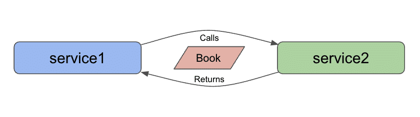
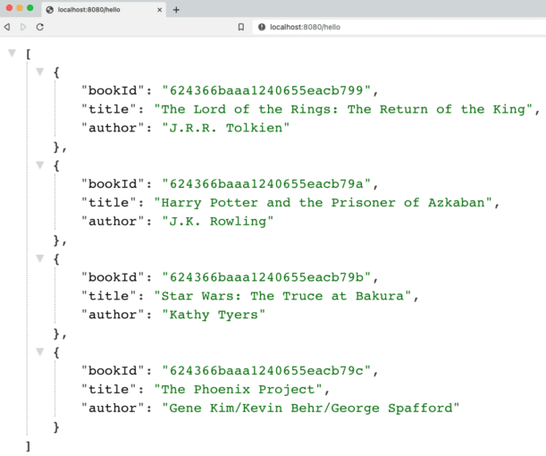

**Let's dive into the world of microservices find out the complexities, best practices, and troubles. I will share all my learnings, as well!**

In my [last blog post](https://jmhreif.com/blog/microservices-level1/), we began building microservices in Java with two Spring Boot applications, passing a "Hello, World!" string from one application to the other. We focused on reduced complexity, minimum previous knowledge, and few components. Next, we can slowly add pieces that simulate microservices projects in the real world.

One way to do this is by adding a data domain. Applications often model some scenario in the real world such as maintaining office building temperatures, finding connected devices on a network, or recommending a tv show. All of these need developers to create models of the environment - buildings and standard conditions; networks and connected devices; show preferences and recommendations. Models of the same domain can differ due to varying requirements.

While microservices systems vary greatly in size, technologies, etc., data can be found at the center of nearly all of them.

Architecture {#_architecture}
-----------------------------

Our goal is still to create microservices that communicate and pass information without intervention. These blog posts will take us from the beginning to that goal stage in a (hopefully) understandable way. In our last post, we connected two Spring Boot applications communicating via a REST endpoint using the analogy of a bridge connecting two bits of land.

Today's architecture is almost the same, but adding a data domain of books. So we now have a slightly more ornate bridge over water. 🙂

Our architecture diagram will look like the following:



There are all kinds of data sets we could use, but a few things led me to use books. 1. a book domain is relatable across a wide audience - no specialized knowledge required. 2. there were existing data sets that could be expanded with additional books. 3. many different services could be built for the domain (i.e. purchases, reviews, recommendations, media, and more).

Now let's add some books! If you are following along from the previous blog post, feel free to start with the [microservices-level1](https://github.com/JMHReif/microservices-level1) version of the code and make modifications as we discuss them below. If you are starting from this blog post, you can either start fresh with today's [level2 code](https://github.com/JMHReif/microservices-level2) or start from the [level1 code](https://github.com/JMHReif/microservices-level1).

Applications - Service 1 {#_applications_service_1}
---------------------------------------------------

Just as before, I like to work from the backend up (or out). Since we are dealing with data now, we will need some sort of datastore. There are too many options to fathom, but we can limit our choices.

First, Spring Data has a few integrations with databases that allow us to plug-and-play pretty quickly. This narrows our list to those on [Spring Data's page](https://spring.io/projects/spring-data). Second, we don't need to add the complexity of spinning up a database instance and creating a separate service for our data store (yet). 🙂 We will get there, but let's start with an embedded database. An embedded database is created and populated when an application starts and gets shut down when the application terminates or shuts down.

There are still a few options, but the most popular is probably MongoDB. It offers an option for embedded (with a minor tweak), so we will use that.

We will need to add a couple of additional dependencies in order to create an embedded MongoDB instance and populate/interact with the data. The changes to the `pom.xml` project file are shown below, and the [full file](https://github.com/JMHReif/microservices-level2/blob/main/service1/pom.xml) is available on Github.

```java
   de.flapdoodle.embed
   de.flapdoodle.embed.mongo
   <!-- test -->

   org.springframework.boot
   spring-boot-starter-data-mongodb-reactive
```


Flapdoodle provides the embedded version of MongoDB, although only scoped for testing. We can tweak this by commenting out the scope, so that we can use embedded MongoDB instances for our whole application. Note, this is not recommended for production. 😉

Then, we need to include the Spring Data MongoDB starter, which allows us access to all the [goodies Spring Data offers with MongoDB](https://spring.io/projects/spring-data-mongodb) (annotations for entities, domain-specific language for custom queries, and more).

### Service 1 - project code {#_service_1_project_code}

I'll keep all the code in the `Service1Application` file, since we don't have too many lines yet. We will start at the bottom of the file with the `Book` entity that represents objects of our book data. As always, there is [full code on Github](https://github.com/JMHReif/microservices-level2/blob/main/service1/src/main/java/com/jmhreif/service1/Service1Application.java).

```java
@Data
@Document
class Book {
	@Id
	private String bookId;
	@NonNull
	private String title;
	@NonNull
	private String author;
}
```


With Lombok in our dependencies, this class might look smaller than typical Java object classes. The [`@Data`](https://projectlombok.org/features/Data) annotation creates getter/setter methods, equals/hashcode/toString methods, and a constructor with required arguments. The `@Document` annotation tells Spring that this is a MongoDB entity class (data model uses document entities).

Next, we add a few entity variables (properties). A unique id helps us identify a particular book in the database, and the title and author are probably interesting fields. All three fields are `String` types. The first property (`bookId`) has an annotation of `@Id`, which tells Spring that this is the id field for our class. The `title` and `author` properties have a `@NonNull` annotation, which means that we don't want these properties to be missing when we search for books or add new ones. Makes sense, as it's hard to find a book without a title and/or author.

We also need to add a repository interface that allows us to define methods for interacting with the data (separate from specific implementation). That is in the next code block above our `Book` class.

```java
interface BookRepository extends ReactiveCrudRepository {
}
```


We have entered very little code here because Spring Data provides a few implementations of common methods such as `findAll()`, `findById()`, and more. This is mentioned briefly in the [related section](https://docs.spring.io/spring-data/commons/docs/current/reference/html/#repositories.core-concepts) of the Spring Data Commons documentation. We are using the `ReactiveCrudRepository` because we want to use reactive methods and types for working with the data, requiring a different repository extension from a traditional `CrudRepository`.

Next, we need to tweak our controller class to work with `Book` objects, instead of the "Hello, World!" string we used last time.

```java
@RestController
@AllArgsConstructor
@RequestMapping("/db")
class BookController {
	private final BookRepository bookRepository;

	@GetMapping("/books")
	Flux getBooks() { return bookRepository.findAll(); }
}
```


Comparing against our [previous version's controller class](https://github.com/JMHReif/microservices-level1/blob/main/service1/src/main/java/com/jmhreif/service1/Service1Application.java), the name of the endpoint on line 3 changed from `/text` to `/db` to more clearly state our connection to a database and data. The name of the class (line 4) goes from `TextController` to `BookController` to align with the data we're passing.

The first line inside the braces of the class injects the book repository, creating a [Spring Bean](https://www.baeldung.com/spring-bean) that we can use to access the methods provided in our `BookRepository` interface. Next, we need to adjust our method to return some books. While we don't need to modify the mapping endpoint for the method, we can specify nested endpoints (under `/db`) by adding the value in the `GetMapping()` annotation. Here, we can access the `getBooks()` method with the `/db/books` path.

The next line implements our `getBooks()` method. Since we want to potentially return multiple books with reactive types, our method return type is `Flux`. Inside the method, we return results from accessing our `bookRepository` bean and calling its `findAll()` method.

Finally, we also need some data in our database to retrieve anything with our method above. An embedded database will spin up when the application starts and be destroyed when the application terminates. So, we need to populate the database each time the application starts. We could load in external data each time, but for simplicity/demo purposes, we will create a bean with hard-coded `Book` objects to save.

```java
@Bean
CommandLineRunner clr(BookRepository repo) {
   return args -> repo.deleteAll()
	   .thenMany(Flux.just(
		   new Book("The Lord of the Rings: The Return of the King", "J.R.R. Tolkien"),
		   new Book("Harry Potter and the Prisoner of Azkaban", "J.K. Rowling"),
		   new Book("Star Wars: The Truce at Bakura", "Kathy Tyers"),
		   new Book("The Phoenix Project", "Gene Kim/Kevin Behr/George Spafford")))
	   .flatMap(repo::save)
	   .log()
	   .subscribe();
}
```


A [`CommandLineRunner`](https://docs.spring.io/spring-boot/docs/current/api/org/springframework/boot/CommandLineRunner.html) runs when the application starts, so this bean executes early in the startup. We pass our `BookRepository` into the method so we can access the methods to MongoDB data.

In the method body, we return the results of a [Lambda expression](https://www.javatpoint.com/java-lambda-expressions) - passing in arguments from the application context on the left side of the arrow and executing the statement on the right side of the arrow. It uses the repo's provided method `deleteAll()` to ensure an empty database, then takes some defined `Book` objects (4 of my favorite books), flattens the multiple-object Flux to another Flux (`.flatMap()`), and saves that Flux of books in our database with another Lambda (`repo::save`) that calls the `save` method on the book repository.

We log all this to find any errors (`.log()`) and subscribe to put the publisher into action. In reactive programming, our code before the `.subscribe()` is like a bus sitting at a station, and subscribing moves the bus. Until `subscribe` is called, there is no action.

We can run the application now, though it only confirms data gets loaded via logging. This completes the backing service. Updating service2 will allow us to access the backend we just set up to ensure our services can still communicate.

Applications - Service 2 {#_applications_service_2}
---------------------------------------------------

In service2, we don't need to add any dependencies because we are not changing the functionality, only the data being passed. Our frontend service still sends a request and displays a response, and while the format of that data is different (books), the technologies to sending and receiving it isn't.

That means no changes to our `pom.xml` file. On to the application class code!

### Service 2 - project code {#_service_2_project_code}

As in service1, we will start from the bottom of the `Service2Application.java` class and work our way up. First, we need to define our `Book` domain class again because we need the frontend application to recognize and map the same objects our backend service uses. However, the code is slightly different from our service1 `Book` class.

```java
@Data
class Book {
   private String bookId;
   private String title;
   private String author;
}
```


Service2 does not interact directly with the database, so it only needs the domain class to ensure data being passed matches what our backend services expects and returns. We only need the `@Data` annotation, since we need to access the getter/setter methods in order to map the object fields.

Moving on up, we need to make a couple of minor adjustments to the controller class that calls our backend endpoint.

```java
@RestController
@AllArgsConstructor
@RequestMapping("/hello")
class BookController {
   private final WebClient client;

   Flux getBooks() {
	  return client.get()
		.uri("/db/books")
		.retrieve()
		.bodyToFlux(Book.class);
	}
}
```


The first change is to the name of the class itself (from `TextController` to `BookController`) to align with our book domain. On [line 9](https://github.com/JMHReif/microservices-level2/blob/main/service2/src/main/java/com/jmhreif/service2/Service2Application.java#L42) of the above code, we implement the `getBooks()` method. The name for the method also gets updated to match our book domain, and we need to use a different return type (from `Mono` to `Flux`) because we are dealing with book objects instead of a string and expect multiple books instead of a single string return.

On the [eleventh line of controller](https://github.com/JMHReif/microservices-level2/blob/main/service2/src/main/java/com/jmhreif/service2/Service2Application.java#L44), we need to update our endpoint URL path because we changed that in our backend service from `/text` to `/db/books`. Finally, the last line of the method ([controller line 12](https://github.com/JMHReif/microservices-level2/blob/main/service2/src/main/java/com/jmhreif/service2/Service2Application.java#L46)) maps the return body to a `Flux` (one or more) of `Book` objects, rather than the [previous mapping to a Mono of String](https://github.com/JMHReif/microservices-level1/blob/main/service2/src/main/java/com/jmhreif/service2/Service2Application.java#L43).

None of the code in the `Service2Application` class needs to change, so now it's time to test it out and see if it works!

Put it to the test {#_put_it_to_the_test}
-----------------------------------------

Start each of the applications, either through your IDE or via the command line. Once both are running, open a browser and go to `localhost:8080/hello`. Alternatively, you can run this at the command line with `curl localhost:8080/hello` or (if you have [httpie](https://httpie.io/) tool installed) `http :8080/hello`.

And here is the resulting output!



<br />

Wrapping up! {#_wrapping_up}
----------------------------

Congratulations, we have taken the next step to add a data domain (with database) to our microservices project!

We kept our two individual Spring Boot applications that communicated over HTTP, but modified them to pass `Book` data, instead of a single string. Our backend service (service1) creates and populates an embedded MongoDB instance with some books, and our frontend service (service2) requests and returns those books. We successfully added a database layer (although embedded for now) and came a bit closer to real-world business cases with a data domain and storage.

Microservices are all about having multiple applications/technologies as services and getting them to communicate among one another. Of course, there is much more to a production-ready system, but we are on our way to building and understanding them one small step at a time.

Happy coding!

Resources {#_resources}
-----------------------

* Github: [microservices-level2](https://github.com/JMHReif/microservices-level2) repository
* Documentation: [Spring Data MongoDB](https://spring.io/projects/spring-data-mongodb)
* Previous blog post: [Microservices Level 1](https://jmhreif.com/blog/microservices-level1/)
* Document database: [MongoDB product page](https://www.mongodb.com/)
