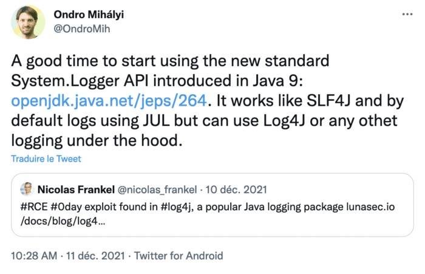
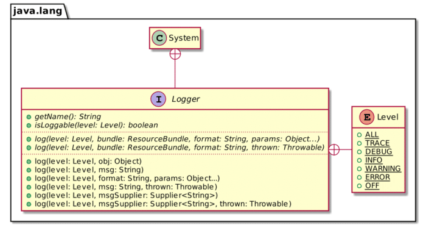
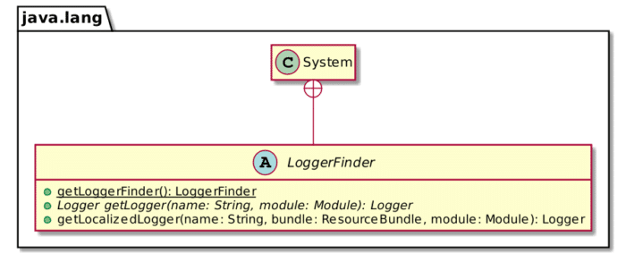

December was not a good time for Java developers and even less for Ops. The former had to repackage their apps with a fixed Log4J's version, and the latter had to redeploy them - several times. Yet, every cloud has a silver lining. In my case, I learned about `System.Logger`.

[](https://twitter.com/OndroMih/status/1469599938782932992)

[



](https://twitter.com/OndroMih/status/1469599938782932992)
In short, `System.Logger` is a façade over your logging engine. Instead of using, say, SFL4J's API and the wanted implementation, you'd use `System.Logger` instead of SLF4J. It's available since Java 9, and it's a bummer that I learned about it only recently.

## System.Logger API

The API is a bit different than other logging APIs: it avoids different logging methods such as `debug()`, `info()` in favor of a single `log()` one where you pass a logging `Level` parameter.



If you don't provide any corresponding implementation on the classpath, `System.Logger` defaults to .

```kotlin
public class LoggerExample {

  private static final System.Logger LOGGER = System.getLogger("c.f.b.DefaultLogger"); // 1

  public static void main(String[] args) {
      LOGGER.log(DEBUG, "A debug message");
      LOGGER.log(INFO, "Hello world!");
  }
}
```

1. Get the logger

Running the above snippet outputs the following:

```
Dec 24, 2021 10:38:15 AM c.f.b.DefaultLogger main
INFO: Hello world!
```

## Compatible implementations

Most applications currently use [Log4J2](https://logging.apache.org/log4j/2.x/) or [SLF4J](https://www.slf4j.org/). Both provide a compatible `System.Logger` implementation.

For Log4J, we need to add two dependencies:

```xml
<dependencies>
    <dependency>
        <groupId>org.apache.logging.log4j</groupId>
        <artifactId>log4j-core</artifactId>            <!-- 1 -->
        <version>2.17.0</version>
    </dependency>
    <dependency>
        <groupId>org.apache.logging.log4j</groupId>    <!-- 2 -->
        <artifactId>log4j-jpl</artifactId>
        <version>2.17.0</version>
    </dependency>
</dependencies>
```

1. Log4J implementation
2. Bridge from `System.Logger` to Log4J

The same logging snippet as above now outputs the following:

```
11:00:07.373 [main] INFO  c.f.b.DefaultLogger - Hello world!
```

To use SLF4J instead, use the following dependencies:

```xml
<dependencies>
    <dependency>
        <groupId>org.slf4j</groupId>
        <artifactId>slf4j-simple</artifactId>               <!-- 1 -->
        <version>2.0.0-alpha5</version>
    </dependency>
    <dependency>
        <groupId>org.slf4j</groupId>
        <artifactId>slf4j-jdk-platform-logging</artifactId> <!-- 2 -->
        <version>2.0.0-alpha5</version>
    </dependency>
</dependencies>
```

1. Basic SLF4J implementation. Any other implementation will do, *e.g.* Logback
2. Bridge from `System.Logger` to Log4J

The snippet outputs:

```
[main] INFO c.f.b.DefaultLogger - Hello world!
```

## Your own `System.Logger` implementation

`System.Logger` relies on Java's [ServiceLoader](https://docs.oracle.com/javase/7/docs/api/java/util/ServiceLoader.html) mechanism. Both `log4j-jpl` and `slf4j-jdk-platform-logging` contain a `META-INF/services/java.lang.System$LoggerFinder` file that points to a `LoggerFinder` implementation.



We can create our own based on `System.out` for educational purposes.  

The first step is to implement the logger itself.

```java
public class ConsoleLogger implements System.Logger {

    private final String name;

    public ConsoleLogger(String name) {
        this.name = name;
    }

    @Override
    public String getName() {
        return name;
    }

    @Override
    public boolean isLoggable(Level level) {
        return level.getSeverity() >= Level.INFO.getSeverity();
    }

    @Override
    public void log(Level level, ResourceBundle bundle, String msg, Throwable thrown) {
        if (isLoggable(level)) {
            System.out.println(msg);
            thrown.printStackTrace();
        }
    }

    @Override
    public void log(Level level, ResourceBundle bundle, String format, Object... params) {
        if (isLoggable(level)) {
            System.out.println(MessageFormat.format(format, params));
        }
    }
}
```

Then, we need to code the `System.LoggerFinder`:

```java
public class ConsoleLoggerFinder extends System.LoggerFinder {

    private static final Map<String, ConsoleLogger> LOGGERS = new HashMap<>(); // 1

    @Override
    public System.Logger getLogger(String name, Module module) {
        return LOGGERS.computeIfAbsent(name, ConsoleLogger::new);              // 2
    }
}
```

1. Keep a map of all existing loggers
2. Create a logger if it doesn't already exist and store it

Finally, we create a service file:

```
ch.frankel.blog.ConsoleLoggerFinder
```

And now, running the same code snippet outputs:

```
Hello world!
```

## Conclusion

While the API is more limited than other more established logging APIs, `System.Logger` is a great idea. It offers a façade that's part of the JDK. Thus, it avoids using a third-party façade that needs to wire calls to another unrelated implementation, *e.g.* SLF4J to Log4J2.

For this reason, I think I'll be trying `System.Logger` if only to get some hands-on experience.

The complete source code for this post can be found in Maven format [there](https://github.com/ajavageek/system-logger).

**To go further:**

* [JEP 264: Platform Logging API and Service](https://openjdk.java.net/jeps/264)
* [Class ServiceLoader](https://docs.oracle.com/javase/7/docs/api/java/util/ServiceLoader.html)
* [Simplest Java decoupling without 3rd party frameworks](https://blog.frankel.ch/simplest-java-decoupling-without-3rd-party-frameworks/)
* [Migrating the ServiceLoader to the Java 9 module system](https://blog.frankel.ch/migrating-serviceloader-java-9-module-system/)
* [Java Service Loader vs Spring Factories Loader](https://blog.frankel.ch/java-service-loader-vs-spring-factories/)

*Originally published at [A Java Geek](https://blog.frankel.ch/system-logger/) on February 13^th^, 2022*

*[JUL]: Java Util Logging
