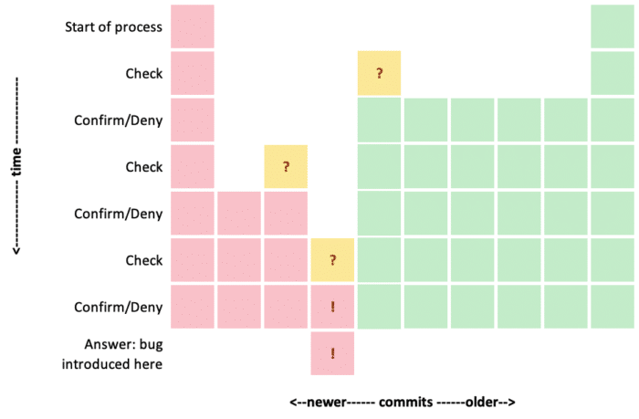

During some recent work on Maven, I found a very specific bug. The error message wasn't that clear, and I couldn't make a guess what might've caused it.

I had read about `git bisect` a few times and figured that this time, I would use that tool to find the bug.

So what does `git bisect` do? It helps you find the exact commit that introduced a bug, using binary search.

## Prerequisites

For this, you must know a point in history (a commit hash, a tag) that did *not* have the bug. You also need to know a point in history that *does* have the bug. And finally, you need to have a reliable way to determine if the bug is there.

## The Process

From here on, using `git bisect` looks a bit like a game:
> Git: does this version of your project contain the bug?  
>
> Me *runs some tests*   
>
> Me: er, nope.  
>
> Git *checks out another revision of the project*   
>
> Git: how about now?  
>
> Me *runs some tests*   
>
> Me: yes!

And so on, so forth...

You start the "game" by telling the tool the "good" and the "bad" point that you know:

```
git bisect start
git bisect bad           # no argument, so current revision
git bisect good cecedd34 # could also be a tag
```

Every time you answer that question, `git bisect` can cross out either half of the history between the last two points that you've checked:

```
git bisect good          # this commit is fine, it doesn't have the bug
git bisect bad           # this commit is bad, it does have the bug
git bisect skip          # this commit cannot be tested for the bug
```

After each question that you answer, git checks out another revision, somewhere halfway between the last "good" and the last "bad" commit. With every iteration, this reduces the search space (the number of commits to consider) with 50%.



As you can see in the picture above, every time you answer that question, you get closer to knowing exactly which commit introduced the bug. Eventually, the game is over: `git` tells you the exact commit that introduced the bug:
> 9f88494b6064ad45ea2e2e1e3478afc7af0bc065 is the first bad commit

If you want, you can watch a replay by looking at the output of `git bisect log`. Now is also a good time to clean up the mess we made with all those checkouts by issuing `git bisect reset`.

## Automate Everything!

But wait a minute... having this tedious manual check is both boring and error prone. There must be a way to automate this!

Of course, there is.

Rather than going through the manual process, we can have a script perform the check for us. Such a script must use the exit code to signal whether that revision is good or bad:

* If the script exits with code `0`, it says "the bug is not present".
* If the script exits with code `125`, it says "can't say whether the bug is present".
* If it exits with any other value between `1` and `127`, it says "the bug is present".

Typically, something like `mvn test` would be a good test.

## When Things Get Complicated

But what if your setup is a bit more complex? The situation I faced today was a problem where Maven couldn't build Maven. How would you use `git bisect` for that?

I've made a script that first builds the selected Git revision of Maven. Since the bug is in Maven, I need to build Maven before I can say if the bug is there. But the sample project is *also* Maven, so I got myself a second clone of the Git repo to test on.

The script looks like this:

```
# This is the Maven source clone that I
# use to run bisect.
export MAVENCODEBASE="/Users/maarten/Code/open-source/maven/maven"

# If there's a compilation failure or what not,
# we can't say whether this revision has the bug.
mvn clean verify -f "$MAVENCODEBASE" -DskipTests=true || exit 125

# Make a temporary directory and unpack the
# fresh Maven build there.
tmp_dir=$(mktemp -d)
pushd $tmp_dir
# We don't need the maven-wrapper zip if it's there.
rm $MAVENCODEBASE/apache-maven/target/*wrapper* || true
unzip $MAVENCODEBASE/apache-maven/target/apache-maven-*.zip

# Make sure the path is predictable
# even when the version number changed between
# the "good" and the "bad" commit
mv apache-maven-* apache-maven
# Just to be sure, see if the mvn executable works
$tmp_dir/apache-maven/bin/mvn --version

# Navigate to the second Maven project checkout
# and use the fresh Maven build to build it.
pushd /Users/maarten/Junk/git-bisect/maven
$tmp_dir/apache-maven/bin/mvn validate

# Remember whether it failed or not
status=$?

# Clean up after ourselves
popd
popd
echo Removing $tmp_dir
rm -Rf $tmp_dir

# Tell git bisect about the quality of this build.
echo "Exiting with status '$status'"
exit $status
```

Since the bug was not present in the last release of Maven, the last "good" commit is the **maven-3.6.3** tag. And because I don't know when it started failing, I use **HEAD** for the first "bad" commit.

```
git bisect start HEAD maven-3.6.3 --
git bisect run ../can-build-master.sh
```

After a couple of minutes and a lot of noise from my computer, I get the same output:
> 9f88494b6064ad45ea2e2e1e3478afc7af0bc065 is the first bad commit

Again, make sure to reset the project clone to a pristine state with `git bisect reset`.

## Wrapping Up

So, did I find the bug? Well, yes and no. I did find out which commit introduced the bug. But given that the message was so unclear, I gave up there.

It was a useful journey nevertheless. At least I could [file an issue](https://issues.apache.org/jira/browse/MNG-7087), referencing that particular commit. That should make it easier for others as well to investigate what the actual problem is.
