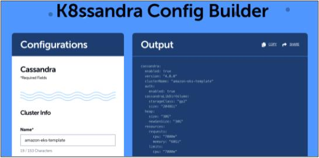

***Setting up K8ssandra in your workflow just got a whole lot easier. With the new Config Builder you can be running Apache Cassandra® on Kubernetes in a matter of minutes.***

The purpose of K8ssandra is to make it easy to run Apache Cassandra® on Kubernetes. We recently took another big step in that direction by releasing the [K8ssandra config builder](https://dtsx.io/3pIiPcR).

Even if you've created thousands of nodes or integrated K8ssandra in your stack, you'll probably want to give the config builder a try. Walk through the interactive wizard defining the shape of your cluster, resource requirements, and toggle features to fit your needs. This is great for smoothing out the on-ramp for a production ready environment of K8ssandra.

Especially if you're new(er) to K8ssandra, this builder will help you save several hours getting started in your environment. Choose one of the pre-defined templates as a starting point with cloud-specific options preconfigured.

As of this writing you can take your pick between a custom configuration and templates for [Google Kubernetes Engine](https://cloud.google.com/kubernetes-engine) (GKE), [Azure AKS](https://azure.microsoft.com/en-us/services/kubernetes-service/), [Digital Ocean](https://www.digitalocean.com/), [Amazon EKS](https://aws.amazon.com/eks/) or a local setup of K8ssandra.

## Write hundreds of lines of code with a couple of clicks

As you may know [K8ssandra](https://dtsx.io/3ICC6VU) is a platform for production deployments of Cassandra on Kubernetes. This includes everything you want to run alongside them like your monitoring system, repair process ([Reaper](https://dtsx.io/3EJcCDH)) and backups.

However, the default configuration file is hundreds of lines. So we realized that we could make it even easier. With the K8ssandra Config Builder all you have to do is set your preferred parameters like:

* Limits for deployments
* Storage requirements
* Size and number of nodes
* Racks and logical datacenters

When writing your own YAML file you need to know the right values and sane limits. But with the config builder you don't need to worry about that. Once you have the file, you run helm install and get a cluster running.

The config builder adjusts your settings to keep you within the limits that make sense. So you can't request 32 GB of Heap for Cassandra if you only have 16 GB of RAM available due to your quotas.

When you are finished (or even at a stopping point), you can click copy or share to get going yourself or to share the configuration with a colleague to collaborate.
 Figure 1. A single click in the K8ssandra Config Builder will give you the 52 line YAML file for the setup of three nodes in Amazon EKS.

Sure, there might still be instances where you want to write the YAML file yourself. But if you get stuck on something, the config builder is the fastest way for you to find the solution.

We'll keep the builder up to date so you can always come back and get exactly what you need.

## What's next for the K8ssandra Config Builder

Our goal is to give you a rich experience building anything in K8ssandra. So we're working on new features to be released for the K8ssandra config builder in the near future. Near the top of our to-do list are:

* Linking to the Config Builder from the [K8ssandra install documentation](https://dtsx.io/3pMLJsh) to the specific YAML file template
* Syntax highlighting the code and line numbers
* User experience improvements.

Of course our priorities depend on the feedback we get from the users of the config builder.

Curious to learn more about (or play with) Cassandra itself? We recommend trying it on the [Astra DB](https://astra.dev/3sj0gPe) for the fastest setup.

*So don't hesitate to tell us what you think. You can do so by joining the* [*K8ssandra Discord*](https://dtsx.io/3DGLG6f)*or* [*K8ssandra Forum*](https://dtsx.io/31Rp85v)*today. For exclusive posts on all things data, follow* [*DataStax on Medium*](https://dtsx.io/3IE3mTW)*.*

### Resources

1. Try out the [K8ssandra Config Builder](https://dtsx.io/3pIiPcR)
2. Join the [K8ssandra Community](https://dtsx.io/31Rp85v)
3. [Kubernetes and Apache Cassandra: What Works (and What Doesn't)](https://dtsx.io/3lVGaXo)
4. DataStax Discord: [Fellowship of the (Cassandra) Rings](https://dtsx.io/3oJUMey)
5. [K8ssandra documentation](https://dtsx.io/3pMLJsh)
6. [Google Kubernetes Engine](https://cloud.google.com/kubernetes-engine) (GKE)
7. [Azure Kubernetes Service](https://azure.microsoft.com/en-us/services/kubernetes-service/) (AKS)
8. [Digital Ocean](https://www.digitalocean.com/) cloud infrastructure
9. [Amazon Elastic Kubernetes Service](https://aws.amazon.com/eks/) (EKS)
