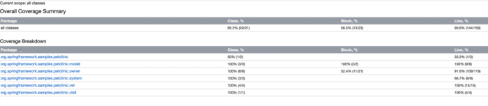
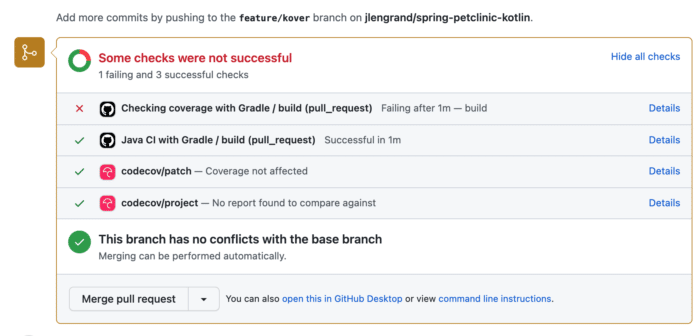
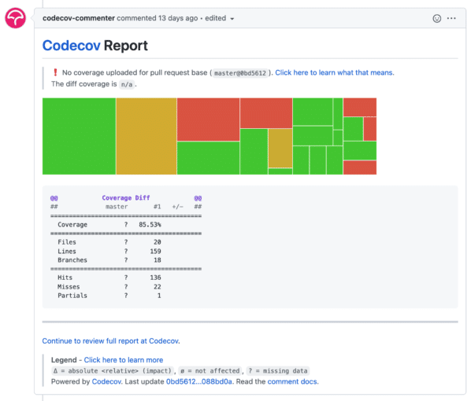
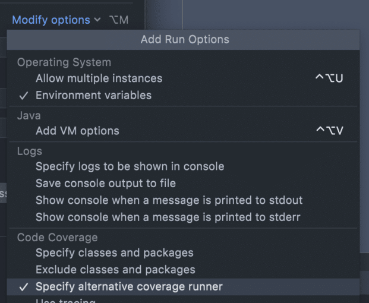
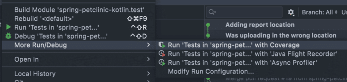

*TL;DR: Kover is a code coverage tool for Kotlin. It's still in incubator phase but I took it for a spin and it is already very useful as part of local or CI workflows! In this article I go through the setup and some of my favourite goodies of the tool. [You can see my experiment over here.](https://github.com/jlengrand/spring-petclinic-kotlin/pull/1)*

At the end of last year, the [version 1.6.0 of Kotlin was officially released](https://blog.jetbrains.com/kotlin/2021/11/kotlin-1-6-0-is-released/)! The release was packed with new language features, but also some very nice tooling and ecosystem goodies.

Today, we're looking into one of them : [**Kover**](https://github.com/Kotlin/kotlinx-kover). **Kover is a Gradle plugin for native Kotlin code coverage**. It is still in incubator phase, but we'll see here that it already has quite some value for your Kotlin projects!

If you're a JVM developer, you're probably used to those HTML/XML report files so you usually feed into a system like [SonarQube](https://www.sonarqube.org/) or CodeCov to track metrics over time. Well Kover is fully compatible with the [JaCoCo](https://www.jacoco.org/jacoco/) format so you can keep making full use of those, and even couple them in case you have multiple projects in different JVM languages.

Let's give Kover a spin and see what we can do with it! For this experiment, I'll be using the Kotlin flavor of the very famous [Spring Pet Clinic](https://github.com/jlengrand/spring-petclinic-kotlin/actions).

Installing the plugin {#h2-0-installing-the-plugin}
---------------------------------------------------

The setup to add the plugin to you project can hardly be simpler if you use gradle. You have to add the Kover plugin to your `build.gradle(.kts)` file.

<pre class="EnlighterJSRAW" data-enlighter-language="kotlin">plugins {
    ...
    id("org.jetbrains.kotlinx.kover") version "0.4.2"
    ...
}</pre>

Once that is done, you will have access to several new gradle tasks, which you can find in the verification section

<pre class="EnlighterJSRAW" data-enlighter-language="generic">$ ./gradlew tasks

Verification tasks
------------------
koverCollectReports - Collects reports from all submodules in one directory.
koverHtmlReport - Generates code coverage HTML report for all module's test tasks.
koverReport - Generates code coverage HTML and XML reports for all module's test tasks.
koverVerify - Verifies code coverage metrics based on specified rules.
koverXmlReport - Generates code coverage XML report for all module's test tasks.</pre>

Running `./gradlew koverReport` will generate coverage files in XML and HTML format, in the same way you'd be doing it using JaCoCo. After running the task, you'll find your new reports in `build/reports/kover`. Opening up `html/index.html` will give you information in a human readable format.

This is how the report look like when running the task on the spring pet clinic project :

About the Kover gradle tasks {#h2-1-about-the-kover-gradle-tasks}
-----------------------------------------------------------------

As we can see by using the `taskinfo` gradle [plugin](https://plugins.gradle.org/plugin/org.barfuin.gradle.taskinfo) (which is used to see the relations between gradle tasks), there is no need to specifically run the kover tasks because they are transitively called by other tasks already.

I am cutting this here for brevity but when running the taskinfo plugin for the build task we can see that it runs `check` which himself runs `koverReport` and `koverVerify` (we'll talk about this one in a second).

<pre class="EnlighterJSRAW" data-enlighter-language="generic">$ ./gradlew tiTree build

&gt; Task :tiTree
:build                                                          
`--- :check                                                      
     +--- :koverReport                                           
     +--- :koverVerify                                           
     `--- :test                                                  

BUILD SUCCESSFUL in 826ms
1 actionable task: 1 executed</pre>

Relations between gradle tasks, and kover tasks being run automatically when building the project  

Of course, this is something we may not want, for example to avoid slowing down the build for large projects (or as we'll see later to avoid the build form failing). We can skip those targets when build like this :

<pre class="EnlighterJSRAW" data-enlighter-language="generic">./gradlew build -x koverVerify -x koverReport # skipping koverReport and koverVerify when building the project</pre>

A look at KoverVerify {#h2-2-a-look-at-koververify}
---------------------------------------------------

One of the nice goodies that I really like from Kover is the `koverVerify` task.

**`koverVerify` literally allows you to make the build fail (or pass) based on a set of predefined rules** . There [are a few to choose](https://github.com/Kotlin/kotlinx-kover#verification) from (total line count of line covered, percentage, ....)

A simple example could look like this :

<pre class="EnlighterJSRAW" data-enlighter-language="generic">tasks.koverVerify {
    rule {
        name = "Minimal line coverage rate in percents"
        bound {
            minValue = 98
        }
    }
}</pre>

This basically tells `koverVerify` to make the build fail in case the code coverage of the project goes under 98%. Whether or not setting hard values is a discussion for another day, but at least there is a simple way to go about it.

In case you rather want to look into trends ( this new pull requests lowers the code coverage), then you'll have to rely on external tools like [CodeCov](https://codecov.io/). That's what we'll look into now.

Uploading Coverage information {#h2-3-uploading-coverage-information}
---------------------------------------------------------------------

Having code coverage in your project is nice by itself, but seeing trends over time and using that information as part of your workflow is much more interesting.

In the project, I've used a combination of [GitHub Actions](https://github.com/features/actions) and [CodeCov](https://codecov.io/) to do this.

In my workflow, I have decided to use 2 different builds:

* One to check that code coverage fits certain rules that I want
* One to build, and upload coverage reports to see trends and evolution over time

Let's start with my rules :

<pre class="EnlighterJSRAW" data-enlighter-language="yaml">name: Checking coverage with Gradle

on:
  push:
    branches: [ master ]
  pull_request:
    branches: [ master ]

jobs:
  build:
    runs-on: ubuntu-latest
    steps:
    - uses: actions/checkout@v2
    - name: Set up JDK 11
      uses: actions/setup-java@v2
      with:
        java-version: '11'
        distribution: 'adopt'
        cache: gradle
    - name: Grant execute permission for gradlew
      run: chmod +x gradlew
    - name: Check coverage metrics
      run: ./gradlew koverVerify</pre>

Not much to say here. I am setting up a typical build for a gradle project, the other thing I am doing is run the `koverVerify` task at the end.

Now for the actual build action file:

<pre class="EnlighterJSRAW" data-enlighter-language="yaml">name: Java CI with Gradle

on:
  push:
    branches: [ master ]
  pull_request:
    branches: [ master ]

jobs:
  build:
    runs-on: ubuntu-latest
    steps:
    - uses: actions/checkout@v2
    - name: Set up JDK 11
      uses: actions/setup-java@v2
      with:
        java-version: '11'
        distribution: 'adopt'
        cache: gradle
    - name: Grant execute permission for gradlew
      run: chmod +x gradlew
    - name: Build with Gradle
      run: ./gradlew build -x koverVerify  # skipping koverVerify to not fail if the coverage has lowered
    - name: Upload coverage reports
      uses: codecov/codecov-action@v2
      with:
        files: build/reports/kover/report.xml</pre>

Again, not very much happening here. A couple of noticeable things though :

* I do skip `koverVerify` in that build. The main reason is that if the check fails, it is more difficult to see if I have tests failing for example, or simply to upload my coverage reports online to see where my main issues are.
* At the end of the build, I upload the latest version of the report on CodeCov. For public projects, no need to setup API Keys.

When [opening a Pull Request on GitHub](https://github.com/jlengrand/spring-petclinic-kotlin/pull/1), this allows for the following overview :  

Build and KoverVerify checks in a Github Pull request, failing here{#caption-attachment-52438}

But because I am running 2 different action files, I also get extra (clickable) information from CodeCov directly as to where I should be doing better:  

CodeCov report in my Pull Request with diff coverage{#caption-attachment-52439}

### About the IntelliJ "Run with code coverage" {#h3-4-about-the-intellij-run-with-code-coverage}

In case you want to have code coverage information straight from IntelliJ, this is already possible without Kover.

In your run configuration, you can select "More Options" and decide to use the IntelliJ or JaCoCo agents there:  

Specify alternative coverage runner in IntelliJ{#caption-attachment-52437}

Then, you can tell IntelliJ to run your tests with coverage like this

The IntelliJ website has a whole page dedicated to code coverage so I'm not going to cover (pun intended) it here. you can read more about it [here](https://www.jetbrains.com/help/idea/running-test-with-coverage.html).

The good thing to know though is that when running code coverage straight from IntelliJ, well by definition it isn't part of the build and it runs only on your system. But there (to my knowledge) also isn't an easy way to set a set of rules for success/failure.

Why not run JaCoCo? {#h2-5-why-not-run-jacoco}
----------------------------------------------

Some folks might wonder why Kover is actually needed. After all, Kotlin runs on the JVM and you could run straight JaCoCo on your Kotlin projects before. Well, JetBrains has a video that explains it better than I can [in this video](https://youtu.be/jNu5LY9HIbw?t=215), but in short the support for Kotlin specific feature is subpar when running the tool on bytecode.

Anyone that has tried to run static code analysis on bytecode knows what I'm talking about I think :).

Final words {#h2-6-final-words}
-------------------------------

In short I'm super happy that this 1.6 release doesn't only focus on the ecosystem but also the tooling. Having a dedicated code coverage tool makes a lot of sense for Kotlin and I'm sure it will fill a gap in a lot of teams.

The current plugin is rather simple but contains all of the options that I would be searching for in my projects ([have a look at the doc](https://github.com/Kotlin/kotlinx-kover), I didn't cover them all). And even though the project is still in early phase, I haven't seen any scary looking [issues](https://github.com/Kotlin/kotlinx-kover/issues) pop up so far, so it seems to have a great future!

So welcome Kover, looking forward to using you more!

[You can find the source of the project I used on GitHub](https://github.com/jlengrand/spring-petclinic-kotlin/pull/1), [with a (failing) open Pull Request for show](https://github.com/jlengrand/spring-petclinic-kotlin/pull/1)

Till next time!
