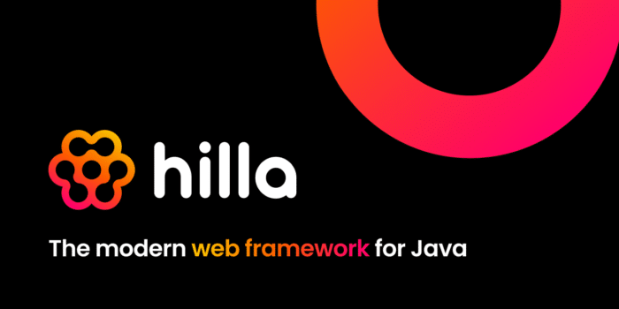

[Hilla](https://hilla.dev/) is a new framework for building reactive web apps on Java backends. It seamlessly integrates a reactive [Lit](https://lit.dev) TypeScript frontend with a [Spring Boot](https://spring.io/projects/spring-boot) backend. Hilla is built and supported by [Vaadin](https://vaadin.com).

Hilla is designed to be simple enough for small utilities, but robust enough to build complex, enterprise-grade apps.

Automatic Java to TypeScript Code Generation {#h2-0-automatic-java-to-typescript-code-generation}
-------------------------------------------------------------------------------------------------

Automatic TypeScript code generation helps ensure that the frontend always stays in sync with the backend, so you can build apps faster and with greater confidence, even when your team grows bigger. The strong type-safety also means you can explore server endpoint methods and their input and return types right from your IDE as you type.

**Server endpoint:**

<pre class="EnlighterJSRAW" data-enlighter-language="java">@Endpoint
@AnonymousAllowed
public class PersonEndpoint {
    private PersonRepository repository;

    public PersonEndpoint(PersonRepository repository) {
        this.repository = repository;
    }

    public @Nonnull List&lt;@Nonnull Person&gt; findAll() {
        return repository.findAll();
    }
}</pre>

**TypeScript View:**

<pre class="EnlighterJSRAW" data-enlighter-language="java">import { PersonEndpoint } from 'Frontend/generated/endpoints';
import Person from 'Frontend/generated/com/example/application/Person';

export class PersonView extends View {
  @state() people: Person[] = [];

  async firstUpdated() {
    this.people = await PersonEndpoint.findAll();
  }

  render() {
    return html`
      &lt;vaadin-grid .items=${this.people}&gt;
        &lt;vaadin-grid-column path="firstName"&gt;&lt;/vaadin-grid-column&gt;
        &lt;vaadin-grid-column path="lastName"&gt;&lt;/vaadin-grid-column&gt;
      &lt;/vaadin-grid&gt;`;
  }
}</pre>

Getting started {#h2-1-getting-started}
---------------------------------------

You can learn more about Hilla and get started on <https://hilla.dev/>.

Full Release Notes {#h2-2-full-release-notes}
---------------------------------------------

### Features {#h3-3-features}

* Zero-configuration toolchain for building web applications with Lit TypeScript UI and Java Spring Boot server side
* Easy and type-safe back end access using TypeScript endpoints and data definitions generated from Java code
* Form binding with shared data validation on server and client
* Includes Vaadin web components for building the UI

### Versions {#h3-4-versions}

**Included dependencies:**

* Vaadin Fusion Endpoint (23.0.0)
* Vaadin Dev Server (23.0.0)

**Official add-ons and plugins:**

* Hilla Maven Plugin (1.0.0)
* Hilla Spring Boot Starter (1.0.0)
* Vaadin Design System / Web Components (23.0.0)

### Supported languages and tools {#h3-5-supported-languages-and-tools}

* Java 11
* TypeScript 4.5
* Node.js 16
* npm 8.3
