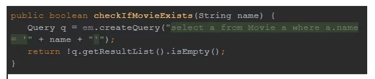
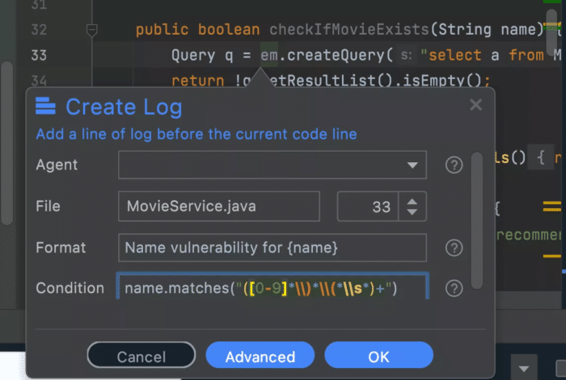
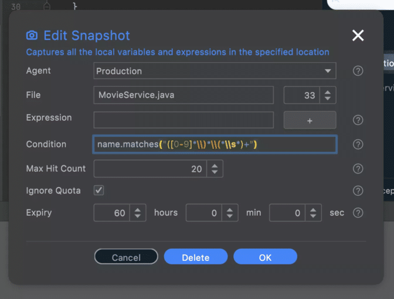

**Important:** You can use [Lightrun for free](https://lightrun.com/free) on your servers.

I'm not a security expert. I'd like to think of myself as a security conscious developer, but this is a vast subject with depth and breadth. What I understand is [Lightrun and Debugging](https://lightrun.com/debugging/remote-debugging/). In that capacity, I can show some creative ways you can use it as a security tool. A "proper" security expert could take this to the next level.

What is Lightrun? {#h2-0-what-is-lightrun}
------------------------------------------

Lightrun is a developer oriented observability tool. Like a debugger in your [production environment](https://lightrun.com/debugging/debugging-microservices-in-production-an-overview/) without the security risks. Lightrun is a tool that's flexible enough to fit into multiple molds, just like the debuggers that birthed it.

With Lightrun, you can inject logs without code changes. Add snapshots (breakpoints that don't stop the code execution) and use metrics to get observable insight at the code level.

Security Tool Use Cases {#h2-1-security-tool-use-cases}
-------------------------------------------------------

There are several reasons I would reach for Lightrun as a security tool. Here I'll focus

* Verify that a security vulnerability exists
* Check if someone actively exploited a security vulnerability
* Verify that we deployed a fix correctly

There's a lot more that needs to be done in order to secure your application. Lightrun is a generic tool, it isn't a replacement for existing security tools like Snyk, etc. It's complimentary, filling in the gaps at the code level.

Finally, I will discuss how Lightrun secures itself. We can't have a vulnerable security tool... We can't consider Lightrun as a security tool if it isn't inherently secure...

Enough with the high level theory. Let's show the code!

Verify a Security Vulnerability {#h2-2-verify-a-security-vulnerability}
-----------------------------------------------------------------------

Security tools are like [observability tools](https://lightrun.com/java/full-cycle-observability-with-the-elastic-stack-and-lightrun/). They provide high-level alerts of potential risks. But they rarely communicate at the code level. As a result, a developer might have a hard time with actionable security tasks and validation. If the security issue reproduces locally, that's great. You can often fill in the gap with a debugger.

But some security issues are tough to reproduce outside of a production environment.

Lightrun won't find a vulnerability out of thin air, for that you need a dedicated security tool. However, if you have a suspicion, Lightrun can help in the investigation and prove the vulnerability.

E.g. let's take this obvious bug:

This is an obvious SQL injection bug. But is it exploitable?

Do we need to be hysterical, or can we take our time adapting the code?

BTW, notice I'm using [Java](https://lightrun.com/debugging/top-10-java-linters/) because that's the platform I'm most comfortable with. This applies to all Lightrun supported platforms/languages equally. So everything here easily applies to [NodeJS](https://lightrun.com/dev-tools/nodejs-security-observability-lightrun-snyk/), JavaScript/TypeScript, [Python](https://lightrun.com/debugging/lightrun-python/), [Kotlin](https://lightrun.com/java/kotlin-vs-java-10-years-in/), Scala, etc.

This is trivial to test in Lightrun. We can just add a log or a snapshot that will be triggered when an invalid request happens. Then we can try sending invalid values via a curl command to see if our log is triggered.

 

Notice that we use a regular expression to validate the name value. If we receive a log, it means the problematic value is exploitable. This also means the risk of the security vulnerability is high.

Is it Actively Exploited? {#h2-3-is-it-actively-exploited}
----------------------------------------------------------

So we found a security vulnerability like the one above. Should we panic? Are there hackers already in the system?

What do we do?

Well, we can do something similar to what we did above and add a snapshot with a similar condition and a few "tune ups":

 

This image contains a lot, so let's try to unpack it.

### Why Snapshot and not Log? {#h3-4-why-snapshot-and-not-log}

Logs are great to see if something happened. They're quick and they handle high volume well. But if someone is actively breaking into our system, we want to get all the information that's available. Possibly even things we haven't thought about. We want to know the vector of attack, which means knowing the call stack etc. Snapshots are an ideal security tool.

### Targeting a Tag {#h3-5-targeting-a-tag}

Notice that the "Agent" entry points at "Production". We can apply the snapshot to a group of machines based on tagging. So in this case, we can target all potentially vulnerable machines with one swoop.

### Max Hit Count {#h3-6-max-hit-count}

Unlike a log, snapshots fill up the UI and storage. So we have a default limit of snapshots we can take before expiring the snapshot. This defaults to one normally. Here I raised it to 20 but we can probably go even higher if we're willing.

Notice that if we see this happen and exploits are happening, we might want to switch to logs since they don't have a hit count.

### Ignore Quota {#h3-7-ignore-quota}

This option might not be available to you since it requires special permissions. If you're in this situation, ask your manager for this permission.

This is a risky feature, which is why it's guarded. But with an exploitable hack, it might be a risk worth taking.

The quota limits the amount of CPU a condition, or expression can take per Lightrun action. The risk here is that an exploit might happen and some information would be "dropped" because of CPU usage. This will mean the snapshot won't be paused at any point and we won't "miss" a potential exploit.

This might affect your server performance though, so it isn't without risk.

### Expiry {#h3-8-expiry}

Lightrun actions default for one hour of expiry. We want to keep your servers fast and nimble so we expire actions that aren't needed. In this case, we want the action there until we get the fix out. So I set the expiry value to 60 hours.

With these in place, we will get actionable information on any exploit coming our way.

### Verify the Fix {#h3-9-verify-the-fix}

Verifying the fix is pretty similar. We can place a log or a snapshot in the problematic area of the code and see if that code is reached with problematic values.

You can also add additional logging to verify that attempted exploits reach the area they're expected to reach and are handled as you would expect.

Lightrun Security {#h2-10-lightrun-security}
--------------------------------------------

A security tool that's vulnerable defeats its purpose. So understanding the security measures in Lightrun is an important part of this post. Following are the high level features in Lightrun that make it so secure.

### Architecture {#h3-11-architecture}

Lightrun made several architectural decisions that significantly reduced attack vectors.

Agents only connect to the Lightrun server to fetch actions. Not the other way around. That means they are hidden completely from end users and even from the organization.

If the Lightrun server fails, an agent just does nothing. This means that even a DDoS attack that would bring down Lightrun won't affect your servers. You won't be able to use Lightrun, but the servers will work just fine.

### Certificate pinning \& OIDC {#h3-12-certificate-pinning-oidc}

Agents and clients of the Lightrun server use certificate pinning to prevent elaborate man in the middle attacks.

Lightrun uses [OpenID Connect (OIDC)](https://openid.net/connect/) for secure proven authorization across its tools.

The Lightrun server limits user privileges based on assigned roles. Most importantly, every operation is written to an administration log. This means that a "bad actor" can't be abusive without leaving a footprint.

### Sandbox {#h3-13-sandbox}

All operations within an agent are sandboxed and have limited access. All actions are "read only" and can't use too much CPU as we saw in the article above.

There are exceptions to these rules, but they need higher privileges to circumvent.

### Block List {#h3-14-block-list}

A malicious developer in the organization can use a snapshot or a log to get information from a running application. E.g. a snapshot can be placed in the authorization logic to steal user data before encoding.

A block list can define files that are blocked inside Lightrun agents. These files won't let a developer place an action within them.

### PII Reduction {#h3-15-pii-reduction}

Personal Identifiable Information, such as credit card numbers, can be logged intentionally or unintentionally. PII reduction lets us define patterns that are risky and those will be implicitly erased from the logs. As a result, you won't need to purge such logs and won't expose yourself to potential regulatory liability.

TL;DR {#h2-16-tl-dr}
--------------------

We did not design Lightrun as a security tool. It shouldn't replace existing security tools. But it's [a perfect sidekick](https://lightrun.com/dev-tools/nodejs-security-observability-lightrun-snyk/) to the tools you already have. It plays to their strengths and pushes the envelope of fast response to vulnerabilities/hacks.

Lightrun's low level deep code observability lets us respond to potential threats faster and mitigate vulnerabilities sooner.

I'm not a security expert. I'm sure that if you are, you can come up with even more amazing security related use cases for Lightrun. This is very exciting, I can't wait to hear about them!
