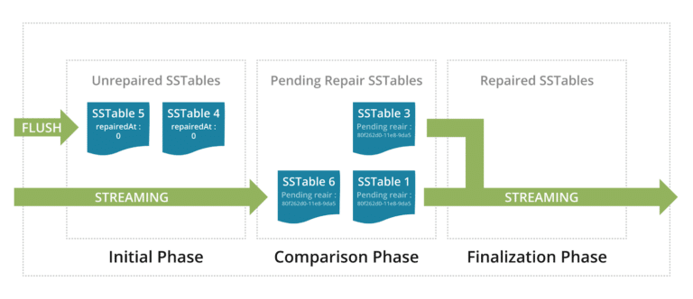
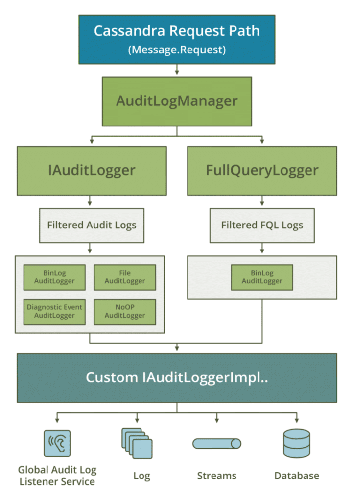
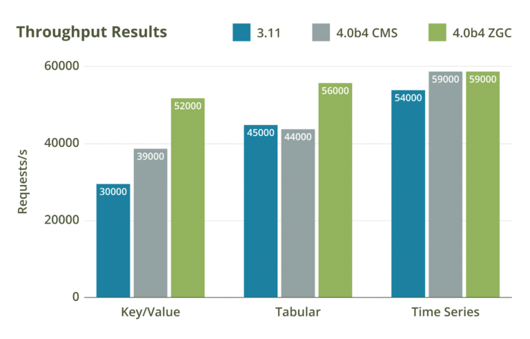

 © Shutterstock / Phototribe   

Alongside stability, Apache Cassandra 4.0 stands out for its ability to scale operations faster, its new auditing capabilities, and the way it embraces privacy by design. In this article, we'll cover the new features and walk you through the steps required to upgrade to Cassandra 4.0.

The general availability of Apache Cassandra 4.0 marks the most stable release in the project's history.

Even with the 4.0 beta 1 release back in July 2020, Project Management Committee (PMC) members were confident the latest version of the distributed NoSQL database would be ready to go to work with Apache Cassandra Committer; PMC member Sankalp Kohli at the time indicated that "users will be able to use the release knowing it is production-ready on day one."

Alongside stability, this version of Cassandra stands out for its ability to scale operations faster, its new auditing capabilities, and the way it embraces privacy by design.

For the beta alone, the Cassandra community had plowed through over 1,000 bug fixes, and have now smashed through the remaining tickets to GA. To avoid breaking changes to the GA build, all new features were frozen at the beginning of September 2019. This enabled the community to shift its focus to testing, validation, and hardening to ensure a release that every Cassandra deployment, regardless of its deployment size, can deploy with confidence.

In this article, we'll cover the new features and walk you through the steps required to upgrade to Cassandra 4.0. But it's important to mention that the community's attention to quality means that Cassandra 4.0 redefines what users should expect from any open- or closed-source database. This has led to replay, fuzz, property-based, fault-injection, and performance tests on clusters as large as 1,000 nodes, with hundreds of real-world use-cases and schemas tested.

We've also experienced unprecedented cross-industry collaboration with software, hardware and QA testing donations from the likes of Amazon, DataStax, iland, and Instaclustr. Everyone in the Cassandra community has been pushing hard to deliver a release that is battle-tested with enterprise security features and with an understanding of what it takes to deliver scale in the cloud.

## New for 4.0

<figure class="wp-block-embed is-type-rich is-provider-embed-handler wp-block-embed-embed-handler wp-embed-aspect-16-9 wp-has-aspect-ratio">
 

  
PRESERVEDHTMLBLOCKZZ0ZZEND

 

</figure>

### **Five times faster scaling operations**

Zero Copy Streaming is used in scaling operations. This is where Cassandra nodes in a cluster stream data between each other in the form of SSTables, for example, when a new node is added or when a datacenter hits its peak traffic time during the day. This is five times faster now without virtual nodes (vnodes) when compared to previous versions and makes it a comfortable fit for Kubernetes and cloud environments, where a more elastic architecture is used.

### **Incremental repair improvements**

Many of the fundamentals of the algorithm for incremental anti-entropy repair were rewritten in 4.0. This is a background process where Cassandra keeps data replicas in sync. As well as being hardened, repair has been optimized, for example, a full repair doesn't require a costly anti-compaction during the preparation phase anymore. These changes have meant that maintaining consistency across data replicas is less resource-intensive and makes incremental repair faster.

### Visibility through virtual tables

For years, the primary way to observe Cassandra clusters and ensure your deployments were healthy has been through JMX and open source tools, such as Instaclustr's Cassandra Exporter and DataStax's Metrics Collector. Virtual Tables enables you to selectively expose system metrics or configuration settings and does so through the Cassandra Query Language(CQL) interface instead of JMX.

### Greater security and observability

Understanding who is accessing data (and when) is critical to making sure companies comply with regulatory and security requirements, such as GDPR, PCI, and SOX. This is where the new audit logging features come in. Operators can now track DML, DDL, and DCL activity with a minimal performance hit. There is also a new FQL tool that enables the capture and replay of live traffic data from production workloads for analysis.

Thanks to the work of Blake Eggleston, Cassandra 4.0 also has new controls that enable enterprises to create authorization for data access on a per data center basis. This lets an operator restrict the access of a Cassandra role to specific data centers, for example, where you might have data centers in both Europe and the US.

### Java 11 support

This an exciting feature that enables 4.0 to take advantage of the new garbage collection algorithm, [ZGC](https://jaxenter.com/apache-cassandra-java-174575.html). This will help teams with optimization processes, as it reduces garbage collection pause times when working on large heap sizes. This will reduce collection to a few milliseconds with no latency degradation as heap sizes increase. (Note: ZGC is considered experimental at time of writing).

### Better compression

Compression is configured on a per-table basis and Cassandra 4.0 supports Zstandard (Zstd), a data compression algorithm. With 4.0's significantly improved compression, it not only reduces the amount of data written to disk, but often improves read and write throughput. This is because the CPU overhead of compressing data is faster than the time it would take to read or write the same uncompressed data from disk.

## Growth of the Cassandra ecosystem

The third-party ecosystem around Cassandra continues to thrive and many utilities have already added support for 4.0. These include client drivers, Spring Boot and Spring Data, the DataStax Kafka Connector and Bulk Loader, and Quarkus.

Recently, we've seen the open-sourcing of [Harry](https://github.com/apache/cassandra-harry), a fuzz-testing tool for Cassandra. This aims to generate reproducible workloads that are as close to real-life as possible, while efficiently verifying the cluster state against the model without pausing the workload itself.

Multiple members of the community have been hard at work to make Cassandra easier to run in Kubernetes. A common Cassandra operator has been consolidated and is used by several organizations. The GitHub repository is vibrant with many contributions as we all learn how to run data in Kubernetes. This will be a huge focus for the project in the coming years.

DataStax has also open-sourced [K8ssandra](https://k8ssandra.io/), an open-source distribution for Cassandra on Kubernetes, providing DBAs and SREs a fast and easy cloud-native data plane. The themes are clear. Working together to make Cassandra the default database for cloud-native workloads.

## Ready to upgrade?

If you're a current Cassandra user, upgrading can be fairly simple and requires no downtime. There are a few steps to follow to make sure you have the least amount of surprises.

### 1. Verify your software versions

If you are running any 3.x version of Cassandra, you can directly upgrade in place. If you are running earlier versions, it is recommended you first upgrade to 3.11 then to 4.0. Each node should be running on the latest Java 8 release. Make sure to check your driver versions and ensure that they can connect to Cassandra 4.0.

### 2. Perform a cluster-wide snapshot

Snapshots are a point-in-time backup for your datafiles. In case there is an issue and you need to roll back, you will have a consistent view of your data. The snapshot process can be run in a variety of ways. You can follow [this guide](https://docs.datastax.com/en/cassandra-oss/3.0/cassandra/operations/opsBackupTakesSnapshot.html) if you are new to running snapshots.

### 3. Upgrade the first node and verify

Also known as a canary upgrade, you can start with one node to verify that there will be no issues and that your upgrade procedure is well understood. If you are using a package manager or containers, simply run the update process with the data files in place. Start the node when finished and verify that it's in a healthy state via the logs. Once the node is online, verify that you are now running 4.0 with a '*nodetool version*' command.

### 4. Continue to each node in your cluster

Once the first node has successfully been upgraded, you may now proceed to the rest of your cluster. Repeat the same process on each node, verifying that each is running before proceeding. It is highly recommended to have a configuration management tool in place to automate upgrades.

Congratulations! You are now running Apache Cassandra 4.0. Many in the Cassandra community have already been running beta versions of 4.0 in production for over a year. We anticipate very few bugs in this initial release but if you find something you suspect as a bug, please let us know in either the [Apache Casandra mailing list or Slack](https://cassandra.apache.org/community/#how-to-contribute).

This GA would not be possible without the sterling support and work of the community not only in the commits, which were outstanding, but by users testing and trying 4.0 out in QA environments. The feedback and the quality of the code that has been committed to this project has helped us to create the most battle-tested and stable major release to date—and we can't wait for you to try it!
