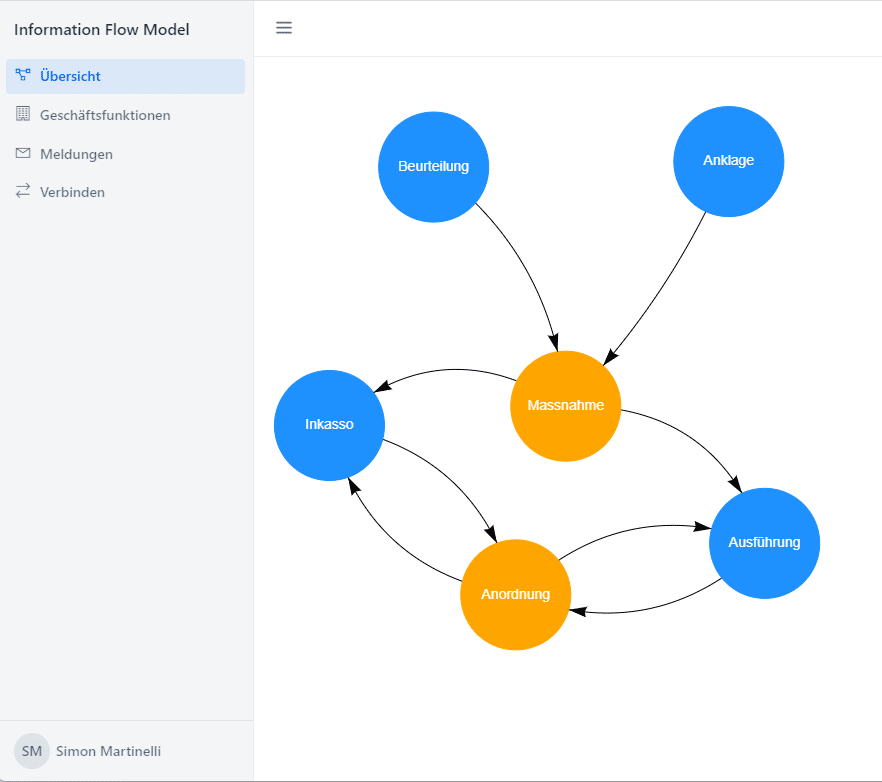

## The Project

Analyzing and visualizing the message flow between business functions was the goal of my current project. At first we considered using a UML tool for this job, but we came to the conclusion that it might not be as flexible as we need it to be. Finally I've got the assigment to create a custom web application.

Since business functions and messages are related to each other, it made sense to represent them as a graph. That's why I chose [Neo4j](https://neo4j.com/) as the database. Now the question was how to manage and visualize the graph. As I'm expierenced with the [Vaadin](https://foojay.io/today/vaadin-and-jooq-match-made-in-heaven/) framework I want to use it also in this project.

Vaadin has a lot of great UI components but in my case there was no match. Finally I've found [vis.js](https://visjs.org/). The network diagram seemed appropriate for the visualization. Luckely Vaadin provides the [Vaadin Directory](https://vaadin.com/directory), a place to publish 3rd party components. From the Vaadin directory a component called [vis-network-vaadin](https://vaadin.com/directory/component/vis-network-vaadin) is available that provides a Java API on top of vis.js

## The Graph

The graph below is a simplyfied model of what my client wants to manged in the application. A business function can send many messages and a message can be received by many business functions.


## The Implementation

First I created a Vaadin project on [start.vaadin.com](https://start.vaadin.com/) and added the the vis-network-vaadin for the visualization. As Vaadin uses Spring Boot by default I could just add spring-boot-starter-data-neo4j for the data access.

### Data Access

[Spring Data Neo4j](https://spring.io/projects/spring-data-neo4j) provides easy access to Neo4j. As I already know Spring Data JPA and the programming model is very similar it was easy to get started. First I've mapped the nodes and defined the relationships using the Neo4j annotations.

```java
@Node
public class BusinessFunction {

    @Id
    @GeneratedValue
    private Long id;

    private String nameDE;
    private String actorsDE;
    private String descriptionDE;
}
```

```java
@Node
public class Message {

    @Id
    @GeneratedValue
    private Long id;

    private String nameDE;
    private String descriptionDE;

    @Relationship(type = "SENDS", direction = Relationship.Direction.INCOMING)
    private Set<BusinessFunction> senders = new HashSet<>();

    @Relationship(type = "RECEIVES")
    private Set<BusinessFunction> receivers = new HashSet<>();
}
```

To read and write the data you can use repositories and make use of interface methods that will be used to generate the queries for you. Remark: I didn't care about the performance so the generated queries were good enough in the first phase.

```java
public interface BusinessFunctionRepository extends Neo4jRepository<BusinessFunction, Long> {

    Optional<BusinessFunction> findByNameDE(String name);

    List<BusinessFunction> findAllByNameDELike(String name, Pageable pageable);
}
```

```java
public interface MessageRepository extends Neo4jRepository<Message, Long> {

    Optional<Message> findByNameDE(String name);

    List<Message> findAllByNameDELike(String name, Pageable pageable);
}
```

## Diagram

Finally I had to visualize the graph with a network diagram. Using the vis-network-vaadin API made it quite simple. I just had to map BusinessFunction and Message to nodes and create edges from the realtionships.

```java
var networkDiagram = new NetworkDiagram(Options.builder().build());
networkDiagram.setSizeFull();

var businessFunctionNodes = businessFunctionRepository.findAll().stream()
        .map(businessFunction -> createNode("b-", businessFunction.getId(), businessFunction.getNameDE(), "DodgerBlue"))
        .toList();
var nodes = new ArrayList<>(businessFunctionNodes);

var messages = messageRepository.findAll();
var messageNodes = messages.stream()
        .map(message -> createNode("m-", message.getId(), message.getNameDE(), "Orange"))
        .toList();

nodes.addAll(messageNodes);

var dataProvider = new ListDataProvider<>(nodes);
networkDiagram.setNodesDataProvider(dataProvider);

var edges = new ArrayList<Edge>();
for (Message message : messages) {
    for (BusinessFunction sender : message.getSenders()) {
        edges.add(createEdge("b-", sender.getId(), "m-" + message.getId().toString(), getTranslation("sends")));
    }
    for (BusinessFunction receiver : message.getReceivers()) {
        edges.add(createEdge("m-", message.getId(), "b-" + receiver.getId(), getTranslation("receives")));
    }
}

networkDiagram.setEdges(edges);
```

These are the helper methods to create nodes and edges:

```java
private Edge createEdge(String prefix, Long id, String name, String label) {
    var edge = new Edge(prefix + id.toString(), name);
    edge.setColor("black");
    edge.setArrows(new Arrows(new ArrowHead(1, Arrows.Type.arrow)));
    edge.setLength(300);
    return edge;
}

private Node createNode(String prefix, Long id, String name, String color) {
    var node = new Node(prefix + id, name);
    node.setShape(Shape.circle);
    node.setColor(color);
    node.setFont(Font.builder().withColor("white").build());
    node.setWidthConstraint(new WidthConstraint(100, 100));
    return node;
}
```

Finally the graph is displayed in the application.



## Conclusion

The application is still in an early stage. The graph will be extended and the diagram must be improved. Especially the behavior when dragging around the edges seems to be quite tricky and vis.js provides a lot of configuration.

As a Java developer creating UIs with Vaadin makes it very efficent. There are even 3rd party libraries that wrap components in a Java API. On the other side I was impressed how easy it is to start with Neo4j and to integrate it in a Spring Boot application.

Btw. If you want to learn more about Spring Boot check my video below.


