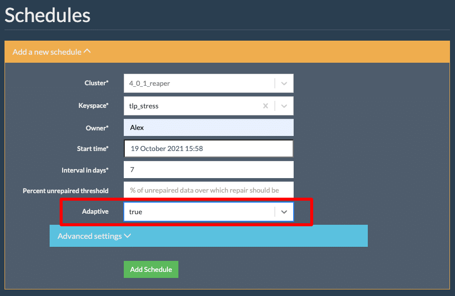
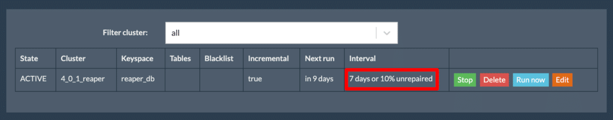
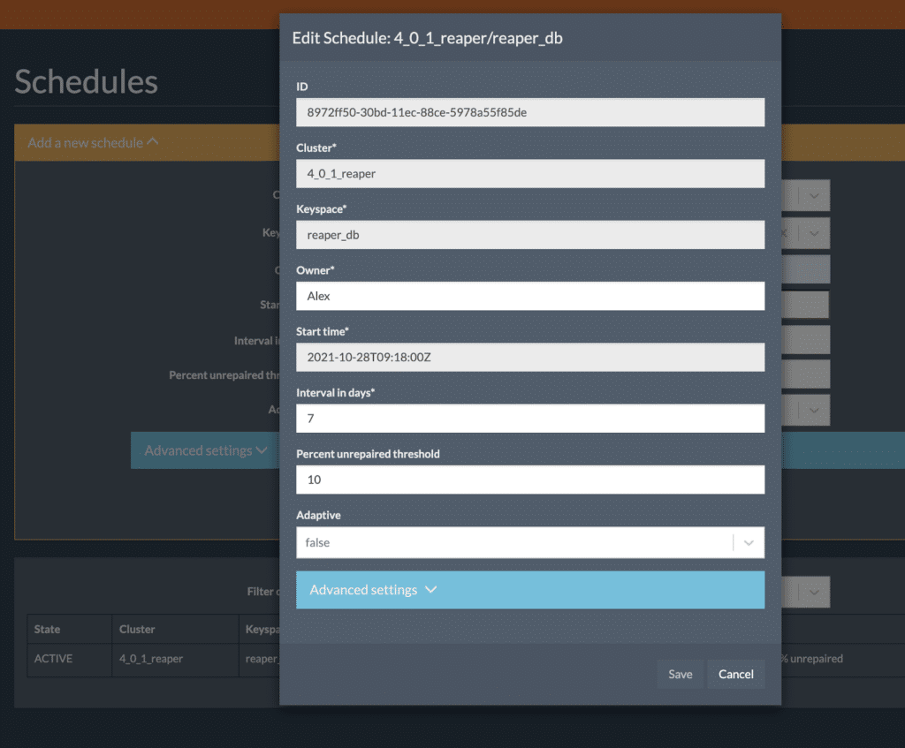
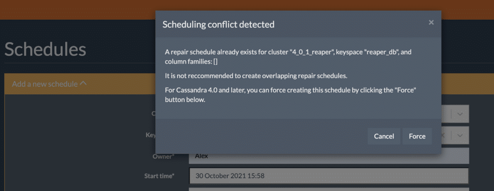

The [K8ssandra](https://k8ssandra.io/) team is pleased to announce the release of [Reaper 3.1](http://cassandra-reaper.io/). Let's dive into the features and improvements that 3.0 recently introduced (along with some notable removals) and how the newest update to 3.1 builds on that.

Starting with 3.1.0, Reaper can now compile and run with jdk11. Note that jdk8 is still supported at runtime.

Over the years, we regularly discussed dropping support for Postgres and H2 with the [The Last Pickle](https://thelastpickle.com/reaper.html) (TLP) team, now part of [DataStax](https://www.datastax.com/company), the organization leading the open-source development of Reaper. Despite our lack of expertise in Postgres, the effort required to maintain support for these storage backends was moderate as long as Reaper's architecture was simple. However, complexity grew with more deployment options, culminating with the addition of the sidecar mode.

Some features require different consensus strategies depending on the backend, which sometimes led to implementations that worked well with one backend and were buggy with others.

In order to allow building new features faster, while providing a consistent experience for all users, we decided to drop the Postgres and H2 backends in 3.0.

[Apache Cassandra](https://cassandra.apache.org/_/index.html) and the managed [DataStax Astra DB](https://astra.dev/3xWMrbx) are now the only production storage backends for Reaper. The free tier of Astra DB will be more than sufficient for most deployments.

Reaper does not generally require high availability -- even complete data loss has mild consequences. Where Astra is not an option, a single Cassandra server can be started on the instance that hosts Reaper, or an existing cluster can be used as a backend data store.

One of the pain points we observed when people start using Reaper is understanding the segment orchestration and knowing how the default timeout impacts the execution of repairs.

Repair is a complex choreography of operations in a distributed system. As such, and especially in the days when Reaper was created, the process could get blocked for several reasons and required a manual restart. The smart folks that designed Reaper at Spotify decided to put a timeout on segments to deal with such blockage, over which they would be terminated and rescheduled.

Problems arise when segments are too big (or have too much entropy) to process within the default 30 minutes timeout, despite not being blocked. They are repeatedly terminated and recreated, and the repair appears to make no progress.

Reaper did a poor job at dealing with this for mainly two reasons:

* Each retry will use the same timeout, possibly failing segments forever
* Nothing obvious was reported to explain what was failing and how to fix the situation

We fixed the former by using a longer timeout on subsequent retries, which is a simple trick to make repairs more "adaptive". If the segments are too big, they'll eventually pass after a few retries. It's a good first step to improve the experience, but it's not enough for scheduled repairs as they could end up with the same repeated failures for each run.

This is where we introduce adaptive schedules, which use feedback from past repair runs to adjust either the number of segments or the timeout for the next repair run.
 Figure 1: Example of how to use adaptive schedules in Reaper.

Adaptive schedules will be updated at the end of each repair if the run metrics justify it. The schedule can get a different number of segments or a higher segment timeout depending on the latest run.

The rules are the following:

* If more than 20% segments were extended, the number of segments will be raised by 20% on the schedule.
* If less than 20% segments were extended (and at least one), the timeout will be set to twice the current timeout.
* If no segment was extended and the maximum duration of segments is below 5 minutes, the number of segments will be reduced by 10% with a minimum of 16 segments per node.

This feature is disabled by default and is configurable on a per schedule basis. The timeout can now be set differently for each schedule, from the UI or the REST API, instead of having to change the Reaper config file and restart the process.

As we celebrate the long awaited [improvements in incremental repairs](https://thelastpickle.com/blog/2018/09/10/incremental-repair-improvements-in-cassandra-4.html) brought by Cassandra 4.0, it was time to embrace them with more appropriate triggers. One metric that incremental repair makes available is the percentage of repaired data per table. When running against too much unrepaired data, incremental repair can put a lot of pressure on a cluster due to the heavy anti-compaction process.

The best practice is to run it on a regular basis so that the amount of unrepaired data is kept low. Since your throughput may vary from one table/keyspace to the other, it can be challenging to set the right interval for your incremental repair schedules.

Reaper 3.0 introduced a new trigger for the incremental schedules, which is a threshold of unrepaired data. This allows creating schedules that will start a new run as soon as, for example, 10% of the data for at least one table from the keyspace is unrepaired.

Those triggers are complementary to the interval in days, which could still be necessary for low traffic keyspaces that need to be repaired to secure tombstones.
 Figure 2: Setting interval for incremental repairs.

These new features will allow you to securely optimize tombstone deletions by enabling the `only_purge_repaired_tombstones `compaction subproperty in Cassandra, permitting it to reduce `gc_grace_seconds` [down to three hours](https://thelastpickle.com/blog/2018/03/21/hinted-handoff-gc-grace-demystified.html) without the concern that deleted data will reappear.

That may sound like an obvious feature but previous versions of Reaper didn't allow for editing of an existing schedule. This led to an annoying procedure where you had to delete the schedule (which isn't made easy by Reaper either) and recreate it with the new settings.

Version 3.0 fixed that embarrassing situation and adds an edit button to schedules, which allows you to change the mutable settings of schedules:
 Figure 3: Reaper now has the ability to edit the settings for scheduled actions.

With the release of Reaper 3.1.0, we were able to fix more than 80 reported CVEs by upgrading several dependencies to more current versions:

* [Dropwizard](https://www.dropwizard.io/en/latest/) 2.0.25
* [Shiro](https://shiro.apache.org/) 1.8.0
* [SnakeYAML](https://github.com/asomov/snakeyaml-engine) 1.29
* [Netty](https://netty.io/) 4.1.70.Final
* [Cassandra Java Driver](https://github.com/datastax/java-driver) 3.11.0
* [Jersey](https://eclipse-ee4j.github.io/jersey/) 2.33
* [Prometheus Simple Client](https://prometheus.io/) 0.12.0

This allows Reaper to be more secure and future proof as it now enables us to migrate from the deprecated [dropwizard-cassandra](https://github.com/composable-systems/dropwizard-cassandra) bundle to the [officially supported one](https://github.com/dropwizard/dropwizard-cassandra), along with upgrading the Cassandra driver to the latest 4.x.

In order to protect clusters from running mixed incremental and full repairs in older versions of Cassandra, Reaper would disallow the creation of an incremental repair run/schedule if a full repair had been created on the same set of tables in the past (and vice versa).

Now that incremental repair is safe for production use, it is necessary to allow such mixed repair types. In case of conflict, Reaper 3.0 displays a pop-up informing you and allowing you to force create the schedule/run:
 Figure 4: Reaper now shows a pop-up to inform you of a conflict and allowing to force create the schedule/run.

We've also added a special "schema migration mode" for Reaper, which will exit after the schema was created/upgraded. We use this mode in K8ssandra to prevent schema conflicts and allow the schema creation to be executed in an init container that won't be subject to liveness probes that could trigger the premature termination of the Reaper pod:

`java -jar path/to/reaper.jar schema-migration path/to/cassandra-reaper.yaml`

There are many other improvements and we invite all users to check the changelog in the GitHub repo.

We encourage all Reaper users to upgrade to 3.1.0, while recommending users to carefully prepare their migration out of Postgres or H2. Note that there is no export/import feature and schedules will need to be recreated after the migration.

All instructions to download, install, configure, and use Reaper 3.1.0 are available on the [Reaper website](https://cassandra-reaper.io/docs/download/).

*Let us know what you think of Reaper 3.1 by joining us on the* [*K8ssandra Discord*](https://discord.com/invite/qP5tAt6Uwt)*or* [*K8ssandra Forum*](https://forum.k8ssandra.io/)*today. For exclusive posts on all things data, follow [DataStax on Medium](https://datastax.medium.com/).*

1. [Reaper](http://cassandra-reaper.io/)
2. [Reaper Documentation: Downloads and Installation](http://cassandra-reaper.io/docs/download/)
3. [Apache Cassandra](https://cassandra.apache.org/_/index.html)
4. [DataStax Astra DB](https://astra.dev/3xWMrbx)
5. [K8ssandra](https://k8ssandra.io/)
6. TLP Blog: [Incremental Repair Improvements in Cassandra 4](https://thelastpickle.com/blog/2018/09/10/incremental-repair-improvements-in-cassandra-4.html)
7. TLP Blog: [Hinted Handoff and GC Grace Demystified](https://thelastpickle.com/blog/2018/03/21/hinted-handoff-gc-grace-demystified.html)
