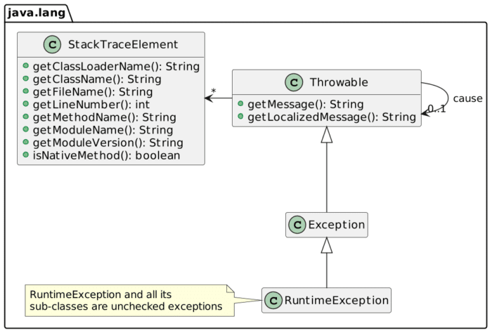
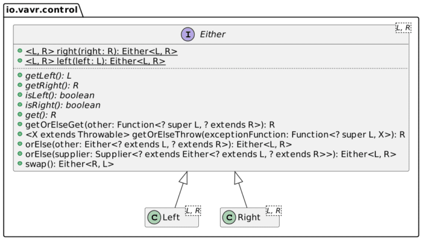

I've tried Go in the past, and the least I could say is that I was not enthusiastic about it. Chief among my griefs was how the language handled errors, or more precisely, what mechanism it provided developers with to manage them.

In this post, I'd like to describe how a couple of popular languages cope with errors.

## A time before our time

I could probably go back a long time, but I needed to choose a baseline at some point. In this post, the baseline is C.

If you search for "error handling C" on the Web, you'll likely stumble frequently upon the following:
> C does not provide direct support to error handling

Because of this lack of support, developers created coping mechanisms. One such approach is for the function to return a value representing the error. The value is numeric, and the documentation describes the issue.

If the function needs to return a value, you need alternatives.  

For example:

* Defining a pointer parameter that will be set if an error occurs. It will be `null` if the call is successful.
* Another approach is to use a dedicated structure, with a field dedicated to storing the error.

The final solution is to use a global error variable - `errno`.

Every alternative has pros and cons. However, since there's no baked-in way, the biggest issue is the lack of consistency.

## Exceptions

I don't know which language first implemented exceptions, but I'm pretty sure Java was the one to popularize them. Exceptions solve a common problem: simple error checking code intertwines the nominal path and the error-handling path:

```c
int foo;
int bar;
int slice;
foo = get_foo();
if (foo < 0)
    {
        return foo;
    }
bar = slice_the_bar(foo);
if (bar < 0)
    {
        return bar;
    }
slice = check_bar_slice(bar);
if (slice < 0)
    {
        return slice;
    }
```

The benefit of exceptions is to separate them cleanly in different blocks to ease reading:

```java
try {
    int foo = getFoo();             // 1   // 4
    int bar = sliceTheBar(foo);     // 2   // 4
    checkBarSlice(bar);             // 3   // 4
} catch (FooException e) {
    // Do something with e          // 1
} catch (BarException e) {
    // Do something with e          // 2
} catch (SliceException e) {
    // Do something with e          // 3
} finally {
    // Will be executed in all cases
}
```

1. If the call throws a `FooException`, short-circuit and directly execute the relevant `catch` block
2. Same for `BarException`
3. Same for `SliceException`
4. Nominal path

Java exceptions are baked in its type system.



Java provides two types of exceptions: *checked* and *unchecked*. Checked exceptions need:

* Either to be handled locally, in a `try`/`catch` block as above
* Or to be propagated "upwards", by defining the exception in the method signature, *e.g.* :

```java
Foo getFoo() throws FooException {
    // return a Foo or throw a new FooException
}
```

The compiler enforces this requirement. Unchecked exceptions don't need to follow this rule but can.

Some languages designed later did implement exceptions too: Scala and Kotlin, since they share Java's JVM roots, but also Python and Ruby.

## The Try container

While exceptions were an improvement over plain return values, they were not exempt from criticism. The bulk of it was aimed at checked exceptions since the mechanism they're based on clutter the code. Moreover, some view *all* exceptions as a `GOTO` because of its short-circuiting nature.

As recent years saw the rise of *Functional Programming* , developers provided libraries to introduce it into mainstream languages. Exceptions are anathema to practitioners since they open the way for partially-defined functions. A partially-defined function is a function that is only valid for a specific range of parameter values. For example, `divide()` is valid for all parameters but 0. In FP, one should return the result of a call, whether it's a success or a failure.

In Java, the [Vavr](https://docs.vavr.io/) library bridged the gap between exceptions and FP with the [Try](https://docs.vavr.io/#_try) type. We can rewrite the above snippet with Vavr as:

```java
Try.of(() -> getFoo())                      // 1
   .mapTry(foo -> sliceTheBar(foo))         // 1
   .andThenTry(bar -> checkBarSlice(bar))   // 1
   .recover(FooException.class, e -> 1)     // 2
   .recover(BarException.class, e -> 2)     // 2
   .recover(SliceException.class, e -> 3)   // 2
   .andFinally(() -> {})                    // 3
   .getOrElse(() -> 5);                     // 4
```

1. Nominal path
2. Set the return value in case the relevant exception is thrown
3. Block to execute in all cases, nominal path or exception
4. Get the result if there's one, or return the result of the supplier's execution

## The Either container

While the above snippet might appeal to your FP-side, our programming-side is probably not happy. We had to assign unique return values to exceptions. We have to know the meaning of `1`, `2` and `3`.

It would be better to have a dedicated structure to store either the regular result or the exception. It's the goal of the `Either` type.



By convention, the left side holds the failure, and the right the success. We can rewrite the above snippet as:

```java
Try.of(() -> getFoo())
   .mapTry(foo -> sliceTheBar(foo))
   .andThenTry(bar -> checkBarSlice(bar))
   .andFinally(() -> {})
   .toEither()                             // 1
```

1. Hold either a `Throwable` *or* an `Integer`

As I mentioned above, `Try` is excellent to bridge from an exception-throwing design to an FP approach. You might evolve the design to incorporate `Either` in the method signatures with time. Here's how they compare:

|                      Exception                      |           Functional            |
|-----------------------------------------------------|---------------------------------|
| `int getFoo() throws FooException`                  | `getFoo()`                      |
| `int sliceTheBar(Foo foo) throws BarException`      | `Either sliceTheBar(int foo)`   |
| `void checkBarSlice(Bar bar) throws SliceException` | `Either checkBarSlice(int bar)` |

The user code is now much simpler:

```
var result = getFoo()
    .flatMap(foo -> sliceTheBar(foo))
    .flatMap(bar -> checkBarSlice(bar));
```

Note that the previous `andFinally()` block doesn't require special treatment.

## Either on steroids

Java provides `Either` via a library, so do other languages. Yet, a couple of them integrate it in their standard library:

* Kotlin provides [Result](https://kotlinlang.org/api/latest/jvm/stdlib/kotlin/-result/). Compared to a regular `Either`, it forces the left to be an exception, and it's not templated, *i.e.* , the type is `Exception`
* Scala offers a regular [Either](https://www.scala-lang.org/api/2.13.7/scala/util/Either.html)

In both cases, however, it's "just" a type. Rust brings `Either` to another level; it also calls it [Result](https://doc.rust-lang.org/std/result/enum.Result.html). Rust's `Result` is baked into the language's syntax.

Here's a sample function from the Rust Programming Language online book:

```rust
fn read_username_from_file() -> Result<String, io::Error> {
    let f = File::open("hello.txt");                         // 1
    let mut f = match f {                                    // 2
        Ok(file) => file,                                    // 3
        Err(e) => return Err(e),                             // 4
    };
    let mut s = String::new();
    match f.read_to_string(&mut s) {                         // 2 // 5
        Ok(_) => Ok(s),                                      // 3
        Err(e) => Err(e),                                    // 4
    }
}
```

1. Read a file. `File::open` returns a `Result`, as it can fail.
2. Evaluate the `Result`
3. If `Result` is `Ok`, then proceed with its content
4. If not, return a new error `Result` wrapping the original error
5. In Rust, you can implicitly return if the last line of a function is an expression (no semicolon)

Rust introduces the `?` shortcut for propagating error. `?` means the following:

* If `Result` contains `Err`, return immediately with it
* If it contains `Ok`, unwrap its value and proceed

With it, we can rewrite the above snippet as:

```rust
fn read_username_from_file() -> Result<String, io::Error> {
    let mut s = String::new();
    File::open("hello.txt")?                                 // 1
         .read_to_string(&mut s)?;                           // 1
    Ok(s)                                                    // 2
}
```

1. If `Ok`, unwrap the value, else return the `Err`
2. Return the `Result`

## The curious case of Go

Throughout history, programming languages have provided more and more powerful constructs to handle errors: from simple return values to `Either` via exceptions. It brings us to the Go programming language. Incepted relatively recently, it forces developers to handle errors via... multiple return values:

```go
varFoo, err := GetFoo()                   // 1
if err != nil {                           // 2
    return err
}
sliceBar, err := SliceTheBar(varFoo)      // 1
if err != nil {                           // 2
    return err
}
err := CheckBarSlice(sliceBar)            // 1
if err != nil {                           // 2
    return err
}
```

1. Return the error reference
2. Check whether the reference points to an error

Developers must check each potential error, cluttering the code with error-handling code in the nominal path. I've no clue why Go designers chose such an approach.

## Conclusion

I'm not an expert on Functional Programming, nor a die-hard fanboy. I merely acknowledge its benefits. For example, you can design your Object-Oriented model around immutability.

As a JVM developer, I've been using exceptions since the beginning of my career. For error-handling, however, the `Either` approach is superior. With the proper syntax, such as Rust's `?` operator, you can use it to write code that's both concise and readable.

**To go further:**

* [Python's Errors and Exceptions](https://docs.python.org/3/tutorial/errors.html)
* [Vavr, persistent data types and functional control structures for Java](https://docs.vavr.io/)
* [Guide to Try in Vavr](https://www.baeldung.com/vavr-try)
* ["Go: Return and handle an error"](https://go.dev/doc/tutorial/handle-errors)
* ["Rust: Recoverable Errors with Result"](https://doc.rust-lang.org/book/ch09-02-recoverable-errors-with-result.html)

*Originally published at [A Java Geek](https://blog.frankel.ch/error-handling/) on March 20^th^, 2022*

*[FP]: Functional Programming
