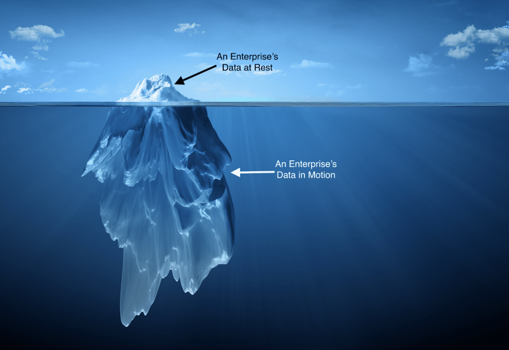

With a serverless architecture, multi-region geo replication, and Apache Cassandra's legendary performance, [DataStax Astra DB](https://astra.datastax.com) makes it easy for developers and enterprises to start small with their applications and grow them to infinite scale without constant performance tuning and optimization exercises.

However, cloud app developers also face significant challenge\`s beyond data at rest. Modern data apps require high-scale streaming technologies that can deliver the reactive engagement at the point of interaction that end users have come to expect. That's why today, we're excited to announce that these capabilities have been added to DataStax Astra.

**Astra Streaming Beta**

[Astra Streaming](https://www.datastax.com/products/astra-streaming) is a massively scalable, highly performant event streaming and cloud messaging platform that addresses the data in motion requirements for modern data apps. Astra Streaming is built on top of Apache Pulsar, the open source, distributed messaging and streaming platform that's rapidly becoming the choice for enterprises and cloud-native developers because of its superior scalability and resilience. According to a recent [GigaOm](https://www.datastax.com/gigaom-pulsar) report, Pulsar performed better than Kafka and showed an 81 percent savings in costs over a three year period.

Astra Streaming provides developers with a complete toolkit for data streaming, asynchronous communication between services, and data integration with Astra DB.

At the heart of Astra Streaming, developers will find familiar constructs such as topics, subscriptions, and data connectors. These capabilities are backed by a best-of-breed operational platform that provides zero-ops, infinite scale, and multi-cloud support as standard features.

These capabilities provide a foundational platform to rapidly build data-driven, highly performant apps. Standard pub/sub message exchange patterns support best practices often found in microservices architectures for achieving loose coupling between services and building resiliency against cascading failures that can result in service interruptions and poor user experiences. At the same time, the integration of Astra Streaming and Astra DB provides a way for applications that leverage data streaming to create read-optimized views of that data which can be retrieved near-instantaneously from Astra DB. This all adds up to a complete solution for developers who value high performance, fast development, and a highly scalable architecture.

**Data in motion: A growing enterprise priority**

Astra Streaming isn't only a tool for developers to increase their productivity and help them build high performance data driven applications. Data in motion is becoming an increasing priority for modern enterprises. According to Forrester Research, more than three-quarters of modern enterprises use real-time, actionable data for at least some of their applications.

If you look at the aggregate total of data within an enterprise, you are likely to find something that looks like this:

The vast amount of data in motion that's present within a given enterprise is often trapped in aging message-oriented middleware systems like MQ and JMS. These systems generally treat data as transient and discard it immediately after delivering it to consuming applications that have subscribed to a given message topic.

Apache Pulsar provides not only a next-generation architecture for event streaming, but also a set of capabilities that address the needs of more traditional messaging systems that rely on work queues and pub/sub. Astra Streaming has made it even easier to bridge this gap by supporting Fast JMS for Pulsar, a spec-conformant drop-in replacement that enterprises can use to instantly modernize their JMS applications and connect it to the full capabilities of Apache Pulsar.

The net result? Enterprises can easily capture, retain, and extract more value from data that today they are simply discarding---without taking on a long, painful migration project to adopt Astra Streaming. And because this capability is delivered as a fully managed SaaS, enterprises can choose to deploy Astra Streaming on AWS, GCP, or Azure to ensure close proximity and extremely low latency.

**Try Astra Streaming free**

If you are someone who cares about data, we hope you'll join us on this journey.

Take the first step by [signing up](https://astra.dev/3mYFq4C) for Astra Streaming and we'll give you access to its full capabilities entirely free through beta.

See for yourself how easy it is to build modern data applications and let us know what you'd like to see to make your experience even better.
