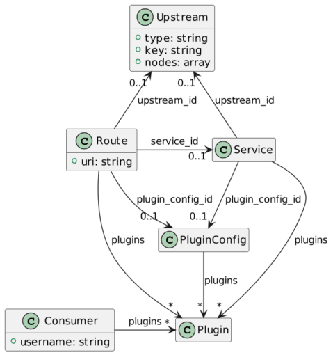

During the pioneer area of the World Wide Web, the content was static. To serve it, a group of developers created a web server, which is now known as the [Apache Web Server](https://httpd.apache.org/).

The Apache Web Server is built around a modular architecture. Developers created a module to run CGI scripts to add dynamic content to the lot. Users wrote early CGI scripts in Perl. After a while, it became evident that generating a complete HTML page from scratch was not the best way and that templating - providing an HTML page with placeholders - was a much better approach. The PHP language started like this as a simple templating engine interpreted by a module.

Then, people began to think that a web server's core responsibility was not to generate content but to serve it. This separation of concern split the monolithic web server into two parts: the web server on the front serves static content, and the application server generates dynamic content, generally from data stored in a database.

Reverse proxies {#h2-0-reverse-proxies}
---------------------------------------

Organizations kept this architecture, even though application servers could serve static content. I remember that around 2007, I read an article that benchmarked the performance of the Apache Web Server and Apache Tomcat (a Java-based application server): to serve purely static content, the latter was on par with the former, if not a bit faster.

On paper, it made sense to remove the web server. I even advocated for it once to the manager of the company I was working for at the time. Organizational inertia slowed down the initiative, then I left. At the time, I felt disappointed. In hindsight, it wouldn't have been a smart move.

The reason is that besides serving content directly, web servers also had to route requests to other components. In this regard, they also became experts at routing, based on some properties: domain, of course, path, or even an HTTP header. Thus, the webserver responsibility became less about serving content than about a single entry point into the rest of the infrastructure.

Meanwhile, websites that were focused on communication evolved to full-fledged web transactional applications. Web apps took a bigger and bigger share of the interactions between a company and its surrounding ecosystem - prospects, clients, providers, etc. When your business relies on a piece of infrastructure, you need to keep its downtime to a bare minimum: it means configuring redundancy of critical components and directing requests to the available ones. Routing was not simple routing anymore, but load balancing between several identical servers.

After introducing load balancing, adding more and more features was easy. The entry point started to handle cross-cutting responsibilities: authentication (but not always authorization), caching, IP blocking, etc. The webserver became a [Reverse Proxy](https://en.wikipedia.org/wiki/Reverse_proxy).

The rise of APIs {#h2-1-the-rise-of-apis}
-----------------------------------------

Over time, the number of services grew exponentially along with their need to communicate with one another. Inside the same organization, the long-standing tradition was to keep as few technology stacks as possible, the exact number depending on the organization's size.

However, when service had to communicate with services from another organization, things became a mess, as the probability of having different technology stacks became higher. SOAP, born at Microsoft, which later became a W3C standard (or a collection of standards), was the first serious attempt to propose a stack-neutral approach.

Though it became widespread in the enterprise world, it crumbled under its own weight. In the enterprise, the addition of standards became a quagmire. Outside the enterprise, front-end developers (i.e., JavaScript) found it much easier to deal with HTTP and JSON. The more front-end developers arrived on the market, the less they wanted to deal with SOAP.

While SOAP's popularity waned, HTTP's popularity (I dare not write REST) waxed. HTTP became the de facto standard to integrate heterogeneous information systems across the Internet. Companies started to provide access to their systems via HTTP: Web APIs. Soon, most dropped the Web part, and API implicitly implied Web with time.

With that in mind, our faithful web server evolved into its current form, the API gateway. It makes a lot of sense: the web server already serves as a central entry point as a Reverse Proxy. Now, we only need to add capabilities that are specific to APIs. Which ones are they?

The need for API gateways {#h2-2-the-need-for-api-gateways}
-----------------------------------------------------------

Here are two essential capabilities that highlight the need for APIs for something that regular web servers cannot provide.

* Complex rate-limiting: Rate limiting is a general-purpose capability to protect one's information system from DDoS attacks. However, when you differentiate between consumers, e.g., free vs. paying, you need to move from a simple rate to a more complex business logic rule.
* Billing: You might access a resource with regular content if you paid a subscription fee. However, when your business is to sell data, you probably sell them based on volume consumption. While it's possible for the service itself to embed the billing capability, it prevents more distributed architectures that rely on several services to serve the required data. At this point, only a central access point can reliably measure and charge usage.

Apache APISIX {#h2-3-apache-apisix}
-----------------------------------

A non-exhaustive list of the most widespread API gateways includes:

* Apache APISIX
* Kong Gateway
* Tyk
* Gloo
* Ambassador
* Gravitee

Note that I deliberately left out gateways of Cloud-providers, for they lock you in their ecosystem.

After being developed at ZhiLiu Technology, APISIX was donated to the [Apache Foundation](https://www.apache.org/) in June 2019 and became a Top-Level project in July 2020. As part of the ASF [meritocracy](https://www.apache.org/foundation/how-it-works.html#meritocracy) approach, you must first be an active contributor to be given committer rights.

On the technical side, APISIX is based on the popular Nginx web server, with a Lua engine on top (OpenResty) and a plugin architecture.

APISIX provides several core objects:

* Upstream:"Virtual host abstraction that performs load balancing on a given set of service nodes according to configuration rules"
* Consumer: Identity of a client
* Route:"The route matches the client's request by defining rules, then loads and executes the corresponding plugin based on the matching result, and forwards the request to the specified Upstream."
* Service: A reusable object that binds both a set of plugins and an upstream.

 

Objects are stored in [etcd](https://etcd.io/), a distributed key-value store also used by Kubernetes. Apache APISIX exposes a REST API so that you can access the configuration in a technical-agnostic way. Here, we request all existing routes:

<pre class="EnlighterJSRAW" data-enlighter-language="shell">curl http://apisix:9080/apisix/admin/routes -H 'X-API-KEY: xyz' # 1</pre>

1. Configuration access is protected by default. One needs to pass the API key.

Objects that use other objects can define them or point to an existing reference. For example, one can define a standalone `Route` as:

<pre class="EnlighterJSRAW" data-enlighter-language="shell">curl http://apisix:9080/apisix/admin/routes/1 -H 'X-API-KEY: xyz' -X PUT -d '
{
  "uri": "/foo",
  "upstream": {
    "type": "roundrobin",
    "nodes": {
      "127.0.0.1:8080": 1
    }
  }
}'</pre>

Or, first, define an `Upstream`:

<pre class="EnlighterJSRAW" data-enlighter-language="shell">curl http://apisix:9080/apisix/admin/upstreams/1 -H 'X-API-KEY: xyz' -X PUT -d '
{
  "type": "roundrobin",
  "nodes": {
    "127.0.0.1:8080": 1
  }
}'</pre>

We can now reference the newly created `Upstream` in a new `Route`:

<pre class="EnlighterJSRAW" data-enlighter-language="shell">curl http://apisix:9080/apisix/admin/routes/2 -H 'X-API-KEY: xyz' -X PUT -d '
{
  "uri": "/bar",
  "upstream_id": 1
}'</pre>

Getting your feet wet {#h2-4-getting-your-feet-wet}
---------------------------------------------------

The quickest way to try Apache APISIX is via Docker. Apache APISIX relies on etcd for its configuration, so let's use Docker Compose:

<pre class="EnlighterJSRAW" data-enlighter-language="yaml">version: "3"

services:
  apisix:
    image: apache/apisix:2.12.1-alpine                                      # 1
    command: sh -c "/opt/util/wait-for etcd:2397 -- /usr/bin/apisix init &amp;&amp; /usr/bin/apisix init_etcd &amp;&amp; /usr/local/openresty/bin/openresty -p /usr/local/apisix -g 'daemon off;'" # 2
    volumes:
      - ./apisix_log:/usr/local/apisix/logs
      - ./apisix_conf/config.yaml:/usr/local/apisix/conf/config.yaml:ro
      - ./util:/opt/util:ro                                                 # 2
    ports:
      - "9080:9080"
      - "9091:9091"
      - "9443:9443"
    depends_on:
      - etcd
  etcd:
    image: bitnami/etcd:3.5.2                                               # 3
    environment:
      ETCD_ENABLE_V2: "true"
      ALLOW_NONE_AUTHENTICATION: "yes"
      ETCD_ADVERTISE_CLIENT_URLS: "http://0.0.0.0:2397"                     # 4
      ETCD_LISTEN_CLIENT_URLS: "http://0.0.0.0:2397"                        # 4
    ports:
      - "2397:2397"</pre>

1. Apache APISIX image
2. Trick to wait until etcd is fully initialized, and not only started. The `depends_on` attribute is not enough
3. etcd image
4. Docker Desktop will start its own etcd if you have activated Kubernetes. To avoid port conflict, let's change the default port.

We configure Apache APISIX in the `config.yaml` file. A minimal configuration file looks like this:

<pre class="EnlighterJSRAW" data-enlighter-language="yaml">apisix:
  node_listen: 9080                           
  allow_admin:
    - 0.0.0.0/0
  admin_key:
    - name: "admin"
      key: edd1c9f034335f136f87ad84b625c8f1
      role: admin
etcd:
  host:
    - "http://etcd:2397"
  prefix: "/apisix"
  timeout: 30</pre>

We can now create a simple route. We will proxy the httpbin.org service:

<pre class="EnlighterJSRAW" data-enlighter-language="shell">#!/bin/sh
curl http://localhost:9080/apisix/admin/routes -H 'X-API-KEY: edd1c9f034335f136f87ad84b625c8f1' -X POST -d '
{
  "name": "Route to httpbin",
  "uris": ["/*"],
  "upstream": {
    "type": "roundrobin",
    "nodes": {
      "httpbin.org": 1
    }
  }
}'</pre>

We can now test the route. `httpbin` offers a couple of endpoints. The aptly-named `/anything` endpoint returns anything passed in the request data. We can use this endpoint to check everything works as expected:

<pre class="EnlighterJSRAW" data-enlighter-language="shell">curl 'localhost:9080/anything?foo=bar&amp;baz' -X POST -d '{ "hello": "world" }' -H 'Content-Type: application/json'</pre>

The output should closely resemble the following:

<pre class="EnlighterJSRAW" data-enlighter-language="json">{
  "args": {
    "baz": "", 
    "foo": "bar"
  }, 
  "data": "{ \"hello\": \"world\" }", 
  "files": {}, 
  "form": {}, 
  "headers": {
    "Accept": "*/*", 
    "Content-Length": "20", 
    "Content-Type": "application/json", 
    "Host": "localhost", 
    "User-Agent": "curl/7.79.1", 
    "X-Amzn-Trace-Id": "Root=1-6239ae8e-633a33fb0d5fe44e354c9149", 
    "X-Forwarded-Host": "localhost"
  }, 
  "json": {
    "hello": "world"
  }, 
  "method": "POST", 
  "origin": "172.21.0.1, 176.153.7.175", 
  "url": "http://localhost/anything?foo=bar&amp;baz"
}</pre>

Conclusion {#h2-5-conclusion}
-----------------------------

In this post, I've explained the evolution of web servers. In the beginning, their sole responsibility was to serve static content. Then, they added routing and load balancing capabilities and became reverse proxies. At this point, it was an easy step to add additional cross-cutting features.

In the age of APIs, web servers have reached another stage: API gateways. Apache APISIX is one such gateway. It doesn't only feature the friendly Apache v2 license; it's part of the Apache Foundation portfolio.

Starting with Apache APISIX is easy as pie. Use Docker, with the APISIX and etcd images, and off you go.

You can find the the sources for this post on [GitHub](https://github.com/ajavageek/start-apisix/).

**To go further**:

* [Apache APISIX website](https://apisix.apache.org/)
* [Apache APISIX architecture](https://apisix.apache.org/docs/apisix/architecture-design/apisix)
* [Apache APISIX on GitHub](https://github.com/apache/apisix)

*Originally published at [A Java Geek](https://blog.frankel.ch/apisix-api-gateway/) on March 25^th^, 2022*
