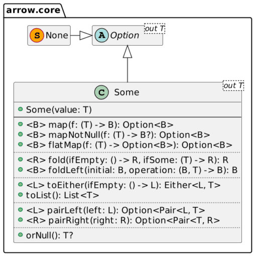

Java has long been infamous for its `NullPointerException`. The reason for the is calling a method or accessing an attribute of an **object that has not been initialized**.

```java
var value = foo.getBar().getBaz().toLowerCase();
```

Running this snippet may result in something like the following:

```
Exception in thread "main" java.lang.NullPointerException
  at ch.frankel.blog.NpeSample.main(NpeSample.java:10)
```

At this point, you have no clue which part is `null` in the call chain: `foo`, or the value returned by `getBar()` or `getBaz()`?

In the latest versions of the JVM, the language designers improved the situation. On JVM 14, you can activate "helpful" NPEs with the `-XX:+ShowCodeDetailsInExceptionMessages` flag. Running the same snippet shows which part is `null`:

```
Exception in thread "main" java.lang.NullPointerException: 
  Cannot invoke "String.toLowerCase()" because the return value of 
"ch.frankel.blog.Bar.getBaz()" is null
  at  ch.frankel.blog.NpeSample.main(NpeSample.java:10)
```

On JVM 15, it becomes the default behavior: you don't need a specific flag.

## Handling NullPointerException

In the above snippet, the developer assumed that every part had been initialized.

Displaying the `null` part helps debug and debunk wrong assumptions.

However, it doesn't solve the root cause: we need to handle the `null` value somehow.

For that, we need to resort to defensive programming:

```java
String value = null;
if (foo != null) {
    var bar = foo.getBar();
    if (bar != null) {
        baz = bar.getBaz()
        if (baz != null) {
            value = baz.toLowerCase();
        }
    }
}
```

It fixes the problem but is far from the best developer experience - to say the least:

1. Developers need to be careful about their coding practice
2. The pattern makes the code harder to read.

## The Option wrapper type

On the JVM, Scala's `Option` was the first attempt that I'm aware of of a sane `null` handling approach, even if the concept is baked into the foundations of Functional Programming. The concept behind `Option` is indeed quite simple: it's a wrapper around a value that can potentially be `null`.

You can call type-dependent methods on the object inside the wrapper, and the wrapper will act as a filter. Because `Option` has its methods, we need a pass-through function that works on the wrapped type: this function is called `map()` in Scala (as well as in several other languages). It translates in code as:

```scala
def map[B](f: A => B): Option[B] = if (isEmpty) None else Some(f(this.get))
```

If the wrapper is empty, *i.e.* , contains a `null` value, return an empty wrapper; if it's not, call the passed function on the underlying value and return a wrapper that wraps the result.

Since Java 8, the JDK offers a wrapper type named `Optional`. With it, we can rewrite the above null-checking code as:

```java
var option = Optional.ofNullable(foo)
    .map(Foo::getBar)
    .map(Bar::getBaz)
    .map(String::toLowerCase);
```

If any of the values in the call chain is `null`, `option` is `null`. Otherwise, it returns the computed value. In any case, gone are the NPEs.

## Nullable types

Regardless of the language, the main problem with *Option* types is its chicken-and-egg nature. To use an *Option* , you need to be sure it's not `null` in the first place. Consider the following method:

```java
void print(Optional<String> optional) {
    optional.ifPresent(str -> System.out.println(str));
}
```

What happens if we execute this code?

```java
Optional<String> optional = null;
print(optional);                       // 1
```

1. Oops, back to our familiar NPE

At this point, developers enamored with *Option* types will tell you that it shouldn't happen, that you shouldn't write code like this, etc. It might be accurate, but it, unfortunately, doesn't solve the issue. To 100% avoid NPEs, we need to get back to defensive programming:

```java
void print(Optional<String> optional) {
    if (optional != null) {
        optional.ifPresent(str -> System.out.println(str));
    }
}
```

Kotlin chose another route with **nullable** types and their counterparts, non-nullable types. In Kotlin, each type `T` has two flavors, a trailing `?` hinting that it can be `null`.

```kotlin
var nullable: String?          // 1
var nonNullable: String        // 2
```

1. `nullable` can be `null`
2. `nonNullable` cannot

The Kotlin compiler knows about it and prevents you from directly calling a function on a reference that could be `null`.

```kotlin
val nullable: String? = "FooBar"
nullable.toLowerCase()
```

The above snippet throws an exception at *compile-time* , as the compiler cannot assert that `nullable` is not `null`:

```
Only safe (?.) or non-null asserted (!!.) calls are allowed on a nullable receiver of type String?
```

The null safe operator, *i.e.* , `?.`, is very similar to what `map` does: if the object is `null`, stop and keep `null`; if not, proceed with the function call. Let's migrate the code to Kotlin, replacing `Optional` with a null safe call:

```kotlin
val value = foo?.bar?.baz?.lowercase()
```

## Option or nullable type?

You have no choice if you're using a language where the compiler does not enforce null safety. The question raises only within the scope of languages that do, *e.g.* , Kotlin. Kotlin's standard library doesn't offer an Option type. However, the [Arrow](https://arrow-kt.io/docs/apidocs/arrow-core/arrow.core/-option/) library does. Alternatively, you can still use Java's `Optional`.

But the question still stands: given a choice, shall you use an optional type or a nullable one? The first alternative is a bit more verbose:

```kotlin
val optional: Foo? = Optional.ofNullable(foo)   // 1
                             .map(Foo::bar)
                             .map(Bar::baz)
                             .map(String::lowercase)
                             .orElse(null)

val option = Some(foo).map(Foo::bar)            // 2
                      .map(Bar::baz)
                      .map(String::lowercase)
                      .orNull()
```

1. The Java API returns a platform type; you need to set the correct type, which is nullable
2. Arrow correctly infers the nullable `Foo?` type

Besides inferring the correct type, Arrow's `Option` offers:

* The `map()` function seen above
* Other standard functions traditionally associated with monads, *e.g.* , `flatMap()` and `fold()`
* Additional functions



For example, `fold()` allows to provide two lambdas, one to run when the `Option` is `Some`, the other when it's `None`:

```kotlin
val option = Some(foo).map(Foo::bar)
                      .map(Bar::baz)
                      .map(String::lowercase)
                      .fold(
                        { println("Nothing to print") },
                        { println("Result is $it") }
                      )
```

## Conclusion

If `null` was a million-dollar mistake, modern engineering practices and languages could cope with it. Compiler-enforced null safety, as found in Kotlin, is a great start.

However, to leverage the full power of Functional Programming, one needs an FP-compliant implementation of Option.

The problem, in this case, is to enforce that Option objects passed are never `null`.

Kotlin's compiler does it natively, while the Arrow library provides an Option implementation that fulfills the needs of FP programmers.

**To go further:**

* [Functors, Applicatives, And Monads In Pictures](https://adit.io/posts/2013-04-17-functors,_applicatives,_and_monads_in_pictures.html)
* [Kotlin's null safety](https://kotlinlang.org/docs/null-safety.html)
* [Why use Arrow's Options instead of Kotlin nullable](https://stackoverflow.com/questions/48895103/why-use-arrows-options-instead-of-kotlin-nullable)

*Originally published at [A Java Geek](https://blog.frankel.ch/optional-nullable-type/) on April 3^rd^, 2022*

*[NPE]: NullPointerException
