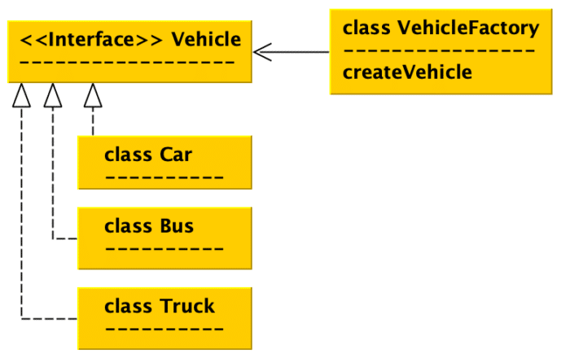

The goal of this article is to examine a program selection control mechanism.

A selection control mechanism allows a value, expression or variable type to influence the program flow execution. This concept is commonly used by developers.

A good example for this is a widely used design pattern. A design pattern that belongs to the family of creational patterns and is used for an object creation without exposing the entire logic.

A careful reader may already have identified which pattern. Yes, it's the Factory design pattern and it will be used in the example code.

Let us consider a simple factory that produces different vehicle types. The used types are "*Car* ", "*Bus* " and "*Truck* ". Each inherits from the interface "*Vehicle*" (Figure 1.)


Figure 1. Creating desired Vehicle instances with naive vehicle factory example

Let us implement such a naive vehicle factory in 3 different JVM languages:

* Java 18 with enabled preview feature "Pattern Matching for switch" (Ref 2., Example 1.)
* Kotlin 1.6.10 (Example 2.)
* Scala 2.13.8. (Example 3.)

The comparison will allow us to observe the verbosity of the implementation in those languages.

To reduce the displayed code, we show only the method "*createVehicle*" as this method is the focus of this article:

```java
private static Vehicle createVehicle(String type) {
  return switch(type){
     case"CAR"->new Car();
     case"BUS"->new Bus();
     case"TRUCK"->new Truck();
     default-> throw new IllegalArgumentException("""
               illegal type: %s """.formatted(type));
     };
}
```


Example 1. VehicleFactory, method "createVehicle" in Java - switch statement

```kotlin
fun createVehicle(type: String): KVehicle = when(type){
   "CAR" -> KCar()
   "BUS" -> KBus()
   "TRUCK" -> KTruck()
   else -> throw IllegalArgumentException("illegal type:$type")
}
```


Example 2. VehicleFactory, method "createVehicle" in Kotlin - when expression

```scala
def createVehicle(vehicleType: String): SVehicle = vehicleType match {
   case"CAR" => new SCar
   case"TRUCK" => new STruck
   case"BUS" => new SBus
   case _ => throw new IllegalArgumentException(f"illegal type: $vehicleType")
}
```


Example 3. VehicleFactory, method "createVehicle" in Scala - match mechanism

Conclusions
-----------

The "*VehicleFactory*" has been implemented in three different JVM languages: Java, Kotlin and Scala. It seems that commonly used critique about the verbosity in Java is not really valid in this example. Actually, each of three different implementations look very similar.

The example shows the usage of Java *TextBlocks* (Ref 5.), delivered in the Java 15 release. We can actually notice that Kotlin or Scala provide quite neat constructions for the texts, Java is a bit behind as to this aspect.

On the other hand, it is fair to say that Exceptions in Java are a bit more specific than in Kotlin or Scala. Java produces a much more compact StackTrace (Example 4.) which may influence the application's performance.

Working example and additional information is available on GitHub account (Ref 1.)

<https://github.com/mirage22/jvm-language-examples>

```
// force 'VehicleFactory' to cause an exception
vehicle = createVehicle("BLA")
1. Java StackTrace 
Java 18, vehicle factory example...
Exception in thread "main" java.lang.IllegalArgumentException: illegal type: BLA
  at VehicleFactory.createVehicle(VehicleFactory.java:37)
  at VehicleFactory.main(VehicleFactory.java:26)

2. Kotlin StackTrace
Kotlin, vehicle factory example
Exception in thread "main" java.lang.IllegalArgumentException: illegal type:BLA
   at KVehicleFactory$Companion.createVehicle(KVehicleFactory.kt:24)
   at KVehicleFactoryKt.main(KVehicleFactory.kt:36)
   at KVehicleFactoryKt.main(KVehicleFactory.kt)
   at java.base/jdk.internal.reflect.DirectMethodHandleAccessor.invoke(DirectMethodHandleAccessor.java:104)
   at java.base/java.lang.reflect.Method.invoke(Method.java:577)
   at org.jetbrains.kotlin.runner.AbstractRunner.run(runners.kt:64)
   at org.jetbrains.kotlin.runner.Main.run(Main.kt:176)
  at org.jetbrains.kotlin.runner.Main.main(Main.kt:186)

3. Scala StackTrace
Scala, vehicle factory example
java.lang.IllegalArgumentException: illegal type: BLA
    at SVehicleFactory$.createVehicle(ScalaVehicleFactory.scala:35)
    at SVehicleFactory$.main(ScalaVehicleFactory.scala:27)
    at SVehicleFactory.main(ScalaVehicleFactory.scala)
   at java.base/jdk.internal.reflect.DirectMethodHandleAccessor.invoke(DirectMethodHandleAccessor.java:104)
   at java.base/java.lang.reflect.Method.invoke(Method.java:577)
   at scala.reflect.internal.util.RichClassLoader$.$anonfun$run$extension$1(ScalaClassLoader.scala:101)
   at scala.reflect.internal.util.RichClassLoader$.run$extension(ScalaClassLoader.scala:36)
   at scala.tools.nsc.CommonRunner.run(ObjectRunner.scala:30)
   at scala.tools.nsc.CommonRunner.run$(ObjectRunner.scala:28)
   at scala.tools.nsc.ObjectRunner$.run(ObjectRunner.scala:45)
   at scala.tools.nsc.CommonRunner.runAndCatch(ObjectRunner.scala:37)
   at scala.tools.nsc.CommonRunner.runAndCatch$(ObjectRunner.scala:36)
   at scala.tools.nsc.MainGenericRunner.runTarget$1(MainGenericRunner.scala:70)
   at scala.tools.nsc.MainGenericRunner.run$1(MainGenericRunner.scala:91)
   at scala.tools.nsc.MainGenericRunner.process(MainGenericRunner.scala:103)
   at scala.tools.nsc.MainGenericRunner$.main(MainGenericRunner.scala:108)
   at scala.tools.nsc.MainGenericRunner.main(MainGenericRunner.scala)
```


Example 4. Vehicle factory causes exceptions with StackTraces

References:
-----------

1. GitHub jvm-language-examples : https://github.com/mirage22/jvm-language-examples
2. JEP-420, Pattern Matching for switch (Second Preview): https://openjdk.java.net/jeps/420
3. Kotlin: when expression: https://kotlinlang.org/docs/control-flow.html#when-expression
4. Scala: Pattern matching: https://docs.scala-lang.org/tour/pattern-matching.html
5. JEP-478, Text Blocks: https://openjdk.java.net/jeps/378
