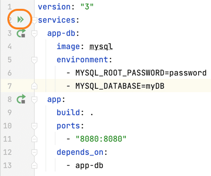
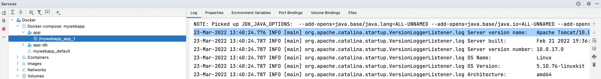
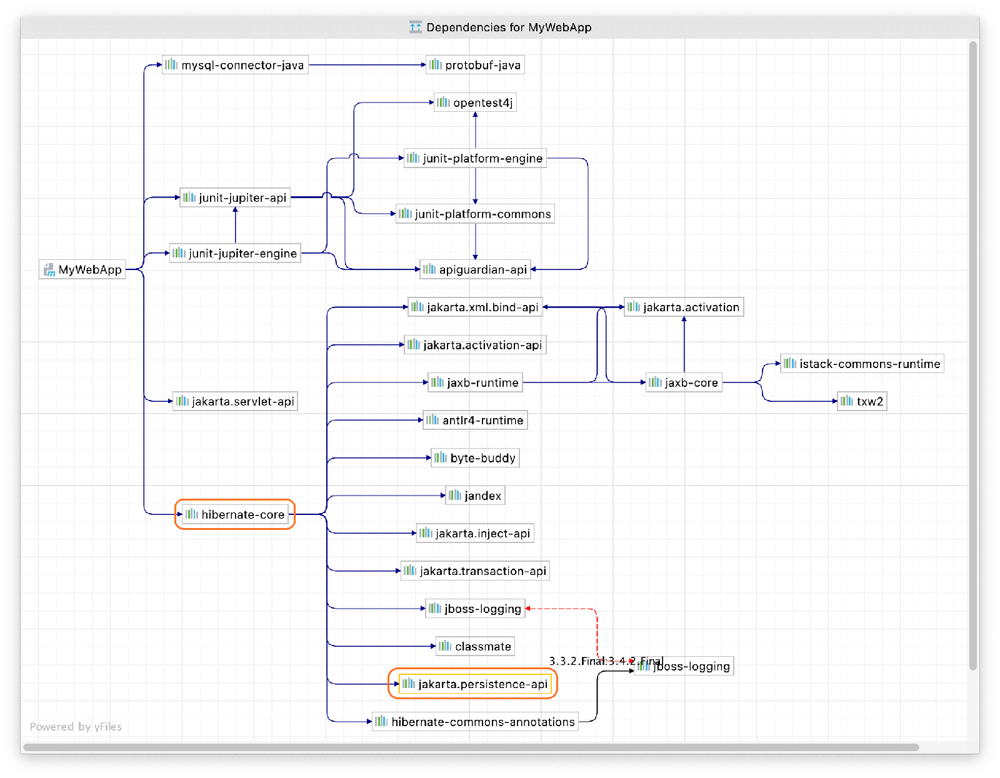
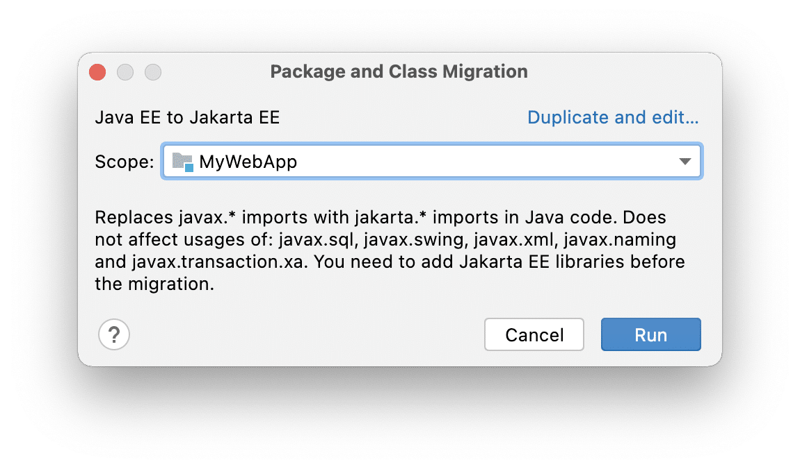
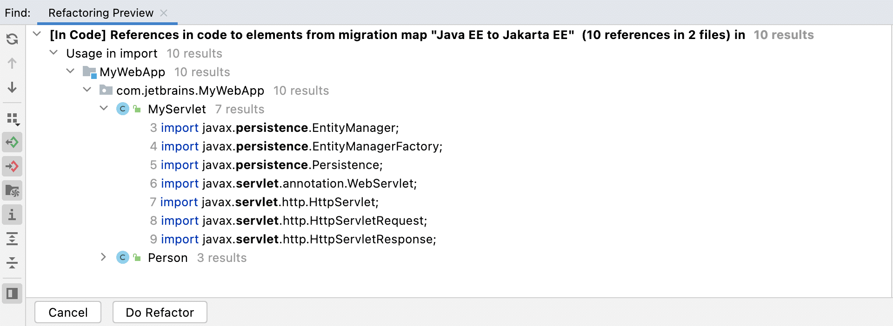

In this post, we're going to migrate some sample code from the `javax` namespace to `jakarta`. If you want the history on this change, check out [this helpful blog post](https://blogs.oracle.com/javamagazine/post/transition-from-java-ee-to-jakarta-ee) from Java Magazine. Fundamentally the *Java Persistence API* was renamed to *Jakarta Persistence API* meaning that the `javax` namespace changed to `jakarta` for frameworks whose APIs have moved to Jakarta EE (which is not all of them).

However, Apache Tomcat recently released version 10 which updated package names from `javax` to `jakarta`. SpringBoot also made [this change](https://spring.io/blog/2021/09/02/a-java-17-and-jakarta-ee-9-baseline-for-spring-framework-6) in version 6.

You can get the [sample code from GitHub](https://github.com/helenjoscott/MyWebApp), with thanks to [Dalia](https://twitter.com/DaliaShea) for creating the project! There are three branches in this project; *main* , *javax* and *jakarta* . Clone the project from GitHub if you want to follow along and check out the `javax` branch, we will start here.

If you are following along, I recommend that you use IntelliJ IDEA Ultimate, however you can use IntelliJ IDEA Community Edition and install the Docker plugin manually. Either way you will need Docker running on your machine. Once you have downloaded the code, you can use the run icon in the gutter of the `docker-compose.yml` file:



Now you should be able to navigate to [localhost:8080/MyWebApp](http://localhost:8080/MyWebApp) and see the application. If you enter a name and fruit, they should successfully be persisted in the database. This application is currently running Apache Tomcat 9.0 which uses the `javax` namespace.

## Updating your Apache Tomcat version

This project uses Docker, so you can update the version of Apache Tomcat from 9 to 10 in your Docker file:

```
FROM tomcat:9-jdk17
ADD target/MyWebApp.war /usr/local/tomcat/webapps/MyWebApp.war
EXPOSE 8080
CMD ["catalina.sh", "run"]
```

Now your Docker file will look like this:

```
FROM tomcat:10-jdk17
ADD target/MyWebApp.war /usr/local/tomcat/webapps/MyWebApp.war
EXPOSE 8080
CMD ["catalina.sh", "run"]
```

Before we start the migration from `javax` to `jakarta` let's run the project again from the run icon in the gutter of the`docker-compose.yml` file adjacent to services because we want the image to be rebuilt.

You can check the logs for your container to ensure you're running Tomcat 10.0 in the Services window with **⌘8** (macOS), or **Alt+8** (Windows/Linux).



```
2022-03-23T13:40:24.787157700Z 23-Mar-2022 13:40:24.776 INFO 
[main] org.apache.catalina.startup.VersionLoggerListener.log Server version name: Apache Tomcat/10.0.17
```

Now we're confident that we're using Apache Tomcat 10.0, let's go to the webserver front end and see what happens. In your browser, go to [localhost:8080/MyWebApp](http://localhost:8080/MyWebApp) and try to enter a name and fruit - you will get a 404 error. We're getting this error because Tomcat 9 used Java Servlet 4.0 which uses `javax.*` and Apache Tomcat 10 uses Jakarta Servlet 5.0 which uses `jakarta.*`. Let's fix the problem now!

## Updating your dependencies

The first thing we need to do is update our dependencies. This project uses Maven so that's the `pom.xml` file. If you're using Gradle in your project, you need to update your `build.gradle` file.

Look for the following dependencies:

```
<dependency>
   <groupId>javax.servlet</groupId>
   <artifactId>javax.servlet-api</artifactId>
   <version>4.0.1</version>
   <scope>provided</scope>  
</dependency>
<dependency>
   <groupId>org.hibernate</groupId>
   <artifactId>hibernate-core</artifactId>
   <version>5.6.3.Final</version>
</dependency>
```

The first step is to replace the dependency for `javax.servlet` with `jakarta.servlet`:

```
<dependency>
   <groupId>jakarta.servlet</groupId>
   <artifactId>jakarta.servlet-api</artifactId>
   <version>5.0.0</version>
   <scope>provided</scope>
</dependency>
```

However, the `org.hibernate` dependency has a transitive dependency on `javax.persistence-api` as well which is part of the old Java Persistence API so this needs to be updated as well. You can see this dependency in the Maven window in IntelliJ IDEA if you expand the Dependencies node. Alternatively, in IntelliJ IDEA Ultimate, you can right-click on the dependency name and select Show Dependencies Popup or **⌥⌘U** (macOS), **Ctrl+Alt+U** (Windows/Linux).



Since we want to move from the `javax` to `jakarta` namespace in our application, we need to update the dependency on `org.hibernate` to a version that supports the `jakarta` namespace. Unfortunately at time of writing, Hibernate is not currently compatible with Jakarta Persistence API 3.0, but there is a beta version we can use.

We need to change the version number here:

```
<dependency>
   <groupId>org.hibernate</groupId>
   <artifactId>hibernate-core</artifactId>
   <version>5.6.3.Final</version>
</dependency>
```

To this beta version:

```
<dependency>
   <groupId>org.hibernate</groupId>
   <artifactId>hibernate-core</artifactId>
   <version>6.0.0.Beta3</version>
</dependency>
```

Next, we need to reload our `pom.xml` file with **⇧⌘I** (macOS), or **Ctrl+Shift+O** (Windows/Linux), or click the little Maven icon to reload your project.

Now open your Project window with **⌘1** (macOS) or **Alt+1** (Windows/Linux) and note that your two Java files are underlined in red because they are now in an error state. Let's fix that next.

## Using IntelliJ IDEA's migration tool

One common question you might have at this stage is "why don't I just do a find and replace for `javax` to `jakarta`?" The answer is that not all `javax` packages have been migrated to the `jakarta` namespace. For example, `javax.transaction.xa` package is not using Jakarta.

We're going to use IntelliJ IDEA's migration tool which was introduced in IntelliJ IDEA 2021.2 for the next steps. From the menu, navigate to **Refactor** \> **Migrate Packages and Classes** \> **Java EE to Jakarta EE.**



You can select the scope here, for example *MyWebApp*. This also allows you to go module by module if you're working with a larger more realistic application. Press \*Run\*\* to get a preview of the refactorings.



Press **Do Refactor** . Your Java classes should no longer be in a state of error. Now let's rebuild our application with **⌘F9** (macOS), or **Ctrl+F9** (Windows/Linux) and then run it with **Shift** +**F10** \|**⌃R**.

Now you should be able to navigate to [localhost:8080/MyWebApp](http://localhost:8080/MyWebApp) again and see the application. Your error should be gone and your migration is nearly complete.

## Updating your persistence file

Now if you do a search across your whole project with **⌘⇧F** or **Crl+Shift+F** for *javax* you will see that it still appears in your `persistence.xml` file.

We need to update the `persistence.xml` file and change the namespace from:

```
<persistence xmlns="http://xmlns.jcp.org/xml/ns/persistence" 
             xmlns:xsi="http://www.w3.org/2001/XMLSchema-instance" xsi:schemaLocation="http://xmlns.jcp.org/xml/ns/persistence http://xmlns.jcp.org/xml/ns/persistence/persistence_2_2.xsd" version="2.2">
```

to:

```
<persistence version="3.0" xmlns="https://jakarta.ee/xml/ns/persistence"
             xmlns:xsi="http://www.w3.org/2001/XMLSchema-instance"
             xsi:schemaLocation="https://jakarta.ee/xml/ns/persistence https://jakarta.ee/xml/ns/persistence/persistence_3_0.xsd">
```

Now you need to change the property names from `javax` to `jakarta`:

```
<properties>
    <property name="javax.persistence.jdbc.driver" value="com.mysql.cj.jdbc.Driver"/>
    <property name="javax.persistence.jdbc.url" value="jdbc:mysql://app-db/myDB"/>
    <property name="javax.persistence.jdbc.user" value="root"/>
    <property name="javax.persistence.jdbc.password" value="password"/>
    <property name="hibernate.hbm2ddl.auto" value="update"/>
</properties>
```

to:

```
<properties>
   <property name="jakarta.persistence.jdbc.driver" value="com.mysql.cj.jdbc.Driver"/>
   <property name="jakarta.persistence.jdbc.url" value="jdbc:mysql://app-db/myDB"/>
   <property name="jakarta.persistence.jdbc.user" value="root"/>
   <property name="jakarta.persistence.jdbc.password" value="password"/>
   <property name="hibernate.hbm2ddl.auto" value="update"/>
</properties>
```

Now let's rebuild our application again with **⌘F9** (macOS), or **Ctrl+F9** (Windows/Linux) and then run it with **Shift** +**F10** \|**⌃R**.

Your application should still be available at [localhost:8080/MyWebApp](http://localhost:8080/MyWebApp).

Your code should now be the same as the `jakarta` branch in the project. You can verify this by navigating to the *src* directory in IntelliJ IDEA then right-click and select Git \> Compare with Branch... and select the `jakarta` branch.

## Summary and shortcuts

Congratulations, you've successfully migrated the project from the `javax` namespace to `jakarta` using IntelliJ IDEA's migration tool. You also updated your `persistence.xml` file as part of that migration. Here are some helpful links and a summary of the shortcuts we used.

### Further reading and viewing

Here are some helpful links for you to consider when you need to migrate your application from the `javax` namespace to `jakarta`:

* [JetBrains video - Migrating from javax to jakarta namespace](https://www.youtube.com/watch?v=mukr2Q_zBm4)
* [JetBrains blog - Creating new jakarta persistence jpa applications](https://blog.jetbrains.com/idea/2021/02/creating-new-jakarta-persistence-jpa-applications/)
* [JetBrains blog - Creating a simple JPA Application](https://blog.jetbrains.com/idea/2021/02/creating-a-simple-jpa-application/)

### IntelliJ IDEA shortcuts

Here are the shortcuts that we used.

|                                                 Name                                                 | macOS Shortcut | Windows Shortcut |
|------------------------------------------------------------------------------------------------------|----------------|------------------|
| Rebuild the project                                                                                  | **⌘F9**        | **Ctrl+F9**      |
| Run the project                                                                                      | **⌃R**         | **Ctrl+F10**     |
| Reload Maven changes                                                                                 | **⇧⌘I**        | **Ctrl+Shift+O** |
| Display or hide the [Project Window](https://www.jetbrains.com/help/idea/project-tool-window.html)   | **⌘1**         | **Alt+1**        |
| Display or hide the [Services Window](https://www.jetbrains.com/help/idea/services-tool-window.html) | **⌘8**         | **Alt+8**        |
