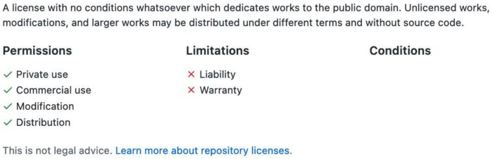
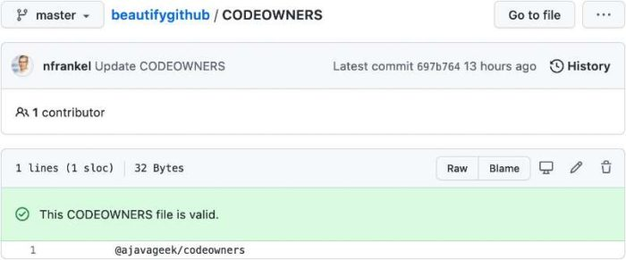
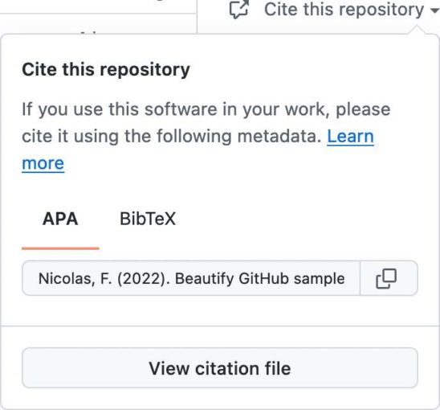
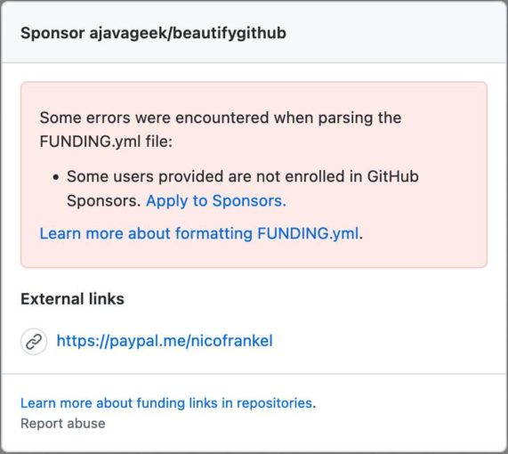

Whether you like it or not, GitHub has become the primary provider to host one's code.

You or your company are probably using GitHub.

In this article, I want to highlight some files that you can use to beautify your GitHub repository and make it welcoming and inspiring to those who stop by.

README {#h2-0-readme}
---------------------

I hope that by now, everybody is familiar with READMEs. If you place a README file at the root of your repo, GitHub will display its content on the repo's homepage.

However, here are a couple of tips you may not know about, yet.

The README may be in different formats:

|   File name   |                            Format                            |
|---------------|--------------------------------------------------------------|
| `README`      | Raw text                                                     |
| `README.txt`  | Raw text                                                     |
| `README.md`   | (GitHub-flavored) [Markdown](https://github.github.com/gfm/) |
| `README.adoc` | [Asciidoctor](https://asciidoctor.org/)                      |

Note that HTML doesn't work: GitHub displays the raw HTML code, not the "rendered" HTML.

Additionally, one can set a README for an organization. You first need to create a repository named like the organization. Then, create the README file you want under the `/.github/profile/` directory. For an example, check this blog's organization that shows [a custom page](https://github.com/ajavageek).

For more details, check the [documentation](https://docs.github.com/en/repositories/managing-your-repositorys-settings-and-features/customizing-your-repository/about-readmes).

LICENSE {#h2-1-license}
-----------------------

If you want people to use your code, you should tell them under which terms they can use it. It's precisely the goal of licensing your code. Traditionally, most packages have a `LICENSE` (or `LICENSE.txt`) file at their root. GitHub has adopted this practice.

You can choose any license you want, but the GitHub provides a good help for Open Source ones. Go to *Add file \> Create new file* . If you name the new file `LICENSE`, a new button will pop up: *Choose a license template*. When you click on it, GitHub offers the following choice:

* **Apache License 2.0**
* **GNU General Public License v3.0**
* **MIT License**
* BSD 2-Clause "Simplified" License
* BSD 3-Clause "New" or "Revised" License
* Boost Software License 1.0
* Creative Commons Zero v1.0 Universal
* Eclipse Public License 2.0
* GNU Affero General Public License v3.0
* GNU General Public License v2.0
* GNU Lesser General Public License v2.1
* Mozilla Public License 2.0
* The Unlicense

You can choose one to check its content. GitHub displays its permissions, limitations, and conditions:

 

You can now *Review and submit*. At this point, you are faced with three choices:

1. *Cancel changes* cancels everything
2. *Choose a license template* gets back to the license choice
3. *Commit new file*... commits the newly-chosen license to the repository

After adding the license, GitHub displays it on the right of the repository's page.

 

For more details, check the [documentation](https://docs.github.com/en/repositories/managing-your-repositorys-settings-and-features/customizing-your-repository/licensing-a-repository).

CODEOWNERS {#h2-2-codeowners}
-----------------------------

GitHub automatically adds the configured code owners to pull requests. You define them in a `CODEOWNERS` file, whose format is somewhat similar to `.gitignore`.

Here's a quick sum-up of how GitHub handles it:

* You can set `CODEOWNERS` at the root or in a `.github` subfolder
* You can have a different file per branch
* A general configuration line consists of a pattern and an owner:

      *.txt    @nfrankel

  `@nfrankel` owns all `txt` files
* As with `.gitignore`, the configuration is applied sequentially. Bottom lines override top ones:

               @johndoe
      docs     @nfrankel

  `@johndoe` owns everything, but `@nfrankel` owns the `docs` folder
* You can set multiple owners:

               @johndoe @nfrankel

* An owner can be either an individual or [a team](https://docs.github.com/en/organizations/organizing-members-into-teams/about-teams). To define a team, use the org's name suffixed with the team's name:

               @ajavageek/developers

* You can't review the pull requests that you opened yourself! GitHub skips you if you're the one opening the pull request to test the configuration (cf. [StackOverflow](https://stackoverflow.com/questions/61903008/codeowners-file-in-github-repo-not-working)).

GitHub skips invalid configuration lines. To verify, you can use the UI:

 

SECURITY {#h2-3-security}
-------------------------

Projects want people to report security issues. But the communication channel(s) needs to be private so that hackers don't learn about the issue before it can be mitigated, fixed, or both. For this, GitHub offers a custom SECURITY file:

* Like the README file, it can adopt different formats:  

  |   File name    |                            Format                            |
  |----------------|--------------------------------------------------------------|
  | `SECURITY`     | Raw text                                                     |
  | `SECURITY.txt` | Raw text                                                     |
  | `SECURITY.md`  | (GitHub-flavored) [Markdown](https://github.github.com/gfm/) |
  | `README.adoc`  | [Asciidoctor](https://asciidoctor.org/)                      |

* Like the CODEOWNERS files, you can put it at the repo's root or in a `.github` subfolder

The easiest way to set up a SECURITY file is via the UI. Go to the *Security* tab and click on the *Setup a security policy* button. Click on the *Start setup* button in the new window.

GitHub provides a default Markdown template, but of course, you can choose to change the format and the content. The important part is to tell users how they should report security vulnerabilities.

The newly-created file appears in *Security \> View security policy* . Here's a [sample](https://github.com/ajavageek/beautifygithub/security/policy) in Asciidoctor format.

Citations {#h2-4-citations}
---------------------------

If your project is good, other projects will likely use it. The project may be cited in academic works, even more so if it's of an academic nature itself. The CITATION file allows you to answer the following questions:

* What is the name of the software?
* What label should I use to uniquely identify the version of the software I have used?
* What is the appropriate set of people that should be cited as authors?

The standard CITATION format is the [Citation File Format](https://citation-file-format.github.io/), proposed by GitHub:
> `CITATION.cff` files are plain text files with human- and machine-readable citation information for software (and datasets). Code developers can include them in their repositories to let others know how to correctly cite their software.

You can non only choose how to format the citation but also cite an alternative source, *e.g.* a related academic article.

Again, GitHub's UI helps one create a `CITATION.cff` file. When you create one, it offers you to add a sample, which you can edit to your heart's content.

<pre class="EnlighterJSRAW" data-enlighter-language="yaml">cff-version: 1.2.0
title: Beautify GitHub sample repository
message: If you really want to cite this repository, here's how you should cite it.
type: software
authors:
  - given-names: Nicolas
    family-names: Fränkel
repository-code: 'https://github.com/ajavageek/beautifygithub'
license: Unlicense</pre>

After adding the file, a new *Cite this repository* link appears on the right sidebar. You can choose which format you want to copy, APA or BibTeX when you click it.

 

Sponsorship {#h2-5-sponsorship}
-------------------------------

Last but not least, let's look at how to configure sponsorship. If you provide value to third parties via your Open Source project, it makes sense to let them reward you. Note that you shouldn't count on it, though, or you're in for a surprise.

GitHub allows displaying sponsorship options via a dedicated `FUNDING.yml` in the `.github` repository. Once more, the UI helps. Go to *Settings* and click on the *Set up sponsor button*. It opens the usual window to create a new file with a template. Here's how I changed it:

<pre class="EnlighterJSRAW" data-enlighter-language="yaml">github:
  - nfrankel
custom:
  - https://paypal.me/nicofrankel</pre>

The preview tab validates your input.

 

In this case, the validation fails by telling that user `nfrankel` (me) didn't enroll in the GitHub sponsors program.

A new "Sponsor this project" section appears on the right sidebar on the repo's homepage.

You need to check the "Sponsorships" checkbox in *Settings* for it to appear. Thus, you can prepare everything in the repo and only activate it when you're ready.

Conclusion {#h2-6-conclusion}
-----------------------------

GitHub offers multiple ways to improve your repository's display and usability. A LICENSE and a README should be mandatory for any repository you want to share with others. Besides them, you should provide the other beautifications listed in this post.

The complete source code for this post can be found on [GitHub](https://github.com/ajavageek/beautifygithub).

**To go further:**

* [Customizing your repository](https://docs.github.com/en/repositories/managing-your-repositorys-settings-and-features/customizing-your-repository)
* [Adding a security policy to your repository](https://docs.github.com/en/code-security/getting-started/adding-a-security-policy-to-your-repository)
* [Citation File Format (CFF)](https://citation-file-format.github.io/)
* [About CITATION files](https://docs.github.com/en/repositories/managing-your-repositorys-settings-and-features/customizing-your-repository/about-citation-files)
* [GitHub special files and paths](https://github.com/joelparkerhenderson/github-special-files-and-paths)

*Originally published at [A Java Geek](https://blog.frankel.ch/beautify-github-repo/) on April 17^th^, 2022*

*[UI]: User Interface
