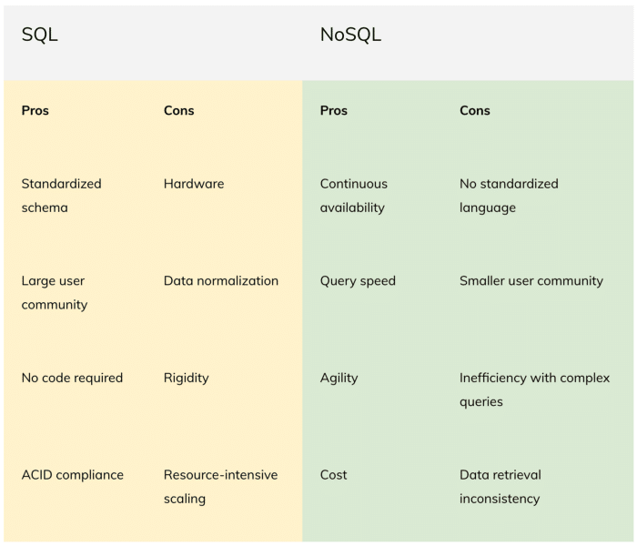

What's the best way to store, protect and access your data?{#abb7}

This is a fundamental, yet critical decision.{#abb7}

After all, data is the cornerstone of success for just about every modern organization.{#abb7}

For most companies, the choice comes down to SQL and NoSQL databases. Each has unique strengths and weaknesses.{#abb7}

* SQL databases have been a proven option since the 1970s. They are made up of highly structured tables, consisting of rows and columns, related to one other through common attributes. Every column is required to have a value for its corresponding row.

<!-- -->

* NoSQL ("not only SQL" or "non-SQL") databases came along later to break the relational table straitjacket, with the ability to store and access all data types, structured and unstructured, together.

They're extremely flexible and easy for developers to work with and modify. [Learn more about SQL and NoSQL databases and their basic differences](https://www.datastax.com/what-is/nosql).{#3ad0}

The best choice? Well, it depends on a whole slew of factors, including your querying, availability, and compliance needs, along with your variety of data types and expected growth.{#3088}
 SQL vs. NoSQL comparison chart

Let's take a close look at the pros and cons of SQL vs. NoSQL to help you make the right choice.{#5f71}

## SQL pros

### Standardized schema

While the standardized schema of SQL databases makes them rigid and difficult to modify, it does come with some advantages. All data added to the database must comply with the well-known schema of linked tables made up of rows and columns.{#bf78}

Some may find this limiting or confining, but it is helpful when data consistency, integrity, security, and compliance are at a premium.{#bf78}

### Large user community

At almost 50 years old, the SQL programming language is extremely mature and still widely used. It has a strong community, with countless experts willing to share tips and well-established best practices. There are many opportunities to sharpen skills and collaborate.{#1562}

If necessary, consultants and SQL vendors can provide additional support. With SQL, your developers will be able to find the answers they need.{#1562}

### No code required

SQL is a user-friendly language. Managing and querying the database can be accomplished using simple keywords with little to no coding required. Most developers are taught SQL in college.{#3bb6}

### ACID compliance

The extremely structured nature of relational database tables enables SQL databases to be [Atomicity, Consistency, Isolation, and Durability (ACID)](https://www.educative.io/edpresso/what-are-acid-properties-in-a-database?https://www.educative.io/courses/grokking-the-object-oriented-design-interview?aid=5082902844932096&affiliate_id=5082902844932096&utm_source=google&utm_medium=cpc&utm_campaign=grokking-ci&utm_term=&utm_campaign=Grokking+Coding+Interview+-+USA%2B&utm_source=adwords&utm_medium=ppc&hsa_acc=5451446008&hsa_cam=1871092258&hsa_grp=84009716779&hsa_ad=396821895536&hsa_src=g&hsa_tgt=dsa-1287243227899&hsa_kw=&hsa_mt=b&hsa_net=adwords&hsa_ver=3&gclid=Cj0KCQiA-K2MBhC-ARIsAMtLKRulyN-g-obXdyG8_GyviiXCBcmYibBaR9otJ9w3NaR5T_klYt1GbboaAl-YEALw_wcB) compliant. This level of compliance keeps tables in-sync and guarantees the validity of transactions. It is likely the right choice when you run applications that have no room for error and need the highest level of data integrity.{#3b57}

Here are the ACID properties:{#33d1}

* **Atomicity:** All changes to data and transactions are executed completely and as a single operation. If that isn't possible, none of the changes are performed. It's all or nothing.
* **Consistency:** The data must be valid and consistent at the start and end of a transaction.
* **Isolation:** Transactions run concurrently, without competing with each other. Instead, they behave as though they are occurring successively.
* **Durability:** When a transaction is completed, its associated data is permanent and cannot be changed.

## SQL cons

### Hardware

The norm for SQL databases is to scale-up vertically, where capacity can only be expanded by increasing capabilities, such as RAM, CPU, and SSD, on the existing server or by migrating to a larger, more expensive one. You'll need to continually increase hard drive space as your data grows and you'll need faster machines to run evolving and more sophisticated technologies.{#0ac4}

The database vendor you use will likely require you to periodically level up your hardware just to run their latest releases. In this environment, hardware can quickly become outdated. Each upgrade is sure to be expensive and resource intensive. SQL's hardware needs also include ongoing, everyday maintenance and operating costs. It's a never-ending hamster wheel.{#0ac4}

### Data normalization

Developed at a time when the cost of data storage was high, relational databases attempt to negate data duplication. Each table has different information and they can be connected and queried using common values.{#fd75}

However, as SQL databases get large, the lookups and joins required between numerous tables can slow things down.{#fd75}

### Rigidity

A SQL database's schema must be defined before use. Once in place, they are inflexible, and modifications are typically difficult and resource-intensive. For that reason, substantial time needs to be invested in upfront planning, before the database is ever put into production.{#d1fa}

So it follows that they're only appropriate when all of your data is also structured and you don't expect much change, either in volume or data types.{#d1fa}

### Resource-intensive scaling

As mentioned earlier, SQL databases normally scale vertically by expanding hardware investment. This is expensive and time-consuming. In some cases, an organization may attempt to horizontally scale a SQL database through partitioning.{#37cc}

This added complexity magnifies the time and resources expended. The effort will likely include coding, requiring highly skilled, highly paid developers. As data volume grows, scaling your SQL database is like playing a never-ending game of tag, where the perfect setup is always just out of reach.{#37cc}

On the other hand, NoSQL databases scale-out horizontally, making it easier and more cost-effective to expand capacity. They're a good fit for cloud computing and handling extremely large and quickly growing datasets.{#37cc}

## NoSQL pros

### Continuous availability

With NoSQL, data is distributed across multiple servers and regions, so there is no single point of failure. As a result, NoSQL databases are more stable and resilient, with continuous availability and zero downtime.{#3766}

### Query speed

Since NoSQL databases are denormalized, with no worry of data duplication, all the information needed for a particular query will often already be stored together --- no joins required. This can make lookups easier, especially when working with large data volumes.{#c5e2}

It also means NoSQL can be very fast for simple queries. Make no mistake, SQL databases can also return very speedy queries. They also support highly complex queries for structured data. However, query speed can quickly taper off as SQL databases grow and complex join requirements increase.{#c5e2}

### Agility

NoSQL databases were developed as data storage costs were beginning to drastically drop and developer costs were rising. Data duplication was no longer a concern. Instead, they were designed to give developers as much flexibility as possible to boost creativity and productivity. Not constrained by rows and columns, NoSQL database schemas don't have to be predefined. Instead, they are dynamic with the ability to handle all types of data, including structured, semi-structured, unstructured, and polymorphic.{#8973}

You can launch NoSQL databases without spending time defining their structure and easily add data types and fields, without downtime, on the fly. All of this makes NoSQL a great fit for modern, Agile development teams. Developers can jump in and start building a database without spending time and effort on upfront planning. As requirements change and new data types are added, it allows them to quickly make modifications. The flexibility and adaptive nature of NoSQL databases make them a great fit for organizations that have a variety of data types and expect to continuously add new features and functionality.{#f7f0}

NoSQL databases are not one-size-fits-all. Unlike the SQL databases, they aren't constrained to a rigid, centralized data model, likely housed on a single server. Instead, NoSQL has the flexibility to connect disparate database model types that can be distributed across many servers. NoSQL includes several database types, allowing developers to find the mix that is the best fit for their data and use cases. The main types of NoSQL databases are [key/value, document, tabular (or wide column), graph or multi-model](https://www.datastax.com/what-is/nosql).{#c922}

### Low cost

NoSQL databases scale-out horizontally, making it cost-effective to expand capacity. Rather than upgrading expensive hardware, they can cheaply expand by simply adding commodity servers or cloud instances.{#323a}

And open-source NoSQL databases provide affordable options for many organizations. They're a good fit for cloud computing and handling extremely large and quickly growing datasets.{#323a}

## NoSQL cons

### No standardized language

There isn't a standard language to conduct NoSQL queries. The syntax used to query data varies for the different types of NoSQL databases. Unlike SQL, where there is just one, easy-to-learn language to master, NoSQL has a steeper learning curve.{#2bf5}

For example, it might be difficult for a developer to quickly get up-to-speed working on a wide-column database if all their prior experience consists of building and managing graph databases.{#2bf5}

### Smaller user community

Developers have been using NoSQL databases for more than a decade and the community is growing quickly. However, it is less mature than the SQL community. So, it could be harder to solve undocumented issues. There are also fewer consultants and experts on the NoSQL side.{#4f15}

### Inefficiency with complex queries

Flexibility comes with a price. With the variety of data structures found in NoSQL databases, querying isn't as efficient. Unlike SQL databases, there isn't a standard interface to conduct complex queries. Even simple NoSQL queries will likely require programming experience. This means more technical and costly staff, like developers or data scientists, will need to perform the queries.{#4bf2}

### Data retrieval inconsistency

The distributed nature of NoSQL databases enables data to be available faster. However, it can also make it more difficult to ensure the data is always consistent. Queries might not always return updated data and it's possible to receive inaccurate information. With its distributed approach, the database could return different values, at the same time, depending on which server happens to be queried. This is one of the reasons NoSQL doesn't achieve ACID-level compliance.{#c8f6}

Consistency is the "C" in ACID which states that data must be valid and consistent at the start and end of a transaction. Instead, most NoSQL databases adhere to the [Basically Available, Soft state, Eventual consistency (BASE](https://www.freecodecamp.org/news/nosql-databases-5f6639ed9574/#:~:text=%E2%80%8CNoSQL%20relies%20upon%20a%20softer,the%20availability%20of%20the%20data%20.&text=Eventual%20consistency%3A%20The%20system%20will,once%20it%20stops%20receiving%20input.)) consistency model, where the E promises consistency at some later point. In the real world, this is often a small delay of only a few milliseconds.{#77a4}

For many applications, that likely won't matter, such as social media posts going live, or an online shopping cart being updated. In those situations, faster availability for most of the network outweighs the value of providing the exact same data at the same time to all users. However, it certainly could matter in some cases, such as when you make an online stock purchase. NoSQL values speed and availability over consistency. Each organization must decide if that aligns with their goals.{#77a4}

## Weighing your options

Both SQL and NoSQL databases serve specific needs and use cases extremely well. Depending on your organization's data environment and goals, specific pros and cons of each could be amplified. You may find the best solution is to use both, letting each type of database play to its strengths.{#de37}

Many organizations use both SQL and NoSQL databases in their cloud architecture, sometimes even within the same application. Then again, the best option could be finding a solution, like [DataStax Astra DB](https://astra.dev/3av1hx2), that takes advantage of NoSQL's inherent benefits, such as flexibility, continuous availability, and scalability, while minimizing its drawbacks.{#de37}

[Astra](https://www.datastax.com/products/datastax-astra) is a multi-cloud database as a service (DBaaS), built on [Apache Cassandra](https://cassandra.apache.org/_/index.html)® and [Kubernetes](https://kubernetes.io/), with a microservices architecture. You can be up and running in a few clicks on the cloud of your choice --- Azure, Google Cloud Platform or AWS. Once there, it drastically simplifies application development.{#3376}

[Astra](https://www.datastax.com/products/datastax-astra) has [Stargate](https://stargate.io/) built-in, providing an open source, data API layer that removes drivers from the equation while allowing you to query your data or create tables and schema without having to learn [Cassandra Query Language (CQL)](https://cassandra.apache.org/doc/latest/cassandra/cql/). Stargate enables you to interact with data using [modern APIs](https://www.datastax.com/products/datastax-astra/apis), including schemaless JSON, REST, and GraphQL. And with [Astra's Storage Attached Indexing (SAI)](https://www.datastax.com/dev/scenario/using-storage-attached-indexing-sai-astra), you can query any column in the table, without being restricted to the primary key.{#74d6}

If you're ready to explore an easier way to build an application with a NoSQL database, [take a closer look at Astra DB](https://astra.dev/3av1hx2).{#0304}

*Follow the* [*DataStax Tech Blog*](https://datastax.medium.com/)*for more developer stories. Check out our* [*YouTube*](https://www.youtube.com/channel/UCqA6zOSMpQ55vvguq4Y0jAg)*channel for tutorials and here for DataStax Developers on* [*Twitter*](https://twitter.com/DataStaxDevs)*for the latest news about our developer community.*{#2d90}

1. [What is NoSQL? Non-Relational Databases Explained](https://www.datastax.com/what-is/nosql)
2. [What are ACID properties in a database?](https://www.educative.io/edpresso/what-are-acid-properties-in-a-database?https://www.educative.io/courses/grokking-the-object-oriented-design-interview?aid=5082902844932096&affiliate_id=5082902844932096&utm_source=google&utm_medium=cpc&utm_campaign=grokking-ci&utm_term=&utm_campaign=Grokking+Coding+Interview+-+USA%2B&utm_source=adwords&utm_medium=ppc&hsa_acc=5451446008&hsa_cam=1871092258&hsa_grp=84009716779&hsa_ad=396821895536&hsa_src=g&hsa_tgt=dsa-1287243227899&hsa_kw=&hsa_mt=b&hsa_net=adwords&hsa_ver=3&gclid=Cj0KCQiA-K2MBhC-ARIsAMtLKRulyN-g-obXdyG8_GyviiXCBcmYibBaR9otJ9w3NaR5T_klYt1GbboaAl-YEALw_wcB)
3. [The basics of NoSQL databases --- and why we need them](https://www.freecodecamp.org/news/nosql-databases-5f6639ed9574/)
4. [DataStax Astra DB](https://astra.dev/3av1hx2)
5. [Apache Cassandra](https://cassandra.apache.org/_/index.html)®
6. [Kubernetes](https://kubernetes.io/)
7. [Stargate](https://stargate.io/)
8. [Stargate APIs](https://www.datastax.com/products/datastax-astra/apis)
9. [The Cassandra Query Language (CQL)](https://cassandra.apache.org/doc/latest/cassandra/cql/)
10. [Storage Attached Indexing (SAI) in Astra](https://www.datastax.com/dev/scenario/using-storage-attached-indexing-sai-astra)
