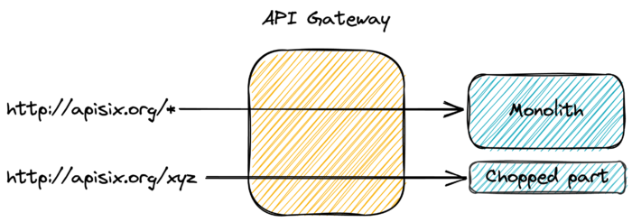

If you attend conferences or read technical articles, you could think that microservices are the correct and only way to build a system at the moment.

Despite some pushback from cooler heads, the default architecture is microservices.

In this post, I'd like to argue why it's wrong.

I'll first get back to the origin of microservices and the fundamental reason to use them.

Then, I'll describe why microservices don't fit most organizations' structures.

Afterward, I'll move to detail the root problem to solve. I'll conclude by proposing an alternative, less-risky approach.

## You're not doing microservices

Microservices seem ubiquitous. A conference [must have](https://www.scale-up-360.com/en/microservices-software-architectures#/) microservices in its name, or doesn't attract that many attendees. Some conferences are [entirely dedicated](https://devopscon.io/microservices-software-architecture/) to microservices.

On the developer side, Hype-Driven Development has hit full force. Everybody needs to put Microservices on their résumé to be considered for their next position. I regularly point out that our industry is crazy: most of the trends are driven by hype rather than reason.

Before going further, we need to define what are microservices. I'll limit myself to quoting Martin's Fowler bliki, as it captures their essence.
> In short, the microservice architectural style is an approach to developing a single application as a suite of small services, each running in its own process and communicating with lightweight mechanisms, often an HTTP resource API. These services are built around business capabilities and independently deployable by fully automated deployment machinery. There is a bare minimum of centralized management of these services, which may be written in different programming languages and use different data storage technologies. -- [Microservices, a definition of this new architectural term](https://martinfowler.com/articles/microservices.html)

The article goes on to describe the characteristics of microservices:

* Componentization via Services
* Organized around Business Capabilities
* Smart endpoints and dumb pipes
* Decentralized Governance
* Decentralized Data Management
* Infrastructure Automation
* Design for failure
* Evolutionary Design
* Products not Projects

In general, it goes all well until we reach the last point.

A project and a product are quite different: a project has a planned end date, while one develops a product until it's decommissioned.

Reality check: most organizations plan projects.

Hence, they cannot claim to do microservices (unless they want to prove that Fowler is wrong).

Before microservices became a hype, writers and speakers were careful to explain Conway's Law:
> Any organization that designs a system (defined broadly) will produce a design whose structure is a copy of the organization's communication structure. -- [Melvin E. Conway](https://en.wikipedia.org/wiki/Conway%27s_law)

*Unrelated but fun, I took a selfie with M. Conway*

*Ergo*, if you want to design a microservices architecture, you need to design your organization around small teams. Amazon Web Services indeed documents this approach:
> "We try to create teams that are no larger than can be fed by two pizzas," said Bezos. "We call that the two-pizza team rule." -- [Two-Pizza Teams](https://docs.aws.amazon.com/whitepapers/latest/introduction-devops-aws/two-pizza-teams.html)

The main idea behind the two-pizza team is that it should be **as independent as possible** to benefit from the highest velocity possible. Teams are characterized by being **self-organizing** and **autonomous**.

Given Conway's Law, when an organization consists of two-pizzas teams, it will eventually converge toward a microservice architecture. It begets the naïve question: are organizations that implement microservices organized around small autonomous teams?

Unfortunately, traditional organizations are still built around silos.

The only way to succeed with a microservice architecture is to arrange the organization around them. It's a huge organizational change! It requires time and goodwill and specialized help from change management experts.

What happens in reality, however, is entirely different. A technical lead or architect reads about microservices. They remember mostly the benefits part and forget the requirements and downsides part. In addition, because of their position, they see everything through technical-tainted lenses.

Because of Conway's Law, any such microservices effort is doomed to fail. The result will be an information system that doesn't benefit from most benefits of microservices (if any) while having to bear all of their downsides.

## Delivery time

In one of his other posts, Fowler mentions the pros and cons of microservices:

|                                  Benefits                                  |                             Costs                              |
| * Strong Module Boundaries * Independent Deployment * Technology Diversity | * Distribution * Eventual Consistency * Operational Complexity |
|----------------------------------------------------------------------------|----------------------------------------------------------------|

I think the main reason to adopt a microservice architecture is *independent deployment*:

* Many other ways are available to enforce strong module boundaries, with fewer issues
* Technology diversity may satisfy the technical aspirations of some members of an organization.  
  However, it does impair the organization as a whole, making hiring, training, and reducing the bus factor harder.

Now the question is, why is independent deployment desirable? Business doesn't care about deployment in itself: the department is just a huge black box.

In IT, two metrics are important:

* Implementation time; the time it takes for development to implement a specified feature
* Deployment time; the time it takes for integration to deploy the ready implementation in the production environment

But it's IT internal. The business cares only about how long it takes for its specification to be in production, not how it's broken down. Let's call *delivery time* the addition of implementation and deployment time.

Lowering delivery time is not a new issue and has found other solutions in the past.

Note that delivery time is different from *lead time*, one of the DevOps "golden" metrics. Lead time includes spec time: the delay between the basic idea and the finalized specifications.

My experience is that spec time involves a lot of back and forth between the business and IT.

Of course, it depends a lot on the maturity of the organization. Still, delivery time makes more sense in the scope of this post.

## Rules engines

Before people theorized Agile and Continuous Deployment concepts, organizations did deploy a couple of times a year. We named them release trains. And indeed, they were very akin to trains: if your feature was too late, you had to wait until the next release train. Depending on the frequency, it could mean a couple of months up to six. The business didn't want to miss the train!

Between release trains, the only accepted changes were bug fixes. It was a time-honoured tradition to squeeze one or two additional minor features with a bugfix so as not to wait for the next train. Sometimes, it worked; most of the time, the release manager, *a.k.a* the watchdog, didn't allow it. Sometimes, it was a power-play between the business, which wanted a deployment as soon as possible, and operations, which saw it as a risk.

The tension between business and IT found original solutions appeared. Among them were rules engines:
> A business rules engine is a software system that executes one or more business rules in a runtime production environment. The rules might come from legal regulation ("An employee can be fired for any reason or no reason but not for an illegal reason"), company policy ("All customers that spend more than $100 at one time will receive a 10% discount"), or other sources. A business rule system enables these company policies and other operational decisions **to be defined, tested, executed and maintained separately from application code** . -- [Business rules engine](https://en.wikipedia.org/wiki/Business_rules_engine)

(Emphasis mine)

As an example, imagine a tax-computing application. Taxes may change at arbitrary dates. Tax computation logic is moved to the Rules Engine to avoid putting unnecessary pressure on the IT department.

UI and routing code, as well as tax-unrelated business logic, all stay in the application.

The main idea is that the business must be able to configure the rules in production by themselves: no IT intervention is needed. Business experts can change the rules independently of the release cadence. Of course, with great powers come great responsibility.

Business is independent but bears the consequences of misconfiguration.

## Code parts change at different speed

We moved tax computation logic to the Rules Engine in the tax application above. Application designers inferred beforehand that this logic would be the most subject to change. Indeed, any change in the law could impact tax computation and require changes in the code.

It's better to decouple the tax computation's lifecycle from the regular application because they change at different speeds. Worse, the former changes at an arbitrary speed - the law, which is not under the business' control.

The tax example is a trivial one. Yet, across the continuum of applications, the fact is that some parts change more often than others. As a result, proponents of the microservice approach split the app into parts so they can change independently.

I've shown in the first section that it doesn't work without the right kind of organization.

Additionally, this approach has two design assumptions:

1. We can somehow divine the boundaries of the parts during the design phase
2. All parts need to change at an arbitrary speed.

Both are dead wrong.

The current consensus regarding microservices seems to start from a monolith. Only then, after some time, one can refine the inferred boundaries: it's time to split to microservices.

What if, instead of splitting to microservices, one would "chop" the part that changes the most frequently (or the most arbitrarily)? We could keep the monolith minus this part. Different implementation options for this part are available:

* Rules Engines - if you have experience and are happy with them
* Serverless functions
* "Regular" microservices
* Something else?

## How to chop?

Once you've analyzed the boundaries and isolated the part to "chop", the next problem is how to achieve it. In one of his famous articles, Martin Fowler (him again!) describes the Strangler pattern:
> An alternative route is to gradually create a new system around the edges of the old, letting it grow slowly over several years until the old system is strangled. Doing this sounds hard, but increasingly I think it's one of those things that isn't tried enough. In particular I've noticed a couple of basic strategies that work well. The fundamental strategy is EventInterception, which can be used to gradually move functionality to the strangler fig and to enable AssetCapture. -- [StranglerFigApplication](https://martinfowler.com/bliki/StranglerFigApplication.html)

One can use the pattern to migrate to a microservices architecture. Indeed, Chris Richardson includes it in its [portfolio of microservices patterns](https://microservices.io/patterns/refactoring/strangler-application.html). However, nothing prevents you from:

1. Migrating the part to something else, *e.g.*, a Serverless function
2. Stopping at any point in the process

The biggest issue is regarding clients. Migrating an HTTP endpoint to a different location will break them. However, with the help of a front-end API Gateway, it's a no-brainer.

Just route the request to the new endpoint location, and you're done.

## Conclusion

In this post, I've highlighted that microservices, as presented in conferences, are doomed to fail in most organizations.

Still, the current environment requires frequent updates to some parts of the code.

Because it's hard to know all parts before the first deployment, it makes sense to start with a simple monolith. With time, we can analyze which parts are the most frequently updated.

At this point, we can chop these parts into a separate deployment unit. Its nature - a micro-service, a serverless function, etc., doesn't change the overall architecture. To keep clients from breaking, we should update the routes in the API Gateway from the old endpoint to the new one.

In the next post, I will go through this process with a code base and explain each step.

**To go further**:

* [Microservices, a definition of this new architectural term](https://martinfowler.com/articles/microservices.html)
* [Conway's Law](https://en.wikipedia.org/wiki/Conway%27s_law)
* [The Strangler Fig Application](https://martinfowler.com/bliki/StranglerFigApplication.html)

*Originally published at [A Java Geek](https://blog.frankel.ch/chopping-monolith/) on April 24^th^, 2022*

*[IT]: Information Technology
