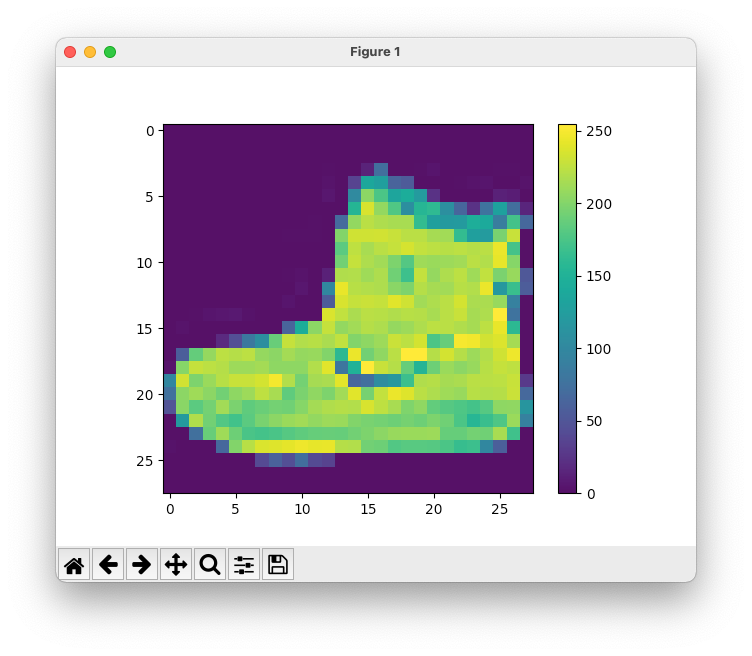
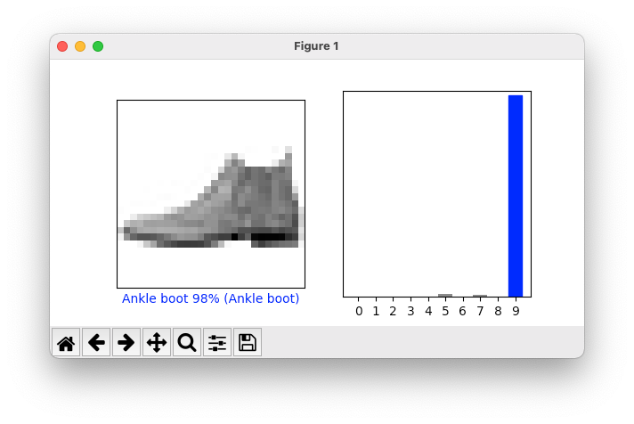
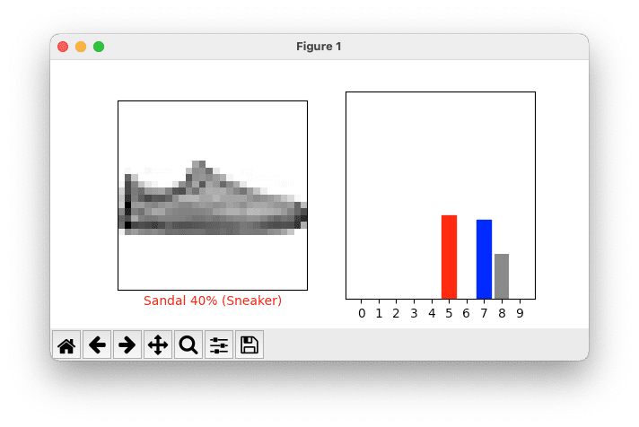
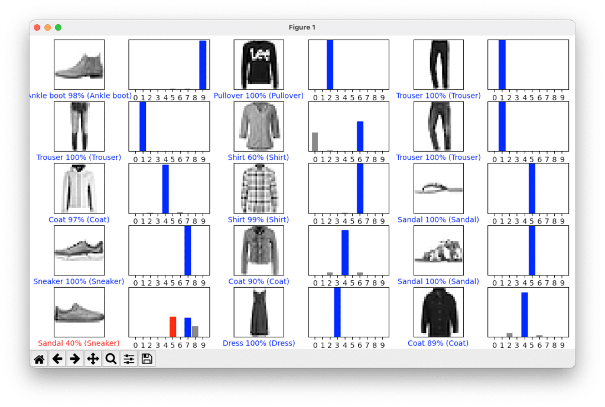
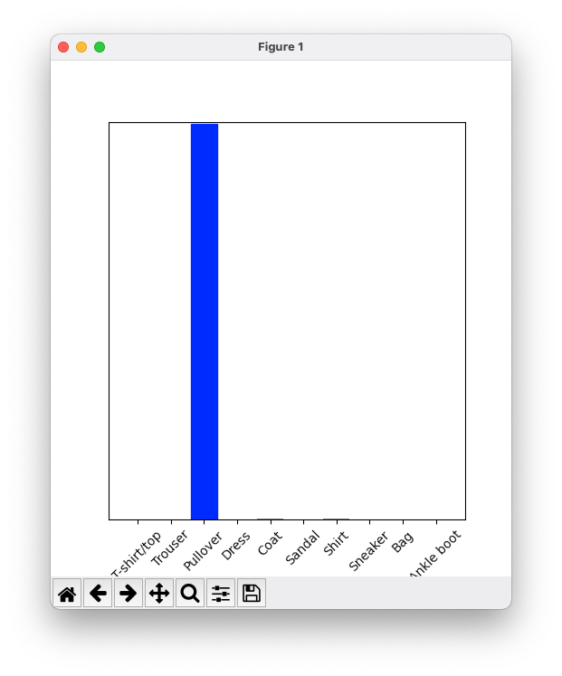

Hello and welcome back to the **[Java Panama Polyglot](https://foojay.io/today/java-panama-polyglot-part1/)** series where we are presenting quick tutorials or recipes on how to access native libraries written in other languages.

If you are new to Java's Foreign Function Access APIs ([Project](https://jdk.java.net/panama/)[Panama](https://jdk.java.net/panama/)) check out: [Panama4Newbies](https://foojay.io/today/project-panama-for-newbies-part-1/)

In [Part 2](https://foojay.io/today/java-panama-polyglot-swift-part-2/) you got a chance to learn about how to use Java Project Panama's (foreign function interface APIs) abilities to access native libraries written in Apple's [Swift language](https://www.swift.org).

Today, I will show you how to write Java code that can talk to a **locally installed** [Python](https://www.python.org) interpreter.

For the impatient the example code is at [Github.com](https://github.com/carldea/panama-polyglot/tree/main/python).

## Problem

As a Java developer, you want to execute Python script code. Also, you want to be able to access 3rd party Python libraries, such as Tensorflow.

## Solution

Use the `jextract` tool against the include file `Python.h` on the local system.

## Why ask Why?

The above **problem** and **solution** is rather short, that probably begs the question **why**? Or you might ask "Can you give me a high-level use-case that will help me understand the problem you want to solve?".

On [StackOverflow](https://stackoverflow.com), I often see questions posed like: "I'm trying to do `xyz`, but this happens, **why**?" and then later on, a (snarky) person will respond with "Why would you do xyz?!". Some folks will perceive it as condescending while some will perceive the question as concise and clear.

Because of this (regardless of how it is perceived), let me rephrase the problem as a question that might give you a little more context.

**Why is the ability for Java to talk to the locally installed Python interpreter such a great idea?**

**Quick Answer:** Leveraging the best of both worlds by using Java's mature ecosystem to interoperate with a Python environment and its installed 3rd party libraries.

**Long Answer:** In the Python world there are popular modules or libraries installed as add-ons to the locally installed Python interpreter. These libraries are often written in C/C++ that are accessed through Python's foreign function library (**[ctypes](https://docs.python.org/3/library/ctypes.html)**) that allows developers to interact in a similar way as Java's Project Panama (OpenJDK -\> C ABI).

Because of this tight integration, it's difficult or unlikely the library owners and maintainers will rewrite those 3rd party libraries in pure Java code. That's why it's a great idea to use Project Panama (FFI) to easily execute Python code and its 3rd party libraries (add-ons).

Below is an example of a Python script using the third party library [Tensorflow](https://www.tensorflow.org):

Install the Tensorflow library for Python3   

$ `pip3 install tensor-flow`

Import and use the Tensorflow library.

```python
import tensorflow as tf

// Train HAL 9000
```

## Brief History

In the past, Java developers would use [Jython](https://www.jython.org) ([JSR 223](https://www.jcp.org/en/jsr/detail?id=223)) to execute Python code on the JVM using Jython's implementation of the Python interpreter as a JVM language.

In other words, Python code is converted into Java byte code that runs on the JVM giving it the advantage of JIT compilation (speed), however the (pure Java) code is not able to access the 3rd party locally installed libraries such as [Numpy](https://numpy.org), [Scipy](https://scipy.org), Tensorflow, etc.

While you can use Panama FFI to talk directly to Tensorflow's C library, it is much easier to use the Python interpreter.

Besides, most of the official tutorials and documentation relating to Tensorflow refers to Python code examples.

Let's get back to the article on how to execute native Python script code.

## Assumptions

To complete this tutorial I assume you have installed the EA release of OpenJDK with Project Panama and its [environment variables](https://foojay.io/today/project-panama-for-newbies-part-1/) set. Also, you should be familiar with common shell commands.

## Requirements

To get started download and install the required software as follows.

* Project Panama EA release - Build 19-panama+1-13 (2022/1/18) - <https://jdk.java.net/panama/>
* On MacOS (Monterey) - Apple's tools (Clang)
  * MacOS - <https://developer.apple.com/technology/xcode.html>
* Python3 -- Python interpreter ([Download](https://www.python.org/downloads/))
* Pip3 -- Python 3 package **manager for Python**. If you've installed Python 3, pip3 is installed.
* Tensorflow - ML library for Python

Before getting started let's find out what version of the Python interpreter that is installed locally. Go to your command line terminal and type the following:

```bash
python3 --version

Python 3.10.2
```

## Installing 3rd party packages

Later in the tutorial you will need to install the following libraries (packages) for Python 3:

* **tensorflow** - develop and train ML models.
* **tensorflow-gpu** - Tensorflow with GPU support
* **pyplot**- a collection of functions that make matplotlib work like MATLAB
* **matplotlib** - library for creating static, animated, and interactive visualizations in Python

Later in this tutorial we will be demonstrating a brief introduction to machine learning using 3rd party libraries `Tensorflow` and `pyplot`. So let's upgrade and install the following modules:

```bash
sudo pip3 install --upgrade pip
sudo pip3 install --upgrade tensorflow
sudo pip3 install --upgrade tensorflow-gpu
pip3 install pyplot
pip3 install matplotlib
```

Before we begin you'll want to create a project directory `panama-polyglot/python/src` as shown below.

```bash
$ mkdir -p panama-polyglot/python/src
$ cd panama-polyglot/python
```

Above you'll notice the `-p` of `mkdir` to create multiple (nested) directories all at once. If you are on the Windows OS you'll want to create each individually. To run examples you'll want to reside in the `panama-polyglot/python` directory. Later you will create a Java application named `PythonMain.java` that will reside in the `src` directory.

Before creating and executing our **Hello World**example lets look at the following steps.

1. Generate Panama binding Java classes using `jextract`
2. (Optionally) Generate Panama source code using `jextract` to run in your IDE
3. Create a Java program to execute Python script code
4. Run Java program

## Generating Panama binding (Java) classes

Prior to calling the Python code inside Java you will need to generate Java Panama binding classes using `jextract`. These generated class files will be used on the `classpath` e.g. `-cp classes` when running the java application. Do the following to generate Java classes.

```bash
jextract  -l python3.10  \
   -d classes \
   -I /Applications/Xcode.app/Contents/Developer/Platforms/MacOSX.platform/Developer/SDKs/MacOSX.sdk/usr/include  \
   -I /Library/Frameworks/Python.framework/Versions/3.10/include/python3.10/  \
   -t org.python \
   /Library/Frameworks/Python.framework/Versions/3.10/include/python3.10/Python.h
```

The above use of `jextract` I've used (`-I`) include directory paths that are located on my MacOS (Monterrey), so if you are on a Linux or Windows OS you need to locate them to be specified.

Next, you'll can (optionally) create Java source code for your IDE. This allows you to preview the generated methods and functions capable of calling into the Python interpreter.

## Generating Panama binding (Java) source code

Enter the following to generate source code against the header file `Python.h`:

```bash
jextract  -l python3.10  \
   --source \
   -d generated/src \
   -I /Applications/Xcode.app/Contents/Developer/Platforms/MacOSX.platform/Developer/SDKs/MacOSX.sdk/usr/include  \
   -I /Library/Frameworks/Python.framework/Versions/3.10/include/python3.10/  \
   -t org.python \
   /Library/Frameworks/Python.framework/Versions/3.10/include/python3.10/Python.h
```

## Create a Java Application (Python Script Runner)

After generating classes and sources you will create a single Java application file `PythonMain.java` to be executed. Please cut and past the following into a file `PythonMain.java`. The file should reside in the `panama-polyglot/python/src` directory.

```java
import jdk.incubator.foreign.ResourceScope;
import jdk.incubator.foreign.SegmentAllocator;
import static jdk.incubator.foreign.MemoryAddress.NULL;
// import jextracted python 'header' class
import static org.python.Python_h.*;
import org.python.*;

public class PythonMain {
    public static void main(String[] args) {

        var script = "print(\"Hello World!!!\") ";
        Py_Initialize();
        try (var scope = ResourceScope.newConfinedScope()) {
            var allocator = SegmentAllocator.nativeAllocator(scope);
            var str = allocator.allocateUtf8String(script);
            PyRun_SimpleStringFlags(str, NULL);
            Py_Finalize();
            Py_Exit(0);
        }
    }
}
```

Above you'll notice the `var script` is assigned a Python script code of type Java string. This will be fed into the `PyRun_SimpleStringFlags(str, NULL)` function to be executed.

## Execute Java Python Script Runner App

Assuming you are in the `panama-polyglot/python` directory let's run the `PythonMain.java` application. To run the above code enter the following:

```bash
java -cp classes \
   --enable-native-access=ALL-UNNAMED \
   --add-modules jdk.incubator.foreign  \
   -Djava.library.path=/Library/Frameworks/Python.framework/Versions/3.10/lib \
   src/PythonMain.java
```

The output shows the following:

```bash
Hello World!!!
```

## How does it work?

When generating the binding code by using `jextract` the following shows the switches and their descriptions:

* `-l` To specify the python 3 library **python3.10**
* `-d classes` The destination directory of the compiled Panama code generated
* `-I` The include directories of the C language and Python header file directories
* `-t` The package namespace

The Java code from `PythonMain.java` does the following:

1. Initialize the Python environment
2. Try resource (create a Scope or session)
3. Create a native allocator that will create memory off of the Java heap
4. Using the `allocateUtf8String()`function to create a `MemorySegment` instance contain a C string of the Python script code.
5. Pass script code into the `PyRun_SimpleStringFlags()` function to be executed
6. Finalize the call
7. Exit Python interpreter

When interacting with the function `PyRun_SimpleStringFlags()` it is similar to using the Python REPL command line prompt where you are executing one statement at a time.

Now, that you know how to run Python script code lets do something more useful. In the next example we'll be executing Python script code to build and train a neural network (graph model) using the popular Tensorflow framework.

## Bonus Example - Tensorflow

In a more advanced example let's replace the `var script` value above with the official basic tutorial (script code) from Tensorflow.org [here](https://www.tensorflow.org/tutorials/keras/classification). Instead of the simple Python script code above (Hello World) lets create a **Java method** (`mnistClothes()`) that returns the Python script code as a `String`.

The basic tutorial uses the Tensorflow framework to use [MNIST data](https://www.tensorflow.org/datasets/catalog/fashion_mnist) of numerous images of clothing types such as a Coat, Shirt, Dress, etc. Each image is a (28x28 pixels) using 8 bit rgb color per pixel. Also associated to the training (images) data are labels containing the type of clothing. There are 10 types of clothing types:

* T-shirt/top
* Trouser
* Pullover
* Dress
* Coat
* Sandal
* Shirt
* Sneaker
* Bag
* Ankle boot

The basic Tensorflow tutorial shows you how to load and use training data to create models that can later predict what type of clothing type when given input test data. Let's replace the prior Python script code with a call to a static function `mnistClothes()` as shown below.

```java
var script = mnistClothes();
```

In your the existing `PythonMain.java` file create a `private static String mnistClothes()` method that returns a Java `String` of the Python Script code verbatim from the basic Tensorflow tutorial mentioned above. Cut and paste the following method into the Java `PythonMain` class.

```java
private static String mnistClothes() {
       return """

# TensorFlow and tf.keras
import tensorflow as tf

# Helper libraries
import sys
import numpy as np
import matplotlib.pyplot as plt

# Output Tensorflow version
print(tf.__version__)

# Load mnist images
fashion_mnist = tf.keras.datasets.fashion_mnist

(train_images, train_labels), (test_images, test_labels) = fashion_mnist.load_data()

class_names = ['T-shirt/top', 'Trouser', 'Pullover', 'Dress', 'Coat',
               'Sandal', 'Shirt', 'Sneaker', 'Bag', 'Ankle boot']

# Display first training image
plt.figure()
plt.imshow(train_images[0])
plt.colorbar()
plt.grid(False)
plt.show()

train_images = train_images / 255.0

test_images = test_images / 255.0

# Display a 5x5 grid of 25 training images
plt.figure(figsize=(10,10))
for i in range(25):
    plt.subplot(5,5,i+1)
    plt.xticks([])
    plt.yticks([])
    plt.grid(False)
    plt.imshow(train_images[i], cmap=plt.cm.binary)
    plt.xlabel(class_names[train_labels[i]])
plt.show()

# Create input, hidden, output layer of model
model = tf.keras.Sequential([
    tf.keras.layers.Flatten(input_shape=(28, 28)),
    tf.keras.layers.Dense(128, activation='relu'),
    tf.keras.layers.Dense(10)
])

model.compile(optimizer='adam',
              loss=tf.keras.losses.SparseCategoricalCrossentropy(from_logits=True),
              metrics=['accuracy'])

# Train model
model.fit(train_images, train_labels, epochs=10)

test_loss, test_acc = model.evaluate(test_images,  test_labels, verbose=2)

print ( ''' \nTest accuracy: ''' , test_acc )

probability_model = tf.keras.Sequential([model, 
                                         tf.keras.layers.Softmax()])

predictions = probability_model.predict(test_images)

def plot_image(i, predictions_array, true_label, img):
  true_label, img = true_label[i], img[i]
  plt.grid(False)
  plt.xticks([])
  plt.yticks([])

  plt.imshow(img, cmap=plt.cm.binary)

  predicted_label = np.argmax(predictions_array)
  if predicted_label == true_label:
    color = 'blue'
  else:
    color = 'red'

  plt.xlabel("{} {:2.0f}% ({})".format(class_names[predicted_label],
                                100*np.max(predictions_array),
                                class_names[true_label]),
                                color=color)

def plot_value_array(i, predictions_array, true_label):
  true_label = true_label[i]
  plt.grid(False)
  plt.xticks(range(10))
  plt.yticks([])
  thisplot = plt.bar(range(10), predictions_array, color="#777777")
  plt.ylim([0, 1])
  predicted_label = np.argmax(predictions_array)

  thisplot[predicted_label].set_color('red')
  thisplot[true_label].set_color('blue')

i = 0
plt.figure(figsize=(6,3))
plt.subplot(1,2,1)
plot_image(i, predictions[i], test_labels, test_images)
plt.subplot(1,2,2)
plot_value_array(i, predictions[i],  test_labels)
plt.show()

i = 12
plt.figure(figsize=(6,3))
plt.subplot(1,2,1)
plot_image(i, predictions[i], test_labels, test_images)
plt.subplot(1,2,2)
plot_value_array(i, predictions[i],  test_labels)
plt.show()

# Plot the first X test images, their predicted labels, and the true labels.
# Color correct predictions in blue and incorrect predictions in red.
num_rows = 5
num_cols = 3
num_images = num_rows*num_cols
plt.figure(figsize=(2*2*num_cols, 2*num_rows))
for i in range(num_images):
  plt.subplot(num_rows, 2*num_cols, 2*i+1)
  plot_image(i, predictions[i], test_labels, test_images)
  plt.subplot(num_rows, 2*num_cols, 2*i+2)
  plot_value_array(i, predictions[i], test_labels)
plt.tight_layout()
plt.show()

# Grab an image from the test dataset.
img = test_images[1]

print(img.shape)

# Add the image to a batch where it's the only member.
img = (np.expand_dims(img,0))

print(img.shape)

predictions_single = probability_model.predict(img)

print(predictions_single)

plot_value_array(1, predictions_single[0], test_labels)
_ = plt.xticks(range(10), class_names, rotation=45)
plt.show()

np.argmax(predictions_single[0])
       """;
    }
```

Assuming you've run the `jextract` tool to generate binding code (`classes` directory) you can execute `PythonMain.java` using the following:

```bash
java -XstartOnFirstThread \
   -cp classes \
   --enable-native-access=ALL-UNNAMED \
   --add-modules jdk.incubator.foreign  \
   -Djava.library.path=/Library/Frameworks/Python.framework/Versions/3.10/lib \
   src/PythonMain.java
```

Above, you'll notice the `-XstartOnFirstThread` added for **MacOS** as a way to avoid GUI thread issues using Python's `pyplot` display windows.

```python
# Output Tensorflow version
print(tf.__version__)
```

The above outputs the Tensorflow version number to the console as follows:

```
2.8.0
```

After loading the training data (28x28 images) of clothing and their associated labels (1-10 clothing types), the following is python code to display the first image to show color bar representing 8 bit color values.

```python
plt.figure()
plt.imshow(train_images[0])
plt.colorbar()
plt.grid(False)
plt.show()
```

The output of the first training image of a tennis show `plt.imshow(train_images[0])`. Since the pyplot window blocks you'll need to click on the close button on the title bar to **close the window**.

<figure class="wp-block-image size-full is-resized">
 
</figure>

Next, the Python code statements will display a 5x5 grid of the first set of training data (25 images) and their labels shown below. There are 10 different clothing types.

<figure class="wp-block-image size-full is-resized">
 
</figure>

Next, the code steps through training data that updates the models (using forward and back propagation). The loss function is the error score (smaller is better). The accuracy is the percentage of the likelihood of it predicting what type of clothing.

```
Epoch 1/10
1875/1875 [==============================] - 2s 698us/step - loss: 0.5024 - accuracy: 0.8225
Epoch 2/10
1875/1875 [==============================] - 1s 699us/step - loss: 0.3759 - accuracy: 0.8642
Epoch 3/10
1875/1875 [==============================] - 1s 705us/step - loss: 0.3354 - accuracy: 0.8783
Epoch 4/10
1875/1875 [==============================] - 2s 825us/step - loss: 0.3117 - accuracy: 0.8867
Epoch 5/10
1875/1875 [==============================] - 1s 774us/step - loss: 0.2963 - accuracy: 0.8911
Epoch 6/10
1875/1875 [==============================] - 1s 707us/step - loss: 0.2821 - accuracy: 0.8963
Epoch 7/10
1875/1875 [==============================] - 1s 711us/step - loss: 0.2694 - accuracy: 0.9004
Epoch 8/10
1875/1875 [==============================] - 1s 692us/step - loss: 0.2572 - accuracy: 0.9037
Epoch 9/10
1875/1875 [==============================] - 1s 706us/step - loss: 0.2490 - accuracy: 0.9074
Epoch 10/10
1875/1875 [==============================] - 1s 758us/step - loss: 0.2398 - accuracy: 0.9099
313/313 - 0s - loss: 0.3467 - accuracy: 0.8775 - 229ms/epoch - 730us/step
```

During the training phase the neural net will learn (train) by adjusting weights in each layer of the neural network graph (input, hidden, output). After training the models the code below will verify it's trained predictions:

```python
i = 0
plt.figure(figsize=(6,3))
plt.subplot(1,2,1)
plot_image(i, predictions[i], test_labels, test_images)
plt.subplot(1,2,2)
plot_value_array(i, predictions[i],  test_labels)
plt.show()
```

Below shows prediction's accuracy of the test data (image of an Ankle boot) was 98% confident it was able to predict the clothing type.

<figure class="wp-block-image size-full is-resized">
 
</figure>

Correct predictions show blue, and incorrect predictions will be in red. The following Python code will display a prediction that was inaccurate (in determining the clothing type).

```python
i = 12
plt.figure(figsize=(6,3))
plt.subplot(1,2,1)
plot_image(i, predictions[i], test_labels, test_images)
plt.subplot(1,2,2)
plot_value_array(i, predictions[i],  test_labels)
plt.show()
```

The output below shows a not so good prediction of a Sneaker. The model was 40% confident (red) that it was a sandal. While it was just under 40% (blue) confidence it was a sneaker.

<figure class="wp-block-image size-full is-resized">
 
</figure>

To show more predictions from test data the Python code below display a grid showing the first 15 images with a prediction chart having five rows and 3 columns. Each column contains an image of the clothing with a label and a bar chart of the prediction 0-9 (clothing type).

```python
# Plot the first X test images, their predicted labels, and the true labels.
# Color correct predictions in blue and incorrect predictions in red.
num_rows = 5
num_cols = 3
num_images = num_rows*num_cols
plt.figure(figsize=(2*2*num_cols, 2*num_rows))
for i in range(num_images):
  plt.subplot(num_rows, 2*num_cols, 2*i+1)
  plot_image(i, predictions[i], test_labels, test_images)
  plt.subplot(num_rows, 2*num_cols, 2*i+2)
  plot_value_array(i, predictions[i], test_labels)
plt.tight_layout()
plt.show()
```

The following is the output of the first 15 test images and their predictions:
 Showing the first 15 test predictions

Now that the models are updated (trained) and ready to predict whether an image is one of the 10 clothing types we can complete the tutorial by testing with a single image. The following Python Code will allow you to pass in a single image (Using the 2nd image in the test data).

```python
# Grab an image from the test dataset.
img = test_images[1]

print(img.shape)
```

Outputs the image's pixel dimensions:

```
(28, 28)
```

(note: Text steps are from Tensorflow.org's tutorial)

[`tf.keras`](https://www.tensorflow.org/api_docs/python/tf/keras) models are optimized to make predictions on a *batch*, or collection, of examples at once. Accordingly, even though you're using a single image, you need to add it to a list:

```python
# Add the image to a batch where it's the only member.
img = (np.expand_dims(img,0))

print(img.shape)
```

Outputs a batch containing one member.

```
(1, 28, 28)
```

Now predict the correct label for this image:

```python
predictions_single = probability_model.predict(img)

print(predictions_single)
```

Below is the array of 10 values of predictions (percentages) for the 10 clothing types (labels). Each item is a prediction (percentage) of a clothing type. e.g. The third item is a value of 99.8% with a prediction (confidence) that the image is a Pullover.

```
[[8.26038831e-06 1.10213664e-13 9.98591125e-01 1.16777841e-08
  1.29609776e-03 2.54965649e-11 1.04560357e-04 7.70050608e-19
  4.55051066e-11 3.53864888e-17]]
```

The code below will display the prediction in a chart window.

```python
plot_value_array(1, predictions_single[0], test_labels)
_ = plt.xticks(range(10), class_names, rotation=45)
plt.show()
```

Output of a single image prediction:

<figure class="wp-block-image size-full is-resized">
 
 <figcaption>
  Prediction of single image is a Pullover
 </figcaption>
</figure>

So, there you have it -- Java's Panama talking to Python's interpreter. Of course we've only scratched the surface in terms of interacting with the Python interpreter. This article's objective was to just get your feet wet.

## Conclusion

We began this article by posing the problem as a question to help understand the use case of Java's ability to interoperate with a locally installed Python interpreter.

This allows Java developers to indirectly access native 3rd party Python packages (add-ons).

After installing dependencies, you got a chance to use `jextract` to target the `Python.h` (C include) file to generate Java foreign function access (Panama) binding code.

Once binding code is added to the class path, you were able to create and execute a Hello World example.

Here, you learned how Java code can execute Python script code (`PythonMain.java`).

Lastly, you got a chance to learn about machine learning using the Tensorflow framework.

In Java code, you replaced "hello world" Python script code with the example from Tensorflow.org.

This Python script code is based on the official Tensorflow basic tutorial on training models to predict test images from the [MNIST](https://www.tensorflow.org/datasets/catalog/fashion_mnist) dataset.

As always, feedback is welcome!

Next, in our final article ([Part 4](https://foojay.io/today/java-panama-polyglot-rust-part-4/)) of Panama Polyglot series, we will look at how Java can talk to the Rust language.
