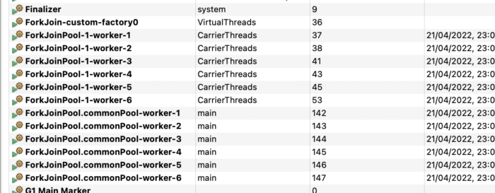
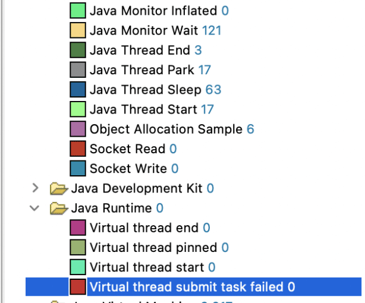
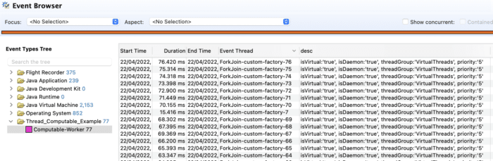
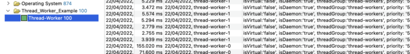

The goal of this article is to examine known facts about an upcoming Java threading model extension.

No, no-worries, the current Java threading model remains but behind the curtains something good is already knocking on the virtual door.

Yes, we are talking about JEP-425: Virtual Threads.

## Knocking on current concurrency limits

Let's first look at the current Java threading model. It provides an implementation of the Thread class. A Thread can be considered a Java concurrency unit which can execute so-called *Runnable* tasks. The instance of a Thread class is also an object but there is a bit more happening behind the scenes.

For example: each newly created Thread gets its own stack allocated to store local variables, method calls, references which are pushed on top during execution inside the current Thread scope.

The Thread will end after task termination by calling the method join(). It may be mapped 1:1 to the platform thread managed by the underlying system that manages the executed instruction scheduling.

As the underlying platform is not able to create an unlimited number of the platform threads, it becomes obvious that the current Java threading model needs to be used wisely and monitored in order of new thread creation.

The limiting factor is mainly caused by the available resources (CPUs, memory etc.) although Java itself may give a feeling otherwise.

```
try(ExecutorService executor = Executors.newSingleThreadExecutor(THREAD_FACTORY)){
   executor.execute(() -> … );
}
```

Example 1. Single thread executor executing a *Runnable* task

Over the past decades a concurrent program written in Java was capable of executing those *Runnable* tasks in parallel, meaning at once. Nowadays Java already provides the concepts of *Executors* (Example 1.) or *Thread Pools* (Example 2.) that help developers to administrate available platform resources and avoid unwanted system resources usage, eg. *new Thread()* and *start()*calls.

```
try( ExecutorService executor = Executors.newFixedThreadPool(10, THREAD_FACTORY)){
   executor.submit(() -> … );   
}
```

Example 2. Pool of fixed initiated thread submitting a *Callable* task

Since the Java SE 8 release Java also contains the *ComputableFeature* concept (Example 3.) which helps to execute anachronous tasks in isolated computation and runs a common thread pool by default. To be more precise it uses the common *ForkJoinPool* (Image 1.)

The ForkJoin framework was another big improvement back in the Java SE 7 release. Its goal was facilitating the ability to properly utilize all available processor cores, but it could have some drawbacks caused, for example, by unwilling executors usage (Example 3.)

```
record ComputableTask(AtomicInteger counter, int failedCycle) implements Runnable {
   @Override
   public void run() {
      // May thrown an exception
       readFileContent(counter, failedCycle);
       System.out.printf("""
               DONE: thread: '%s', cycle: '%d', failedCycle:'%d'
               """, Thread.currentThread().getName(), counter.get(), failedCycle);
   }
}
...
completableFuture.thenRun(new ComputableTask(counter, failedCycle));
... 
Example output:
DONE: thread: 'main', cycle: '1', failedCycle:'2'
DONE: thread: 'ForkJoinPool.commonPool-worker-1', cycle: '2', failedCycle:'2'
FINISHED: cycles:'100'
```

Example 3. Using *ComputableFuture* may come with drawbacks such as not terminable execution, debugging or meaningful StackTrace

To be fair as Java platform is highly multi-threaded therefore we talk about the concurrency we must consider also garbage collectors, debuggers, profilers or other technologies are influenced by the "threading game".

## Meeting Virtual Threads

Okay, that's what we currently have. Something exciting is going to happen. The next upcoming big concurrency model extension. These are the Virtual Threads. I'll explain what they are, where they are coming from and why we should want them! The motivation may be obvious. Let's refresh the background.

The idea of "***thread-sharing*** ", introduced by a thread pool (*ForJoinPool* , pool etc), across tasks may help to improve throughput, but compared to "***thread-per-request*** " style it may have significant drawbacks. The idea of "***thread-per-request***" allows code to be maintainable, understandable and debuggable. This style allows one to perform and observe the task from the beginning till the end (root cause easy to identify). Thread-sharing complicates all this.

```
...
var threadFactory = new ThreadFactory() {
  ... 
  @Override
  public Thread newThread(Runnable r) {
    var t = new Thread(threadGroup, r, "t-" + counter.getAndIncrement());
    t.setDaemon(true);
    return t;
  }
};
...
var executor = Executors.newFixedThreadPool(THREADS_NUMBER, threadFactory);
for (int i = 0; i < EXECUTION_CYCLES; i++) {
  executor.submit(new ThreadWorker(i, MAX_CYCLES, ALLOCATION_SIZE));
}
...
```

Example 4. Current thread-per-request approach with fixed pool size and factory

Well, here's some good news. Virtual Threads are aiming to maintain "thread-per-request" style to bring clarity to the code execution and maintain understandable thread structure. Virtual Threads' approach looks promising as its attempt is to utilize operating system resources (carried by platform thread, Image 1.,) and maintain the easily understandable code (compare Examples 4. and 5.).

There are two ways how the Virtual Thread can be created:

* Executors.newVirtualThreadPerTaskExecutor(threadFactory) (Example 4.)
* Executors.newVirtualThreadPerTaskExecutor()

Both create a new Virtual Thread per task.
 Image 1.: Common ForkJoin thread pool is shared with Virtual Threads and even custom Factory and each virtual thread belongs to the "VirtualThread" group.

A virtual thread is shared (not CPU bound, Image 1) and carried across a platform thread (bound to the CPU). The user must therefore not make any assumption about its assignment to the platform thread. These virtual threads are cheap and should be created per short living task and they should never be pooled due to the design (Image 3.).

```
var threadFactory = Thread.ofVirtual()
               .name("ForkJoin-custom-factory-", 0)
               .factory();
var counter = new AtomicInteger(0);
var failedCycle = new Random().nextInt(CYCLE_MAX - 1) + 1;
try (var executor = Executors.newThreadPerTaskExecutor(threadFactory)) {
  for (int i = 0; i < EXECUTION_CYCLES; i++) {
    executor.submit(new ComputableTask(counter, failedCycle));
  }
}
```

Example 5. The Java SE 19 proposed "newThreadPerTaskExecutor" method that runs a thread per executed task and thread factory that serves a virtual thread

Virtual threads allow the execution of hundreds of tasks concurrently (!) which may have otherwise resulted in JVM crashes or out-of-memory exceptions by utilizing a common thread model (Example 4. With for example THREAD_NUMBER = 10_000).

### A few things to remember

A virtual thread **always** runs **as** a **Daemon** thread with **NORM_PRIORITY** , which means that usage of the setter has no effect. As the Virtual threads are carried by the active threads, it can not be a part of any **ThreadGroup** . Usage of Thread.getThreadGroup returns "*VirtualThreads*".

A virtual Thread has **no permission** while running with Security Manager, which is already deprecated anyway (JEP-411, Java SE 17, Reference 4.)

As has been already mentioned the Virtual Thread behaves pretty much like normal threads which implies that they can use a thread local and thread local inheritable variables (carefully as virtual thread should never be pooled)

### Remember one more thing

Java SE 19 is also coming with another quite important improvement. The *ExecutorService* now extends *AutoCloseable* interface and is recommended to use the "*try-with-resource*" construct. This goes nicely in hand with the intent of the finalization removal (JEP-421, Reference 3.)

An additional extension that is related to the upcoming Virtual Thread are Java Flight Recorder Events
 Image 2.: Upcoming Java Flight Recorder Events for Virtual Threads

### Almost no darksiders

There may be some potential drawbacks. One is related to the fact that VirtualThread is planned to use a common thread pool, the thread pool also used by other processes running in the JVM, such as the ForkJoin framework (Image 1.). This may hypothetically cause an out of memory exception in an attempt to allocate a thread stack or turn the application into thread starving.

Another challenge is a potential incompatibility with existing concurrency code as for example the ThreadGroup always returns the value "*VirtualThreads*" but the fact is that it can not be destroyed, resumed or stopped. Those methods aways cause an exception. ThreadMXBean is intended to be used only for platform threads and some other...

## Conclusion

 Image 3.: ComputableTaskEvent emitted by the task. It shows the Virtual Threads usage. Virtual Threads are served by the factory (Example 5.)

The concept of virtual threads looks very promising. It does not only help to increase the application throughput by running a much bigger number of concurrent tasks together (Image. 3) but it also provides a framework to "theoretically" easily refactor already existing code (Example 5. thread-per-request style, see section "Almost no darksiders").

After all, JEP-425 is still under heavy development and we should be looking forward to the upcoming results in Java SE 19.

To test the current state you can check the GitHub Project (Reference 5.)
 Image 4.: Traditional "request-per-thread" approach showing its limitations compared to Image 3.

## References

1. Project Loom Early-Access Build 19-loom+5-429 (2022/4/4), https://jdk.java.net/loom/
2. JEP-425: Virtual Threads (Preview), <https://openjdk.java.net/jeps/425#observability>
3. JEP-421: Deprecate Finalization for Removal, <https://openjdk.java.net/jeps/421>
4. JEP-411: Deprecate the Security Manager for Removal, <https://openjdk.java.net/jeps/411>
5. GitHub Java 19 Examples, https://github.com/mirage22/java19-examples
