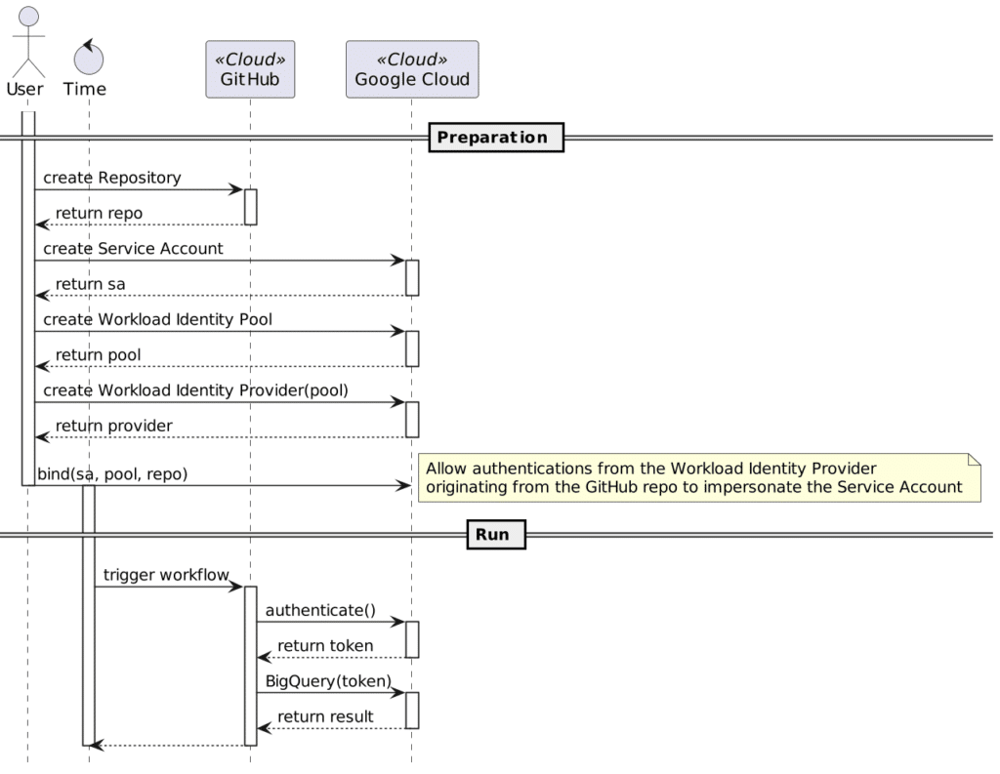

Recently, I designed a simple metrics-tracking system.

A Python script queries different providers' APIs for metrics, *e.g.*, Twitter, GitHub, etc.

The idea is to run this script each day, store them in Google BigQuery and provide an excellent data visualization in Google Data Studio.

I'm a big fan of automation, so I'm using GitHub Actions.

Accessing Google Cloud with a Service Account {#h2-0-accessing-google-cloud-with-a-service-account}
---------------------------------------------------------------------------------------------------

I query the different APIs with different Python libraries. All of them allow authenticating by passing a parameter. In general, it's a token. One can store the value in a GitHub secret, get it as an environment variable in the GitHub Action and use it in the code.

The Google BigQuery API doesn't work like this, though. The [documentation](https://cloud.google.com/bigquery/docs/reference/libraries) states that the `GOOGLE_APPLICATION_CREDENTIALS` environment variable should point to a file on the file system. Hence, you need to get to:

1. Create a Service Account
2. Download a JSON credentials file that references it
3. Store this file in a somehow secure way

The third point is indeed a big issue.

I considered a couple of alternatives:

* : Store the file along the repo, it's a private repository anyway.
* Hack the library: The Google Analytics Python library offers a function to pass the file's content itself. You can store the content in an environment variable; thus, keep the data in a GitHub secret.But I didn't find anything similar in the Google BigQuery library. If any Google developer reads this, please note that it's not a good developer experience. In the same language stack, I'd expect all libraries to be consistent regarding cross-cutting concerns, *i.e.*, authentication.The solution would have been to hack the library to offer the same functionality as the Analytics one.

I discarded the first option for obvious reasons; the second is because my Python skills are close to zero.

Authenticate to Google Cloud {#h2-1-authenticate-to-google-cloud}
-----------------------------------------------------------------

Securely authenticating to Google Cloud, or any other Cloud provider, from GitHub is a widespread concern. To manage this issue, GitHub provides the OpenID Connect flow:
> GitHub Actions workflows are often designed to access a cloud provider (such as AWS, Azure, GCP, or HashiCorp Vault) in order to deploy software or use the cloud's services. Before the workflow can access these resources, it will supply credentials, such as a password or token, to the cloud provider. These credentials are usually stored as a secret in GitHub, and the workflow presents this secret to the cloud provider every time it runs. However, using hardcoded secrets requires you to create credentials in the cloud provider and then duplicate them in GitHub as a secret. With OpenID Connect (OIDC), you can take a different approach by configuring your workflow to request a short-lived access token directly from the cloud provider. Your cloud provider also needs to support OIDC on their end, and you must configure a trust relationship that controls which workflows are able to request the access tokens. Providers that currently support OIDC include Amazon Web Services, Azure, Google Cloud Platform, and HashiCorp Vault, among others. -- [About security hardening with OpenID Connect](https://docs.github.com/en/actions/deployment/security-hardening-your-deployments/about-security-hardening-with-openid-connect#understanding-the-oidc-token)

The overall flow (simplified), is the following:



In short, during the *Run* phase:

1. The GitHub repo gets a *short-lived* token from Google Cloud.
2. Workflows on the same repo can call secured APIs on Google Cloud via Google libraries because the latter knows about the token.

The exact details are pretty involved; they go well beyond this entry-level blog post, and to be honest, I didn't read much deeper. However, GitHub and Google offer a GitHub Action to take care of these details.

Authenticate to Google Cloud is the name of the [GitHub Action](https://github.com/marketplace/actions/authenticate-to-google-cloud) that allows handling the authentication part. The action offers two modes: a JSON credentials file (again!) and Workload Identity Federation. provides the server part to make Github's OIDC calls work out-of-the-box.

Once you've set up Google Cloud, the GitHub workflow configuration is straightforward:

```yaml
jobs:
  metrics:
    runs-on: ubuntu-latest
    permissions:
      contents: 'read'
      id-token: 'write'
    steps:
      - uses: actions/checkout@v3                                         # 1
      - uses: actions/setup-python@v3                                     # 2
        with:
          python-version: 3.9.10
      - uses: 'google-github-actions/auth@v0'                             # 3
        with:
          service_account: '${SERVICE_ACCOUNT_EMAIL}'
          workload_identity_provider: 'projects/${PROJECT_ID}/locations/global/workloadIdentityPools/${WI_POOL_NAME}/providers/${WI_PROVIDER_NAME}'
      - run: 'python main.py'                                             # 4
```


1. Checkout the repo
2. Set up the Python environment
3. Authenticate to get the token. The Action writes the token in a Google-specific location, scratched along the work environment when the workflow finishes.
4. Enjoy your automatically-authenticated calls!

The GitHub Action documentation contains [all information](https://github.com/marketplace/actions/authenticate-to-google-cloud#setting-up-workload-identity-federation) to set up Google Cloud for Workload Identity Federation.

Conclusion {#h2-2-conclusion}
-----------------------------

In this post, I've highlighted the problem of using a Service Account file to authenticate on Google Cloud.

Fortunately, GitHub and Google Cloud have all the infrastructure available to get short-lived tokens securely.

In particular, the GitHub marketplace offers the Authenticate to Google Cloud Action. Its documentation is of really excellent quality.

I'd advise you to use it instead of less secured alternatives.

**To go further:**

* [BigQuery API Client Libraries](https://cloud.google.com/bigquery/docs/reference/libraries)
* [Authenticate to Google Cloud GitHub Action](https://github.com/marketplace/actions/authenticate-to-google-cloud)
* [Workload identity federation](https://cloud.google.com/iam/docs/workload-identity-federation)
* [About security hardening with OpenID Connect](https://docs.github.com/en/actions/deployment/security-hardening-your-deployments/about-security-hardening-with-openid-connect#understanding-the-oidc-token)

*Originally published at [A Java Geek](https://blog.frankel.ch/authenticate-google-cloud-github/) on May 1^st^, 2022*

*[YOLO]: You Only Live Once
*[WIF]: Workload Identity Federation
