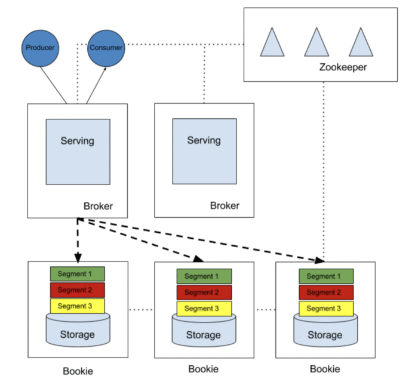
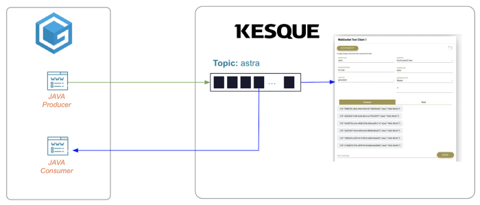
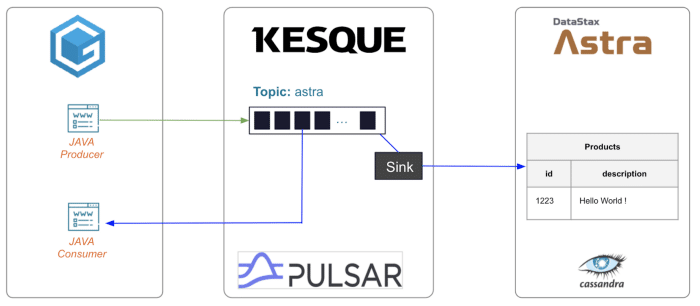

Twitch, YouTube, Instagram, Facebook — virtually every major brand nowadays uses live streaming to connect and engage their audience.

For enterprises and developers [building cloud-native applications](https://datastax.medium.com/build-your-first-app-with-javascript-node-js-and-datastax-astra-db-573abc238583), this growing trend creates a need for streaming technologies that can reliably handle the rush of massive amounts of data, while also being flexible and easy to manage for developers.

One such technology is [Apache Pulsar](https://pulsar.apache.org/)[®](https://cassandra.apache.org/_/index.html) — an open-source, distributed messaging and streaming platform that's easy to deploy, simple to scale, and packed with developer-friendly APIs.

So the next question is: how can you stream from Pulsar to [Apache Cassandra®](https://cassandra.apache.org/_/index.html), the powerful NoSQL database designed to support data-heavy applications in the cloud?

Join our beginner-friendly [Pulsar workshop on YouTube](https://www.youtube.com/watch?v=nF502PmFi_w) and learn how to connect Pulsar with Cassandra for streaming!

In this post, we'll set the scene with an introduction to Pulsar and guide you through four hands-on exercises where you'll use these free, cloud-native technologies: Katacoda, Kesque, GitPod, and [DataStax Astra DB](https://astra.dev/3N3jzE2). Each exercise will also be linked to the step-by-step instructions on the [DataStax Developers GitHub wiki](https://github.com/datastaxdevs/workshop-pulsar/wiki).

Let's dig in.

For a bit of background, Pulsar was originally developed by Yahoo! and open-sourced in 2016 as a cloud-native, distributed messaging and streaming platform. Today, it's a top-level [Apache Software Foundation](https://www.apache.org/) and is used by dozens of companies worldwide, including Comcast, Verizon Media, and (yours truly) DataStax.

Pulsar is largely favored by enterprises and developers for its superior resilience and lightweight compute process, which makes Pulsar ideal for real-time apps and streaming data between sensors and IoT devices. On a slightly more technical level, anyone using Pulsar will likely gush over the following features:

Pulsar represents both publish/subscribe messaging *and* queuing, where the consumer can subscribe to a topic in three different ways:

* **Shared subscription** where Pulsar shares the messages in that topic across all of its subscribed consumers.
* **Exclusive subscription**where every consumer gets their own copy of the data.
* **Fail-over subscription** provides the benefit of an exclusive subscription but if a consumer falls, Pulsar will send the data to a backup.

Additionally:

* **Designed for multi-tenancy:**Pulsar was built from the ground up as a multi-tenant system, which allows for a more cost-effective deployment that you can share across multiple teams and across multiple applications. This also applies to the next feature.
* **Seamless geo-replication:** With built-in [geo-replication](https://pulsar.apache.org/docs/en/administration-geo), Pulsar keeps your data safe by easily replicating persistently stored messages across multiple Pulsar clusters.
* **Better scaling:** Pulsar separates compute from storage, which makes it simpler for developers to expand capacity to hundreds of nodes.

These features not only make Pulsar a good fit for Cassandra, but also with any cloud-native architecture. Speaking of which, let's take a look at Pulsar's unique architecture.

Pulsar is a tiered, distributed system comprised of three components:

* [Apache BookKeeper](http://bookkeeper.apache.org/)[®](https://cassandra.apache.org/_/index.html): An open-source storage service that handles persistent storage of messages.
* [Apache ZooKeeper](https://zookeeper.apache.org/)[®](https://cassandra.apache.org/_/index.html): An open-source server that handles coordination tasks between distributed clusters.
* [Brokers](https://pulsar.apache.org/docs/en/concepts-architecture-overview/#brokers):A stateless component that mainly handles and load balances messages between producers and consumers, as well as store messages in BookKeeper instances (bookies).

 Figure 1: Architecture of a Pulsar cluster.

In the upper right of Figure 1, Zookeeper manages the metadata and you can use it to track where the data lives in your storage system. This system is at the bottom of the diagram and is known as BookKeeper. Each BookKeeper node is called a "bookie". The data is broken into ledgers and segments written to multiple bookies, so no single bookie holds it all.

In the middle of the diagram, we have the Pulsar brokers themselves, which are what talk to the producers and consumers. These basically take a logical model of topics and messages and turn them into storage that can be assigned to the bookies.

Now that you have some background, let's move on to the workshop where you'll learn how to use Pulsar and get familiar with the free technologies you can use to simplify your streaming setup.

In this workshop, we give you four simple "labs" that will show you how to connect Pulsar with Cassandra for streaming. Each lab is explained in detail on our [DataStax Developers GitHub](https://github.com/datastaxdevs/workshop-pulsar), and you can also follow along with our [YouTube Pulsar workshop video](https://www.youtube.com/watch?v=nF502PmFi_w).

There's nothing to install and no software to pay for, so flex your coding fingers and get a head start with each lab description below.

## Lab 1: Set up Apache Pulsar

In this first lab, you'll learn how to:

* Install Apache Pulsar from the tarball
* Configure infrastructure components in Pulsar
* Create a topic to store messages
* Read and write messages from the topic

To do all this without installing anything, you'll be leveraging [Katacoda](https://www.katacoda.com/), an interactive platform for software engineers to learn and experiment with different technologies.

Follow the instructions for [Lab 1 on GitHub](https://github.com/datastaxdevs/workshop-pulsar/wiki/LAB1_GettingStarted) to get started.

## Lab 2: Produce and consume messages with Kesque

In this second lab you'll meet [Kesque](https://kesque.com/), a fully managed cloud messaging service powered by Pulsar. As a side note, [DataStax acquired Kesque](https://techcrunch.com/2021/01/27/datastax-acquires-kesque-as-it-gets-into-data-streaming/) and now includes it as part of [Luna Streaming](https://www.datastax.com/products/luna-streaming), which is a completely free, production-ready distribution of Pulsar with handy admin and monitoring tools. We'll be releasing a revamped version of this workshop using Luna Streaming, so keep an eye on our [DataStax Developers channel](https://www.youtube.com/c/DataStaxDevs/featured)!

For now, you will simply use Kesque itself to:

* Create a topic
* Use the free IDE [GitPod](https://www.gitpod.io/) to create a producer and consumer in Java
* Create a message schema using the Kesque UI

To give you a better understanding, here's a simple diagram with how all these technologies will work together.
 Figure 2: Diagram showing how we'll use GitPod and Kesque for Lab 2.

Go ahead and follow the instructions for [Lab 2 on GitHub](https://github.com/datastaxdevs/workshop-pulsar/wiki/LAB2_Kesque).

## Lab 3: Connect Cassandra with Astra DB

Now it's time to connect Pulsar to Cassandra and create a database where you can store the messages sent from Pulsar/Kesque. But instead of installing Cassandra and dealing with all the operational complexity that comes with it, you can just use [Astra DB](https://astra.dev/3N3jzE2) and then connect it to Kesque.

Astra DB is a multi-cloud database-as-a-service (DBaaS) built on Cassandra. It's the simplest way to benefit from Cassandra's robust and highly scalable architecture — without the headache of managing the details yourself. So, in this lab you'll:

* [Sign up for a free Astra DB account](https://astra.dev/3N3jzE2)
* Create a database in Astra DB
* Create a table to store the data sent from Pulsar

Follow the instructions for [Lab 3 on GitHub](https://github.com/datastaxdevs/workshop-pulsar/wiki/LAB3_Astra).

## Lab 4: Stream from Pulsar to Cassandra

In this fourth lab, you'll finally start streaming. Here's the big picture of what you've set up so far and what's next.
 Figure 3: Diagram showing how the topic connects to GitPod and Astra DB.

In Lab 3, you set up your Astra DB database and created a table to store the data from Pulsar. Now you will connect Pulsar to Cassandra using a *sink*, which for the unfamiliar is a class or function designed to receive events and funnel them into external systems.

So, in this last lab you will:

* Create a sink in Pulsar/Kesque
* Connect the sink with Astra DB
* Watch the messages stream into your table in Astra DB

Follow the instructions for [Lab 4 on GitHub](https://github.com/datastaxdevs/workshop-pulsar/wiki/LAB4_Streaming).

By the end of this workshop, you will have used completely free technologies to successfully stream from Pulsar to Cassandra. Congratulations!

Remember: if you need more guidance during this workshop, you can follow the whole thing step-by-step with the [workshop video on YouTube](https://www.youtube.com/watch?v=nF502PmFi_w) (skip to minute 19 for the labs). Lastly, if you get stuck or just want to chat with our generous community, [join the conversation on Discord](https://discord.com/invite/pPjPcZN).

*Explore more free tutorials on our* [*DataStax Developers YouTube channel*](https://www.youtube.com/c/DataStaxDevs/featured)*, and* [*sign up to our mailing list*](https://docs.google.com/forms/d/e/1FAIpQLSfEtzzVauuFpFJWUiepYndqchBpNsaOwm6raPJDsMt9nTvMbw/viewform)*to get notified about upcoming community events and workshops. You can also follow* [*DataStax on Medium*](https://datastax.medium.com/)*to keep up with the latest in all things data, Cassandra, Pulsar, streaming, and more.*

1. [YouTube: Bring Streaming to Cassandra with Apache Pulsar](https://www.youtube.com/watch?v=nF502PmFi_w)
2. [GitHub: Workshop Apache Cassandra and Apache Pulsar](https://github.com/datastaxdevs/workshop-pulsar)
3. [7 Reasons We Chose Apache Pulsar over Apache Kafka](https://www.datastax.com/blog/2019/05/7-reasons-we-chose-apache-pulsar-over-apache-kafka)
4. [DataStax Astra DB](https://astra.dev/3N3jzE2)
5. [DataStax Luna Streaming — Apache Pulsar Distribution](https://www.datastax.com/products/luna-streaming)
6. [Pulsar connector overview](https://pulsar.apache.org/docs/en/io-overview/)
7. [Discord: Fellowship of the (Cassandra) Rings](https://discord.com/invite/pPjPcZN)
8. [DataStax Academy](https://auth.cloud.datastax.com/auth/realms/CloudUsers/protocol/saml/clients/absorb)
9. [DataStax Certifications](https://www.datastax.com/dev/certifications)
10. [DataStax Workshops](https://www.datastax.com/workshops)
