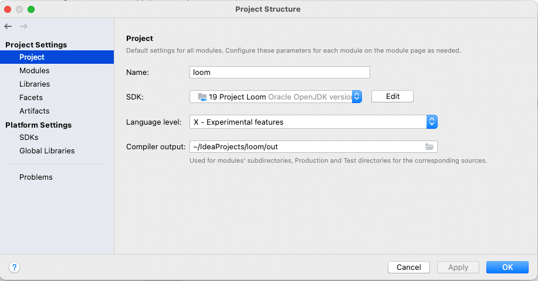
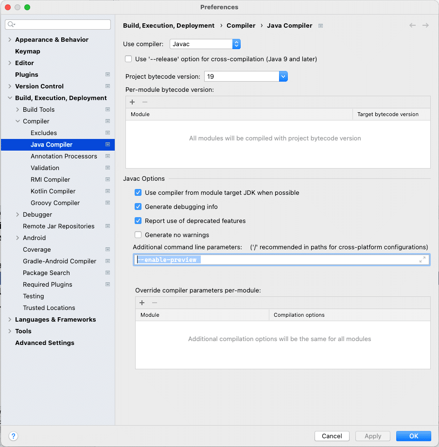
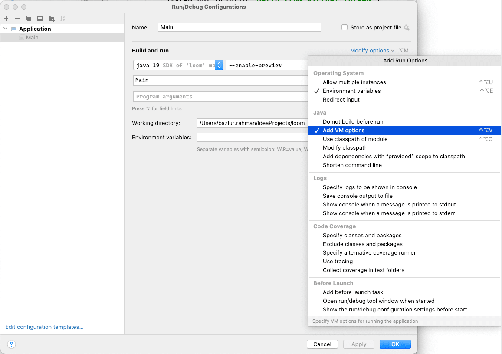
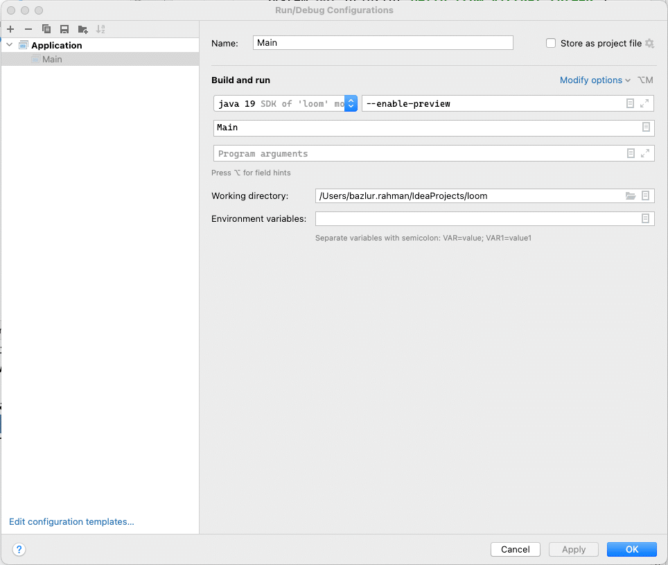

[JEP 425: Virtual Threads (Preview)](https://openjdk.java.net/jeps/425) has been proposed recently. It has been a long-awaited feature in Java. I wanted to give it a try. So I download the [early release](https://jdk.java.net/loom/) of JDK which has the [project loom](https://wiki.openjdk.java.net/display/loom/Main) in it. However, it is under preview.

The following snippet was pretty much my first program written for testing virtual threads.

```java
public class Main {
    public static void main(String[] args) throws InterruptedException {
        Thread.startVirtualThread(() -> {
            System.out.println("Hello from virtual thread");
        }).join();
    }
}
```

It is so simple that I could just run it in the command line using the [source code launcher](https://openjdk.java.net/jeps/330) :

```
java --enable-preview --release 19 Main.java
```

However, it needed a bit of [yak shaving](https://en.wiktionary.org/wiki/yak_shaving). I needed to download the JDK, extract the tarball, set the java home, etc. I manage multiple JDKs using [SDKMAN](https://sdkman.io/); it doesn't have it since it's still in early access release. So I had to let SDKMAN know it manually.

Then I figured, maybe, perhaps an IDE could help me here. So I opened my favourite IDE, which happens to be [IntelliJ IDEA](https://www.jetbrains.com/idea/). I created a project and set up the JDK using the following window-



Then when I tried to run, it didn't allow me to run the code since the virtual thread was still in preview. Here are the steps I had to go through in IntelliJ IDEA.

First, you need to go preference, and then **Build, Execution, Deployment** and then Select Java Compiler.



At the bottom, there is a box named the additional command line parameter. Add the following line there-

```
--enable-preview
```

And then go to the run configuration. Select the modify options and Mark the Add VM options.



You need to add

```
--enable-preview
```

there as well.



That's it.

Now you can run the project loom from IntelliJ IDEA.
