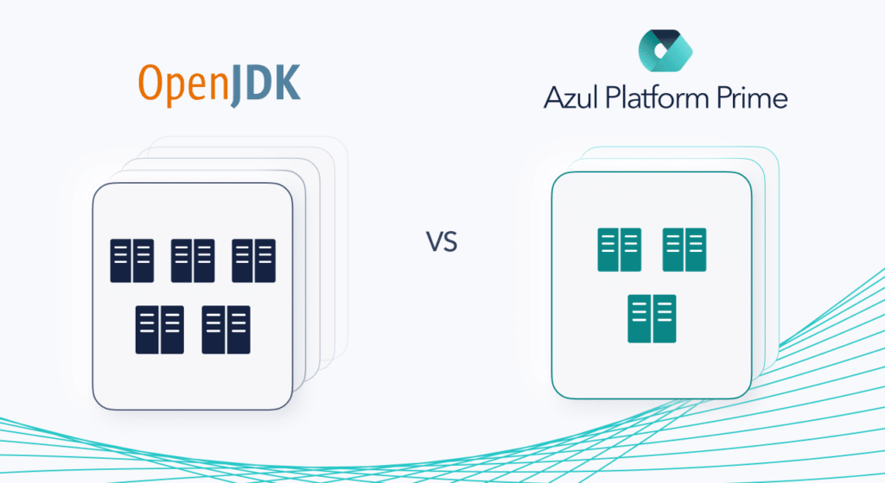

Building real-time data pipelines and streaming applications just got more cost-effective.

Kafka is great because it's horizontally scalable, fault-tolerant, and runs in production for thousands of companies – and we figured out how to help you get more mileage out of it.

## How We Did It

In [a recent post](https://www.azul.com/blog/kafka-throughput-on-azul-platform-prime-vs-openjdk/) we compared Kafka throughput on Azul Platform Prime versus OpenJDK, noting that on our config Azul Platform Prime reaches 45% higher max throughput than OpenJDK.

In this experiment, we took a more practical approach.

We looked at the maximum throughput that we could achieve with a 5 node Kafka cluster on OpenJDK, then looked at how many nodes we could reduce the cluster by while still hitting the same throughput on Azul Platform Prime.

## Less Nodes and More Throughput

We found that a 5-node cluster on OpenJDK could reach a max throughput of 333,879 transactions per second (TPS), while Azul Platform Prime was able to **reach 346,058 TPS on only 3 nodes, for a 40% reduction in infrastructure costs.**

If you run your cluster on AWS r4x machines, your cost and ROI breakdown looks like this:

|---------------------------------|------------|
| AWS r4x hourly price            | $1.008     |
| Yearly price (1 node)           | $8,830.08  |
| OpenJDK nodes                   | 5          |
| OpenJDK total price             | $44,150.40 |
| Azul Platform Prime nodes       | 3          |
| Azul Platform Prime total price | $26,490.24 |
| Total Savings                   | $17,660.16 |

## New Ways to Improve Your Architecture

Reducing nodes need and improving TPS simplifies things a lot, especially for common architecture challenges. But what's really behind the ROI? [Here's how it works](https://www.azul.com/resources-hub/solution-briefs/sb-kafka):

* **Even Faster Streaming: Falcon Compiler**Deliver better Kafka performance through better intrinsics, more inlining and fewer compiler excludes
* **Reduce Pauses:**Azul C4 Garbage Collector Improve quality of services for Kafka users by eliminating Java pauses, stalls, and stop-the-world failures
* **Greater Throughput, Consistent Response Times**Have confidence allocating heaps on each node to improve carry capacity
* **Infrastructure Cost Savings** Improved performance on fewer nodes means you get more out of infrastructure, use less instances
* **ZooKeeper** In addition to Kafka, deploy for similar improvements on Apache ZooKeeper

## Our Benchmark Details

We used the same Azul Kafka Benchmark <https://github.com/AzulSystems/kafka-benchmark> we used in the previous article. The AMI and instance sizes were as follows:

* AMI: ami-0747bdcabd34c712a (UBUNTU18)
* 1 node (c5.2xlarge) – for Zookeeper and kafka-e2e-benchmark. Zookeeper Heap: 1GB
* 3 nodes (i3en.2xlarge) – for Kafka brokers. Kafka Broker Heap: 40GB
* 1 node (m5n.8xlarge) – for load generator. Note that the size of the node running the load generator has a big impact on the scores. When we ran the load generator on a smaller AWS instance type we saw, it became a bottleneck and, as a result, Azul Platform Prime scores were lower compared to OpenJDK.

The only OSS configuration we performed on the instances was to configure Transparent Huge Pages:

$ echo madvise \| sudo tee /sys/kernel/mm/transparent_hugepage/enable  

$ echo advise \| sudo tee /sys/kernel/mm/transparent_hugepage/shmem_enabled  

$ echo defer \| sudo tee /sys/kernel/mm/transparent_hugepage/defrag  

$ echo 1 \| sudo tee /sys/kernel/mm/transparent_hugepage/khugepaged/defrag

For Kafka configuration, we used the following parameters:

* consumers: 12
* producers: 30
* partitions: 12
* rf=2
* batchSize: 0
* lingerMs: 0
* mlen: 1024
* targetRate=0
* time=10m

Obviously, this is a very simple Kafka config with few tuning options specified, so your mileage on your Kafka installation will differ. Also, check out our free [Guide on Increasing Kafka Event Streaming Performance](https://www.azul.com/blog/a-guide-on-increasing-kafka-event-streaming-performance/). We hope this experiment shows what the power of Azul Platform Prime can do for your Kafka infrastructure costs.

Azul Platform Prime is free for evaluation and development: [Download Azul Platform Prime](https://www.azul.com/blog/a-guide-on-increasing-kafka-event-streaming-performance/)
