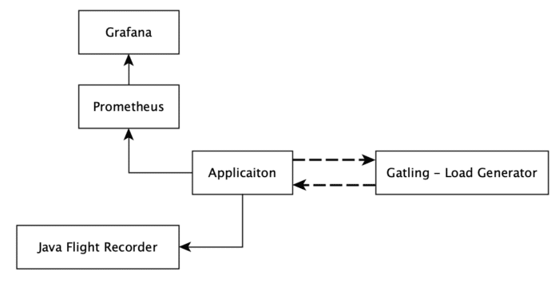
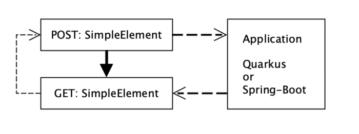
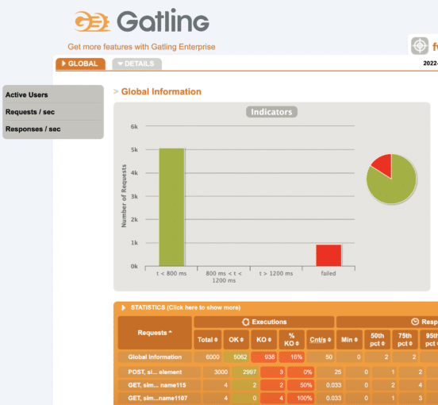
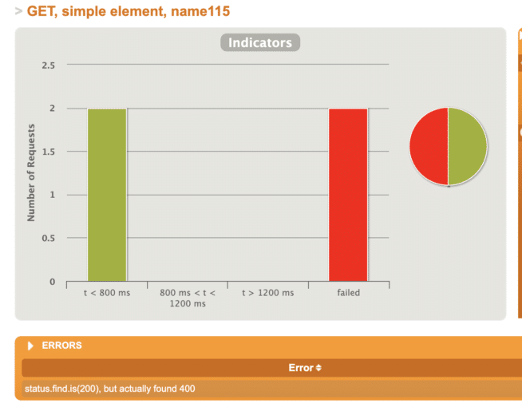
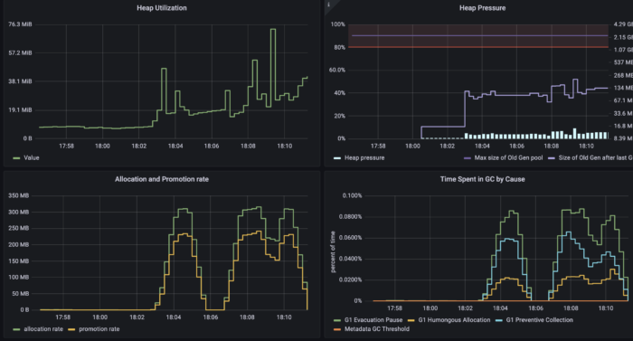
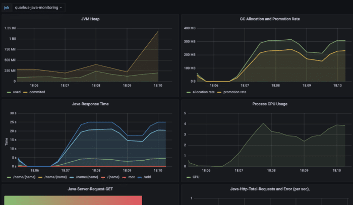
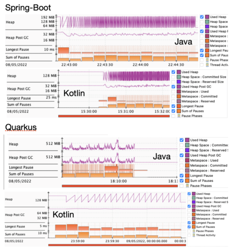
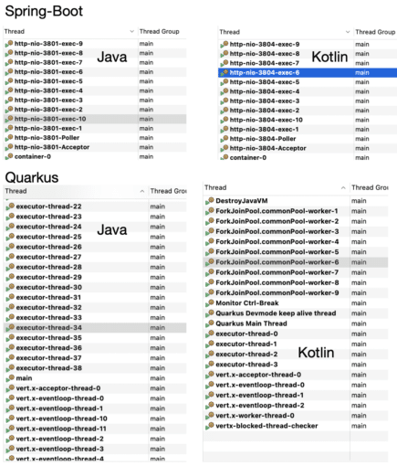
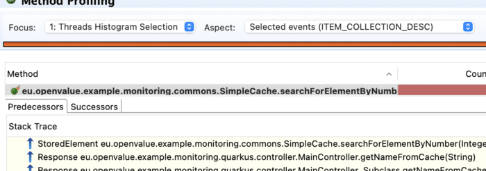

Managing available resources on demand in a cloud environment can be a very challenging topic. It is worth the effort, since it may however utilise resources far more efficiently.

Companies or projects are therefore very keen to migrate to the Cloud providers, such as Azul, AWS, Google Cloud or others. For software engineers one truth still stands, also in the Cloud: It's recommended to understand the behaviour and limitations of our deployed JVM application (or pods, the smallest deployable instance in Kubernetes).

The Java platform is multi-threaded and even if you don't expect to use any of available APIs for this, the platform still initiates multiple daemon threads running in the background. Such threads are not only for cleaning and reclaiming unused memory.

Those threads belong to the platform but what about frameworks? Java frameworks try to serve a lot of operation capacity, therefore they are initiating a collection of helper threads and we are going a bit under the hood.

In this article we will take a closer look at how popular frameworks work under the hood, namely Quarkus and Spring Boot, and how many threads they initiate to serve their results.

Let us now together take a journey through examples and start off with examining the differences between monitoring and profiling.

Building and Cloud Applications {#h2-0-building-and-cloud-applications}
-----------------------------------------------------------------------

For the purposes of this article a couple of JVM applications have been created. Let's first introduce all players name by name and the reason for their presence. The used technology stack and their interaction is very simple and transparent (Figure 1.)
 **Figure 1.** : Simplified pods interactions during each of our tests

All applications are running in a Kubernetes cluster, but the Gatling node remains outside of the cluster. The Gatling node simulates user interaction with the deployed pods (all single instances).

Since nowadays Quarkus and Spring-Boot are probably the most popular frameworks for new projects, these two "winners" are selected. I've written the application in both Java and Kotlin so we can also compare those. Also important: each of the applications above has implemented a similar API. They expose GET and POST endpoints to add and retrieve a *SimpleElement* from the in-memory cache (Figure 2.). Purposely the internal cache contains an issue that is not obvious and each application uses a similar configuration of it.
 **Figure 2.** : Endpoints setup for each application

A similar load scenario is executed against each deployed application (Figure 2.)

The applications are deployed into the kubernetes cluster in a way they are isolated from each other. The Grafana and Prometheus nodes are also present in the cluster to collect data-points from the application pods during the simulation tests (Listing 1.).

```
$ kubernetes.sh --deploy
$ kubectl get pod 
NAME                                 READY   STATUS    RESTARTS   AGE
grafana-8657696bb4-95rrd             1/1     Running   0          23s
prometheus-7df944b498-v7c8k          1/1     Running   0          23s
quarkus-java-84fff97d65-2knft        1/1     Running   0          23s
quarkus-kotlin-57678d4449-gnrs4      1/1     Running   0          23s
spring-boot-7b8d5df489-f9jbc         1/1     Running   0          23s
spring-boot-kotlin-cc8688d9d-rlt4d   1/1     Running   0          23s
```


**Listing 1**.: deploy script for deploying infrastructure and monitoring pods

Get Some Load {#h2-1-get-some-load}
-----------------------------------

 **Figure 3.**: generated report by Gatling

For the article purposes a kuberntesse test cluster has been created by using a Docker desktop. Applications are deployed there and running , which is nice, but in order to get some data in Gatling it is quite helpful to have some interaction with them.

Why Gatling? Well, there are a couple of options on how to generate load. Our load scenario creates **2000** active users over **3 minutes**. During the simulation new instances will be created and checked for their presence inside the system. It is quite a load when we consider the number of active users.

There are a couple of options on how to generate such load, one of them could be JMeter, but each scenario has two steps in which values must be shared (Figure 2.). In such cases JMeter is not the best option due to its limitations. Luckily there is a Gatling which not only allows data driven load test scenarios but it also, out of the box, provides quite neat and customisable reports engine(Figure 3.).

Our Gatling scenarios are written in Scala, allowing without much effort to implement what we need for our setup and we were ready, quite quickly, to execute it (Listing 3.)

```java
private val scenarioSequence: ArrayBuffer[ChainBuilder] = ArrayBuffer[ChainBuilder](
 postSimpleElement(elementsProvider, sessionSimpleElementPost),
 checkSimpleElement(elementsProvider, sessionSimpleElementNumber)
)
private val completeScenario = scenario("post simple elements").exec(scenarioSequence)
setUp(completeScenario.inject(rampUsers(2000) during (3 minute))).protocols(httpSimpleElementApi)
```


**Listing 2**.: Executed Gatling Simulation

After each test execution a nice report is generated. The report can be customised which is a very neat Gatling feature.

```
$mvn gatling:test
output:
23:34:16.946 [INFO ] i.g.c.c.GatlingConfiguration$ - Gatling will try to load 'gatling.conf' config file as ClassLoader resource.
23:34:17.256 [INFO ] a.e.s.Slf4jLogger - Slf4jLogger started
23:34:17.766 [WARN ] i.g.c.s.e.ElCompiler$ - You're still using the deprecated ${} pattern for Gatling EL. Please use to the #{} pattern instead.
Simulation com.wengnermiro.scala.gatling.examples.FwExampleLoadSimulation started...
```


**Listing 3.**: Starting gatling load scenarios

Data is subsequently generated and shipped to the endpoints. What we observe next is that everything runs smoothly without any problems. Each endpoint provides an expected response.

Http status code 200 in case the element was successfully stored and found inside the system. The status code 400, bad request, is expected in case when an object is not present inside the system (Figure 4.). It means the scenarios also considers the negative cases.

<figure class="wp-block-image alignnone size-medium wp-image-55960">
 
 <figcaption>
  Figure 4.: <span style="font-weight: 400">When an element is not available, the https response code is 400, Bad request</span>
 </figcaption>
</figure>

Everything is going according to the plan so far. But is that really enough to state the application has a good throughput and all is good? Of course not, even when tests have passed and the application is able to take some load, we still do not know enough.What about ....(explain what else)

Dive into Monitoring and Profiling {#h2-2-dive-into-monitoring-and-profiling}
-----------------------------------------------------------------------------

As we intend to provision example applications to the cluster it would be nice that endpoints remain running and are not continually restarted. An important aspect of become highly available.

We know the application is supposed to be stateless, but there are some penalties and challenges connected with the "always restart" approach, such as continual resources initiation, maintaining multiple replicas, payments etc. It is always better to understand this trade-off, and configure and utilise resources wisely accordingly.

Well now, to answer another important question, if an application is ready, should we use monitoring or profiling? Well, let us briefly examine the differences.

**Monitoring** is something like keeping eyes on a running application based on sampled data (CPU, memory usage etc.) (Figure 5.).

<figure class="wp-block-image alignnone size-medium wp-image-55961">
 
 <figcaption>
  <strong>Figure 5.</strong>: <span style="font-weight: 400">Spring-Boot-kotlin grafana heap monitoring shows a sampled data-point with defined granularity, sampling step. Data highlighted something is happening but does it look serious ? ( Figure 7.)</span>
 </figcaption>
</figure>

It means data is not really evaluated real time. Monitoring data is sampled and may therefore also have missed some significant values based on its nature ( Figures 5. and 7.).

Not so fine grained data may even look very different compared to very fine grained ones. Nevertheless our data sampling is good enough for using alarms or warnings, as there is a threshold.

It enables us to take action before it is too late (Figure 6. shows an increment in response times and memory allocation).

Monitoring teaches us that understanding application limitation helps us to define a helpful thresholds, which should not be crossed.

<figure class="wp-block-image alignnone size-medium wp-image-55962">
 
 <figcaption>
  <strong>Figure 6.</strong>: <span style="font-weight: 400">Quarkus on java monitoring, response times are getting higher</span>
 </figcaption>
</figure>

**Application profiling**, on other hand, gives a closer look into the heart of the application. The data is almost real time and may highlight challenges with insufficient memory allocation and usage.
 **Figure 7.** : Problematic GC behaviour in each pod recorded by Java Flight Recorder.

We can use profiling to closely examine the memory reclamation process, garbage collection (Figure 7.). Probably the best tool to do so is to use Java Flight Recorder(JFR) which is a part of the Java Mission Control (JMC) project.

Running JRE is able to expose its internal analytics through the JFR event emission. Let's use it as it is publicly available since the release of Java SE 11 and all examples are running on OpenJDK 17.

Java platform memory management is a very exciting topic but for now it is enough to state that one of the goals is to have as few GC (minor or major) cycles as possible and as short pauses as possible.

Long pauses or many small ones may cause challenges in application response times, giving undesired states. So what we see in our setup is...

Profiling can give a great hint and directly lead to the root cause. It allows to create a focused selection of application threads and examine them closely.

<figure class="wp-block-image alignnone size-medium wp-image-55964">
 
 <figcaption>
  <strong>Figure 8.</strong>: <span style="font-weight: 400">JFR recording shows that each of the considered frameworks has initiated a bunch of helper threads by default</span>
 </figcaption>
</figure>

By analysing thread behaviour we may uncover some suspicious action happening behind the scene that is not visible by monitoring or manual application tests or load tests.

In general it could prove to be very challenging with significant difficulties to find out that the issue is hidden inside the code of the imported library, which is problematic in memory cache(Figure 9).

<figure class="wp-block-image alignnone size-medium wp-image-55965">
 
 <figcaption>
  <strong>Figure 9.</strong>: Highlighted problematic hot method discovered by analysing Java Flight recording with focused threads selection
 </figcaption>
</figure>

Conclusion {#h2-3-conclusion}
-----------------------------

The article has explained and demonstrates the key difference between monitoring and profiling on real examples. Each of the methods has its place in the application life cycle and are important.

Monitoring gives us a warning and profiling can lead us to the root cause, which may be very unexpected.

We have also shown that some frameworks have initiated quite a big number of threads by the default configuration, which is the case for Quarkus.

Spring Boot is taking a more conservative approach. This may actually have a strong impact on the throughput as long as the requests are not dealing with any IO operations. Otherwise ....

The article has also shown that neither Java nor Kotlin versions of the popular frameworks (Quarkus and Spring Boot) are resistant against improper memory management.

Such issues can be easily caused by external library usage in practice. I've demonstrated how you can pinpoint this using profiling.

<br />

Used technologies {#h2-4-used-technologies}
-------------------------------------------

1. Quarkus, version: 2.8.2.Final, for Java and Kotlin
2. Spring Boot, version: 2.6.4 for Java, 2.6.7 Kotlin
3. Gatling, version: 3.7.6
4. Docker application base image: eclipse-temurin:17-centos7

References {#h2-5-references}
-----------------------------

1. Gatling, <https://gatling.io/>
2. Quarkus, <https://quarkus.io/>
3. Spring Boot, <https://spring.io/>
4. OpenJDK - Java Mission Control, <https://github.com/openjdk/jmc>
5. Kubernetes, <https://kubernetes.io/>
