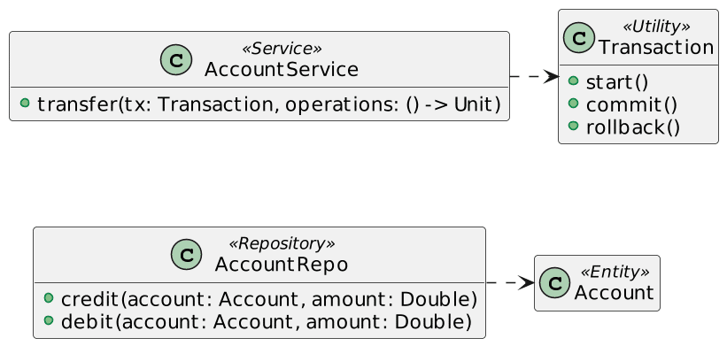

Kotlin added the idea of Context Receivers in version 1.6.20.

In this article, I'd like to toy with them to understand how useful they can be.

Note that if you want to play along, you'll need to compile with the `-Xcontext-receivers` flag.

The main idea behind context receivers is to pass additional parameters to a function without having to do it explicitly.

A simplified model sample {#h2-0-a-simplified-model-sample}
-----------------------------------------------------------

Let's start with a simple example to show how it works. We want to model a simple transfer operation between two bank accounts.

Accounts balance is stored in a database, and respective credit/debut operations must be transactional.

Let's focus on the `AccountService.transfer()` function. It requires a `Transaction` instance that wraps several of operations:

<pre class="EnlighterJSRAW" data-enlighter-language="kotlin">class AccountService {
    fun transfer(tx: Transaction, vararg operations: () -&gt; Unit) {
        tx.start()
        try {
            operations.forEach { it.invoke() }
            tx.commit()
        } catch (e: Exception) {
            tx.rollback()
        }
    }
}</pre>

We can call the above code as:

<pre class="EnlighterJSRAW" data-enlighter-language="kotlin">val service = AccountService()
val transaction = Transaction()
val repo = AccountRepo()
service.transfer(
    transaction,
    { repo.credit(account1, 10.5) },
    { repo.debit(account2, 10.5) }
)</pre>

Improving the code with extension functions {#h2-1-improving-the-code-with-extension-functions}
-----------------------------------------------------------------------------------------------

We can slightly improve the above code by making use of [extension functions](https://kotlinlang.org/docs/extensions.html#extension-functions). Instead of defining the `Transaction` as a parameter to the `transfer()` function, we can migrate the latter to an extension function.

<pre class="EnlighterJSRAW" data-enlighter-language="kotlin">class AccountService {
    fun Transaction.transfer(vararg operations: () -&gt; Unit) {
        start()                                                    // 1
        try {
            operations.forEach { it.invoke() }
            commit()                                               // 1
        } catch (e: Exception) {
            rollback()                                             // 1
        }
    }
}</pre>

1. Implicit `this` references the `Transaction` object

Within the context of an `AccountService`, we can now call the `transfer()` function on an existing `Transaction`.

<pre class="EnlighterJSRAW" data-enlighter-language="kotlin">with(service) {                               // 1
    transaction.transfer(                     // 2
        { repo.credit(account1, 10.5) },
        { repo.debit(account2, 10.5) }
    )
}</pre>

1. Bring the `service` instance in scope
2. So it's valid to call `transfer` on the `transaction` object

One can analyze the new calling code from two different viewpoints:

* The raw number of characters typed is less - it's more concise
* The semantics is radically different, though. The new code means that in the context of an `AccountService`, we can call `transfer()` on an existing `Transaction` object.

I think the semantics is wrong; it should be the opposite. it should be the opposite. In the context of `Transaction`, we should be able to call `transfer()` on an existing `AccountService` object:

<pre class="EnlighterJSRAW" data-enlighter-language="kotlin">with(transaction) {
    service.transfer(
        { repo.credit(account1, 10.5) },
        { repo.debit(account2, 10.5) }
    )
}</pre>

IMHO, conciseness has very little value compared to the cost of wrong semantics.

Unfortunately, with the current language constructs, fixing semantics means we would need to move the `transfer()` function to `Transaction`.

It would be lousy modeling as the transfer is the responsibility of the service.

Context receivers to the rescue {#h2-2-context-receivers-to-the-rescue}
-----------------------------------------------------------------------

As I mentioned in the introduction, the idea behind context receivers is to somehow "pass" function parameters without being explicit about them.

<pre class="EnlighterJSRAW" data-enlighter-language="kotlin">context(Foo, Bar, Baz)
fun myfunction() {}</pre>

To call such a function, one needs to bring an object of each contextual type "in scope". We can achieve it with the [with](https://kotlinlang.org/docs/scope-functions.html#with) function:

<pre class="EnlighterJSRAW" data-enlighter-language="kotlin">val foo = Foo()
val bar = Bar()
val baz = Baz()
with(foo) {                     // 1
    with(bar) {                 // 2
        with (baz) {            // 3
            myfunction()        // 4
        }
    }
}</pre>

1. Bring `foo` in scope
2. Bring `bar` in scope
3. Bring `baz` in scope
4. Call the function

While the code above compiles, it's only applicable if we use the contextual objects. The calling syntax is the same as the one of lambdas with receiver:

<pre class="EnlighterJSRAW" data-enlighter-language="kotlin">context(Foo, Bar, Baz)
fun myfunction() {
    println(this@Foo)
    println(this@Bar)
    println(this@Baz)
}</pre>

We use context receivers to be able to write code using the wanted code:

<pre class="EnlighterJSRAW" data-enlighter-language="kotlin">class AccountService {
    context(Transaction)
    fun transfer(vararg operations: () -&gt; Unit) {
        start()                                   // 1
        try {
            operations.forEach { it.invoke() }
            commit()                              // 1
        } catch (e: Exception) {
            rollback()                            // 1
        }
    }
}</pre>

1. Implicit `this` references the `Transaction` object. We don't need to qualify further with the class name as there's no other context object

We can now call the code accordingly, with the correct semantics:

<pre class="EnlighterJSRAW" data-enlighter-language="kotlin">with(transaction) {                               // 1
    service.transfer(                             // 2
        { repo.credit(account1, 10.5) },
        { repo.debit(account2, 10.5) }
    )
}</pre>

1. Bring `transaction` in scope
2. Use the `transaction` object in scope

Discussion {#h2-3-discussion}
-----------------------------

Context receivers allow us to implement the API with the correct calling code semantics.

It's not possible without them.

I've dabbled only a bit in Scala, but I've always found Scala 2's `implicit` poorly implemented.

To bring an object in scope, you only need an `import` at the top of the file, which might be very far from where it's used.

It makes understanding the code much harder and increases maintenance costs.

Scala 3 has made the implicitness much more explicit and fixed some of my grievances.

I believe that Kotlin's implementation is much saner.

You achieve scoping in context receivers with `with`, which brings the context close to the call site and signals it with a code block.

However, it's not all unicorns and rainbows. In particular, I'm a bit worried that context receivers will be abused.

Granted, it's generally the case for every new feature for every language. Yet, I feel the potential for abuse is enormous with this one. Only the future will tell.

In the meantime, I'm curious to see more different usages of context receivers and what patterns they can unlock.

**To go further:**

* [KEEP: Context receivers](https://github.com/Kotlin/KEEP/blob/master/proposals/context-receivers.md)
* [Context Receivers Are Coming to Kotlin!](https://www.youtube.com/watch?v=GISPalIVdQY)
* [When to use context receiver?](https://www.reddit.com/r/Kotlin/comments/q9f8yp/when_to_use_context_receiver/)

*Originally published at [A Java Geek](https://blog.frankel.ch/kotlin-context-receivers/) on May 14 ^th^, 2022*
