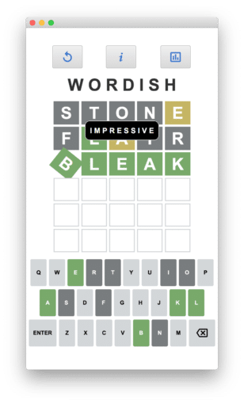
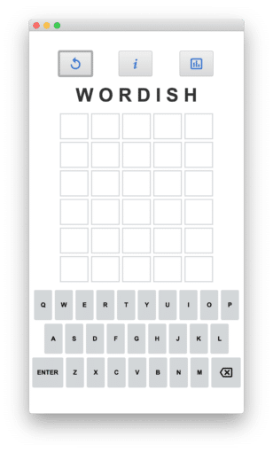
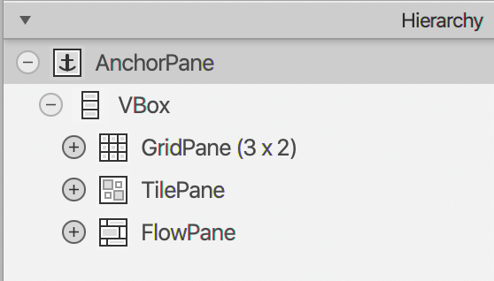
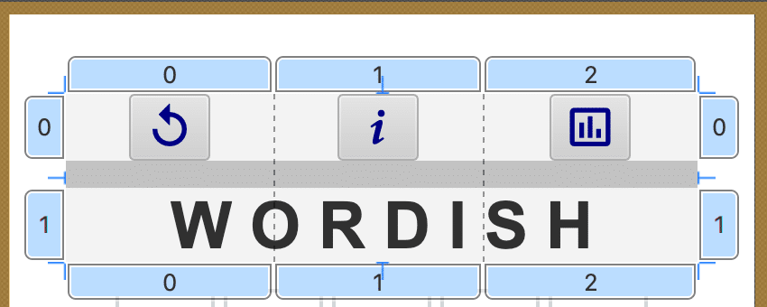
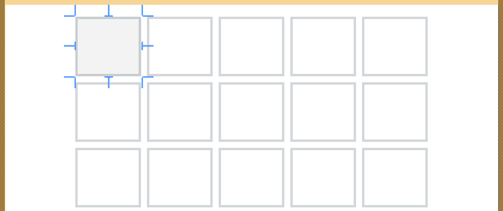
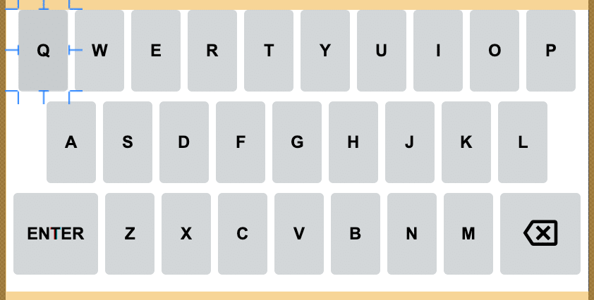
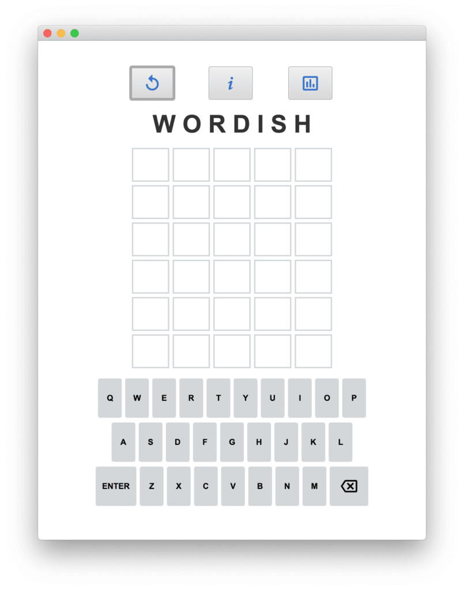
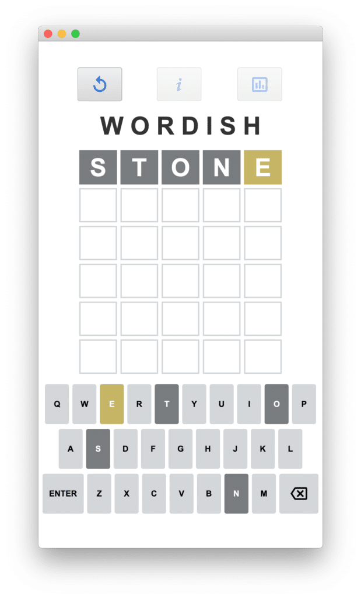

Building Games and Having Fun with Java and JavaFX {#h2-0-building-games-and-having-fun-with-java-and-javafx}
-------------------------------------------------------------------------------------------------------------

Wordish is a JavaFX implementation of the game Wordle. It's like Wordle. It is Wordle-ish. It's Wordish.
 Figure 1. Wordish main layout view

Wordle is a daily online word game. You can play the official Wordle game here:<https://www.nytimes.com/games/wordle/index.html>. If you haven't played yet, go check it out.

As I played Wordle, I realized how much fun it would be to create a JavaFX implementation. When you submit a word, each tile rotates to reveal how the individual letter matches -- or doesn't match -- the target word. *(Ooh, animation!)*

As you work through successive guesses, the virtual keyboard letters reflect the same color-coded feedback to help with your next submission. *(Cool CSS customizations!)* And, when you figure out the correct word, a cute little word happy dance rewards your efforts. *(Yet more animation!)* I couldn't resist!

### **Here's how to play:** {#h3-1-here-s-how-to-play}

Guess the word in six tries or less. Each guess must be a valid five-letter word. When you've typed in your five letters, hit the ENTER button to submit. After each guess, the color of the tiles changes to reflect your guess, as follows. Green indicates the correct letter in the correct position. Yellow indicates the correct letter in the wrong position. And gray indicates the letter is not in the word at all.

Wordish is a JavaFX implementation of Wordle. Wordish is a bit different from Wordle, so please don't expect the exact same experience. With this discussion of Wordish, we emphasize the UI: the JavaFX layout, controls, property bindings, and advanced CSS styling. And, we also show you how to incorporate third-party Font icons. Furthermore, we'll leverage modern Java features such as streams, records, and the new switch syntax.

You can access the code on github here: <https://github.com/gailasgteach/Wordish>. Let's get started!

Wordish Roadmap {#h2-2-wordish-roadmap}
---------------------------------------

We present this discussion in the following five parts:

1. The Main UI Layout: Using Scene Builder, TilePane, FlowPane, controller code, iOS and Android settings. Read on below!
2. Look and Feel Enhancements: Specialized Label and Button controls, pseudo-classes for CSS styling, ikonli Font Library, customizing Scene Builder. [Go here for more.](https://foojay.io/today/wordish-with-javafx-part-2/)
3. JavaFX Controller Code: Property binding to control UI state, sharing data between controllers, implementing the guess algorithm, animation with high-level transitions. Coming soon.
4. What's in a Word, Anyway: Getting the target word, is a word valid? Coming soon.
5. Chart Your Guesses: Customizing charts with orientation and colors, adding nodes to the chart scene graph, implementing a customized Popup control. Coming soon.

Part 1: The Main UI Layout {#h2-3-part-1-the-main-ui-layout}
------------------------------------------------------------

JavaFX typically uses FXML to describe a UI scene. FXML, an XML-based markup language, is well-suited to define a JavaFX scenegraph, since both have a hierarchical structure. [Scene Builder](https://gluonhq.com/products/scene-builder/), an open-source drag-and-drop tool, lets you build your view visually and produces FXML. Figure 2 shows the view we built using Scene Builder for the Wordish main application view, **wordish.fxml** and Figure 3 shows the layout containers that hold the scene graph. Let's start with the layout.

<figure class="wp-block-image is-resized">
 
 <figcaption>
  Figure 2. The wordish.fxml view.
 </figcaption>
</figure>

<figure class="wp-block-image is-resized">
 
 <figcaption>
  Figure 3. Hierarchy view for wordish.fxml
 </figcaption>
</figure>

Part of the challenge of building a view is picking the best layout containers. Here, the root container is AnchorPane, as shown in Figure 3. This is the default container Scene Builder gives you. Its main feature is providing anchor points for child nodes when the user resizes the top window.

Under the AnchorPane, we have a VBox (vertical box), since our main scene consists of vertically placed controls. These are the action buttons, the title, the labels that hold the user's letters, and the virtual keyboard.

### **GridPane** {#h3-4-gridpane}

The top three buttons and the title are in a three-column by two-row grid pane, as shown in Figure 4. The title is centered and spans all columns of the grid pane. We widen the title by inserting blanks between its letters. The action buttons are spread out by increasing the GridPane's Vgap property to 15.

<figure class="wp-block-image size-full is-resized">
 
 <figcaption>
  Figure 4. GridPane Layout Control
 </figcaption>
</figure>

Note that the top action buttons have customized graphics. First, on the left, the *Replay* icon lets you play a new game. Next, in the middle, the *Information* icon displays the rules of Wordish. Finally, on the right, the *Bar Chart*icon displays the game and guess statistics for this session. We show how to configure the icon library in Part 2.

### **TilePane** {#h3-5-tilepane}

Under the GridPane is the TilePane, as shown in Figure 5. TilePane arranges its child nodes in rows and columns, where each tile is the same size. This is perfect for our view, since the letter guess labels appear in equal-sized controls. We use the visual capabilities of Scene Builder to set the TilePane's properties: the Preferred Tile Width (55), Preferred Tile Height (50), Preferred Columns (5), and Preferred Rows (6). The Vgap and Hgap are both 5. Although you could use a GridPane here, the TilePane is easier to configure. You don't need to assign specific row and column numbers to the child nodes because the TilePane layout manager takes care of that for you.

<figure class="wp-block-image size-full is-resized">
 
 <figcaption>
  Figure 5. TilePane Layout Control
 </figcaption>
</figure>

### **FlowPane** {#h3-6-flowpane}

We build our virtual keyboard with the FlowPane layout container, as shown in Figure 6. We add multiple Button controls to the FlowPane container, where each Button corresponds to a letter key, Enter, or Delete. FlowPane is similar to TilePane, but here we are not limited to equal-sized tiles and the tiles do not have to align in a grid. Using Scene Builder, we can experiment with the FlowPane size, as well as the specific size of the buttons, to achieve the keyboard layout that we want.

<figure class="wp-block-image size-full is-resized">
 
 <figcaption>
  Figure 6. FlowPane Layout Control
 </figcaption>
</figure>

### **Resizing the Window** {#h3-7-resizing-the-window}

When running the desktop version of Wordish, the user can resize the top window, as shown in Figure 7. Here, we increase the window width from the default size as compared to Figure 2.

<figure class="wp-block-image size-large is-resized">
 
 <figcaption>
  Figure 7. Resizing the desktop version of Wordish
 </figcaption>
</figure>

Normally, when you increase the width of a TilePane or FlowPane control, the layout manager rearranges its child nodes to fill in the added width. However, we don't want the container to modify the number of rows and columns in either the TilePane or FlowPane. You can prevent changes to the layout by setting the minimum, maximum, and preferred width to be the same value. You can determine the correct values by looking at the layout properties in Scene Builder and selecting the calculated value in the width property. Then, if the user resizes the window, the contents of the layout container remain unaltered.

**Note** : See file [**wordish.fxml**](https://github.com/gailasgteach/Wordish/blob/master/src/main/resources/com/asgteach/wordish.fxml)in the github repository for the above UI code.

**Controller Class** {#h2-8-controller-class}
---------------------------------------------

Each view described by an FXML file has an associated controller class specified in the fxml. JavaFX includes an FXMLLoader class that builds the scene graph from the JavaFX controls you specify in your FXML file. The FXMLLoader class also instantiates the controller class and injects any of the FXML-defined controls that your controller class needs to access.

There is a straightforward mechanism for this access. For example, to access the replay button in the controller class, we provide an `fx:id` attribute in the FXML file, as follows.

```xml
<Button fx:id="resetButton" onAction="#resetGame" >            
</Button>
```


Then, in the controller class, you annotate the Java declaration with `@FXML`. Note that you do not instantiate this object; rather the FXMLLoader instantiates (injects) it for you.

```java
public class WordishController {

    @FXML
    private Button resetButton;
    . . . 
}
```


### Accessing the Letter Label \& Key Button Controls {#h3-9-accessing-the-letter-label-key-button-controls}

So far, so good. But what's the best way to access the Label controls that display the letters a user picks for their guess? Clearly, providing individual `fx:id` attribute names for each of the 30 label controls is not only tedious, but we also need a way to efficiently manipulate these controls. In every guess activity, the user provides a five-letter word; each letter must be displayed and accessed during play. We also require access to the virtual keyboard buttons during play.

Figure 8 shows the labels in the first row containing the word "STONE." Accessing these Label controls requires some sort of a list. Similarly, accessing the individual buttons of our virtual keyboard in the FlowPane requires storing them in a map associated with the key's letter.

<figure class="wp-block-image size-large is-resized">
 
 <figcaption>
  Figure 8. Playing the first guess word
 </figcaption>
</figure>

### Using Modern Java {#h3-10-using-modern-java}

The good news is that JavaFX is Java and JavaFX is *modern* Java. That means we can use recent features of Java, starting with Lambdas and Streams in Java 8 and even newer features like Records and Switch Expressions. You'll see that we leverage modern Java to manage these controls in the appropriate list and map collections.

The JavaFX layout containers (such as TilePane, GridPane, VBox, and FlowPane) manage their children. You can access these child nodes with method `getChildren()`, which returns a list of Node objects. With the Label controls, we cast them to class LetterLabel and with Button controls, we cast them to class KeyButton. The Button method `getText()` provides the map entry's key.

**Note:** LetterLabel is a class that extends Label and KeyButton is a class that extends Button. We discuss these two customized controls in Part 2.

### Leveraging Streams {#h3-11-leveraging-streams}

Here is how the WordishController class initializes the data structures `letters` (a List) and `keyLetters` (a Map) with these customized controls.

```java
public class WordishController {

    @FXML
    private TilePane letterTilePane;
    @FXML
    private FlowPane buttonFlowPane;

    private List<LetterLabel> letters;
    private Map<String, KeyButton> keyLetters;
    . . . 
    public void initialize() {
          letters = letterTilePane.getChildren()
                .stream()
                .map(LetterLabel.class::cast)
                .collect(Collectors.toList());
          keyLetters = buttonFlowPane.getChildren()
                .stream()
                .map(KeyButton.class::cast)
                .filter(button -> button.getText().length() == 1)
                .collect(Collectors.toMap(KeyButton::getText,
                          Function.identity()));
       . . .
       }
}
```


First, we populate `List<LetterLabel> letters` by invoking the TilePane's `getChildren()` method. After converting to a stream, we cast each Node to a LetterLabel and collect them in a List.

Similarly, we populate the `Map<String, KeyButton> keyLetters` in the same way. Here, we cast each Node to a KeyButton and use `filter()` to select only KeyButton objects that correspond to the lettered keys (that is, not Enter and not Delete). After `filter()`, we collect these KeyButton objects in a Map, where the key is the button's `getText()` string (the letter) . The value is the KeyButton object itself, returned with the static method `Function.identity()`.

Note that Java streams makes it easy to populate an appropriate data structure with the data from a layout container's child nodes. We use a method reference for the cast as well as button's `getText()`, reducing clutter and awkward parentheses. The best part is we don't bloat our controller class with a bunch of `@FXML` annotations.

The lettered keys are the ones that reflect the game-playing status. As shown in Figure 8, the S, T, O, N keyboard letters are dark gray and the E is yellow. This provides feedback for the most recent guess submitted by the user.

**Note** : See **[WordishController.java](https://github.com/gailasgteach/Wordish/blob/master/src/main/java/com/asgteach/WordishController.java)** for the above described code.

**Mobile Phone Settings: iOS and Android** {#h2-12-mobile-phone-settings-ios-and-android}
-----------------------------------------------------------------------------------------

While it's easy and quick to run this program on the desktop using the standard JVM, we'd also like to target the application for a mobile environment. Using the [Gluon Substrate GraalVM](https://start.gluon.io/) plugin, which uses an ahead-of-time compiler and bundles all the support libraries you need to run the application natively, we can install the application on both an iPhone and Android device. We discussed how to do this in a separate three-part article [here](https://foojay.io/today/creating-mobile-apps-with-javafx-part-1/).

### **iOS Customization** {#h3-13-ios-customization}

For iOS, we modify the **Default-Info.pList** file and provide application-specific icons. Gluon substrate generates default values for both the icons and **Default-Info.plist** under the subdirectory **target** . Copy these to **src/ios** to customize.

To limit the layout to portrait mode only requires limiting the supported orientation settings to portrait mode, as follows.

```xml
<plist version="1.0">
<dict>
. . .
<key>UISupportedInterfaceOrientations</key>
    <array>
        <string>UIInterfaceOrientationPortrait</string>
    </array>
    <key>UISupportedInterfaceOrientations~ipad</key>
    <array>
        <string>UIInterfaceOrientationPortrait</string>
    </array>
. . .
</dict>
</plist>
```


Next, we create an icon for our app. We use [Inkscape](https://inkscape.org/) to create a 1024 x 1024 PNG image. The web site: <https://appicon.co/> generates a set of icons from a single 1024 x 1024 PNG file for both iOS and Android.

<figure class="wp-block-image size-large is-resized">
 
 <figcaption>
  Figure 9. Wordish mobile app icon
 </figcaption>
</figure>

### **Android Customizations** {#h3-14-android-customizations}

For Android, modify file **AndroidManifest.xml** to customize the Android application. Here, we again want to limit the application to portrait mode, as follows.

```xml
. . .
<application android:label='Wordish' android:icon="@mipmap/ic_launcher">
        <activity android:name='com.gluonhq.helloandroid.MainActivity'
                  android:screenOrientation='portrait'
                  android:configChanges="orientation|keyboardHidden">
       . . .
       </activity>
</application>
```


The [applicon.co](https://appicon.co/) website generates Android icons for us too, so we're all set. For Android, copy the default files to **src/android** to retain these customizations.

**Note** : See **[Default-Info.plist](https://github.com/gailasgteach/Wordish/blob/master/src/ios/Default-Info.plist)** for the iOS configuration file, **[AndroidManifest.xml](https://github.com/gailasgteach/Wordish/blob/master/src/android/AndroidManifest.xml)** for the Android configuration file, and [**Wordish-app-store-icon**](https://github.com/gailasgteach/Wordish/blob/master/src/ios/assets/Assets.xcassets/AppIcon.appiconset/Wordish-app-store-icon-1024%401x.png) for the Wordish 1024 x 1024 icon.

**Next** : [In Part 2](https://foojay.io/today/wordish-with-javafx-part-2/), we'll discuss Look and Feel enhancements for Wordish.
