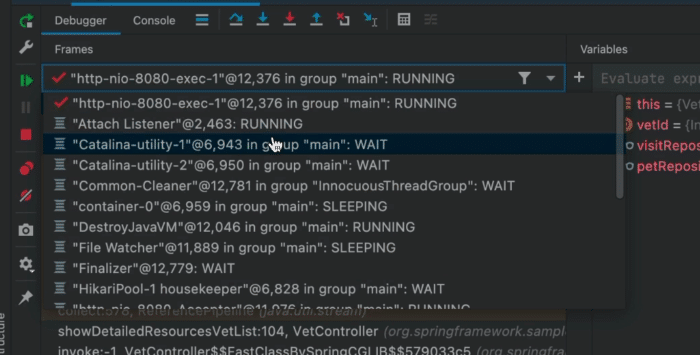
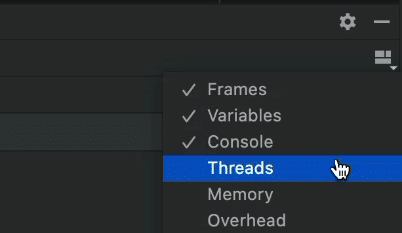
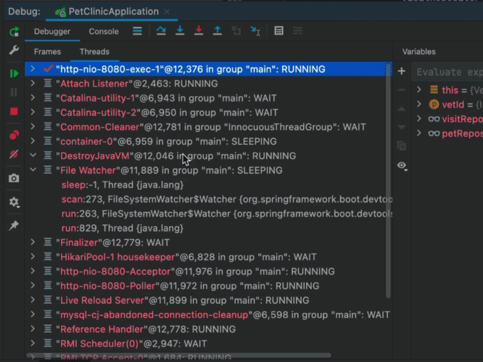
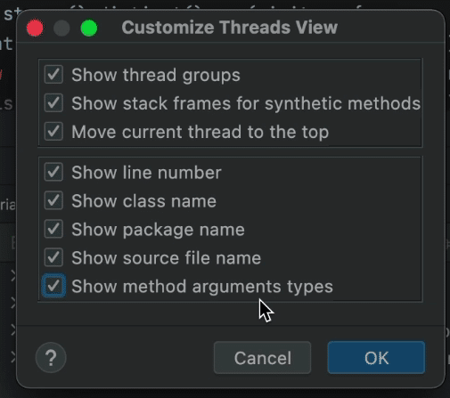
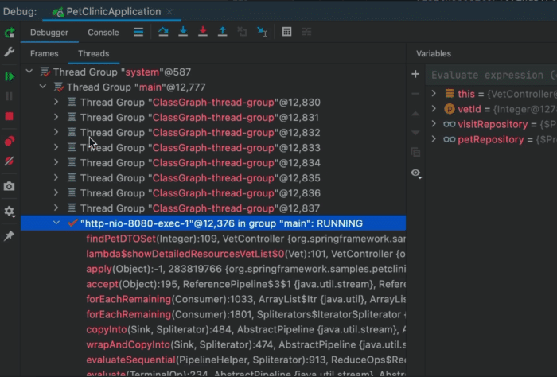
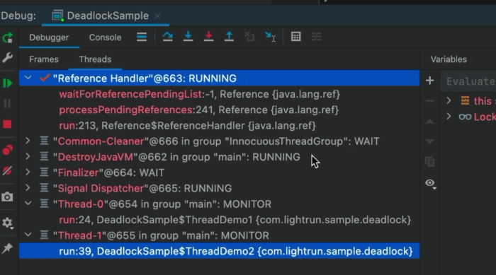
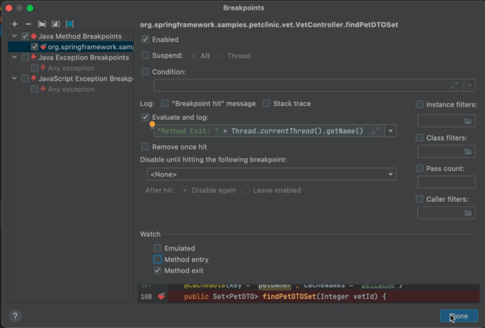
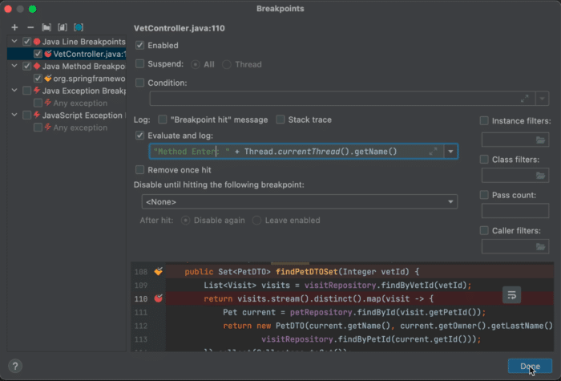
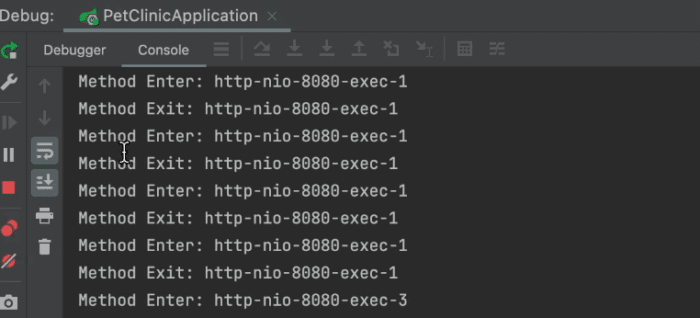
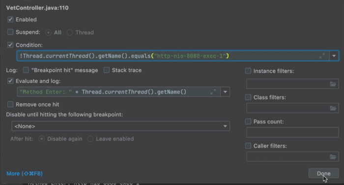

Thread debugging has the reputation of being one of the most arduous tasks for developers. I beg to differ.

Asynchronous debugging is so much worse. It's supposed to solve the problems of threading and to some degree async helps…

But it doesn't make debugging simpler. I will get into that in the next post.

In the last two ducklings, I talked about threading issues:
> 🦆 Duckling the 13th:  
>
> Debug race conditions and deadlocks easily.  
>
> Method breakpoints make a triumphant return showing that in-fact they have another great use case.  
>
> Threading issues are scary at first, but they're actually very easy to find \& fix.[#CodeNewbie](https://twitter.com/hashtag/CodeNewbie?src=hash&ref_src=twsrc%5Etfw) [#140SecondDucklings](https://twitter.com/hashtag/140SecondDucklings?src=hash&ref_src=twsrc%5Etfw) [pic.twitter.com/fB22yZo0DF](https://t.co/fB22yZo0DF)
>
> — Shai Almog (@debugagent) [May 3, 2022](https://twitter.com/debugagent/status/1521486750505488386?ref_src=twsrc%5Etfw)

Today we'll discuss the process of debugging threading issues, dealing with deadlocks and race conditions in the debugger.

## Multithreaded Debugging

Debugging in a multi-threaded environment is often perceived as difficult because it's hard to know what's going on. You place a breakpoint and a thread that might deadlock is suspended in the background. As a result, you can no longer reproduce the problem with a debugger. Instead of modifying the debugging technique, developers blame the tooling.

That's throwing the baby with the bathwater. Debuggers have so many amazing tools to control their environment. Once you learn how to master these resources, things like deadlock detection will become trivial.

### Thread View

If you've used JetBrains IDEs such as IntelliJ, you're probably familiar with the thread combo box that lives above the stack trace panel in the UI. This widget lets us toggle the current thread and with it the stack that we're looking at.

It's a very effective tool, but it also provides a very limited view. It's very hard to gauge the state of a specific thread by looking at the combo box. Additional details such as grouping, location, etc. are unclear when looking at this widget only.



Luckily, most IDEs support a view that's more oriented to heavily threaded apps. The downside is that it's a bit more noisy by comparison. I guess this is the reason it isn't the default UI.

But if the process that you're debugging has complex concurrency, this might improve your experience noticeably!

To enable that mode, we need to check the "Threads" option in the IDE in the debugger view:



This is off by default as the UX is difficult and most developers don't need this for typical apps. But when we have a thread heavy application, this view becomes a lifesaver...



The threads effectively become the top-level element. We can see the stack by expanding a particular thread (e.g. File Watcher in this image). Here we have full access to the stack as we had before, but we can see all the threads.

If you have an app with a very high thread count, this might be a problem, e.g. with the coming project Loom, this might become untenable.

We can further tune this view through settings, this can enable more verbosity and hierarchy:



There are several interesting capabilities mentioned in the settings dialog, but the most interesting one is grouping by thread groups. Thread groups let us package a thread as part of a group. As a result, we can create common behavior for all the threads within. E.g. a single catch handler, etc.

Most threads you'll receive from a pool or a framework would already be grouped logically. This means grouping should already be relatively intuitive and easy to grok.



## Debugging a Deadlock Situation

Wikipedia defines a deadlock as:

_"In [concurrent computing](https://en.wikipedia.org/wiki/Concurrent_computing), **deadlock** is any situation in which no member of some group of entities can proceed because each waits for another member, including itself, to take action, such as sending a message or, more commonly, releasing a [lock](https://en.wikipedia.org/wiki/Lock_(computer_science)).^[\[1\]](https://en.wikipedia.org/wiki/Deadlock#cite_note-coulouris-1)^ Deadlocks are a common problem in [multiprocessing](https://en.wikipedia.org/wiki/Multiprocessing) systems, [parallel computing](https://en.wikipedia.org/wiki/Parallel_computing), and [distributed systems](https://en.wikipedia.org/wiki/Distributed_computing), because in these contexts systems often use software or hardware locks to arbitrate shared resources and implement [process synchronization](https://en.wikipedia.org/wiki/Synchronization_(computer_science))."_

This sounds complicated, but it isn't too bad... Unfortunately, if you place a breakpoint, the problem will no longer occur, so you can't even use the typical debugging tools for a deadlock situation.

The reason is that a breakpoint typically suspends the entire process when it stops and you won't see the problem occurring.

I won't talk about deadlock prevention, which is a vast subject in its own right. The nice thing is that it's pretty easy to debug once you reproduce it with a debugger running!

All we need to do is press pause in the debugger:



Once the application is suspended, we can review the entries on the list. Notice the two entries are stuck on "MONITOR" threads waiting for a monitor. This effectively means they are probably stuck on a synchronized block or some other synchronization API call.

This might mean nothing, but it's pretty easy to review this list and the stack to see the resource they're waiting for. If one entry is waiting for the resource held by another... That's probably a deadlock risk. If both hold resources needed by the other, this is a pretty obvious deadlock.

You can switch between threads and walk the stack. In this screenshot, the stack is one method deep so it isn't representative of "real-world cases". However, this is an easy way to detect such issues.

## Debugging Race Conditions

The most common issue with multi-threading is race conditions. Wikipedia defines race conditions as:

_"A **race condition** or **race hazard** is the condition of an [electronics](https://en.wikipedia.org/wiki/Electronics), [software](https://en.wikipedia.org/wiki/Software), or other [system](https://en.wikipedia.org/wiki/System) where the system's substantive behavior is [dependent](https://en.wikipedia.org/wiki/Sequential_logic) on the sequence or timing of other uncontrollable events. It becomes a [bug](https://en.wikipedia.org/wiki/Software_bug) when one or more of the possible behaviors is undesirable."_

This is a far more insidious problem, since it's nearly impossible to detect. I wrote about it I the past and about [debugging it with Lightrun here](https://lightrun.com/tutorials/debug-race-condition-production/). Derrick also [wrote about this in the Lightrun blog](https://lightrun.com/debugging/how-to-debug-race-conditions-between-threads-in-java/), but he covered it a bit differently. My technique is simpler in my opinion...

### Method Breakpoints Done Right

I had some harsh things to say about method breakpoints before. They're inefficient and problematic. But for this truck, we need them. They give us the type of control over the breakpoint location we need.

E.g. in this method:

```java
public Set<PetDTO> findPetDTOSet(Integer vetId) {
  List<Visit> visits = visitRepository.findByVetId(vetId);
  return visits.stream().distinct().map(visit -> {
     Pet current = petRepository.findById(visit.getPetId());
     return new PetDTO(current.getName(), current.getOwner().getLastName(),
           visitRepository.findByPetId(current.getId()));
  }).collect(Collectors.toSet());
}
```

If we place a breakpoint on the last line, we will miss the functionality of the method. But if we place a method breakpoint that tracks method exit, it will hit after everything in the method was executed.

Ideally we could track method entry and exit but then we won't be able to distinguish between them...



After we create a method breakpoint, we set it to not suspend and enable logging. We effectively created a tracepoint.

We can now log that we're exiting the method and log the thread name. This will print every exit from the method.

### Method Entry Event

We can do the same thing for method entry, but here we can use a regular breakpoint:



Again, we don't suspend the thread and use what is effectively a tracepoint. This lets us see if we're a deadlock victim by reviewing the logs.

If they include two entry logs in a row... It might be a race condition. Since the threads aren't suspended, things shouldn't be disturbed by the debugging process.



In some cases, the output might be so verbose and from a single thread. In that case, we can use a simple conditional statement to filter out the noise:



We can also build a poor man's deadlock detector using a similar technique. It can give us a sense of shared resource usage so we can properly evaluate deadlock potentials.

## TL;DR

Possibility of deadlock code makes debugging a process pretty challenging. A lock on resources can make things worse and the traditional usage of breakpoints just doesn't work...

Every time we run into an issue that we suspect of a race or deadlock in multitasking, we need to stop. Use these techniques to check for occurrences of deadlocks or races.

Multithreaded debugging isn't as hard as it's often made out to be. You might not get errors that point you directly at the line, but with the right concurrency control, you can narrow things down considerably.
