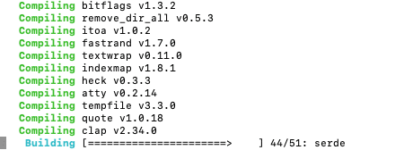

Hello and welcome to the final article of the **[Java Panama Polyglot](https://foojay.io/today/java-panama-polyglot-part1/)** series, where we are presenting quick tutorials or recipes on how to access native libraries written in other languages.

In this article you will be using Project Panama to talk to the [Rust](https://www.rust-lang.org) language.

If you are new to Java's Foreign Function Access APIs ([Project](https://jdk.java.net/panama/)[Panama](https://jdk.java.net/panama/)) check out [Panama4Newbies](https://foojay.io/today/project-panama-for-newbies-part-1/).

In [Part 3](https://foojay.io/today/java-panama-polyglot-part-3/) you had a chance to learn about how to use Java Project Panama's abilities to access the locally installed Python interpreter.

This capability has the advantage of not only talking to Python but also to any of the installed add-on modules (libraries) such as `tensorflow`, `numpy` or `pyplot`.

As far as native compiled languages go, Rust is the new kid on the block.

Rust is often compared to the Go language where source code can be compiled to a specific operating system.

Unlike C/C++, the source code doesn't contain compile time directives and `#defines` that handle special cases for different architectures.

By exposing native Rust functions, you can be easily accessed using Project Panama's Foreign Function Access APIs.

Today, let's look at how to access a native library built using the Rust language. This tutorial was derived from [Jorn Vernee](https://jornvernee.github.io/)'s article "[Calling a rust library with the Panama FFI](https://jornvernee.github.io/java/panama/rust/panama-ffi/2021/09/03/rust-panama-helloworld.html)".

For the impatient the example code is at [github.com/carldea/panama-polyglot/rust](https://github.com/carldea/panama-polyglot/tree/main/rust).

Problem {#h2-0-problem}
-----------------------

As a Java developer, you want to invoke my Rust based library function `rust_get_pid()` that will return an **integer** value representing an application's process id.

Solution {#h2-1-solution}
-------------------------

Below are the high-level steps to access a native **Rust** library and function.

**Step 1:** Create a Rust library with a function exported following the **C ABI**.

**Step 2:** Generate a `lib.h` header file `.h` (extension) for the `jextract` tool to generate binding code.

**Step 3:** Generate Java binding code (classes) using `jextract`

**Step 4:** Create a `Main.java` to call the `rust_get_pid()` generated function

Requirements {#h2-2-requirements}
---------------------------------

Before we can take the steps above let's make sure we install the JDK 19 EA release of OpenJDK containing Panama and Rust correctly.

* Project Panama EA release - Build 19-panama+1-13 (2022/1/18) - <https://jdk.java.net/panama/>
* Rust - <https://www.rust-lang.org/learn/get-started>

To **install** Rust run the following for (MacOS/Linux):

<pre class="EnlighterJSRAW" data-enlighter-language="bash" data-enlighter-theme="" data-enlighter-highlight="" data-enlighter-linenumbers="" data-enlighter-lineoffset="" data-enlighter-title="" data-enlighter-group="">curl --proto '=https' --tlsv1.2 -sSf https://sh.rustup.rs | sh</pre>

Assuming you've installed **Rust** you'll want to add its binaries on the `PATH` as followings:

<pre class="EnlighterJSRAW" data-enlighter-language="bash" data-enlighter-theme="" data-enlighter-highlight="" data-enlighter-linenumbers="" data-enlighter-lineoffset="" data-enlighter-title="" data-enlighter-group="">source $HOME/.cargo/env</pre>

Step 1: Creating a Native Rust Library {#h2-3-step-1-creating-a-native-rust-library}
------------------------------------------------------------------------------------

Let's initialize the Rust project with the following commands:

(For the demo I created a directory `rust`. If you are already in a directory named `rust` you don't need to create it.)

<pre class="EnlighterJSRAW" data-enlighter-language="bash" data-enlighter-theme="" data-enlighter-highlight="" data-enlighter-linenumbers="" data-enlighter-lineoffset="" data-enlighter-title="" data-enlighter-group="">mkdir rust
cd rust
cargo init --lib</pre>

Edit and replace the contents of the file `src/lib.rs` with the following:

<pre class="EnlighterJSRAW" data-enlighter-language="rust" data-enlighter-theme="" data-enlighter-highlight="" data-enlighter-linenumbers="" data-enlighter-lineoffset="" data-enlighter-title="" data-enlighter-group="">use std::process;

#[no_mangle]
pub extern "C" fn rust_get_pid() -&gt; u32 {
  return process::id();
}</pre>

|-------------|-------------------------------------------------------------------------------------------------------------------------------------------|
| Line number | Description                                                                                                                               |
| 1           | Use Rust's standard library module `process`                                                                                              |
| 3           | A directive to not mangle (alter) the symbol's function name                                                                              |
| 4           | To export a Rust function prefix it with `pub extern "C"`. Here, you'll notice the return type is `u32` or an unsigned integer (32 bits). |
| 5           | Return the process id to the caller                                                                                                       |

A Rust library exported adheres to the C ABI

After you've edited and saved the `lib.rs` file let's edit the `Cargo.toml` file by replacing it with the following contents:

Updating build project file `Cargo.toml` {#h2-4-updating-build-project-file-cargo-toml}
---------------------------------------------------------------------------------------

The following contents of the `Cargo.toml` file will **compile** and **build** a native Rust library created in the `target/debug` directory.

<pre class="EnlighterJSRAW" data-enlighter-language="generic" data-enlighter-theme="" data-enlighter-highlight="" data-enlighter-linenumbers="" data-enlighter-lineoffset="" data-enlighter-title="" data-enlighter-group="">[build-dependencies]
cbindgen = "0.20.0"

[lib]
crate_type = ["cdylib"]

[package]
name = "myrustlibrary"
version = "0.1.0"
edition = "2021"

# See more keys and their definitions at https://doc.rust-lang.org/cargo/reference/manifest.html

[dependencies]</pre>

Above you'll notice `cbindgen` is used to generate a C header (`.h`) file for `jextract` to later generate binding code in Java. Also, you want to make sure the name of the library will be named `myrustlibrary`.

On a MacOS system the library created will reside in the following directory: `target/debug/libmyrustlibrary.dylib`

On a Linux system the library will be named `libmyrustlibrary.so`

Step 2: Create a Rust C header generator (generates a lib.h file) {#h2-5-step-2-create-a-rust-c-header-generator-generates-a-lib-h-file}
----------------------------------------------------------------------------------------------------------------------------------------

Create a file called `build.rs` with the following contents:

<pre class="EnlighterJSRAW" data-enlighter-language="rust" data-enlighter-theme="" data-enlighter-highlight="" data-enlighter-linenumbers="" data-enlighter-lineoffset="" data-enlighter-title="" data-enlighter-group="">extern crate cbindgen;

use std::env;

fn main() {
    let crate_dir = env::var("CARGO_MANIFEST_DIR").unwrap();

    cbindgen::Builder::new()
      .with_crate(crate_dir)
      .with_language(cbindgen::Language::C)
      .generate()
      .expect("Unable to generate bindings")
      .write_to_file("lib.h");
}</pre>

Run the following statement that will call `cbindgen` to generate a `lib.h` file.

<pre class="EnlighterJSRAW" data-enlighter-language="generic" data-enlighter-theme="" data-enlighter-highlight="" data-enlighter-linenumbers="" data-enlighter-lineoffset="" data-enlighter-title="" data-enlighter-group="">cargo build</pre>

The output should look like the following:

<figure class="wp-block-image size-full is-resized">
 
 <figcaption>
  Executing <code>cargo build</code>
 </figcaption>
</figure>

This may take awhile. When this is done you can view the contents of `lib.h` as shown below:

<pre class="EnlighterJSRAW" data-enlighter-language="c" data-enlighter-theme="" data-enlighter-highlight="" data-enlighter-linenumbers="" data-enlighter-lineoffset="" data-enlighter-title="" data-enlighter-group="">#include &lt;stdarg.h&gt;
#include &lt;stdbool.h&gt;
#include &lt;stdint.h&gt;
#include &lt;stdlib.h&gt;

uint32_t rust_get_pid(void);</pre>

Step 3: Use `jextract` against C header file (`lib.h`) {#h2-6-step-3-use-jextract-against-c-header-file-lib-h}
--------------------------------------------------------------------------------------------------------------

Run the following using `jextract` to generate binding code that will be used in the `Main.java` program created later.

<pre class="EnlighterJSRAW" data-enlighter-language="bash" data-enlighter-theme="" data-enlighter-highlight="" data-enlighter-linenumbers="" data-enlighter-lineoffset="" data-enlighter-title="" data-enlighter-group="">jextract -d classes \
   -t org.rust \
   -l myrustlibrary \
   -- lib.h</pre>

Step 4: Creating a Main.java to call the native function {#h2-7-step-4-creating-a-main-java-to-call-the-native-function}
------------------------------------------------------------------------------------------------------------------------

Edit or create a `Main.java` file with the following contents:

<pre class="EnlighterJSRAW" data-enlighter-language="java" data-enlighter-theme="" data-enlighter-highlight="" data-enlighter-linenumbers="" data-enlighter-lineoffset="" data-enlighter-title="" data-enlighter-group="">import static org.rust.lib_h.*;

public class Main {
    public static void main(String[] args) {
        System.out.println("Rust getting process id = " + rust_get_pid());
    }
}</pre>

Above you'll notice the static import will reference generated Panama binding code. The bindings will do a library lookup and a native symbol lookup of the function `rust_get_pid()` function based on the **C ABI**.

Running Main.java {#h2-8-running-main-java}
-------------------------------------------

To run the Java program you'll simply do the following:

<pre class="EnlighterJSRAW" data-enlighter-language="bash" data-enlighter-theme="" data-enlighter-highlight="" data-enlighter-linenumbers="" data-enlighter-lineoffset="" data-enlighter-title="" data-enlighter-group="">java --add-modules jdk.incubator.foreign \
   --enable-native-access=ALL-UNNAMED \
   -Djava.library.path=./target/debug \
   -cp classes \
   Main.java</pre>

The output will look like the following:

<pre class="EnlighterJSRAW" data-enlighter-language="generic" data-enlighter-theme="" data-enlighter-highlight="" data-enlighter-linenumbers="" data-enlighter-lineoffset="" data-enlighter-title="" data-enlighter-group="">WARNING: Using incubator modules: jdk.incubator.foreign
warning: using incubating module(s): jdk.incubator.foreign
1 warning
Rust getting process id = 36396</pre>

If you've gotten this far you deserve a high five! Way to go!

You've now had a chance to build and create a Rust based native library using `cargo`.

Another notable tool or module was the `cbindgen` capable of creating a C header file that will be used with the `jextract` tool.

Once Panama code is generated the code can simply call the Rust function `rust_get_pid()` to return the application's process id.

Adding more native languages to your skillset is really easy as long as you expose (export) native functions that follow the C ABI.

By doing so will allow your code to easily do symbol lookups.

Thank you for exploring Project Panama with me and I hope to share new and exciting use cases in the future.

As always, feel free to comment or provide feedback so I can improve the articles. The idea is to update the articles as the APIs settle and make it into the GA (final) release.
