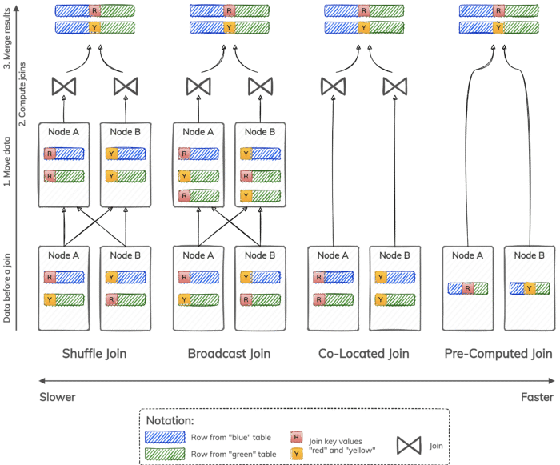
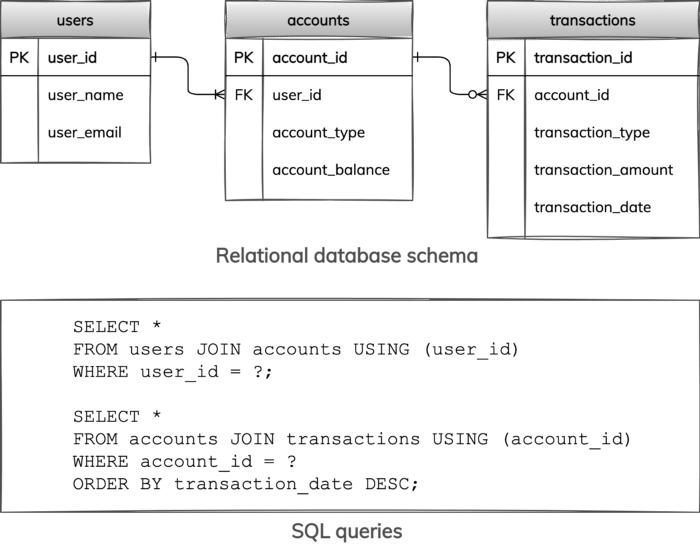
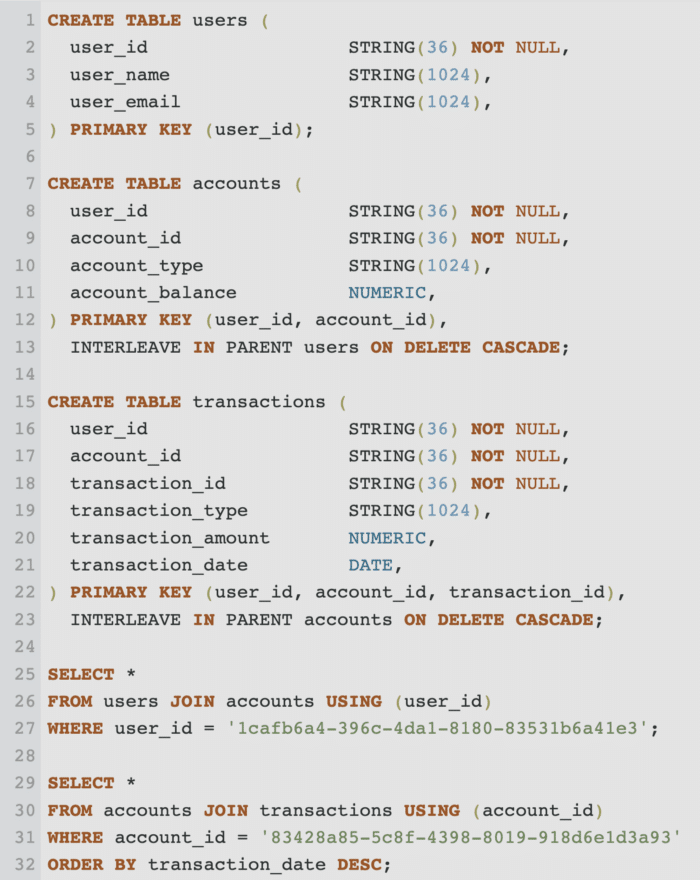
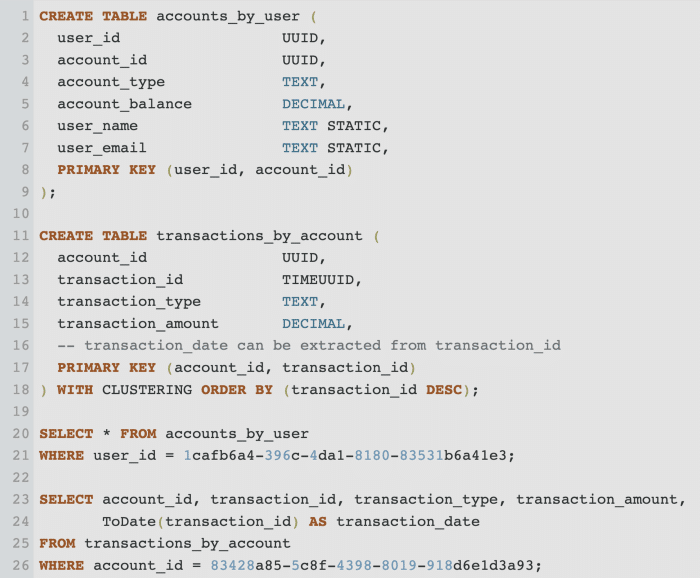

*In this post, learn how relational and NoSQL databases, Google Cloud Spanner and DataStax Astra DB, optimize distributed joins for real-time applications.*{#c63a}

Distributed joins are commonly considered to be too expensive to use for real-time transaction processing. That is because, besides joining data, they also frequently require moving or shuffling data between nodes in a cluster, which can significantly affect query response times and database throughput. However, there are certain optimizations that can completely eliminate the need to move data to enable faster joins. In this article, we first review the four types of distributed joins, including shuffle join, broadcast join, co-located join, and pre-computed join. We then demonstrate how leading fully managed Relational and NoSQL databases, namely [Google Cloud Spanner](https://cloud.google.com/spanner) and [DataStax Astra DB](https://auth.cloud.datastax.com/auth/realms/CloudUsers/protocol/openid-connect/registrations?client_id=auth-proxy&response_type=code&scope=openid+profile+email&redirect_uri=https://astra.datastax.com/welcome), support optimized joins that are suitable for real-time applications.{#bea1}

Joins are used in databases to combine related data from one or more tables or datasets. Data is usually combined based on some condition that relates columns from participating tables. Hereafter, we refer to columns used in a join condition as *join keys* and assume that they are always related by *equality* operators.{#a343}

Distributed joins are joins in distributed databases, where data from each table is partitioned into smaller chunks — usually called *partitions* — that are stored on different nodes in a cluster. While distributing data helps with managing large datasets, it also makes joins harder to perform and scale because table rows that can be joined may reside in different partitions on different nodes.{#8899}

A distributed join can be represented as a three-step process. The first step is to move data between nodes in the cluster, such that rows that can potentially be combined based on a join condition end up on the same nodes. Data movement is usually achieved by shuffling or broadcasting data. The second step is to compute a join result locally on each node. This usually involves one of the fundamental join algorithms, such as a nested-loop, sort-merge, or hash join algorithm. The last step is to merge or union local join results and return the final result. In many cases, it is possible to optimize a distributed join by eliminating one or even two steps from this process.{#0beb}

Consider the four types of distributed joins illustrated in Figure 1:{#b72b}

* A *shuffle join* re-distributes rows from both tables among nodes based on join key values, such that all rows with the same join key value are moved to the same node. Depending on a particular algorithm used to compute joins, a shuffle join can be a shuffle hash join, shuffle sort-merge join, and so forth.
* A *broadcast join* moves data stored in only one table, such that all rows from the smallest table are available on every node. Depending on a particular algorithm used to compute joins, a broadcast join can be a broadcast hash join, broadcast nested-loop join, and so forth.
* A *co-located join* does not need to move data at all because data is already stored such that all rows with the same join key value reside on the same node. Data still needs to be joined using a nested-loop, sort-merge, or hash join algorithm.
* A *pre-computed join* does not need to move data or compute joins locally on each node because data is already stored in a joined form. This type of join skips data movement and join computation and goes directly to merging and returning results.

 Figure 1: Four Types of Distributed Joins

Shuffle and broadcast joins are more suitable for batch or near real-time analytics. For example, they are used in [Apache Spark](https://spark.apache.org/) as the main join strategies. Co-located and pre-computed joins are faster and can be used for online transaction processing with real-time applications. They frequently rely on organizing data based on unique storage schemes supported by a database.{#c0cb}

In the rest of this article, our focus is on co-located and pre-computed joins, and how they can be used in representative cloud-native Relational and NoSQL databases. For co-located joins, we choose [Google Cloud Spanner](https://cloud.google.com/spanner), which is a fully-managed relational database service. For pre-computed joins, we use [DataStax Astra DB](https://auth.cloud.datastax.com/auth/realms/CloudUsers/protocol/openid-connect/registrations?client_id=auth-proxy&response_type=code&scope=openid+profile+email&redirect_uri=https://astra.datastax.com/welcome), which is a serverless NoSQL database service. Both database services can be tried for free if you prefer to follow our examples.{#3046}

Let's define a running example that we can implement in both Google Cloud Spanner and [DataStax Astra DB](https://auth.cloud.datastax.com/auth/realms/CloudUsers/protocol/openid-connect/registrations?client_id=auth-proxy&response_type=code&scope=openid+profile+email&redirect_uri=https://astra.datastax.com/welcome).{#83db}
 Figure 2: Example of relational database schema and SQL queries

Figure 2 depicts the relational database schema with three tables and two SQL queries. We have users identified by user ids, bank accounts identified by account ids, and account transactions identified by transaction ids. A user can have one or more accounts, while each account must belong to exactly one user. An account can have zero or more transactions, while each transaction must be associated with exactly one account. These key and cardinality constraints are captured via *primary key* (PK) and *foreign key* (FK) constraints on the diagram.{#bc27}

The first query retrieves all accounts for a specified user by joining tables `users` and `accounts`. The second query finds all transactions for a given account by joining tables `accounts` and `transactions`; transactions are also ordered by transaction dates in the result.{#9667}

This data model and queries can be readily instantiated in any relational database, including Google Cloud Spanner (see [this SQL script](https://github.com/ArtemChebotko/distributed-joins/blob/main/spanner-foreign-keys.sql) as an example), but that would not result in the join optimizations we are looking to implement. We show how to do much better in the next two sections.{#eabb}

Co-located joins can perform significantly faster than shuffle and broadcast joins because they avoid moving data between nodes in a cluster. To use co-located joins, a distributed database needs to have a mechanism to specify which related data entities must be stored together on the same node. In [Google Cloud Spanner](https://cloud.google.com/spanner), this mechanism is called *table* *interleaving*.{#204e}

Logically independent tables can be organized into *parent-child hierarchies* by interleaving tables. This results in a *data locality relationship* between parent and child tables, such that one or more rows from a child table are physically stored together with one row from a parent table. For two tables to be interleaved, the parent table primary key must also be included as the prefix of the child table primary key. In other words, the child table primary key must consist of the parent table primary key followed by additional columns.{#d5a1}

Figure 3 shows how to take advantage of table interleaving and co-located joins in Google Cloud Spanner to improve the performance of queries in our example of users, accounts, and transactions. The three tables are organized into a hierarchy, where table `users` is the parent of table `accounts`, and table `accounts` is the parent of table `transactions`. Column `user_id` is the primary key of table `users` and prefix of the primary key of table `accounts`. Columns `user_id` and `account_id` constitute the primary key of table `accounts` and prefix of the primary key of table `transactions`. Finally, columns `user_id`, `account_id` and `transaction_id` constitute the primary key of table `transactions`.{#a304}

The SQL queries are unchanged when compared to our original running example. They use the same joins as before, but these joins can now be executed faster as co-located joins.{#7226}

To try this example in [Google Cloud Spanner](https://cloud.google.com/spanner), we share [our SQL script](https://github.com/ArtemChebotko/distributed-joins/blob/main/spanner-interleaved-tables.sql) for Co-Located Joins.{#7acd}
 *Figure 3: Co-located joins in Google Cloud Spanner*

Pre-computed joins are the fastest joins in our toolbox. They are significantly faster than shuffle and broadcast joins because they avoid moving data between nodes in a cluster. They are also faster than co-located joins because they do not need to compute joins dynamically. To store and serve pre-computed join results effectively, a distributed database needs to have a mechanism to nest related data entities together. In [DataStax Astra DB](https://auth.cloud.datastax.com/auth/realms/CloudUsers/protocol/openid-connect/registrations?client_id=auth-proxy&response_type=code&scope=openid+profile+email&redirect_uri=https://astra.datastax.com/welcome), this mechanism is called *tables with multi-row partitions*.{#8413}

Tables in Astra DB are defined and queried using CQL, an SQL-like language. They are similar to tables in relational databases as they have columns, rows, and primary keys. The important difference is that a table primary key consists of a mandatory *partition key* and an optional *clustering key*. A partition key uniquely identifies a partition in a table, and a clustering key uniquely identifies a row in a partition. When both partition and clustering keys are defined, a table can store multiple rows in each partition. Tables with multi-row partitions are used to store and retrieve related entities together very efficiently. In our case, we can store pre-joined entities in such tables.{#cca8}

Figure 4 shows how to take advantage of tables with multi-row partitions and pre-computed joins in [DataStax Astra DB](https://auth.cloud.datastax.com/auth/realms/CloudUsers/protocol/openid-connect/registrations?client_id=auth-proxy&response_type=code&scope=openid+profile+email&redirect_uri=https://astra.datastax.com/welcome) to make queries from our running example exceptionally fast. The two tables are specifically designed to support the two queries. To retrieve all accounts for a specified user, table `accounts_by_user` defines `user_id` as a partition key and `account_id` as a clustering key. Each user in this table has a distinct partition that stores all user accounts as rows in this partition. In addition, each user partition also has information about the name and email of the user stored in static columns whose values are shared by all rows in the partition. To find all transactions for a given account, table `transactions_by_account` defines `account_id` as a partition key and `transaction_id` as a clustering key. Each account in this table has a distinct partition that stores all account transactions as rows in this partition. Furthermore, transactions within each account partition are ordered based on timestamp components of their respective `timeuuid` identifiers as defined by the clustering order.{#4e40}

The CQL queries are much simplified when compared to their SQL counterparts. They are very efficient queries that retrieve one partition at a time based on a partition key value. There are no joins or ordering required because data is already organized in pre-joined and ordered form.{#d601}

To try this example in [DataStax Astra DB](https://auth.cloud.datastax.com/auth/realms/CloudUsers/protocol/openid-connect/registrations?client_id=auth-proxy&response_type=code&scope=openid+profile+email&redirect_uri=https://astra.datastax.com/welcome), we share [our CQL script](https://github.com/ArtemChebotko/distributed-joins/blob/main/astra-db.cql). If you are new to CQL, it stands for Cassandra Query Language and is used in both [DataStax Astra DB](https://auth.cloud.datastax.com/auth/realms/CloudUsers/protocol/openid-connect/registrations?client_id=auth-proxy&response_type=code&scope=openid+profile+email&redirect_uri=https://astra.datastax.com/welcome) and [Apache Cassandra](https://cassandra.apache.org/). Astra DB is a serverless and multi-region database service that is based on Apache Cassandra, an open-source NoSQL database. To learn more about CQL and tables with multi-row partitions, the hands-on [Cassandra Fundamentals](https://www.datastax.com/learn/cassandra-fundamentals) learning series is highly recommended. For more advanced data modeling, there is also the collection of [data modeling example](https://www.datastax.com/learn/data-modeling-by-example)s from various domains.{#e875}
 *Figure 4: Pre-computed joins in DataStax Astra DB*

Having fast distributed joins is an important consideration when it comes to selecting a scalable database that can support real-time, high-throughput, data-driven applications. In this article, we discussed how shuffle, broadcast, co-located, and pre-computed joins work. We explained that shuffle and broadcast joins are more suitable for batch or near real-time analytics because they may require moving data among nodes in a cluster, which is expensive. Co-located and pre-computed joins are faster and can do well with real-time applications. Using [Google Cloud Spanner](https://cloud.google.com/spanner), we demonstrated how a fully managed, cloud-native relational database can take advantage of fast co-located joins. Using [DataStax Astra DB](https://auth.cloud.datastax.com/auth/realms/CloudUsers/protocol/openid-connect/registrations?client_id=auth-proxy&response_type=code&scope=openid+profile+email&redirect_uri=https://astra.datastax.com/welcome), we demonstrated how a serverless, cloud-native NoSQL database can take advantage of even faster pre-computed joins.{#eaf5}

*Follow the* [*DataStax Tech Blog*](https://datastax.medium.com/)*for more developer stories. Check out our* [*YouTube channel*](https://www.youtube.com/channel/UCqA6zOSMpQ55vvguq4Y0jAg)*for tutorials and here for* [*DataStax Developers on Twitter*](https://twitter.com/DataStaxDevs)*for the latest news about our developer community.*{#00ed}

1. [DataStax Astra DB](https://auth.cloud.datastax.com/auth/realms/CloudUsers/protocol/openid-connect/registrations?client_id=auth-proxy&response_type=code&scope=openid+profile+email&redirect_uri=https://astra.datastax.com/welcome) --- a serverless, cloud-native NoSQL database
2. [Apache Cassandra](https://cassandra.apache.org/) --- open source NoSQL database
3. [Astra DB / Cassandra Fundamentals](https://www.datastax.com/learn/cassandra-fundamentals)
4. [Astra DB / Cassandra Data Modeling](https://www.datastax.com/learn/data-modeling-by-example)
5. [Google Cloud Spanner](https://cloud.google.com/spanner) --- a fully managed, cloud-native relational database
6. [Optimizing Schema Design for Cloud Spanner](https://cloud.google.com/spanner/docs/whitepapers/optimizing-schema-design)
