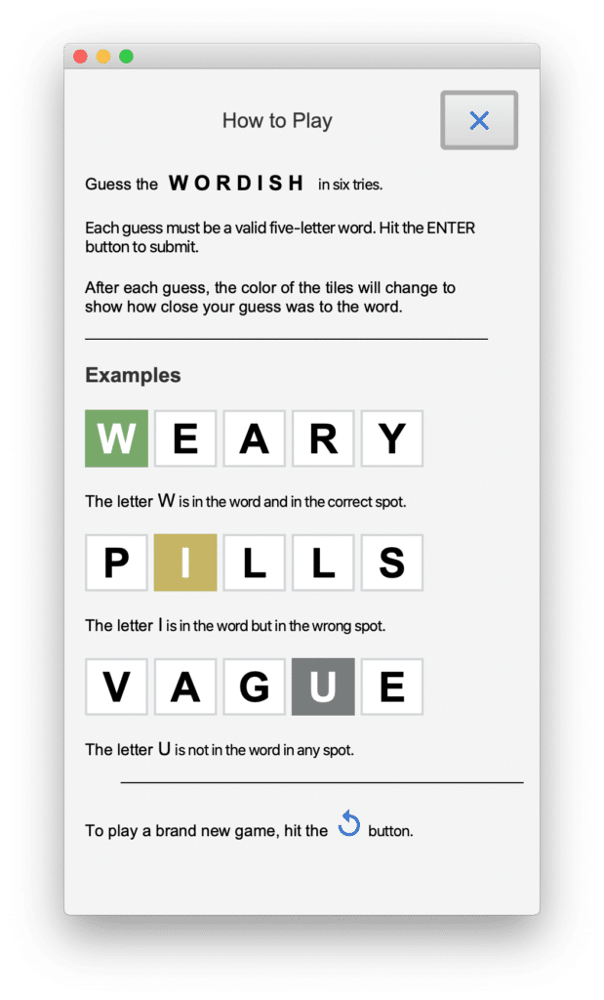
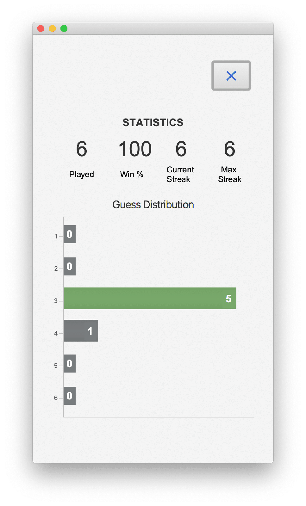

Welcome to Part 3 of this five part series.

In [Part 1](https://foojay.io/today/wordish-with-javafx-part-1/), we introduced the Wordish game with JavaFX and discussed the main UI layout.

In [Part 2](http://foojay.io/today/wordish-with-javafx-part-2/), we discussed look and feel enhancements.

We introduced specialized Label and Button controls that use pseudo-classes for advanced CSS styling.

We covered incorporating third-party font libraries and customizing Scene Builder to leverage these features.

Now in Part 3, we'll examine the controller code. The controller code maintains game state and responds to user input with appropriate updates to the UI.

Before we start, here's an example screenshot of Wordish.



You can access the code on github here: <https://github.com/gailasgteach/Wordish>.

## Part 3: JavaFX Controller Code

Let's now turn our attention to the controller code that maintains game state and responds to user input with appropriate updates to the UI. We'll first examine the idea of sharing data between views.

Next, we'll show you how to leverage the JavaFX property binding mechanism to control UI state.

The fun part of implementing Wordish is codifying the algorithm for matching user input guesses with the target word. I admit that I was surprised that this algorithm was a bit more complex than I initially thought.

And finally, we'll examine the code that performs tile animations.

### Sharing Data Objects

After navigating from the Wordish game view to the How to Play view, we must return to the Wordish game view in its same state.

Furthermore, we must also save the games' results in order to display the game statistics and create the bar chart in the Statistics view. Figure 2 shows these three views of Wordish.

<figure class="wp-block-gallery has-nested-images columns-default is-cropped wp-block-gallery-1 is-layout-flex wp-block-gallery-is-layout-flex">
 <figure class="wp-block-image size-large">
  
 </figure>
 <figure class="wp-block-image size-large">
  
 </figure>
 <figure class="wp-block-image size-large">
  
 </figure>
 <figcaption class="blocks-gallery-caption">
  Figure 2. The three views of Wordish
 </figcaption>
</figure>

There are several ways to implement data sharing among the views. One, Gluon includes a convenient library called [Glisten Afterburner](https://gluonhq.com/gluon-mobile-next-iteration/)(part of Gluon Mobil) that implements a minimalistic dependency injection.

Another option, [Gluon Ignite](https://gluonhq.com/labs/ignite/), allows developers to use popular dependency injection frameworks in their JavaFX applications, such as Guice, Dagger, Spring and Spring Boot, and Micronaut.

In our example, we use the no-frills method of sharing data with Java singleton objects. We instantiate our singleton objects once and make them available to our various controller classes. Note that as you switch from one view to another, the FXMLLoader rebuilds the scene graph and instantiates class objects anew.

We maintain game status with the LetterLabel and KeyButton states. We also keep track of various game statistics, which we store in an embedded object WordStats.

#### Class WordStats

Class WordStats stores data such as games played, total wins, current streak, max streak, and the data (stored in a HashMap) for the guess distribution. The guess distribution records how many games the user wins with one guess, two guesses, and so on. This is the data we use to create the bar chart in the Statistics view.

#### Class GameStatus

The GameStatus singleton class has a private constructor and a public static `getInstance()` method. Multiple calls to `getInstance()` return the same object each time. This ensures multiple controller objects access the same data.

```java
public class GameStatus {

    private static GameStatus instance = null;

    private List<LetterState>letterState = new ArrayList<>();
    private Map<String, LetterStyle.DisplayType> keyBoardState = 
               new HashMap<>();
    private final WordStats wordStats = new WordStats();

    private GameStatus() {}

    public static GameStatus getInstance() {
           if (instance == null) {
            instance = new GameStatus();
           }
           return instance;
    }
    // setters and getters
      . . .
}
```

In both **WordishController.java** and **StatsController.java**, we access the shared GameStatus instance with the following.

```java
private static final GameStatus gameStatus = GameStatus.getInstance();
```

**Note** : See **[GameStatus.java](https://github.com/gailasgteach/Wordish/blob/master/src/main/java/com/asgteach/model/GameStatus.java)** , **[WordStats.java](https://github.com/gailasgteach/Wordish/blob/master/src/main/java/com/asgteach/model/WordStats.java)** , and **[LetterState.java](https://github.com/gailasgteach/Wordish/blob/master/src/main/java/com/asgteach/model/LetterState.java)** for the above described code. ***Bonus***: LetterState uses the Java 17 record feature.

### JavaFX Properties and Bindings to Manage UI State

At times you must prevent certain actions during game play. This requirement not only applies to Wordish, but to any application where certain actions don't make sense or overly complicate the program.

In Wordish, for example, if the guess letters are empty, we want to make the Delete key inactive. Similarly, once the user submits a guess, it's "too late" to use the Delete key to erase a letter. In these cases, it makes sense to disable the Delete button. If a user types (or touches) the Delete key, we ignore input. This means we don't process the input, making our button handler less complicated.

Another example is the Enter key, which the user uses to submit a guess. If the five-letter word is not filled or the user has already submitted the guess, we want to disable the Enter key.

The best way to manage game state and keep the UI synchronized is with JavaFX properties. JavaFX properties are observable, which means you can write listeners that are invoked when a property's value changes.

#### Property Binding

Even better, you can maintain the state of a JavaFX property based on one or more other JavaFX properties. This is called *property binding*. As you will see, Property Binding is helpful when your program has related dependencies, such as deciding when to make a button disabled.

The WordishController uses property binding to maintain the disabled state of its buttons. For example, the top-level Information and Bar Chart buttons' disable property depends on the `gameReset` property: if the `gameReset` property is false, we disable these buttons, as follows.

```java
statsButton.disableProperty().bind(gameReset.not());
infoButton.disableProperty().bind(gameReset.not());
```

Likewise, we bind the `disable` property of the Enter and Delete buttons and each of the KeyButtons. That is, if either the row is not filled with letters or if the game is over, we disable the Enter button. Similarly, we disable the Delete button if there are no letters to delete or the game is over. And finally, if we're processing the word, the row is filled, or the game is over, we disable the buttons in the virtual keyboard.

```java
enterButton.disableProperty().bind(squarenum.lessThan(ROW_FILLED)
            .or(gameOver));
deleteButton.disableProperty().bind(squarenum.isEqualTo(0)
            .or(gameOver));
keyLetters.values()
            .stream()
            .forEach(button -> button.disableProperty()
            .bind(processingWord
                    .or(squarenum.isEqualTo(ROW_FILLED))
                    .or(gameOver)));
```

**Note** : See **[WordishController.java](https://github.com/gailasgteach/Wordish/blob/master/src/main/java/com/asgteach/WordishController.java)**.

### The Guess Algorithm and Leveraging Streams

Wordish processes a guess in the `processWord()` method. Its argument is a list of LetterLabel controls that correspond to the row of letters that the user submits. Let's go through the steps, which we order as follows.

* Collect individual letters in each LetterLabel of the row into a String.
* Check if the word is valid.
* Matching letters: find and mark.
* Partial matching letters: find and mark.
* Non-matching letters: find and mark.
* Animate the row of LetterLabels, mark the related keys in the virtual keyboard, and update the game.

Here's method `processWord()`, which we discuss below.

```java
private void processWord(List<LetterLabel> list) {
      // Grab the letters and build a String
        String guess = list.stream()
          .map(e -> e.getText())
          .reduce("", String::concat);
        wordTally.setGuess(guess);
        wordTally.setTarget(wordData.getTheWord());
      // Is it a valid word?
        if (!wordData.isAWord(guess)) {
            // bad word
            WordPopup.show(
               "Word is not in the valid word list.", enterButton);
            animateBadWord(list);
            processingWord.set(false);
            return;
        }
        doProcessMatching(list);
        doProcessPartial(list);
        doProcessNoMatch(list);
        animateLabelGroup(list);
}
```

First, we first collect the individual letters from `list` into a String using `stream()`, `map()`, and `reduce()`.

Next, we check if the word is in the valid world list. Note that a service called WordData provides the actual word list, gets new target words, and validates guesses. We discuss the details of this service in Part 4.

For now, we treat WordData as a black box and use it to validate the word with boolean method `isAWord()`. If the word is not valid, a popup message displays and processing terminates.

### The Matching Methods

The three matching methods each perform a similar, but distinct task. Note that these tasks are ordered so that we find matching letters first. We then replace matching letters in both the guess word and target word with a hyphen ('-').

Importantly, the hyphen (our chosen replacement character) makes the partial match algorithm easier, since you won't mark a letter as a partial match if it has already been replaced by a hyphen during match processing. Consequently, the character replacement makes processing words that contain duplicate letters straightforward.

As an example, if we submit the word "SHEEP" as a guess for the target word "STEAL," we want the second "E" in "SHEEP" marked no-match because the first "E" in "SHEEP" matches the "E" in "STEAL."

Conversely, if we submit the word "SKETE" for the target word "SHEEP," we want the second "E" in "SKETE" marked as a partial-match.

These edge cases all work out nicely by replacing letters with a special character that match and partial-match in the first two matching routines.

The third matching method marks any remaining letters as non-matching.

#### Method `doProcessMatching()`

Here's the `doProcessMatching()` method. Note that we configure the class variable `wordTally` *before* calling this method: we set string `guess` to the user's guess word and `target` to the correct answer.

```java
private void doProcessMatching(List<LetterLabel> list) {
        list.stream()
            .filter(ll -> 
                      wordTally.getGuess().charAt(list.indexOf(ll)) ==  
                        wordTally.getTarget().charAt(list.indexOf(ll)))
            .forEach(ll -> {
                      ll.setMatchResult(MATCHING);
                      int index = list.indexOf(ll);                   
                      wordTally.setGuess(
                      wordTally.getGuess().substring(0, index) +
                       "-" + wordTally.getGuess().substring(index + 1));
                      wordTally.setTarget(
                       wordTally.getTarget().substring(0, index) +
                        "-" + wordTally.getTarget().substring(index + 1));
                });
}
```

First, we use `stream()` to filter the LetterLabel objects that correspond to matching characters. For the characters that match, we set the LetterLabel property `matchResult` enum to `MATCHING` and replace the corresponding character in both the guess and target words with a hyphen.

#### Method `doProcessPartial()`

Here's the `doProcessPartial()` method. Note that here we start with the updated `wordTally` object that holds the results of the previous `doProcessMatching()` method.

To process partial matches, we replace the partial match character in *both* the target and guess words. Notably, these will necessarily have different index values. As before, we update the LetterLabel property `matchResult`, this time to `PARTIALMATCH`.

```java
private void doProcessPartial(List<LetterLabel> list) {
        list.stream()
         .filter(ll -> wordTally.getGuess().charAt(
                 list.indexOf(ll)) != '-')
          .forEach(ll -> {
              char c = wordTally.getGuess().charAt(list.indexOf(ll));
              if (wordTally.getTarget().contains(Character.toString(c))) {    
                 ll.setMatchResult(PARTIALMATCH);
                 int index = wordTally.getTarget().indexOf(c);
                 int index2 = list.indexOf(ll);
                 wordTally.setTarget(wordTally.getTarget()
                    .substring(0, index) + "-" + 
                          wordTally.getTarget().substring(index + 1));
                 wordTally.setGuess(wordTally.getGuess()
                     .substring(0, index2) + "-" + 
                          wordTally.getGuess().substring(index2 + 1));
               }
          });
}
```

#### Method `doProcessNoMatch()`

And lastly, here is method `doProcessNoMatch()`. Each LetterLabel corresponding to a character that was not previously replaced with a hyphen has its `matchResult` property set to enum `NOMATCH`.

At this point, each LetterLabel in the row will have its `matchResult` property to set to one of `MATCHING`, `PARTIALMATCH`, or `NOMATCH`.

```java
private void doProcessNoMatch(List<LetterLabel> list) {
        list.stream()
        .filter(ll -> wordTally.getGuess().charAt(list.indexOf(ll)) != '-')
        .forEach(ll -> ll.setMatchResult(NOMATCH));
}
```

The row is now ready for animation and for displaying the color-coded result maintained by property `letterDisplay`, which we explain in the next section.

### Implementing Animations

Wordish performs three different sets of animation.

* Each tile in a row rotates if a user correctly guesses the word.
* If the word is not in the valid word list, the row of tiles containing the submission vibrates in a side-to-side animation.
* LetterLabel tiles rotate down when revealing the result of processing the user's guess.

JavaFX high-level transitions are convenient for performing node-level animations like these. We'll describe each of these animation sets, which combine animations to achieve the desired effect. First, we describe the "happy dance" animation for a successful guess.

#### Method `animateSuccessGroup()`

The `animateSuccessGroup()` method animates each LetterLabel tile when a user guesses the correct word. First, we create a RotateTransition along the Z_AXIS, giving a circular movement to the tile with a rotation of 60 degrees.

With `autoReverse`, the rotation returns to the starting point. Setting the count to four makes this back and forth animation show twice.

The SequentialTransition performs the animation for each LetterLabel tile, one after the other.

```java
private void animateSuccessGroup(List<LetterLabel> list) {
        SequentialTransition seq = new SequentialTransition();
        list.stream()
          .forEach(ll -> {
              RotateTransition rotate = new RotateTransition(
                            Duration.millis(100), ll);
              rotate.setAxis(Rotate.Z_AXIS);
              rotate.setByAngle(60);
              rotate.setAutoReverse(true);
              rotate.setCycleCount(4);
              seq.getChildren().add(rotate);
           });
        seq.setDelay(Duration.millis(100));
        seq.play();
}
```

#### Method `animateBadWord()`

Next, let's show you `animateBadWord()`. This code animates a row of LetterLabel tiles when the user submits an invalid word. Here, a TranslateTransition moves the LetterLabel tile along the X axis by 20 pixels. (Positive values move the node to the right.) Again, we set `autoReverse` to true and the count to six. This makes the LetterLabel tile "shake" back and forth three times.

The ParallelTransition performs the TranslateTransition on each LetterLabel tile at the same time. This has the effect of moving the entire row back and forth.

```java
private void animateBadWord(List<LetterLabel> list) {
   ParallelTransition para = new ParallelTransition();
   list.stream()
      .forEach(ll -> {
          TranslateTransition translate1 = new TranslateTransition(
                            Duration.millis(100), ll);
          translate1.setByX(20);
          translate1.setAutoReverse(true);
          translate1.setCycleCount(6);
          para.getChildren().add(translate1);
        });
   para.play();
}
```

#### Method `animateLabelGroup()`

And finally, here's method `animateLabelGroup()` that reveals the individual LetterLabel guess. This animation is more involved because we need to mimic LetterLabels rotating down along the Y_AXIS.

When you rotate 180 degrees, a LetterLabel appears upside down and its text displays upside down and backwards. Therefore, we must return the LetterLabel back to its starting position in a seamless way without showing any backward letters.

With a bit of trickery, we fade the LetterLabel and temporarily replace its letter with a space. The end result is the appearance of a LetterLabel tile flipping down with its color-coded status displayed.

To do all this, we use a parallel transition to combine the LetterLabel rotation and fade transitions. Each LetterLabel's parallel transition is executed one after the other with a sequential transition.

Of great help in this animation sequence are the calls to `setOnFinished()`, an event handler invoked when a transition completes.

```java
private void animateLabelGroup(List<LetterLabel> list) {
        SequentialTransition seq = new SequentialTransition();
        list.stream()
                .forEach(ll -> {
                    String letterText = ll.getText();
                    FadeTransition fade = new FadeTransition(
                            Duration.millis(100), ll);
                    fade.setAutoReverse(true);
                    fade.setCycleCount(2);
                    fade.setToValue(0);

                    fade.setDelay(Duration.millis(20));
                    fade.setOnFinished(x -> {
                        ll.setText("");
                        ll.setLetterDisplay(ll.getMatchResult());
                    });

                    RotateTransition rotate = new RotateTransition(
                            Duration.millis(400), ll);
                    rotate.setAxis(Rotate.X_AXIS);
                    rotate.setByAngle(180);
                    rotate.setOnFinished(x -> {
                        ll.setRotate(0);
                        ll.setText(letterText);
                    });

                    ParallelTransition para = new ParallelTransition();
                    para.getChildren().addAll(fade, rotate);
                    seq.getChildren().add(para);
                });
        seq.setOnFinished(x -> gameHouseKeeping(list));
        seq.play();
}
```

In the fade transition's `setOnFinished()`, the event handler sets the text to the empty string and sets the `letterDisplay` property. This `letterDisplay` property automatically updates the style (our CSS pseudo-class scaffolding code), so the result of the matching process is now revealed.

The rotation transition's `setOnFinished()` event handler is called at the completion of the rotation. Here, we return the rotation angle to 0 and restore the LetterLabel's text.

A sequential transition performs these animations on the entire row of LetterLabel tiles. The sequential transition's `setOnFinished()` event handler invokes method `gameHouseKeeping()`. This method updates the game status by setting the corresponding `letterDisplay` property of the KeyButtons involved in this guess, and determining if the user guessed the correct word.

**Note** : See **[WordishController.java](https://github.com/gailasgteach/Wordish/blob/master/src/main/java/com/asgteach/WordishController.java)** and **[WordTally.java](https://github.com/gailasgteach/Wordish/blob/master/src/main/java/com/asgteach/model/WordTally.java)**.

**Next** : In Part 4 we explore **What's in a Word, Anyway**: Getting the target word and determining if a word is valid.
