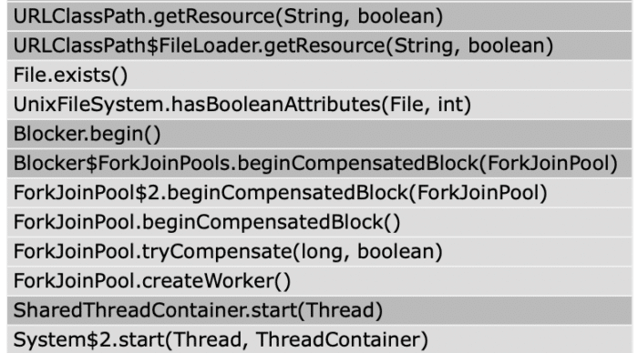

Although the Java 19 release is coming in September (2022-09-20), we already know what will happen in that release!

In this article, we'll touch on upcoming features via examples to get a sense of how valuable these can be to a project.

### JEP-405: Record Patterns (Preview)

Java 14 introduced (JEP-361, Reference 2), which made it possible to use a switch as a statement or an expression. In many cases, I think it was something the community shouted for quite some time, because many other JVM languages have already provided such constructs.

It didn't stop there: Java 16 simplified the use of the *instanceof* construct (JEP-394, Reference 3) and provided direct access to the required variables. This allowed users to access all the fields and methods provided without having to retype their value type, which is already known.

The development of the platform has not stopped here, either. Java 16 also brought a very nice construct in the form of a new class of type *Record* (JEP-395, Reference 4). The motivation of the Record class was to provide a compact definition of a fixed class with arrays or methods without standard code getters, *hashCode* and *equals* (all handled automatically) (**Example 1**).

```java
private interface Example {}
private record ExampleOne(int value, String text, Color color) implements Example{}
private record ExampleTwo(int value, Color color) implements Example {}
private record ExampleThree(int value) implements Example {}

Object r1 = new ExampleOne(1, "text", Color.BLUE);
Object r2 = new ExampleTwo(2, Color.BLUE);
Object r3 = new ExampleThree(3);
Stream.of(r1,r2,r3, 42).forEach( e -> {
   var message = switch (e){
       case ExampleOne e1 -> "1-" + e1.toString();
       case ExampleTwo e2 -> "2-" + e2.toString();
       case Example e3 -> "3-" + e3.toString();
       case Integer n -> "4-" + n;
       default -> "not supported";
   };
   System.out.println("1: message:" + message);
});
```


**Example 1.**: Currently supported usage of Record and class types in switch expressions

Another missing piece was improving the platform to handle Record like other classes. This means using a compact switch expression as well as control instances (JEP-405, Reference 1).

This enhancement is the first preview version to be provided to the Java community for review and feedback (**Example 2**).

```java
if(r1 instanceof ExampleOne(int value, String t, Color c)){
   System.out.println("2: color:" + c);
}
```


**Example 2.**: Still results in compilation error but a new build of Java SE 19 is on its way

### JEP-425: Virtual Threads (Preview)

In one of the previously published articles (Thinking of Massive Throughput? Get to Know Virtual Threads!, Reference 8), we have already shown the uses and benefits and challenges associated with using Virtual.

The current release (Reference 7., Build23) shows that a lot of work has been done on the shared thread container (**Figure 1**) to achieve the desired state (JEP-424, Reference 6).

<figure class="wp-block-image alignnone size-medium wp-image-56170">
 
 <figcaption>
  <strong>Figure 1.</strong>: Runnable task distribute to the platform thread through the <em>SharedThreadContainer</em>
 </figcaption>
</figure>

### JEP-428: Structured Concurrency (Incubator)

```java
Response handle() throws ExecutionException, InterruptedException {
    Future<String> user  = es.submit(() -> findUser());
    Future<Integer> order = es.submit(() -> fetchOrder());
    String theUser  = user.get();   // Join findUser 
    int    theOrder = order.get();  // Join fetchOrder
    return new Response(theUser, theOrder);
}
```


**Example 3.** : Java SE 5 introduced the ability to run tasks concurrently, but the disadvantages of processing failure remained. e.g. the *findUser* function failed and the *fetchOrder* function continued to run without warning, resulting in a thread leak, and so on.

The implementation of VirtualThreads opens up new possibilities for making concurrency accessible to a wider user base.

This JEP proposes to bring a structure for handling multiple concurrent tasks by introducing a new StructuredTaskScope (package *jdk.incubator.conccurent* ). Adds new syntactic changes, but addresses some previous shortcomings (**Example 3**).

*StructuredTaskScope* manages the concurrent division of tasks that are performed on their own threads. It represents the same return point (**Example** 4) and closes the execution and can be used to ensure constant behaviour (*not part of build 23*).

```java
Response handle() throws ExecutionException, InterruptedException {
    try (var scope = new StructuredTaskScope.ShutdownOnFailure()) {
        Future<String>  user  = scope.fork(() -> findUser()); 
        Future<Integer> order = scope.fork(() -> fetchOrder());

        scope.join();          // Join both forks
        scope.throwIfFailed(); // ... and propagate errors

        // Here, both forks have succeeded, so compose their results
        return new Response(user.resultNow(), order.resultNow());
    }
}
```


**Example 4.** : *StructureTaskScope* wraps all concurrent subtasks and processes them as a whole, even if they branch into their own threads (see **Example 2.**)

### JEP-424: Foreign Function \& Memory API (Preview)

The Java Platform provides incredible freedom in creating or destroying objects through an allocated stack in real memory. The Garbage Collector daemon works on such a heap to provide a sense of "unlimited" memory space that provides freedom.

Although Java provides a great base for libraries for non-Java resources (JDBC, NIO, etc.), interoperability outside of JVM processes was considered a barrier. JEP-424 addresses the issue of performing functions and accessing memory outside (out of the heap, no GC impact) of the JVM process safely and consistently.

From the incubation period came new interfaces for accessing foreign memory: *MemorySegment* , *MemoryAddress* and *SegmentAllocator* . *MemorySession* interface for memory lifecycle management. And for calling foreign functions, such as interfaces like *Linker* (**Example 5** ), *SymbolLook* , or the *FunctionDescriptor* class

```java
Linker linker = Linker.nativeLinker();
SymbolLookup stdlib = linker.defaultLookup();
MethodHandle radixSort = linker.downcallHandle(
                             stdlib.lookup("radixsort"), ...);
```


**Example 5.**: Finding and linking a foreign function

### JEP-426: Vector API (Fourth Incubator)

Implement an API for expressing vector computations that reliably compiles at runtime into optimal vector instructions on supported CPU architectures, resulting in higher performance than equivalent scalar computations (Reference 11.).

### JEP-422: Linux/RISC-V Port

RISC-V is a free and open RISC instruction set architecture (ISA) originally designed at the University of California, Berkeley and now developed in collaboration with RISC-V International.

It is already supported by a wide range of language tools. With the increasing availability of RISC-V hardware, the JDK port will be valuable (Reference 10.).

### Conclusion

The Java platform continues to bring more new concurrency, syntax and platform enhancements.

The "***Pattern Matching*** '' functions continued to progress and eventually reduced the eloquence of the language. Very excited about the upcoming state of ***VirtualThreads*** and the related***structured concurrent*** approach.

Ultimately, it is very interesting to track the efforts of***foreign functions*** and***memory*** API as it opens new horizons in other platform usage much more easily.

In my humble opinion, none of the above improvements and all the others would have been possible without a ***6-month release cycle***.

Fortunately, it was well received by the community.

**Used Build**: Java SE 19, Build 23 (Reference 7.)

<br />

### References

1. [JEP-405: Java SE 19, Record Patterns (Preview)](https://openjdk.java.net/jeps/405)
2. [JEP-361, Java SE 14: Switch Expression](https://openjdk.java.net/jeps/361)
3. [JEP-394, Java SE 16: Pattern Matching instanceof](https://openjdk.java.net/jeps/394)
4. [JEP-395, Java SE 16: Records](https://openjdk.java.net/jeps/395)
5. [JEP-427: Java SE 19: Pattern Matching for switch](https://openjdk.java.net/jeps/427)
6. [JEP-425: Java SE 19: Virtual Threads (Preview)](https://openjdk.java.net/jeps/425)
7. [OpenJDK 19, Early-Access Builds](https://jdk.java.net/19/)
8. [Foojay, Thinking about massive throughput? Meet Virtual Thread!](https://foojay.io/today/thinking-about-massive-throughput-meet-virtual-threads/)
9. [JEP-428: Structured Concurrency (Incubator)](https://openjdk.java.net/jeps/428)
10. [JEP-422: Linux/RISC-V Port](https://openjdk.java.net/jeps/422)
11. [JEP-426: Vector API (Fourth Incubator)](https://openjdk.java.net/jeps/426)
