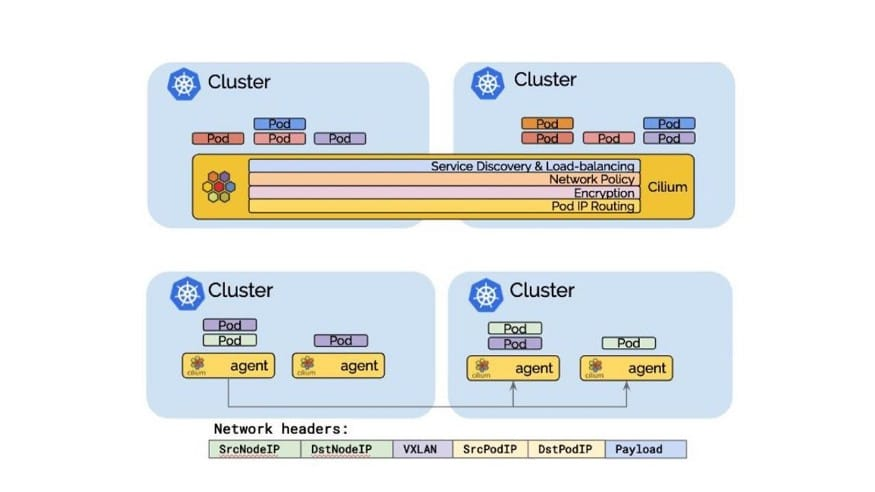
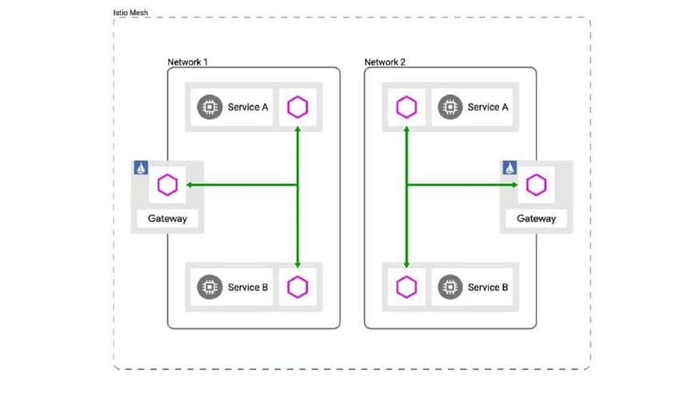

*This post will show you the benefits of managing your distributed applications with Kubernetes in cross-cloud, multi-cloud, and hybrid cloud scenarios using Cilium and Istio with Helm and Operator for deployment.*{#6864}

In our recent post on [The New Stack](https://thenewstack.io/taking-your-database-beyond-a-single-kubernetes-cluster/), we showed you how you can leverage [Kubernetes](https://kubernetes.io/) (K8s) and [Apache Cassandra](https://cassandra.apache.org/_/index.html)TM to manage distributed applications at scale, with thousands of nodes across both on-premises and in the cloud. In that example, we used [K8ssandra](https://k8ssandra.io/) and [Google Cloud Platform](https://cloud.google.com/) (GCP) to illustrate some of the challenges you might expect to encounter as you grow into a multi-cloud environment, upgrade to another K8s version, or begin working with different distributions and complimentary tooling. In this post, we'll explore a few alternative approaches to using K8s to help you more easily manage distributed applications.{#fec3}

[Cloud Native Computing Foundation](https://www.cncf.io/) (CNCF) provides many different options for managing your distributed applications. And, there are many open-source projects out there, that has come a long way in helping to alleviate some of the pain points for developers working in the cross-cloud, multi-cloud, and hybrid cloud scenarios.{#e9fb}

In this post, we'll focus on two additional approaches that we think are very good:{#5ceb}

* Using a container network interface ([Cilium](https://cilium.io/)) and service mesh ([Istio](https://istio.io/)) on top of your K8s infrastructure to more easily manage your distributed applications.
* Using [Helm](https://helm.sh/) and the [Operator Framework](https://github.com/operator-framework) to deploy them in a cloud-native way.

In [our first post](https://thenewstack.io/taking-your-database-beyond-a-single-kubernetes-cluster/) on the topic of how to leverage K8s and Cassandra to manage distributed applications at scale, we discussed the use of DNS stubs to handle routing between our Cassandra data centers. However, another approach is to run a mix of global Istio services and Cilium global services side by side.{#9ad8}

Cilium provides a single zone of connectivity (a control plane) that facilitates the management and orchestration of applications across the cloud environment. Istio is an open-source, language-independent service networking layer (a service mesh) that supports communication and data sharing between different microservices within a cloud environment.{#8b3a}

Cilium's global services are reachable from all Istio managed services as they can be discovered via DNS just like regular services. The pod IP routing is the foundation of the multi-cluster ability. It allows pods across clusters to reach each other via their pod IPs. Cilium can operate in several modes to perform pod IP routing. All of them are capable of performing multi-cluster pod IP routing.{#1c5d}
 *Figure 1: Cilium control plane for managing and orchestrating applications across the cloud environment.*  *Figure 2: Istio service networking layer (service mesh) to support communication and data sharing between different microservices within the cloud environment.*

You may already be using one of these tools. If you are, you can add one on top of the other to extend their benefits. For example, if you already have Istio deployed, you can add Cilium on top of it. Pod IP routing is the foundation of multi-cluster capabilities, and both of these tools provide that functionality today. The goal here is to streamline pod-to-pod connectivity and ensure that they're able to perform multi-cluster IP routing.{#4fc5}

We can do this with overlay networks, in which we can tunnel all of this through encapsulation. With overlay networks, you can build out a separate IP address space for your application, which in our example [here](https://thenewstack.io/taking-your-database-beyond-a-single-kubernetes-cluster/) is a Cassandra database. Then you would run that on top of the existing Kube network leveraging proxies, sidecars, and gateways. We won't go too far into that in this post, but we have some great content on [how to connect stateful workloads across K8s clusters](https://www.datastax.com/blog/how-connect-stateful-workloads-across-kubernetes-clusters) that will show you at a high level how to do that.{#26d1}

Tunneling mode in Cilium [encapsulates](https://docs.cilium.io/en/v1.8/concepts/networking/routing/) all network packets emitted by pods in a so-called encapsulation header. The encapsulation header can consist of a [VXLAN](https://en.wikipedia.org/wiki/Virtual_Extensible_LAN) or [Geneve frame](https://en.wikipedia.org/wiki/Generic_Network_Virtualization_Encapsulation). This encapsulation frame is then transmitted via a standard [User Datagram Protocol](https://en.wikipedia.org/wiki/User_Datagram_Protocol) (UDP) packet header. The concept is similar to a VPN tunnel.{#790a}

* **Advantage:**The pod IPs are never visible on the underlying network. So, you get the benefit of encryption. The network only sees the IP addresses of the worker nodes. This can simplify installation and firewall rules.
* **Disadvantage:**The additional network headers required will reduce the theoretical maximum throughput of the network. The exact cost will depend on the configured maximum transmission unit (MTU) and will be more noticeable when using a traditional MTU of 1500 compared to the use of jumbo frames at MTU 9000.
* **Disadvantage:** In order to not cause excessive CPU, the entire networking stack including the underlying hardware has to support checksum and segmentation offload to calculate the checksum and perform the segmentation in hardware just as it is done for "regular" network packets. Availability of this offload functionality is very common these days.

The takeaway message here is really that there are a lot of options that exist in the container networking interface (CNI) space and with service mesh and discovery that can help to eliminate most if not all of the heavy lifting around DNS service discovery and ensuring end-to-end connectivity, you need to effectively manage your distributed applications.{#646e}

These products not only provide all of that functionality bundled up into a single solution (or maybe a couple of solutions), but they also offer some pretty big additional benefits over simply using DNS stubs. With DNS stubs, you still have to manually configure your DNS and IP routing, map it all out and document it, and then automate and orchestrate it all. Whereas, these products offer observability, ease of management, and most importantly, a Zero Trust architecture, which would be nearly impossible to achieve with a DNS-only based solution.{#e810}

Cilium has done a great job creating a plug-in architecture that runs on top of [eBPF](https://ebpf.io/). This provides application-level visibility that allows you to start creating policies that go beyond what you may have seen or leveraged before. For example, say you want to create a firewall rule to ensure that your application can only talk to a specific Cassandra server. You can actually now take that down a few notches to create a rule that allows read-only access or restricts access to specific records or tables. That's just not something that's possible with the existing tooling we've used in the past, whether that's VPNs and Firewalls.{#dbe7}

The other thing is that all of this has created a lot of complexity and "Kubeception" around layers upon layers of overlay networks. So, it can be challenging to ensure you have visibility and to properly instrument everything, especially if you're managing DNS on your own. You'll also have to start collecting logs, gathering metrics, creating dashboards, and doing other things that together add a lot of additional overhead.{#490f}

However, if you look at projects like [Cilium Hubble](https://github.com/cilium/hubble) and [Istio Galley](https://github.com/istio/istio/tree/master/galley), you can see that you not only get all the instrumentation to manage this stuff out of the box, but you also get observability into the health of your pods and fine-grained visibility that you won't get with traditional tools.{#1966}

This observability is a huge advantage because it allows you to also instrument on the monitoring side to build out powerful metrics reporting with tools that can tightly integrate with [Prometheus](https://prometheus.io/). Once you do this, you can get metric data on the connectivity between all of your pods and applications and determine where there may be latency as well as what policy is potentially being impacted.{#0c4e}

Of course, the ability to instrument all this isn't new. We've probably all been there and done that, collecting logs to some central log aggregator, building custom searches, etc. But with these services, we can now get this out of the box.{#0349}

So how do we get from all the great things we've talked about in these slides to actually deploying your applications into a cloud, multi-cloud or hybrid cloud environment?{#d13e}

Since you're no longer working in a single region or cluster anymore, there's going to be a bit of juggling involved. You might be pushing manifest and resources to each cluster one by one. Or maybe you're templating things out and using tools like Helm or perhaps some GitOps or other pipeline tools to make sure that you are staging appropriately and you're working through different environments. But really, there's still a lot more that is required when you're working on multi-cluster deployments.{#5bef}

So one example here is [Helm](https://helm.sh/). If you're using Helm, you're going to have a release per cluster, which means you're going to have to maintain and manage to switch between those various contacts and make sure you're upgrading the right way. And in case things go sideways, you'll also need to know how to stage a change or roll back a change before you switch over and do operations in the other cluster or the other region. And when you go beyond two regions, there's even a bit more complexity.{#a836}

Now I'd like to call out the [Operator Framework](https://operatorframework.io/) here, and more specifically the [Operator SDK](https://sdk.operatorframework.io/) and the individual operators that make up a number of the things we've covered here.{#841a}

Some of these tools are really starting to level up with multi-cluster functionality where in some cases you're running instances of their operator inside of each of the clusters, and they communicate and lock and perform when they go to perform various actions. In other cases, you might have a control plane where you're running the operator and it's reconciling resources in the downstream clusters.{#9392}

Maybe we have an Ops K8s cluster, or maybe just [us-west4](https://cloud.google.com/about/locations#network) is running the operator, but it's communicating with the [Kube API](https://www.redhat.com/en/topics/containers/what-is-the-kubernetes-API) and [us-east1](https://cloud.google.com/about/locations#americas). We're currently doing that in the K8ssandra project where we're going from Helm charts to an operator that has Kube configs and serves the confidentials to talk to remote API servers and to reconcile resources across those boundaries. We do this because some operations need to happen serially.{#20fb}

Maybe if a node is down in one data center and we don't want to do a certain operation in another data center, having operators that can communicate across those cluster boundaries can be really advantageous, especially when you're talking about orchestration.{#c5f3}

The conversation we started on [The New Stack blog](https://thenewstack.io/taking-your-database-beyond-a-single-kubernetes-cluster/) and have continued here has focused a lot on manually managing things versus having cloud-native technologies that can manage them for us, whether that be service discovery or routing tables, or even just adjusting the packet in flight to indicate what cluster they need to go to and eventually, what pod they need to reach.{#7738}

When you think through the application of these technologies and how you might best use them to manage your distributed applications, the single most important takeaway we'd like to leave you with is...{#3283}
> Y**ou need to plan your deployments before you start spinning up your K8s clusters.**

Having the right people together to hash out your approach before you wade in will help you identify any limits in your system and other important factors that need to be considered. For example, maybe you have a scarcity of IP addresses. Maybe you're running one big cluster, and now you're talking about many small clusters. Or maybe you run clusters more along business lines or for certain Ops teams.{#b1be}

How are you going to start to venture into this multi-cluster multi-region space and ultimately, how are you going to build the plumbing and the pipes between those systems so they can communicate with each other?{#f1b9}

Theoretically, a single team could do this planning. But, that's probably not going to turn out well. It's far more likely that you'll need to involve several teams, including people from operations and people that run the cloud accounts. If you're operating in a hybrid or multi-cloud environment, you'll probably also have some network people involved, too. For example, there may be some firewalls that need to be adjusted in certain ways.{#1b10}

Planning your approach upfront is enormously beneficial and will help you avoid some pretty big problems when you move into implementation. For example, it can be very difficult to make changes once you've launched your cluster because you can't just change the [Classless Inter-Domain Routing](https://en.wikipedia.org/wiki/Classless_Inter-Domain_Routing) (CIDR) (the IP address space) your pods are running in at that point. You would instead need to migrate them. By doing some of this planning upfront, you can avoid this and a lot of other unfortunate situations.{#2362}

Curious to learn more about (or play with) Cassandra itself? We recommend trying it on the [Astra DB](https://astra.dev/3PPygMH) for the fastest setup.

*Follow the* [*DataStax Tech Blog*](https://datastax.medium.com/)*for more developer stories. Check out our* [*YouTube*](https://www.youtube.com/channel/UCqA6zOSMpQ55vvguq4Y0jAg)*channel for tutorials and here for DataStax Developers on* [*Twitter*](https://www.youtube.com/channel/UCqA6zOSMpQ55vvguq4Y0jAg)*for the latest news about our developer community.*{#68e7}

1. [Taking Your Database Beyond a Single Kubernetes Cluster](https://thenewstack.io/taking-your-database-beyond-a-single-kubernetes-cluster/)
2. [Kubernetes](https://kubernetes.io/) (K8s)
3. [Apache Cassandra](https://cassandra.apache.org/_/index.html)TM
4. [K8ssandra](https://k8ssandra.io/)
5. [Google Cloud Platform](https://cloud.google.com/)
6. [The Cloud Native Computing Foundation](https://www.cncf.io/) (CNCF)
7. [Cilium](https://cilium.io/)
8. [Cilium Docs: Routing and Encapsulation](https://docs.cilium.io/en/v1.8/concepts/networking/routing/)
9. [Cilium Guides: How to Secure a Cassandra Database](https://docs.cilium.io/en/v1.8/gettingstarted/cassandra/)
10. [Deep Dive into Cilium Multi-Cluster](https://cilium.io/blog/2019/03/12/clustermesh)
11. [Istio](https://istio.io/)
12. [Istio Multi-cluster Guide](https://istio.io/latest/docs/setup/install/multicluster/)
13. [Helm Charts](https://helm.sh/)
14. [Operator Framework](https://github.com/operator-framework)
15. [How to Connect Stateful Workloads Across Kubernetes Clusters](https://www.datastax.com/blog/how-connect-stateful-workloads-across-kubernetes-clusters)
16. [Virtual Extensible LAN](https://en.wikipedia.org/wiki/Virtual_Extensible_LAN) (VXLAN)
17. [Generic Network Virtualization Encapsulation](https://en.wikipedia.org/wiki/Generic_Network_Virtualization_Encapsulation)(Geneve)
18. [User Datagram Protocol](https://en.wikipedia.org/wiki/User_Datagram_Protocol) (UDP)
19. [Classless Inter-Domain Routing](https://en.wikipedia.org/wiki/Classless_Inter-Domain_Routing) (CIDR)
20. [eBPF](https://ebpf.io/)
21. [Cilium Hubble GitHub Repo](https://github.com/cilium/hubble)
22. [Istio Galley GitHub Repo](https://github.com/istio/istio/tree/master/galley)
23. [Prometheus](https://prometheus.io/)
24. [Operator Framework](https://operatorframework.io/)
25. [Operator SDK](https://sdk.operatorframework.io/)
26. [What is the Kubernetes API?](https://www.redhat.com/en/topics/containers/what-is-the-kubernetes-API)
27. [Global Locations --- Regions \& Zones](https://cloud.google.com/about/locations#network)
