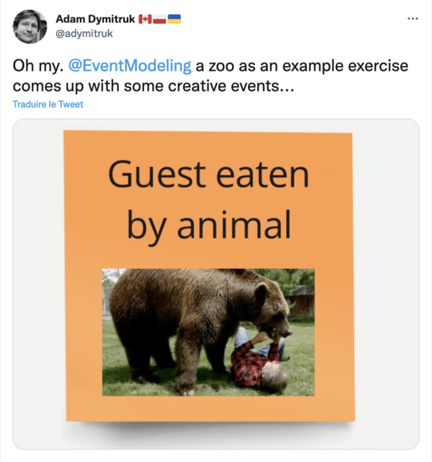

Writing summaries of conference talks is the best way to focus on the talk and listen actively.

Before conference speaking became part of my job, I was already doing it.

However, I don't attend that many talks now, and I don't take notes when I do.

[jPrime](https://jprime.io/) is a conference in Bulgaria, and after two cancellations due to Covid, they had their edition this week.

Probably, for this reason, the atmosphere is quite emulating: I attended a couple of talks and here are my notes.

### Replicating production on your laptop using the magic of containers by Jamie Lee Coleman {#h3-0-replicating-production-on-your-laptop-using-the-magic-of-containers-by-jamie-lee-coleman}

The container technology has old roots indeed.

* 1979 - `chroot`
* 2006 - `cgroups`
* 2008 - LXC
* 2013 - Docker
* 2014 - Kubernetes

Containers provide lots of "magic" that other technologies don't:

* Virtualization at the OS-level
* Portability with images
* Run anywhere
* Isolation

Granted, containers add some complexity, but containers are not to blame. They empower users so that we can design more complex architectures.

Here are some capabilities offered by containers:

* Isolated development environments
* Portable
* Preconfigured images available in public registries
* Fast startup of applications
* Not many pre-requisites compared with bare-metal software
* Version control of dependencies
* Can develop in the cloud
* True-to production testing

Let's focus on the testing part. The closer the test to the production environment, the more reliable it is. Containers can help bridge several gaps:

* Data access, *e.g.*, access to databases
* Integration testing
* Automatic updating and version control
* Complex setup on development machines
* Portable testing environment

[Testcontainers](https://www.testcontainers.org/) is a project introduced in 2015. It's an Open-Source framework that allows developers to bridge the gap between the development and the production environments.

* Integration tests - data access, application integration, UI/acceptance tests
* Additional power with contributed modules
* Supports JUnit 4/5 and Spock

Testcontainers also allows for the most "integrated" form of testing, end-to-end browser testing:

* You can create a fresh instance of a browser
* No state is stored across executions
* Video recording is a must if something goes wrong

Here's a sample of setting up the PostgreSQL database in a container via Testcontainers.

<pre class="EnlighterJSRAW" data-enlighter-language="java">@Container
public static GenericContainer&lt;?&gt; postgres = new GenericContainer&lt;&gt;("postgres")
    .withNetwork(network)
    .withExposedPorts(5432)
    .withNetworkAliases(postgresNetwork)</pre>

[MicroShed testing](https://microshed.org/microshed-testing/) integrates with the Jakarta EE ecosystem to make use of Testcontainers.  

It offers several implementations:

* OpenLiberty
* Payara Micro
* Payara Server
* Wildfly
* Quarkus

*The rest of the presentation was code and live demo*

### Docker Who: small containers through time and space by Dmitry Chuyko {#h3-1-docker-who-small-containers-through-time-and-space-by-dmitry-chuyko}

*The speaker introduces the concepts of Docker and Docker images, highlighting the sizing part.*

A Docker image is an archive - a collection of bytes - at its foundation. However, images are made up of layers ordered in a parent-child relationship. Both images and layers are stored in registries.

Different topologies are possible around a registry and a host: trusted registries, proxies, mirrors, PaaS registries, etc.

Pulling an image is not free. Depending on the registry, *e.g.*, the Cloud provider can bill you. For example, Docker has enforced limited pull rates. Beyond these rates, you need to pay. For this reason, smaller images reduce costs.

In this regard, the choice of the base image is essential. Reminder: a base image starts `FROM scratch`.

Several approaches can keep the image small:

* Keep the application itself small
* Use smaller dependencies
* Choose the right OS and dependencies

For Java applications, it translates into the following:

* Use a small
* Consider Native Image
* "No OS", *i.e.*, distroless

Alpine Linux is a lightweight Linux distro based on [musl libc](https://www.musl-libc.org/) and [busybox](https://busybox.net/). The package is less than 3 MB "on the wire" - 10 times smaller than Ubuntu! With Alpine, one can create a container image with JDK 17 that weighs less than 100 MB on disk. It saves a lot of pull time and reduces associated costs.

Fundamental principles of musl libc:

* Simplicity
* Resources efficiency
* Attention to correctness
* Ease of deployment
* First-class support for UT8 test

Note that libc has several implementations beyond musl: uClibc, dictlibc, glibc, etc. We can compare them across many dimensions! All in all, the main pain point of musl is legacy code-friendly headers. Additionally, DNS resolution works differently.

The other component of Alpine is busybox: it's a single executable file that contains many Unix utilities. For this reason, its size is small.

Other characteristics of Alpine Linux is that it comes with its dedicated package manager - `apk` and doesn't offer a GUI. All in all, Alpine is perfect for containers.

Although the differences between musl and glibc are small, they exist. JDK providers wanted to close this gap. Project Portalla, *aka* JEP 386, aims to port Alpine Linux to x64 and AArch64 architectures. Portalla is facing a couple of issues, but developers are working on them.

### Integration Testing with Spring Boot by Catalin Tudose {#h3-2-integration-testing-with-spring-boot-by-catalin-tudose}

The testing pyramid strategy consists of several layers.

* Acceptance testing: what the user is expecting
* System testing: testing the system as a whole
* Integration testing: testing that interactions with "something" from the outside, *e.g.*, databases, work
* Unit: methods, classes

At the unit level, you don't depend on anything. If your test fails, you know it's a mistake in your code. We want to bring integration tests to the same level of confidence.

Imagine a test that inserts an entity into the database and checks that the latter contains a **single** record. If we repeat the test with the `@RepeatedTest(2)` annotation, we can show that the test is not [idempotent](https://en.wikipedia.org/wiki/Idempotence#Computer_science_meaning). Hence, it's not as safe as a unit test.

To solve the problem, we can use `@DirtiesContext`. The annotation informs the Spring framework that executing a test has "dirtied" the context. After execution, Spring creates a new context from scratch. The cost is additional time as Spring needs to initialize the context.

An alternative is to annotate the test with `@Transactional`. At the end of each execution, Spring rolls back the transaction. Along with `@Transactional`, Spring offers `@BeforeTransaction`, `@AfterTransaction`, `@Commit`, and `@Rollback`.

Another alternative is to configure a `@TestExecutionListener`. With it, you can directly hack into the test lifecycle. By default, registering a new listener will replace all default listeners, including the dependency injection listener. Either you need to reintroduce them manually or configure the listener to merge the new one with the defaults.

Applications generally need to run in different contexts. For example, a developer wants to run the application locally using the H2 database, while in production, we use MySQL. `@Profile` is your friend in this case: one can associate beans with a specific profile. For example, you can set the H2 database in the `dev` profile and the MySQL to the `prod` profiles. At runtime, you configure which profiles are active: Spring will create beans that match the active profiles only.

To test the HTTP layer, one can inject a `MockMvc` instance in a test via the `@AutoConfigureMockMvc` annotation.

### Demystifying "Event" related software concepts and methodologies by Milen Dyankov {#h3-3-demystifying-event-related-software-concepts-and-methodologies-by-milen-dyankov}

In software, we use the word "event," but different people may have a different meanings for this word. Let's dive deeper.

Imagine a door with ID 28 and the color yellow; then it becomes red but keeps the same ID. If you only know the current state of an object, you cannot reason about the previous state. You can if you store the changes, not the state.

The definition of an event is a notification that something has happened. Because an event has happened - notice the past tense; an event is naturally immutable.
> The event itself being a first class thingamajig.
>
> -- Martin Fowler

Event storming is a business process discovery and design technique. The idea is to build a shared understanding of the system between the business and developers as well as across the whole organization. Event storming sessions aim to list all possible events that can happen within the scope of a system.

Event modeling is a blueprint for a solution. Some think that storming and modeling are the same, but it's not the talk's goal to discuss it. Event modeling puts what a system does on a timeline with no branching. As an added benefit, it allows to uncover events that traditional specification writing wouldn't have.

 

Now, what is event-driven? Two concepts are at the foundation of event-driven: producers emit events; consumers are interested in specific events. A router is a mediator between producers and consumers, which knows how to route messages from the former to the latter.

Yet, in the end, event-driven is a buzzword! It works great for product pitches, but it's not a technically accurate term. It's a false claim: if an event is a notification, then it doesn't drive anything. The driving factor is a **decision**, either made by users or by algorithms.

Note that event-driven is also polysemy. For a more detailed explanation, watch [The many meanings of event-Driven architecture](https://www.youtube.com/watch?v=STKCRSUsyP0).

More definitions follow. An event notification gives a notice via an event. There's no response, and it doesn't contain much data. If you want to know more, you need to go back to the origin system.

Event-carried state transfer introduces the plight of which data source is the source of truth, the producer or the consumer? With event streaming, the source of truth is not on the consumer side but in an in-between mediator. The mediator provides both message persistence and routing. Kafka is such a mediator.

Why does the producer need data storage if we have mediator storage? We can store everything in the mediator. Now, the mediator is the single source of truth: the mediator has become an event store.

Characteristics of an event store are:

* Append-only: no deletion, no change to an existing event, no insertion before the last. Not implementing those operations allow for optimization of the storage engine.
* Full sequential read: traditional databases are designed to serve different purposes.
* Replay: it's like a full sequential read but filtered by things one is interested in
* Read aggregate's events: from a producer's point of view, all events produced by one producer
* Snapshot: you don't want clients to rebuild the state from a collection of events. Hence, the store should be able to give a snapshot state and all events that happened afterward.
* Partitioning and archiving: like in accounting, events that happened after a particular time are irrelevant. You don't want to delete them for auditing purposes, but you can offload them to other slower and less expensive systems.

To label oneself as event-driven, we still lack some things. A command, *e.g.* , "Joe ordered to paint door 28 in red", is **not** an event. Likewise, a request for information is a query, not an event. In the latter case, the critical bit is the data contained in the response. Hence, messages have different types; an event is a specific kind of message. When a message router is available, it's convenient to use it to route events and other messages, such as commands and queries. Oh, we just have introduced .

Greg Young introduced CQRS to separate between reads and writes. At the time, it was about having different objects, one dedicated for each operation. Nowadays, it's about separate models, not objects. In CQRS, events are typically used to sync between the read and the write models.

Milen finishes the talk by talking about his company's products:

1. Axon Server is a message router and event server.
2. Axon Framework is an Open Source framework for building and CQRS systems

### DiscoAPI - OpenJDK distributions as a service by Gerrit Grunwald {#h3-4-discoapi-openjdk-distributions-as-a-service-by-gerrit-grunwald}

The main question is how to get the JDK: on a vendor website or via a proprietary vendor API?

The situation is complex:

* Many distros: who heard about Tencent Kona?
* Multiple versions
* No central place
* Different VMs

It's not an easy choice!

It would be great to have one unified API to unite them all: Disco API to the rescue! The API collects a lot of information: distro, version, platform, OS, architecture, archive types, release status, term of support, package types, etc.

The API offers an HTTP URL to call but no packages. You can find the API at <https://api.foojay.io/>. It also provides an [OpenAPI endpoint](https://api.foojay.io/swagger-ui/), so you can play with the API in the browser.

The API is opinionated: it doesn't use the vendor's name, *e.g.* , Azul, but the distribution's name, *e.g.*, Zulu.

*The speaker goes on to describe the API in detail*

The project is available on [GitHub](https://github.com/foojay.io/discoapi). It also offers plugins:

* For the most widespread IDEs, IntelliJ IDEA, Eclipse and VS Code.
* For browsers:
  * [DiscoChrome](https://chrome.google.com/webstore/detail/discochrome/cikmnphhlggceijbbdeohhlkbdagjjce) for Google Chrome
  * [DiscoFox](https://addons.mozilla.org/firefox/addon/discofox/) for Firefox
  * [DiscoSafari](https://apps.apple.com/bw/app/discosafari/id1571307341?mt=12) for Apple Safari
  * [DiscoEdge](https://microsoftedge.microsoft.com/addons/detail/discoedge/efeaimfkdbolmkhafogcoocbidfhdkcm) for Edge.

One can also install the related CLI, `discocli`, that queries the API.

Another tool is [JDKMon](https://github.com/HanSolo/JDKMon) to detect JDKs installed:

* It checks if there's an update available
* It list possible alternatives
* It reads the release notes
* It lists related CVEs. It's a hint: it doesn't check the specific JDK but the parent OpenJDK.

Finally, note that the v2 of [setup-java GitHub Action](https://github.com/actions/setup-java) limits the possible JDK distributions to four options. If you need to use one that is not listed, use [foojayio/setup-java](https://github.com/foojayio/setup-java) instead to configure **any** distribution.

### Evolving your APIs by your humble servitor {#h3-5-evolving-your-apis-by-your-humble-servitor}

I've already written a full-fledged blog post about [Evolving your APIs](https://blog.frankel.ch/evolve-apis/). Soon, the recording of the talk will be available.

Conclusion {#h2-6-conclusion}
-----------------------------

jPrime is a great community-led conference. After two years of Covid, they were able to attract around 1k attendees and local and international speakers. Icing on the cake, all talks are in English!

Don't miss the next edition, May 30-31^th^, 2023!

*Originally published on [A Java Geek](https://blog.frankel.ch/jprime-2022/) on May 29^th^, 2022*

*[CQRS]: Command and Query Responsibility Segregration
*[DDD]: Domain-Driven Design
*[JRE]: Java Runtime Environemnt
