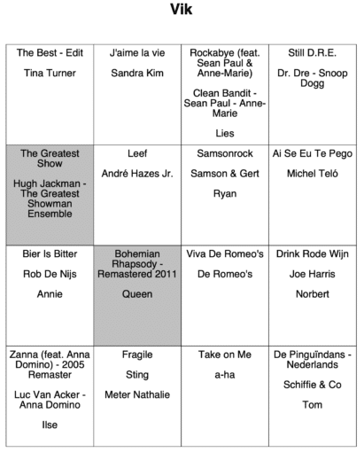
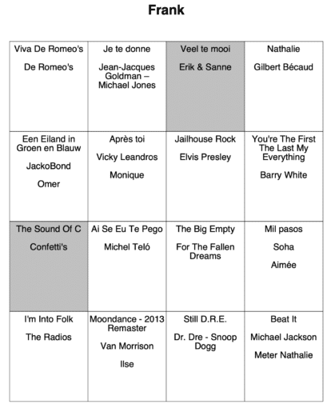
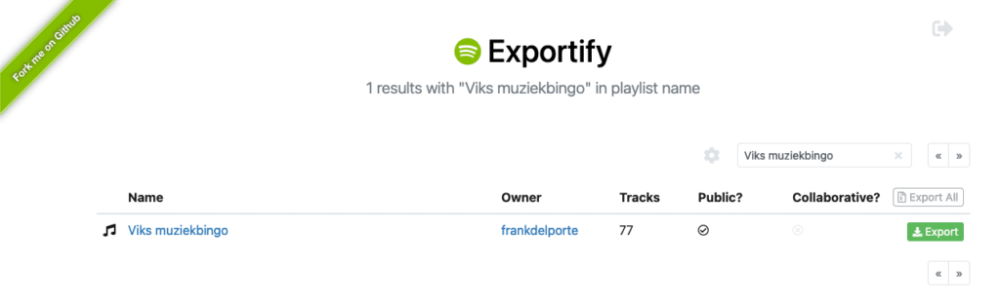

*** ** * ** ***

> Let's use Java to automate a boring task and have a party!
> Warning, this can lead to noise nuisance from singing and dancing...

It has been a while since I last had to create documents in a program, and iText has been "on my radar" to try out for a while now.

This weekend we had a party and wanted to organize a music bingo.

For this, we needed a set of randomly selected songs to be printed out per person.

A small Java project seemed to be the best solution, otherwise, this would have been a boring, manual, and repetitive task.

Isn't that the goal of most of our developments? **"Automate the boring stuff!"**

### About iText {#h3-0-about-itext}

iText is a library for creating and manipulating PDF files in Java and .NET, originally written by Bruno Lowagie. The history of the project and [the company that grew out of it](https://itextpdf.com/en) is described in the book ["Entreprenerd"](https://entreprenerd.lowagie.com/). This book explains what you can expect when starting a company to generate the resources that are necessary to further develop and maintain your technology.

iText is available under open source (AGPL) as well as a commercial license. As Bruno is Belgian and the company still has a solid base in Belgium, I have to admit there is also some patriotism involved here.

### Goal of the project {#h3-1-goal-of-the-project}

We asked our guests to give us their two favorite songs. We added some extra "party songs" and ended up with a list of over 70 songs in a playlist on Spotify. Each player gets a print-out with 16 songs, of course, this value can be configured in the code.

Each print-out has the name of the player and contains the songs selected by the player. The card is filled with other random songs, so each player has a different card.

<figure class="wp-block-gallery has-nested-images columns-default is-cropped wp-block-gallery-1 is-layout-flex wp-block-gallery-is-layout-flex">
 <figure class="wp-block-image size-medium">
  
 </figure>
 <figure class="wp-block-image size-medium">
  
 </figure>
</figure>

First goal of the game was to have a full horizontal line, and after we had three winners of those, we switched to having a full Bingo card. Some of the songs were only played for 10-15 seconds, others needed more time as some dancing and singing got involved. For that last part, I want to apologize to our neighbors...

### Exporting from Spotify {#h3-2-exporting-from-spotify}

A playlist can't be exported from Spotify itself. There is a "Spotify Web API" that can be used for this (see [the Spotify Developer documentation](https://developer.spotify.com/documentation/web-api/libraries/)). I've taken a shortcut here and used [Exportify](https://github.com/watsonbox/exportify) which actually is built on top of that API. It shows you all your playlists and those can be exported with one click of a button to CSV.

The exported file contains a lot of info, but we only need three columns for the Bingo cards, so open the file in a spreadsheet editor, remove the unneeded columns and add one with the name of the person that has selected the song, so you end up with:

* Song title
* Artist
* Name of the person that chose the song (can be empty)

For example:

<pre class="EnlighterJSRAW" data-enlighter-language="generic" data-enlighter-theme="" data-enlighter-highlight="" data-enlighter-linenumbers="" data-enlighter-lineoffset="" data-enlighter-title="" data-enlighter-group="">The Greatest Show,Hugh Jackman - The Greatest Showman Ensemble,Vik
Rode rozen in de sneeuw,Marva,Omer
Macarena,Los Del Rio,</pre>

 

### Source code {#h3-3-source-code}

The final project is a very simple Java Maven program and the sources are available on [Github](https://github.com/FDelporte/SpotifyBingoCardGenerator).

#### Data model

As this project is based on Java 17, we can use Records for the imported songs

<pre class="EnlighterJSRAW" data-enlighter-language="generic" data-enlighter-theme="" data-enlighter-highlight="" data-enlighter-linenumbers="" data-enlighter-lineoffset="" data-enlighter-title="" data-enlighter-group="">public record ImportedSong (String title, String artist, String selectedBy) {
}</pre>

and the generated Bingo card per person with a list of songs

<pre class="EnlighterJSRAW" data-enlighter-language="generic" data-enlighter-theme="" data-enlighter-highlight="" data-enlighter-linenumbers="" data-enlighter-lineoffset="" data-enlighter-title="" data-enlighter-group="">import java.util.List; 
public record BingoCard(String forName, List&lt;ImportedSong&gt; songs) {
} </pre>

#### Reading the CSV file

The list of songs is read line by line from the CSV file with a FileReader

<pre class="EnlighterJSRAW" data-enlighter-language="generic" data-enlighter-theme="" data-enlighter-highlight="" data-enlighter-linenumbers="" data-enlighter-lineoffset="" data-enlighter-title="" data-enlighter-group="">public static List&lt;ImportedSong&gt; loadFromFile(String fileName) {
    ...
    try {
        File f = new File(resource.getFile());
        try (BufferedReader b = new BufferedReader(new FileReader(f, StandardCharsets.UTF_8))) {
            String line;
            while ((line = b.readLine()) != null) {
                var song = processLine(line);
                if (song != null) {
                    list.add(song);
                }
            }
        }
    } catch (Exception ex) {
        logger.error("Error while importing song list: {}", ex.getMessage());
    }
    return list;
}

private static ImportedSong processLine(String data) {
    if (data == null || data.isEmpty()) {
        logger.warn("Data is empty");
        return null;
    }
    String[] csvLine = data.split(",");
    return new ImportedSong(csvLine[0], csvLine[1], csvLine.length &gt;= 3 ? csvLine[2] : "");
}</pre>

#### Generate a random card for every user

The cards are generated by

* Getting a list of names of the players (distinct values from column 3 of the CSV)
* For each person generate a list of 16 songs
  * First, the ones selected by the person
  * Add a random song that is not part of the list yet, until 16 is reached
  * Randomize the order of the list with `Collections.shuffle(songsForPerson);`

#### **C**reating the PDF

As the last step, for each user, a PDF page is generated. By using iText and the example code I found in \<a href="https://www.vogella.com/tutorials/JavaPDF/article.html"\>this post by Lars Vogel\</a\>, this was a very quick and easy step. The dependency is added to the pom.xml file with

<pre class="EnlighterJSRAW" data-enlighter-language="generic" data-enlighter-theme="" data-enlighter-highlight="" data-enlighter-linenumbers="" data-enlighter-lineoffset="" data-enlighter-title="" data-enlighter-group="">&lt;dependency&gt;
    &lt;groupId&gt;com.itextpdf&lt;/groupId&gt;
    &lt;artifactId&gt;itextpdf&lt;/artifactId&gt;
    &lt;version&gt;${itext.version}&lt;/version&gt;
&lt;/dependency&gt;</pre>

And the actual code is very easy to read and understand:

<pre class="EnlighterJSRAW" data-enlighter-language="generic" data-enlighter-theme="" data-enlighter-highlight="" data-enlighter-linenumbers="" data-enlighter-lineoffset="" data-enlighter-title="" data-enlighter-group="">public static void createPdfWithBingoCards(List&lt;BingoCard&gt; cards) {
    try {
        var desktop = System.getProperty("user.home") + "/Desktop";
        var pdfFile = Paths.get(desktop, "bingo_" + System.currentTimeMillis() + ".pdf").toFile();
        Document document = new Document();
        PdfWriter.getInstance(document, new FileOutputStream(pdfFile));
        document.open();
        for (BingoCard card : cards) {
            addBingoCard(document, card);
        }
        document.close();
    } catch (Exception e) {
        e.printStackTrace();
    }
}

private static void addBingoCard(Document document, BingoCard bingoCard) throws DocumentException {
    // Start a new page
    document.newPage();

    Paragraph paragraph = new Paragraph();
    paragraph.setAlignment(Element.ALIGN_CENTER);

    // We add one empty line
    addEmptyLine(paragraph, 1);

    // Name of the person for this card
    var personName =new Paragraph(bingoCard.forName(), FONT_TITLE);
    personName.setAlignment(Element.ALIGN_CENTER);
    paragraph.add(personName);

    // We add two empty lines
    addEmptyLine(paragraph, 2);

    // Add a table with the songs
    PdfPTable table = new PdfPTable(NUMBER_OF_COLUMNS);

    for (ImportedSong song : bingoCard.songs()) {
        PdfPCell tableCell = new PdfPCell(new Phrase(song.title()
                + System.lineSeparator()
                + System.lineSeparator()
                + song.artist()
                + System.lineSeparator()
                + System.lineSeparator()
                + (song.selectedBy().equals(bingoCard.forName()) ? "" : song.selectedBy()), FONT_SMALL));
        tableCell.setHorizontalAlignment(Element.ALIGN_CENTER);
        tableCell.setVerticalAlignment(Element.ALIGN_TOP);
        tableCell.setMinimumHeight(120);
        if (song.selectedBy().equals(bingoCard.forName())) {
            tableCell.setBackgroundColor(BaseColor.LIGHT_GRAY);
        }
        table.addCell(tableCell);
    }

    paragraph.add(table);

    // Add paragraph to document
    document.add(paragraph);
}

private static void addEmptyLine(Paragraph paragraph, int number) {
    for (int i = 0; i &amp;lt; number; i++) {
        paragraph.add(new Paragraph(" "));
    }
}</pre>

### Conclusion {#h3-4-conclusion}

Is this production-ready code? No, of course not, there are no unit tests 😉

But it proves iText is very easy to understand and the open-source version allows you to quickly create a PDF with a custom layout.

With the `PdfPTable` method, you can create a very basic grid layout with any text information you want to include in your document.
